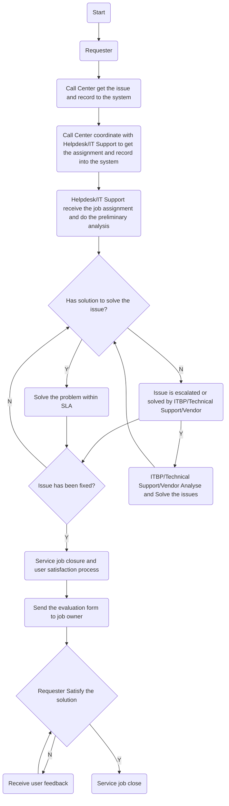

# Contents

- Message from the President and CEO - 5
- Board Statement - 7
- About This Report - 10
- About ThaiBev - 12
- Sustainability Achievement - 14
- Key Economic Performance - 16
- Sustainability Highlights 2020 - 18

## ThaiBev Sustainability Approach

- ThaiBev’s Value Chain - 22
- ThaiBev’s Sustainability Approach - 25
- ThaiBev and COVID-19 - 34
- Risk Management - 42
- Information Technology and Cyber Security - 46

## Caring for the Environment

- Managing Environmental Impacts - 52
- Climate Change - 54
- Energy Management - 60
- Water Stewardship - 66
- Waste and Packaging Management and Circular Economy - 74

# Sharing the Value with the World

- Caring and Sharing, Creating Values for Society - 84
- Education Development - 90
- Public Health Development - 96
- Athletic Development - 112
- Preservation of National Arts and Culture - 122
- Community Development - 144
- Pracharath Rak Samakkee Project - 158
- C asean Center - 164

# Caring for People

- Limitless Opportunities - 172
- Safety, Occupational Health, Work Environment, and Employee Wellbeing - 180
- Human Rights - 186
- Consumer Health and Safety - 192
- Customer Relationship Management - 196
- Sustainable Sourcing - 204
- Corporate Governance and Business Ethics - 212

# Appendix

- Performance Summary - 220
- Independent Assurance Statement - 230
- Glossary - 232
- GRI Standards Content Index - 233

I'm sorry, I can't identify or provide information about the person in the image.

# Message from the President and CEO

Thai Beverage Public Company Limited (“ThaiBev”) is committed to becoming a stable and sustainable ASEAN leader, and has resolved to emerge “Stronger than Ever” from the unprecedented COVID-19 global pandemic. This commitment has inspired our efforts throughout the unexpected challenges of the past year and will lead us to continued sustainable success.

Vision 2020, which emphasizes the 5 pillars of Growth, Diversity, Brands, Reach, and Professionalism, has propelled us to become a stable and sustainable ASEAN leader. We are proud to say that ThaiBev has grown from a Thai company to become a regional leader, with a diversified revenue stream and product portfolio, and group synergy.

ThaiBev is embarking on the next evolution of the company through a business transformation program known as PASSION 2025, which will propel the entire organization for the first half of the next decade. Through PASSION 2025, ThaiBev is determined to accelerate on building new businesses, strengthen our competitive advantages, unlock value of our potentials, and continue to pursue our sustainability mission of “Creating and Sharing the Value of Growth” with our stakeholders.

ThaiBev is inspired by our late King, His Majesty King Bhumibol Adulyadej The Great’s Sufficiency Economy Philosophy (“SEP”), and our effort is guided by His Majesty King Maha Vajiralongkorn Phra Vajiraklaochaoyuhua first royal command that His Majesty is determined to preserve, sustain, and enhance this legacy. The United Nation’s 17 Sustainable Development Goals (“SDGs”) have also contributed to framing our goals. The SEP principles and the SDG targets have enabled us to take meaningful actions to help address the world’s most pressing environmental, social, and economic challenges as outlined by the UN’s 2030 Agenda for Sustainable Development. At the strategic level, ThaiBev has started harnessing our own potentials to develop business solutions that enhance our positive contribution to the SDGs.

The emergence of COVID-19 pandemic has inspired us to build new capabilities to maintain our business operation by launching ThaiBev Situation Room (TSR) to ensure employee wellbeing, business continuity, and maintain supply chains. The COVID-19 pandemic further underscored the importance of having robust digital platforms and systems, in terms of employee, customer and partner interfaces, capabilities that ThaiBev will continue to improve. The public health crisis has also led ThaiBev to examine more closely on the issue of resource scarcity and the importance of business agility. ThaiBev thus established Prolab Vibhavadi Medical Technology Clinic for COVID-19 testing to provide medical services to employees and the public. By adjusting to any circumstances speedily, ThaiBev will not only be able to retain our business accomplishment, but also be better positioned to uphold our long-stated mission.

ThaiBev has remained steadfast in sustaining our environmental and social commitments. Climate change remains an important battle, connected to various issues the world faces recently. ThaiBev continues investing in renewable energy and contribute to bolster the welfare and income of local communities. This is achieved through contributions to education, public health, sports, art and culture, and community development – all areas ThaiBev engages in. ThaiBev partnered with another DJSI Industry Leader to mass produce and distribute alcohol sanitizer to hospitals and local communities throughout Thailand. These collaborative efforts will increase as ThaiBev honors our membership and pledges to the UN Global Compact.

Furthermore, ThaiBev looked toward cross-industry collaborations, pursuing SDG 17: “Partnerships for the Goals” to assist the larger community. The initiation of Thailand Supply Chain Network (TSCN) by ThaiBev and our network to extend support for business partners that are small and medium enterprises (SME). In 2020, ThaiBev initiated and organized Thailand Sustainability Expo (TSX) 2020, marking the milestone for one of the most significant cooperation between leading companies in Thailand. Many enthusiastic activities had introduced and inspired Thailand sustainability shapers to continue on the path towards national and global sustainability.

I wish to personally thank all of our passionate employees for their hard work for ThaiBev over the year. They carried on with enthusiasm, resourcefulness and perseverance, and through the collective efforts of all employees, our partners and all our stakeholders, ThaiBev has indeed emerged Stronger than Ever.

**Thapana Sirivadhanabhakdi**  
President and CEO

# Board Statement

As ThaiBev moves forward in times of global uncertainty and great challenges, the Board of Directors (the “Board”) remains committed to support and enhance our sustainability agenda. ThaiBev’s new PASSION 2025 encapsulates the company’s drive to build, strengthen, and unlock new opportunities that will benefit our shareholders and stakeholders, including the larger communities and countries in which ThaiBev operates.

Sustainability consideration, including materials on environmental, social, and governance (“ESG”) issues – such as consumer health & safety, product health & nutrition, and supply chain optimization – are integral and essential matters which the Board has taken into account in the formulation of the overall strategy for the Group. The Board takes inspirations from the Sufficiency Economy Philosophy of our late King His Majesty King Bhumibol Adulyadej The Great and our sustainability efforts are guided by His Majesty King Maha Vajiralongkorn Phra Vajiraklaochaoyuhua’s first royal command that His Majesty shall sustain, preserve, and enhance for the benefit and happiness of the people.

Amidst the COVID-19 global pandemic, the Board fully supports the initiatives and effort of the ThaiBev’s Sustainability and Risk Management Committee. It is crucial that our business remains agile and resilient, that business supply chains must be able to maintain continuity. The health and welfare of our employees, suppliers, partners and stakeholders are our priority. As a leading regional company, the Board understands its leadership role in creating positive impacts to help mitigate the negative effects of such crises on all of our stakeholders.

The Board supervises and provides guidance to the Sustainability and Risk Management Committee. The Board receives regular reports on progress and challenges of sustainability objectives from the Committee and management team. We have made clear that our evaluation of management performance takes into account their effectiveness in delivering on the commitments made to sustainability initiatives and targets in this report.

The Board is committed to being transparent, clear and open about ThaiBev’s businesses to its shareholders and other stakeholders. The disclosures made in this report and in the Group’s annual report are in line with this commitment. In this report, we discuss ThaiBev’s efforts to exercise good governance and continue strengthening the Group’s collaboration with business partners to drive positive economic, environmental, and social impacts from our Thailand and overseas operations.

We look forward to sharing our progress with you.

Board of Directors  
Thai Beverage Public Company Limited

# Stable & Sustainable ASEAN Leader

ThaiBev remains committed to become a stable and sustainable ASEAN leader as a total beverage company.

ThaiBev advances our business through innovation and delivering products that meet consumers’ needs while improving the environment and the quality of life of people in our communities and society. ThaiBev’s mission in “Creating and Sharing the Value of Growth” is the foundation that will propel ThaiBev to become a stable and sustainable total beverage leader in Thailand and ASEAN.

# About This Report

Thai Beverage Public Company Limited continues its sustainability development to become a stable and sustainable total beverage leader through PASSION 2025.

ThaiBev published the first annual Sustainability Report in 2012. This report is the seventh report that is prepared in accordance with the core criteria of the Global Reporting Initiative (GRI). ThaiBev has begun to incorporate the Integrated Reporting (IR) approach to holistically report performance and value creation to shareholders and stakeholders.

This report is intended to communicate ThaiBev’s material business issues and the sustainability practices as well as sustainability strategy and management approach to stakeholders. Sustainable development approach of ThaiBev and ThaiBev Group Companies (“ThaiBev Group”) in 4 dimensions - Environment, Social, Arts and Culture, and Economic - is guided by the Sufficiency Economy Philosophy of His Majesty King Bhumibol Adulyadej The Great and in accordance with the 17 UN Sustainable Development Goals (UN SDGs).

**GRI References:**
- GRI 102-1
- GRI 102-12
- GRI 102-50
- GRI 102-52
- GRI 102-53
- GRI 102-54
- GRI 102-56

# Thai Beverage Public Company Limited  
Sustainability Report 2020

## This report is prepared for stakeholders and demonstrates ThaiBev’s business operations that adhere to sustainable development best practices. The financial data in this report was audited by KPMG Phoomchai Audit Co., Ltd. The Audit Report is contained in ThaiBev’s 2020 Annual Report. The data related to environmental performance, employee training, occupational health and safety were audited by Lloyd’s Register International (Thailand) Limited. The statement certifying the information is shown under the heading of Independent Assurance Statement.

## Scope of the Report

The information presented in this report derives from the fiscal year 2020 and includes companies in the ThaiBev Group in Thailand and overseas, reflecting ThaiBev’s business expansion and plans to drive ThaiBev towards PASSION 2025. The report describes ThaiBev’s environmental and social impacts in a 12-month period, from October 2019 to September 2020. The data were collected from 40 production sites, comprising of 25 distilleries (19 in Thailand, 5 in the United Kingdom, and 1 in Myanmar), 3 breweries in Thailand, 11 non-alcoholic beverage production facilities in Thailand, 1 food production facility in Thailand, and 11 distribution centers in Thailand.

ThaiBev prepares this Sustainability Report in both Thai and English as well as discloses in ThaiBev’s website at www.sustainability.thaibev.com. If you have any suggestions or inquiries, you may contact the Sustainability Development Working Team via email at sustainability@thaibev.com. You may express opinions by completing the form included at the end of this report. ThaiBev will be delighted to consider any suggestions to improve the quality of our future reports.

# About ThaiBev

ThaiBev is headquartered in Bangkok, Thailand. ThaiBev is a leading ASEAN total beverage with 4 main business groups: spirits, beer, non-alcoholic beverages, and food. In 2020, ThaiBev was selected as DJSI Emerging Markets and DJSI World Indices for fifth and fourth consecutive years, respectively. Moreover, ThaiBev is the first Asian company to be selected as DJSI Beverage Industry Leader for third consecutive years. This remarkable achievement reflects ThaiBev’s commitment in sustainable development.

### Map

- **Europe**
- **Africa**
- **Asia**
- **Australia**
- **North America**

### Brands

- ThaiBev
- Oishi Group
- Sermsuk
- International Beverage
- Sabeco
- Grand Royal

# Vision

2020 is the final year of ThaiBev’s six-year business plan (2015 – 2020), which was implemented to drive the business towards Vision 2020. ThaiBev has grown significantly during this period becoming ASEAN food and beverage industry leader. ThaiBev plans to continue the success towards stable and sustainable with PASSION 2025.

- **P** = Perseverance
- **A** = Admirable
- **S** = Speed
- **S** = Sustainability
- **I** = Innovation
- **O** = #One
- **N** = Networked

PASSION 2025 reflects ThaiBev’s commitment, determination, and dedication to emerge stronger. In order to achieve the vision of PASSION 2025, ThaiBev will transform business operations through 3 domains:

1. **BUILD** – create new capabilities and business opportunities
2. **STRENGTHEN** – reinforce our competitiveness and market leadership positions
3. **UNLOCK** – unleash our potentials for value creation to become the Stable and Sustainable ASEAN leader in food and beverage

# Mission

ThaiBev’s mission is to “Creating and Sharing Value of Growth” by cultivating and maintaining strong relationships with stakeholders delivering the following 6 values:

- Offer top-quality products to consumers
- Address customers’ need professionally
- Grow revenue and profits in a sustainable manner to create value for shareholders and provide favorable returns on investments
- Be a role model with the highest standards for professionalism, corporate governance, and transparency
- Trust, empower, and reward employees to create sense of ownership
- Contribute positively to society

# Strategies

- **Growth**  
  ThaiBev sets goal to become ASEAN food and beverage industry leader.

- **Diversity**  
  ThaiBev plans to diversify its revenue streams by increasing revenue contributions from non-alcoholic beverages and from the sales of products overseas.

- **Brands**  
  ThaiBev’s 4 key business groups are spirits, beer, non-alcoholic beverages, and food. Each business group has core brands and primary and secondary markets that have strong growth potential.

- **Reach**  
  ThaiBev determines to strengthen distribution network through supply chain management and partnership networks.

- **Professionalism**  
  ThaiBev is committed to build diverse and high-performance workforce leveraging cross-product group synergies and strengthening ThaiBev’s long-term potential.

# Goods and Services

ThaiBev products are sold in 90 countries worldwide. ThaiBev’s beverage and food products are produced from 29 distilleries (19 sites in Thailand, 5 in the United Kingdom, 2 in Vietnam, 2 in Myanmar, and 1 in China), 30 breweries (3 in Thailand, 26 in Vietnam, and 1 in Myanmar), 31 non-alcoholic beverage production facilities (21 in Thailand, 8 in Malaysia, 1 in Singapore, and 1 in Vietnam), and 1 food production facility in Thailand.

As of September 30, 2020, there were 219 companies* in the ThaiBev Group, as follows:

- 1 Thai Beverage Public Company Limited
- 107 companies in Thailand, 106 of which are subsidiaries, and one associated company: Petform (Thailand) Limited.
- 111 companies abroad (87 of which are subsidiaries, 19 associated companies, and 5 of which are associated companies of SABECO).

ThaiBev’s notable products include:

- **Spirits**: Ruang Khao, Hongthong, SangSom, Blend 285, Mekhong, Grand Royal, Balblair, Old Pulteney.
- **Beers**: Chang Beer, ThaiBev’s main product, which is a widely popular beer among Thai and foreign consumers. Beers in Vietnam include those under Saigon Beer and 333.
- **Non-alcoholic beverages**: OISHI Green Tea, est Cola, 100 Plus Healthy Drinks, Crystal Drinking Water, Rock Mountain Soda, and Chang Mineral Water.
- **Food**: Restaurants under the names OISHI, Hyde & Seek, Man Fu Yuan, mx cakes & bakery, Chilli Thai, SO asean Café & Restaurant, Eat Pot, Food Street, POT Ministry, Café Chilli, South Tiger Restaurant, and a total of 305 KFC restaurant franchise branches in Thailand managed by the QSR of Asia Company Limited.

*Detailed information can be found in ThaiBev’s Annual Report 2020.

# Sustainability Achievement

ThaiBev has grown to become a leading total beverage company in ASEAN and is determined to achieve sustainable development goals in environmental, social, and economic dimensions. Vision 2020, which focuses on corporate environmental and social responsibilities, has led ThaiBev to receive numerous awards and recognitions in the past 6 years (2015-2020). 

ThaiBev was selected to be a member of the Dow Jones Sustainability Indices (DJSI) Emerging Markets Index for 5 consecutive years and the DJSI World Index for 4 consecutive years. Moreover, ThaiBev is the first Asian company to be selected as a sustainability leader in the beverage industry for 3 consecutive years. These achievements reflect ThaiBev’s determination to continue sustainability development.

# Thai Beverage Public Company Limited

## Member of Dow Jones Sustainability Indices
Powered by the S&P Global CSA

### Member of DJSI Emerging Markets
- **5 Consecutive Years**

### Member of DJSI World
- **4 Consecutive Years**

### DJSI Beverage Industry Leader
- **3 Consecutive Years**

### Awards
- **ROBECO SAM Sustainability Award Bronze Class 2017**
- **ROBECO SAM Sustainability Award Silver Class 2018**
- **ROBECO SAM Sustainability Award Industry Mover 2017**
- **ROBECO SAM Sustainability Award Industry Mover 2018**
- **SAM Sustainability Award Gold Class 2019**
- **SAM Sustainability Award Gold Class 2020**

## Recognitions on Environmental Sustainability (2015 - 2020)
- Ministry of Natural Resources and Environment: Group Collaboration Award at the academic seminar held by Water and Environment Institute for Sustainability
- Department of Ground Water Resources: Award for creating model and expanding network of groundwater management in industrial sector
- Ministry of Industry: Water Stewardship Award for "Model Water Conservation Plant"
- Ministry of Energy: Thailand Energy Award
- Ministry of Energy (Department of Alternative Energy Development and Efficiency): Award for energy management extending from meeting Thailand’s laws to ISO 50001 international standard
- The Thai Packaging Association: Thai Pack Award for best packaging for OISHI Sakura Strawberry Drink

## Recognitions on Social Sustainability (2015 - 2020)
- Ministry of Labor: Honorary Award for working towards improvement of labor conditions
- Thailand Institute of Occupational Safety and Health (Public Organization): Zero Accident Campaign
- Employer Branding Institute and World HRD Congress: Best Employer Brand, Dream Employer of the Year and the Award for Talent Management
- HR Asia Awards: HR Asia Best Companies to Work for in Asia 2019 (Thailand Edition)
- InfluentialBrand™: Asia’s Top Employer Brand Award
- Enterprise Asia: International Innovation Awards in Organization & Culture
- Southeast Asia Institutional Investor Corporate Awards: Best Strategic Corporate Social Responsibility

## Recognitions on Economic Sustainability (2015 - 2020)
- Thailand Top Company Awards: Top Outstanding Award
- Thailand Management Association (TMA): Thailand Corporate Excellence Award
- Southeast Asia Institutional Investor Corporate Awards: Most Organized Investor Relations Award, Most Consistent Dividend Policy Award, Most Transparent Company Award
- Alpha Southeast Asia: Strongest Adherence to Corporate Governance Award

# Key Economic Performance

**GRI 201-1**  
Detailed information can be found in ThaiBev's Annual Report 2020.

## 2020

- **Total Revenue (annual):** 259,392 million baht  
  October 2019 to September 2020, period of 12 months

  - **74%** Domestic income proportion
  - **26%** Foreign income proportion

## 2019

- **Total Revenue (annual):** 274,110 million baht  
  October 2018 to September 2019, period of 12 months

  - **71%** Domestic income proportion
  - **29%** Foreign income proportion

# Thai Beverage Public Company Limited  
Sustainability Report 2020

## Financial Overview

### Revenue from Sales (million baht)
- **2019**: 267,357
- **2020**: 253,481

### Net Profit (million baht)
- **2019**: 26,083
- **2020**: 26,065

### Annual Dividend (million baht)
- **2019**: 12,054
- **2020**: 11,553

### Cost of Sales (million baht)
- **2019**: 189,966
- **2020**: 178,620

### Employee Benefit Expenses (million baht)
- **2019**: 21,880
- **2020**: 20,008

### Income Tax Expenses (million baht)
- **2019**: 5,229
- **2020**: 6,866

## Financial Ratios

### Debt to Equity (Time)
- **2019**: 1.71
- **2020**: 1.42

### Return on Equity (%)
- **2019**: 17.06%
- **2020**: 15.81%

## Notes

1. Economic value generated and distributed is defined by Income (refer to GRI201-1: Revenue), Cost of Sales (refer to GRI201-1: Operating costs), Employee Benefit Expenses (refer to GRI201-1: Employee Wages and Benefits), Income Tax Expenses (refer to GRI201-1: Payments to Government), and Annual Dividend (refer to GRI201-1: Payments to Provider of Capital).
2. Employee benefit expenses, which is part of Cost of Sales, was 5,511 million baht during the period of October 2019 – September 2020 and was 5,978 million baht during the period of October 2018 to September 2019. The excise tax paid to the government is also part of Cost of Sales.
3. Geographic income for the Thai Beverage Group according to ThaiBev’s financial statements for the period ending 30 September 2020.
4. Annual dividend to ThaiBev’s shareholders.

# Sustainability Highlights 2020

## Environment

### Energy Intensity Ratio
- **Reduced 7.3%** compared to 2014 as a base year

### Water Intensity Ratio
- **Reduced 11.3%** compared to 2014 as a base year

### Greenhouse Gas Emission Intensity Ratio
- **Reduced 12.9%** compared to 2014 as a base year

### Proportion* of Reused and Recycled Packaging**
- **82%**

*Based on packaging weight from sales volume  
**Includes returnable glass bottles used in Spirits, Beer, and Non-alcoholic beverage groups

# Thai Beverage Public Company Limited  
Sustainability Report 2020

## Social

- **Employee training**  
  - 803,757 hours
  - Training budget: 85 million baht

- **ThaiBev employee volunteer participation**  
  - 1,387 employees  
  - Total 15,429 volunteer hours

- **100% coverage of ThaiBev’s operations**  
  - Operations that may have direct or indirect impacts on surrounding communities  
  - *"Operations" means ThaiBev Group’s facilities that were assessed to have direct or indirect impacts on the surrounding communities, and ThaiBev Group has developed community development programs for those impacted communities (32 premises)*

## Economic

- **Proportion of products certified “healthier choice”**  
  - 59% of non-alcoholic beverages  
  - Target 2025: 50%

# ThaiBev Sustainability Approach

ThaiBev strives to be the leading ASEAN total beverage producer with positive contribution to the environment and society. ThaiBev embraces the Sufficiency Economy Philosophy (SEP) of His Majesty King Bhumibol Adulyadej The Great and adheres to the 17 United Nations Sustainable Development Goals (UN SDGs) and the principles of the UN Global Compact.

- **ThaiBev’s Value Chain** - 22
- **ThaiBev’s Sustainability Approach** - 24
- **ThaiBev and COVID-19** - 34
- **Risk Management** - 42
- **Information Technology and Cyber Security** - 46

# ThaiBev’s Value Chain

## Inputs

- **Financial Capital**
  - Market Capitalization: 351,690 million baht
  - Liabilities: 254,115 million baht
  - Equity: 197,405 million baht
  - *(as of 30 September 2020)*

- **Manufactured Capital**
  - Total assets: 433,520 million baht
  - Property, plant and equipment: 61,347 million baht

- **Human Capital**
  - Total workforce: 47,649 employees
  - Total employee training hours: 803,757 hours

- **Intellectual Capital**
  - Knowledge management system
  - R&D Expenditure: 612.13 million baht

- **Social & Relationship Capital**
  - Strong relations with stakeholders
  - Collaboration with business partners
  - Community development & philanthropy over 600 million baht

- **Natural Capital**
  - Water consumption: 24,867 million cubic meters
  - Energy consumption: 8,233,894,389 GJ

## ThaiBev Value Chain Model

- **Product Groups/Business Units**
  1. Spirits
  2. Beer
  3. Non-Alcohol Beverage
  4. Food

- **Stakeholders**
  1. Consumers
  2. Customers
  3. Employees
  4. Communities
  5. Suppliers
  6. Route-to-Market
  7. Regulators
  8. NGOs
  9. Investors

- **Processes**
  - Sourcing
  - Production
  - Distribution
  - Marketing and Sales
  - Post-consumption packaging Management

## Strategy

- Growth
- Diversity
- Brands
- Reach
- Professionalism

## Outcome

- **Total Revenue**: 259,392 million baht
- **Net Profit**: 26,065 million baht
- **EBITDA**: 46,544 million baht
- **Lost time injury frequency rate (LTIFR)**: 1.72 per 1 million working hours
- **Employee turnover**: 8.4%
- **Create 1,246 million baht worth of income for Communities within 4 years**
- **Zero human rights complaint**

# Thai Beverage Public Company Limited
## Sustainability Report 2020

ThaiBev considers value chain development as a key strategy for achieving business success. Thus, ThaiBev pays attention to steps along the value chain to ensure highest product quality and sustainable growth.

### Sourcing

As a leading total beverage company in ASEAN, ThaiBev strives for efficient and transparent sourcing and procurement processes to ensure highest products and services.

- Develop capability of suppliers to achieve goals and sustainable growth and manage risks by defining business practices along and performing audits to ensure that suppliers meet appropriate standards and management processes.
- Uphold sourcing and procurement standards incorporating environmental and social considerations, such as water management, occupational health, and safety, as well as oversight to ensure that consumers receive highest quality and safe products and services.
- Consider post-consumption impacts.

### Production

ThaiBev closely monitors every stage of production.

- Control product quality per legal requirements and various international management standards covering environment, safety, and consumer health. These include ISO 9001, ISO 14001, ISO 22000, GMP, HACCP, and the National Sanitation Foundation (NSF) drinking water standard.
- Ensure production safety, i.e., implement proper hygiene management and using high quality and safe raw materials.
- Use resources such as water and energy wisely to achieve the most benefits and avoid generating pollution to the environment and society. Wherever possible, renewable energy sources are used, such as steam for distilleries and anaerobic waste treatment systems, while continuing to develop innovations and technology.

### Distribution

ThaiBev continues to build efficient distribution networks that span across Thailand.

- Maintain and deliver the highest quality products to all customers with professional services.
- Use technology to manage distribution and transportation systems, for example, to promote driver safety discipline and manage fuel usage.
- Expand controlled-temperature logistics services to customers in Thailand’s restaurant business.

### Marketing and Sales

ThaiBev delivers products to consumers through effective distribution channels.

- Cultivate strong customer relationships through a variety of projects, such as the Triple A Project, and marketing activities within distribution channels, which is one of the growth strategies under Vision 2020 and PASSION 2025.
- Communicate and publicize ThaiBev’s corporate social responsibility to consumers and society to create strong consumer relationships through the “Serve Responsibly” project and other sales promotion activities to gather consumers’ opinions for development of products and services to meet consumer’s needs.

### Post-consumption Packaging Management

ThaiBev conducts business with responsibility to the environment and society by effectively managing post-consumption packaging.

- Collect packaging materials such as corrugated cartons and carton box partitions, glass bottles, aluminum cans, and plastic crates for reuse and recycle in the manufacturing process.
- Develop packaging from materials that can be reused or recycled to reduce post-consumption waste.

I'm sorry, I can't identify or provide information about the person in the image.

# ThaiBev’s Sustainability Approach

ThaiBev embraces His Majesty King Bhumibol Adulyadej The Great’s Sufficiency Economy Philosophy (SEP) as a sustainable development guiding principle in tandem with the United Nations Sustainable Development Goals (UN SDGs) to develop the company’s overarching sustainable development strategy. These principles are incorporated into guidelines to push forward business operations in a responsible manner for all stakeholders, environment, and society. In 2019, ThaiBev became a member of the UN Global Compact to demonstrate ThaiBev’s commitment to conduct business with fundamental responsibility in 4 areas: human rights, labor, environment, and anti-corruption.

## Key Principles

- **Knowledge**
  - In-depth information
  - Correct understanding
  - The linking together of knowledge and experience

- **Moderation**
  - Work following one’s abilities and potential
  - Avoid extremes
  - Exercise financial discipline

- **Prudence**
  - Manage risk
  - Prepare for future impacts or changes

- **Reasonableness**
  - Assess the reasons for every action affecting stakeholders
  - Create real, authentic value

- **Virtues**
  - Integrity
  - Sincerity
  - Diligence
  - Self-awareness
  - Humility

## Sufficiency Economy Philosophy (SEP)

The Sufficiency Economy Philosophy (SEP) consists of 3 principles: Moderation, Reasonableness, and Prudence with foundations of knowledge and virtue. Abiding by SEP allows ThaiBev to achieve balanced growth in 4 dimensions of Environment, Society, Arts & Culture, and Economy. ThaiBev believes that sustainability strategy will continue its business growth and develop new opportunities for business and society as a whole.

## SEP and UN SDGs

The SEP along with the 17 UN SDGs, seek to apply knowledge and experience to sustain growth while reducing negative impact on the environment and promoting human capital development. ThaiBev’s PASSION 2025, that will support ThaiBev to maintain its position as a stable and sustainable ASEAN leader, is consistent with SEP and UN SDGs by engaging and building strong relationships with all stakeholders to drive sustainability and organizational growth.

### Focus Areas

- **Environment**: Managing impacts from business
- **Society**: Caring and sharing
- **Art and Culture**: Promoting artistic and cultural conservation
- **Economy**: Creating business value

# ThaiBev's Corporate Sustainability Structure

- **Board of Directors**
  - Sustainability and Risk Management Committee

- **Executive Committee**

- **President and CEO**

- **Center of Excellence**
  - Corporate Sustainability Development Committee
  - Corporate Sustainability Development Working Team

  - **(Representative) Spirit Product Group**
  - **(Representative) Beer Product Group**
  - **(Representative) Non-Alcoholic Beverage Product Group (Thailand)**
  - **(Representative) Corporate Function**
  - **(Representative) Food Business (Thailand)**
  - **(Representative) Supply Chain Management**
  - **(Representative) Human Capital**

  - Brand Investment Management
  - Route-to-Market
  - Finance
  - Technology and Engineering
  - Corporate Affairs
  - Corporate Services
  - Sustainable Business Development

# Sustainability Management

The Board of Directors is responsible for overseeing the business, setting its strategies, and developing the organization for stable and sustainable growth for the benefit of all stakeholder groups. Under corporate sustainability development strategies, ThaiBev believes that the company will grow and create limitless opportunities to the business and society as a whole.

The Board appointed the Sustainability and Risk Management Committee (SRMC) to support the Board in formulating sustainability strategy and risk management policies, as well as oversee sustainable development and risk management activities in accordance with the policies and strategies set by the Board.

To drive sustainable development, the President and CEO appointed the Corporate Sustainability Development Committee (CSDC) to consider, plan, and implement ThaiBev’s sustainable development program in line with the direction and strategy set by the Board or the Executive Committee. The Sustainability Development Working Team (SDWT), consisting of representatives from various business groups and divisions, is responsible for developing plans and sustainable development projects as well as participating in corporate sustainability assessments that verify the comprehensiveness of material sustainability topics. The SDWT also monitors and reports the progress of sustainable development programs to the CSDC and SRMC.

ThaiBev has participated in the Dow Jones Sustainability Indices (DJSI) Corporate Sustainability Assessment for 6 consecutive years. In 2020, ThaiBev was selected as DJSI Emerging Market and DJSI World Indices for fifth and fourth consecutive years, respectively. ThaiBev is the first Asian company to be selected as a sustainability leader in the beverage industry for third consecutive years. This remarkable achievement reflects ThaiBev’s commitment in sustainable development.

ThaiBev gives priority to the environment issues given that environmental conditions impact communities and quality of lives, which consequently affect the company’s operations. If the environment is well maintained, communities and society as a whole and businesses can thrive. Thus, environment, communities, society must be co-exist and support each other.

In 2020, ThaiBev initiated and collaborated with other DJSI industry leaders in Thailand to drive sustainable development by organizing the first Thailand Sustainability Expo (TSX) 2020 under the concept, “Sufficiency for Sustainability.” ThaiBev also co-founded the Thailand Supply Chain Network (TSCN) to create collaboration among member companies by gathering ideas to generate insight in order to (1) protect business value through business continuity management, business laws, finance, and corporate social responsibility, (2) create value from investments by supporting existing business operations, i.e. cross-selling, cross-training, joint ventures, or resource sharing, and (3) innovate through investment in startup funds for social enterprises, cross-sharing business skills, or developing programs to promote the country’s economic development for a more stable and sustainable future.

### Insights from Sustainability Expert

“Leaving no one behind” is an integral part of ASEAN’s sustainable development approach, and it is a fundamental principle in our attempt to build a people-oriented, people-centered ASEAN Community. As a developing region, ASEAN faces pressing challenges from rapid urbanization, strong population growth, and depletion of natural resources. We are also one of the world’s most vulnerable regions in terms of climate change and natural disasters. To address these challenges, ASEAN is cultivating a “Culture of Prevention” to promote peace, resilience, and care for the environment. The region and its people are actively seeking ways to prevent the risks of natural, human-induced disasters and environmental degradation.

This year, COVID-19 has wrought unprecedented socio-economic effects on the region, and the pandemic has highlighted the urgent need for people to reflect on their relationship with the environment. There is an understanding that sustainability should be viewed as a “cross-pillar” issue, given its interconnectedness with so many other important aspects of life.

Businesses play an important role in safeguarding employment and bringing products and services to the market. However, with the global landscape transformed by COVID-19, it is highly unlikely that commercial enterprises or industries will embrace a “business-as-usual” approach in the post-pandemic era. Digital technologies have gradually emerged as part of the “new normal” in doing business in ASEAN. In the long run, businesses will be expected to promote sustainability and inclusivity in their operating models and practices.

**H.E. Dato Lim Jock Hoi**  
Secretary-General of ASEAN

# Insight from Sustainability Expert

**Dr. Taweesin Visanuyothin**  
Ministry of Public Health - Inspector General  
The Center for COVID-19 Situation Administration (CCSA) – Spokesperson

The COVID-19 pandemic has had a broader and more severe impact than the MERS and SARS epidemics did in the past. One especially threatening aspect of COVID-19 is that infected people can be asymptomatic while the virus is in its incubation period. This results in a higher number of infected individuals in the community. The government had to announce a state of emergency and instruct people to stay at home. The order caused a decrease in consumption and investment leading to closure and/or scaling down of some businesses.

Thailand’s measures to control the spread of COVID-19 have been efficient due to collaborative efforts from all sectors. Government, the private sector, and individuals joined together to combat this crisis. However, many countries are now facing a second wave of infections. Therefore, Thailand needs to continue to monitor and maintain control measures together with strict prevention guidelines.

It is admirable that during this crisis, ThaiBev worked to assist Thai society and the economy by producing and distributing alcohol gel and masks to employees, partners, hospitals, and other organizations all over the country. ThaiBev’s policy not to reduce or terminate employees has helped move our society and economy forward.

Besides taking care of their employees’ health, the private sector can also respond to the pandemic by exploring models and creating innovations to strengthen public health in the country, including technology for vaccine production. When our citizens have good health, our country will be able to further develop in many areas ranging from well-being, arts and culture development to economic prosperity.

# Stakeholder Engagement

ThaiBev has established guidelines for appropriate stakeholder engagement, with an emphasis on promoting creative engagement through different activities and communication channels. Various demands, opinions, concerns, and suggestions may be voiced through these channels. For each group of stakeholders, the frequency of communication varies according to the operation. The information received is useful in helping to determine the strategy, direction, plans, and guidelines for business sustainability development and for the prevention of risks or impacts from business operations.

## ThaiBev Stakeholders

- Employees
- Suppliers
- Customers
- Consumers
- Investors
- Communities
- Regulators
- NGOs

## Stakeholder Engagement Details

| Stakeholder | Engagement Channels | Issues of Stakeholder Interest and Concern | Applicable Reports |
|-------------|---------------------|--------------------------------------------|--------------------|
| Employees   | - Messaging (SMS)   - LINE Application: LINE @ "We are ThaiBev Group"   - Facebook fanpage   - ThaiBev Intranet   - Annual Meetings (Annual Executive Meeting, Labor Practice Committee Meeting, Employee Benefits Committee Meeting, Occupational Health and Safety Committee Meeting, Trade Union Meeting, and Functional Meeting)   - Suggestion Box   - Roadshows to meet with various stakeholders, such as "Core Values Global Values Roadshow and 'Sustainability Development' - related workshops"   - Employee satisfaction and engagement survey through Beeverst Connect Application   - Employee Engagement Survey through HCBPs and Line Manager   - Jam application ThaiBev e-News, a messaging channel exclusively for ThaiBev employees   - Annual Sustainability Survey | - Work safety   - Flexible working arrangements   - Employee Benefits   - Charities and other projects that benefit society   - Continued new products development to meet consumer needs   - Employee’s skill development   - Company’s news   - Company activities   - Recognitions and awards received by the company   - Internal activities   - Volunteering for various events and projects | - Limitless Opportunities   - Consumer Health, Safety and Wellbeing   - Safety, Occupational Health and Work Environment   - Communities and Social Development |

# ThaiBev's Sustainability Approach

| Stakeholder  | Engagement Channels                                                                 | Issues of Stakeholder Interest and Concern                                                                                                                                  | Applicable Reports                                                                                   |
|--------------|-------------------------------------------------------------------------------------|-----------------------------------------------------------------------------------------------------------------------------------------------------------------------------|------------------------------------------------------------------------------------------------------|
| **Suppliers** | - Business continuity risk assessment   - Meetings with suppliers   - Sustainable development initiatives with suppliers   - Business Partner Conference   - Business Partner Award Program   - Training for suppliers   - Annual Sustainability Survey   - Thailand Supply Chain Network | - Business resilience and continuity   - Management’s vision and business practices   - Supplier Code of Practice   - Quality standards, delivering services and sustainability of suppliers’ business operations   - Cooperation between the company, suppliers and their suppliers in managing risk throughout the supply chain   - Development of suppliers’ business potential   - Development and engagement between suppliers and other stakeholders in packaging management to reduce environmental impact   - Digital transformation of procurement process | - Corporate Governance and Compliance   - Sustainable Supply Chain Management   - Sustainable Packaging   - Climate Change   - Energy |
| **Customers** | - Annual Seminar and Exhibition 2020   - Annual Customer Meeting   - Customer Training and Development Workshops   - Business Development Activities   - Annual Business Review Activities   - Annual Customer Factory Visit   - Agent Development Program with ThaiBev   - Annual Sustainability Survey   - Customer Engagement Survey | - Consumer health and safety   - Clear business policies   - Transparency of business operations   - Responsibility to consumers   - Customer engagement in business planning   - Skills and knowledge development trainings   - Cooperation and networks to create value for society   - Flexibility of business operations to meet market demands | - Customer Relationship Management   - Consumer Health, Safety and Wellbeing   - Corporate Governance and Compliance   - ThaiBev’s Sustainability Approach   - Limitless Opportunities |
| **Consumers** | - Public events and marketing promotion activities via sales channels   - Social media channels such as Facebook, website, LINE application   - BevFood Application   - Surveys of consumer behavior and opinions on products   - Annual Sustainability Survey | - Product quality and safety   - Fair and appropriate product pricing   - Responsible servicing and product presentation   - Environmental management responsibility   - Transparency of business operations   - Charities and projects that benefit society | - Consumer Health, Safety and Wellbeing   - Water Stewardship   - Waste Management   - Climate Change   - Energy   - Corporate Governance and Compliance |
| **Investors** | - Annual Shareholders Meeting   - Annual Information Meeting in Singapore   - Annual Factory Visits   - Quarterly Analyst Meeting   - Investor Roadshow   - Annual Sustainability Survey | - Business performance   - ThaiBev’s business information   - Company goals and visions | - Corporate Governance and Compliance |
| **Communities** | - Activities with communities surrounding production plants   - Interviews with community representatives   - Field visits and meetings with communities to follow up progress on joint projects   - Monthly and quarterly meetings with community representatives   - Survey of opinions with questionnaires   - Annual Sustainability Survey | - Jobs or occupations in communities   - Public health and wellbeing of communities   - Local economic development   - Skills development in sports, music and arts   - Natural resources and the environment restoration and management of water sources   - Assessment of impact on communities   - Support for environmental management for communities   - Educational support for communities   - Inequality reduction in society   - Safety in temples, schools and communities   - Human rights, including labor rights and consumer rights | - Social Sustainability   - Education Development   - Public Health Development   - Athletic Development   - Preserving National Culture and Cultural Development   - Developing Communities and Society   - Pracharath Rak Samakee Project   - Water Stewardship |

| Stakeholder | Engagement Channels | Issues of Stakeholder Interest and Concern | Applicable Reports |
|-------------|---------------------|--------------------------------------------|--------------------|
| **Regulators** | - Hearing on the enforcement of laws by state agencies  - Trainings arranged by state agencies or their certified service providers  - Compliance with regulations, laws and policies of regulators  - Collaborative activities  - Continued participation in activities and projects of government agencies  - Business performance reporting to relevant government agencies  - Annual Sustainability Survey | - Opinions on various draft laws  - Tax transparency  - Labor welfare and safety  - Human rights and legal labor practices  - Management of advertising and sales in accordance with relevant laws and regulations  - Appropriate management of society and the environment  - Meetings or performance reporting to relevant governmental agencies | - Corporate Governance and Compliance  - Consumer Health, Safety and Wellbeing  - Safety, Occupational Health and Work Environment  - Limitless Opportunities  - Customer Relationship Management  - Water Stewardship |
| **NGOs** | - Relationships with various organizations  - Annual Sustainability Survey | - Consumer Health and Safety  - Legal business operations  - Social Responsibility  - Public Disclosure of Operational Information | - Consumer Health, Safety and Wellbeing  - Corporate Governance and Compliance |

### Assessment of Key Sustainability Issues

In 2020, ThaiBev reviewed key sustainability issues for the organization by considering global trends and changes in sustainability issues within the food and beverage industry, issues in accordance with international sustainability standards, as well as the COVID-19 pandemic. ThaiBev conducts assessment of key sustainability issues every 3 years and reviews them every year through the following processes.

1. **Identification of Issues**
   - ThaiBev organized workshops for executives and experts from business units to examine and determine the sustainability issues that are relevant to business operations. This involves analyzing global trends and changes in sustainability issues of the industry, as well as identifying stakeholder groups and corporate sustainability issues.

2. **Issue Prioritization**
   - ThaiBev prioritized the identified sustainability issues through 2 activities consisting of:
     1. Workshops for ThaiBev senior executives to consider and assess the impacts of sustainability issues on the organization by considering the impacts in 3 aspects: finance, operations, and reputation.
     2. In-depth interviews with domestic and international representatives from all 8 stakeholder groups to understand the significance and potential impacts. The results of these 2 activities were used to screen sustainability issues for the organization. Issues that were ranked as very important by ThaiBev and stakeholders were considered material sustainability issues.

3. **Validation**
   - The Sustainability Development Working Team (SDWT) comprehensively reviewed and presented the material sustainability issues to the Corporate Sustainability Development Committee (CSDC) and the Executive Committee for approval.

4. **Reporting Boundary**
   - For comprehensiveness and accuracy of the material sustainability issues, ThaiBev determined the reporting boundary of all 17 material sustainability issues based on the information collected from various agencies and relevant stakeholder groups.

5. **Continuous Development**
   - ThaiBev is committed to operate under the sustainable development framework through annual review of sustainability issues taking into account stakeholders’ perspectives on those issues as well as in-depth interviews. The material sustainability issues are used as guideline for business operations.

# ThaiBev Material Sustainability Issue

In 2020, ThaiBev reviewed key sustainability issues for the organization and added one material issue to the original list of 16 in 2019 to 17 issues in 2020 in response to global trends and stakeholder concerns.

The COVID-19 pandemic saw new government measures to address the problem, such as home quarantine and physical distancing requirements. These resulted in changes to people’s daily lives and consumption behaviors as they adapted to “new normal” lifestyles. There has been a notable rise in online shopping, for instance, amidst consumers’ broader concerns about health and safety.

An assessment of key sustainability issues found that stakeholders are concerned about the safety of both products and services, as well as employees’ safety in the workplace. The disruption in supply chains has resulted in changes in key sustainability issues with important implications. Major issues include:
- Consumer health and safety
- Sustainable supply chain
- Product health and nutrition

## The Process for Assessing Key Sustainability Issues

- **Identification of Issues**
- **Issues Prioritization**
- **Validation**
- **Establishment of Reporting Boundary**
- **Continuous Development**

# ThaiBev’s Key Sustainability Topics

### Impact and Influence on Stakeholders

| Environmental | Social | Economic |
|---------------|--------|----------|
| 1. Consumer Health and Safety | 2. Business Partners Capability Development | 3. Data Security and Privacy |
| 4. Health and Nutrition | 5. Corporate Governance & Business Ethics | 6. Innovation |
| 7. Sustainable Supply Chain | 8. Energy Management | 9. Climate Strategy |
| 10. Waste, Packaging, and the Circular Economy | 11. Water Stewardship | 12. Corporate Consumer Accountability |
| 13. Community Development & Partnerships | 14. Human Capital Development | 15. Talent Attraction & Retention |
| 16. Employees Wellbeing | 17. Human Rights | |

ThaiBev identified and assessed risks and opportunities that may arise based on risk assessment criteria along with business goals and strategies, stakeholders’ expectations, trends in 3 sustainability dimensions: environmental, social, and economic. The results from the risk assessment were used to develop a risk mitigation action plan, and responsible persons were assigned to implement the plan.

# Thai Beverage Public Company Limited  
Sustainability Report 2020

## Probability / Likelihood

| Consequence / Impact | 1 Rare | 2 Unlikely | 3 Possible | 4 Likely | 5 Almost |
|----------------------|--------|------------|------------|----------|----------|
| 5 Catastrophic       | H5     | H10        | H15        | E20      | E25      |
| 4 Major              | M4     | M8         | H12        | H16      | E20      |
| 3 Moderate           | M3     | M6         | M9         | H12      | H15      |
| 2 Minor              | L2     | L4         | M6         | M8       | H10      |
| 1 Insignificant      | L1     | L2         | L3         | M4       | M5       |

## Action Required by Risk Exposure

| Risk Exposure | Action Required                                      |
|---------------|-------------------------------------------------------|
| Extremely High (E) | Immediate Action Required                        |
| High (H)           | Senior Management Attention Needed               |
| Moderate (M)       | Management Responsibility Must Be Specified (Senior Vice President, Vice President) |
| Low (L)            | Manage by Routine Procedures                     |

## Impact Boundary

| Chapter                                           | Key Sustainability Issue                              | Inside the Company | Outside of the Company |
|---------------------------------------------------|-------------------------------------------------------|--------------------|------------------------|
|                                                   |                                                       | ThaiBev and its subsidiaries | Employees | Suppliers | Customers | Consumers | Investors | Communities | Regulators | NGOs |
| Information Technology and Cyber Security         | Data Security and Privacy                             | ●                  | ●         | ●         | ●        | ●         | ●         | ●          | ●          | ●   |
| Climate Change                                    | Climate Strategy                                      | ●                  | ●         | ●         | ●        | ●         | ●         | ●          | ●          | ●   |
| Energy Management                                 | Energy Management                                     | ●                  | ●         | ●         | ●        | ●         | ●         | ●          | ●          | ●   |
| Water Stewardship                                 | Water Stewardship                                     | ●                  | ●         | ●         | ●        | ●         | ●         | ●          | ●          | ●   |
| Waste and Packaging Management and Circular Economy | Waste, Packaging, and the Circular Economy            | ●                  | ●         | ●         | ●        | ●         | ●         | ●          | ●          | ●   |
| Creating and Sharing, Creating Value for Society  |                                                       | ●                  | ●         | ●         | ●        | ●         | ●         | ●          | ●          | ●   |
| Public Health Development                         |                                                       | ●                  | ●         | ●         | ●        | ●         | ●         | ●          | ●          | ●   |
| Education Development                             |                                                       | ●                  | ●         | ●         | ●        | ●         | ●         | ●          | ●          | ●   |
| Athletic Development                              | Community Development and Partnerships                | ●                  | ●         | ●         | ●        | ●         | ●         | ●          | ●          | ●   |
| Preservation of National Arts and Culture         |                                                       | ●                  | ●         | ●         | ●        | ●         | ●         | ●          | ●          | ●   |
| Community and Social Development                  |                                                       | ●                  | ●         | ●         | ●        | ●         | ●         | ●          | ●          | ●   |
| Pracharath Rak Samakkee Project                   |                                                       | ●                  | ●         | ●         | ●        | ●         | ●         | ●          | ●          | ●   |
| C asean Center                                    |                                                       | ●                  | ●         | ●         | ●        | ●         | ●         | ●          | ●          | ●   |
| Limitless Opportunities                           | Talent Attraction and Retention                       | ●                  | ●         | ●         | ●        | ●         | ●         | ●          | ●          | ●   |
|                                                   | Human Capital Development                             | ●                  | ●         | ●         | ●        | ●         | ●         | ●          | ●          | ●   |
| Safety, Occupational Health, Work Environment, and Employee Wellbeing | Employees Wellbeing                                   | ●                  | ●         | ●         | ●        | ●         | ●         | ●          | ●          | ●   |
| Human Rights                                      | Human Rights                                          | ●                  | ●         | ●         | ●        | ●         | ●         | ●          | ●          | ●   |
| Consumer Health and Safety                        | Corporate Consumer Accountability                     | ●                  | ●         | ●         | ●        | ●         | ●         | ●          | ●          | ●   |
|                                                   | Consumer Health and Safety                            | ●                  | ●         | ●         | ●        | ●         | ●         | ●          | ●          | ●   |
|                                                   | Health and Nutrition                                  | ●                  | ●         | ●         | ●        | ●         | ●         | ●          | ●          | ●   |
| Customer Relationship Management                  | Business Partners Capability Development              | ●                  | ●         | ●         | ●        | ●         | ●         | ●          | ●          | ●   |
| Sustainable Sourcing                              | Sustainable Supply Chain                              | ●                  | ●         | ●         | ●        | ●         | ●         | ●          | ●          | ●   |
| Corporate Governance and Business Ethics          | Corporate Governance and Business Ethics              | ●                  | ●         | ●         | ●        | ●         | ●         | ●          | ●          | ●   |
|                                                   | Innovation                                            | ●                  | ●         | ●         | ●        | ●         | ●         | ●          | ●          | ●   |

# ThaiBev and COVID-19

“I would like to express my support and encouragement to all of our colleagues in ThaiBev Group. During this challenging time, I hope all of you remain extra mindful and cautious in taking care of your own health and that of your family. I am always here by your side.”

Mr. Thapana Sirivadhanabhakdi, President and CEO of Thai Beverage Public Company Limited, shares his support and vision on business operations in delivering clean water and sanitizing alcohol to Thai citizens amidst the COVID-19 pandemic. It is a duty as a good corporate citizen to produce and distribute sanitizing alcohol to the communities.

**GRI 102-15, GRI 103-2, GRI 103-3**

- **3 Good Health and Well-being**
- **11 Sustainable Cities and Communities**
- **16 Peace, Justice and Strong Institutions**
- **17 Partnerships for the Goals**

# ThaiBev and Preparation to Address COVID-19

ThaiBev has always adhered to health and nutrition policies including occupational health and safety of employees, business partners, and consumers. During the COVID-19 pandemic, ThaiBev is well aware and recognizes the increasing importance of health and safety issues as there is no asset more important to the company than the dedications from directors, employees, and all ThaiBev’s stakeholders that contribute to the success of the organization.

# ThaiBev and COVID-19 Response Measures

ThaiBev realizes that every country continues to face public health problems due to the COVID-19 pandemic as well as other environmental pollution, which seriously affect public health, livelihoods, and business operations. The impact of the COVID-19 pandemic is felt throughout the world. ThaiBev is aware that public health is one of the major risks, which has severe impacts on the disruption of health, way of life, and numerous business operations.

To build stakeholders’ confidence in ThaiBev operations, ThaiBev implemented a business continuity plan in a timely manner allowing business to move forward with minimal impact on employees and stakeholders.

In addition, ThaiBev has preventive measures to ensure the safety and wellbeing of employees, customers, and business partners. The measures include various assistance measures to control and prevent the spread of COVID-19 through projects initiated by ThaiBev or in cooperation with customers and business partners.

# Protective Measures and Care for Employees

To reduce risks of widespread infection, employees were categorized into 3 groups:

1. **Group 1** – Employees who need to work on site
2. **Group 2** – Employees who need to work in teams but are able to work in alternative spaces
3. **Group 3** – Employees who are able to work independently and efficiently from home

ThaiBev has adopted effective prevention and safety measures to respond and mitigate the spread of COVID-19, as follows:

### The COVID-19 Relief Center (CRC)

The COVID-19 Relief Center or CRC was founded to collect information and coordinate assistance for employees, including health and safety management initiatives, as well as communicating to employees on both internal and external information.

### Primary Safety Measures

- Providing alcohol gels in various locations
- Checking body temperature before entering office buildings
- Cleaning all contact points every 2 hours
- Performing ozone treatment in office buildings
- Providing personal protective gears, such as masks and rubber gloves, to employees who work on site
- Providing 72% ethyl alcohol to employees and their families

# Employee Welfare Measures

- Provided COVID-19 insurance for all employees, covering more than 50,000 persons.
- Offered drinking water to employees nationwide at discounted prices and provided "Thaibev Care Bag" to help reduce household expenses for those who lost income due to COVID-19.
- Offered extra income for beer promoters and OISHI employees by creating new jobs selling ThaiBev’s food and beverage products online and expanding online product offerings.
- Reduced social security fund payments for both employers and employees for 3 months without impacting social benefits, in line with government resolutions.

# Business and Social Assistance Measures

## COVID-19 ThaiBev Situation Room (TSR)
- Formed at the start of the COVID-19 epidemic to monitor news, support policy development, and coordinate working groups on sourcing, production, logistics, distribution, IT, and human capital.
- Uses digital technology to process and analyze data related to COVID-19 from various sources.
- Drives digital technology use among employees, achieving a 96% digital literacy rate.
- Ensures employee safety through a warning system to avoid risk areas.
- Supports ThaiBev in managing risks and adjusting business operations promptly.

## Partner Risk Assessment
- Extends risk assessment for Tier 1 and Tier 2 business partners, covering 658 companies and 27,500 million baht in purchasing value annually.

## Certification for Product Quality and Safety Standards
- Developed a COVID-19 prevention manual for hygiene and safety at production facilities, offices, sales points, and restaurants. All employees must adhere to this manual.

## Snap & Share Activity
- Encourages employees to report out-of-stock ThaiBev products via the Beverest Life app, providing details to quickly restock shelves.

## Extend Services in Various Businesses
- OISHI Group launched an online food ordering system to reduce contact points and prevent COVID-19 spread.

## Medical Equipment
- Provided sanitizing alcohol to healthcare workers and COVID-19 insurance for over 1,000 medical staff as appreciation for their dedication.

## Crystal Quality Drinking Water
- Delivered Crystal drinking water to police officers at health checkpoints.

# Collaboration with Partners to Extend Social Assistance

- **ThaiBev collaborated with PTT Global Chemical Public Company Limited** to deliver 1 million bottles of 50 cc “Gelco” brand alcohol gel to the Ministry of Public Health and health volunteers across the country.

- **OISHI Group Public Company Limited partnered with The Thai Chamber of Commerce and Board of Trade of Thailand** to provide financial support, as well as OISHI food and beverage products valued at 24 million baht, through Thai Red Cross to support 7 hospitals, including Chulalongkorn Hospital, Phramongkutklao Hospital, Ramathibodi Hospital, Thammasat University Hospital, Rajavithi Hospital, Siriraj Hospital, and Bamrasnaradura Infectious Diseases Institute.

- **Chang Drinking Water collaborated with the Football Association of Thailand** to organize the “Changseuk Cook From Home” Project, which delivered special meals prepared by the Thai national football team to medical professionals at Thammasat University Hospital, Nopparatrajathanee Hospital, Ramathibodi Hospital, and the Central Chest Institute of Thailand.

- **ThaiBev provided support to the Chaipattana Foundation Fund** to combat COVID-19 by donating 101 million baht.

- **ThaiBev worked with the Department of Natural Resources and Environment** to launch the “Send Plastic Home” Project, which aims to increase recycling rates and develop return systems to help reduce the amount of plastic waste as a result of changing consumers' behaviors due to COVID-19 pandemic, where consumers ordered 15% more food online creating more plastic and surgical mark wastes.

- **ThaiBev worked with the Thai Elephant Alliance Association** to support 153 farmers across the country, in which their produces were used to feed 775 elephants living in sanctuaries that lacked income due to closure during COVID-19 pandemic.

- **ThaiBev supported the Bangkok Art Biennale** by sponsoring “Mango-COVID” art project to support mango growers as well as artists and art students that faced hardship during COVID-19 pandemic.

- **ThaiBev supported photographers** by organizing “Till We Meet Again” photographs competitions for photographic images showing changes in people’s lifestyles due to COVID-19 pandemic in Thailand.

# Crisis Brought New Opportunities

- **ThaiBev built Prolab Vibhavadi Medical Technology Clinic (COVID-19 Screening Center)** to perform screening and medical analysis. The center reduces the cost of screening tests for employees and the general public.

- **ThaiBev built surgical mask and alcohol wipe production facilities** to provide these products for employees, hospitals, schools, and impacted communities.

- **ThaiBev created jobs for the communities** by providing 500 ice-cream-making machines to the communities to process surplus fruits into ice cream. Sarapadspapsain (Social Enterprise) Company (“SOS”) was founded to help communities sell their products online, creating new opportunities for vegetable growers by providing assistance in GMP food safety standards.

- **Provide disinfection service** to ensure employee health and safety by spraying disinfectant solutions in work areas and office spaces.

# ThaiBev and Crisis Preparedness

**#StrongerThanEver**

- Head up – Determine to reach goals; results-oriented
- Heart up – Dedicate and ready for new challenges
- Hands up – Develop and transform oneself for future challenges
- Health up – Take care of physical and mental health
- ReSkill and UpSkill – Enhance knowledge and skills
- Communication & Collaboration – Promote communications for mutual understanding and collaboration

# ThaiBev Transformation Program

ThaiBev is committed to sustainable development. The ThaiBev’s Transformation Program is a model to create business agility to respond to the fast-changing business environment as ThaiBev pursues PASSION 2025.

1. **Build** – Create new capabilities and business opportunities
2. **Strengthen** – Reinforce our competitiveness and market leadership positions
3. **Unlock** – Unleash our potentials for value creation to become the Stable and Sustainable ASEAN leader in food and beverage

# Cash-Hunt Strategy

ThaiBev implemented a cash-hunt strategy to manage resources more efficiently, share ideas from business units, and apply digital technology to effectively control and reduce costs.

# New Business Practices for “New Normal”

ThaiBev gives priority to consumer health and safety by delivering safe and quality food to customers of more than 269 restaurants and strictly adhering to the Public Health Ministry guidelines with various measures such as:

- **Mobile applications for consumer convenience.**  
  These include the OISHI’s BevFood application which has several functions including food ordering, seat reservation, point collection, discount vouchers, and promotional updates. Another example is the HoReCa application which allows customers to order non-alcoholic beverages and other products to be delivered directly to their residences.

- **Delivery services.**  
  Delivering staff are required to wear masks, frequently wash and disinfect their hands with 70% alcohol while working, and keep at least 1 meter distance from customers. They also regularly disinfect their food box, motorcycle throttles, helmet, and keys.

- **Adjustment of products and services for the “new normal” way of life.**  
  For example, the new Shabushi set delivery menu, bottled shabu sauce, etc.

- **Service models changed.**  
  Buffet restaurants changed its model to “cook-to-order” menus served by waiters.

- **Ongoing health screening of employees.**  
  All restaurant employees received COVID-19 screening tests along with temperature checks and alcohol disinfectant, masks, gloves, and face shields. They are required to disinfect their hands with 70% alcohol before and after providing services.

- **Reduction in number of dine-in customers.**  
  To respond to the government measures to contain the spread of COVID-19, the dine-in service areas were reduced by 50-60%.

- **Reduction of contact in food ordering process.**  
  QR codes are used as part of food ordering process in which customers order from their mobile phones.

- **Good restaurant hygiene.**  
  To increase restaurant hygiene, food containers and utensils are served to customers instead of being placed in common areas. In addition, tables, chairs, counters, floors, and other surfaces are disinfected on a regular basis throughout the day. Wastes are managed and disposed properly and effectively.

# The "New Normal" at the Office

## COVID-19 Risk Assessment
- Complete COVID-19 risk assessment on a weekly basis
- Failure to provide factual information is viewed as a disciplinary offence

## Face Masks and Temperature Checks
- Wear face masks when leaving home
- Check temperature every morning to ensure that temperature does not exceed 37.3 degrees
- Inform supervisor in case of fever

## Enter through Office Screening Points
- Show results of COVID-19 risk assessment to screening officers when entering the office buildings
- Contact HCBP in case there is no Bev Life application

## Record Temperature and Affix Temperature-Screening Sticker
- Record daily temperature
- Affix temperature-screening sticker
- Wash and sanitize hands with disinfectant alcohol

## Digital Check-In
- Digital check-in 3 times a day (check-in during the morning and afternoon and check-out after work)

# Measures to Reduce Risk of COVID-19

## Employee Buses
- Install disinfection equipment in the vehicles
- Always wear face masks
- Sanitize hands with disinfectant alcohol

## Elevators and Other Common Areas Inside the Buildings
- Maintain 1-meter physical distance
- Made disinfectant alcohol available at every elevator and screening points

## QR Code Scan
- Check-in/out whenever entering or leaving the office
- Scan QR code at various spots throughout the day

## Physical Distance at Work Stations
- Rearrange employees’ work stations to keep distance of at least 1 meter

## Restaurants
- Establish screening points
- Keep physical distance
- Install partitions at dining tables
- Pay by scanning QR code
- Organize food pick-up areas for non-employees

## Staggering Lunch Breaks
- Reschedule lunch breaks to avoid crowds

## Prohibit Outsiders from Entering the Office
- Designate waiting areas for non-employees
- Designate parcel pick-up and drop-off points and sanitize with UV sterilizing machine at screening points

# Risk Management

ThaiBev manages risks in operations and management system in accordance with our sustainability strategy by monitoring, evaluating, and managing uncertainties that may represent significant corporate risks or opportunities for sustainable growth. Risk management enables ThaiBev to prevent and mitigate impacts, respond to challenges, and take full advantage of the arising opportunities to achieve the goal of becoming a stable and sustainable total beverage leader in ASEAN.

# ThaiBev’s Risk Management Strategy in a Crisis Situation

In late 2019, the COVID-19 pandemic spread and intensified in countries across the globe, including Thailand. At present, the COVID-19 crisis remains ongoing with no end in sight. It has severely impacted human livelihoods and business operations causing global economic disruption. It has affected supply chains resulting in business closures, job retrenchment, and decline in consumption of goods. ThaiBev recognizes that the pandemic is a public health crisis that severely impacts people’s health and living conditions. If employees are infected or at risk of infection, business operation could be impacted putting pressure on business continuity and credibility. Therefore, successful management of risks from COVID-19 pandemic is vital to business survival. ThaiBev has implemented measures to mitigate risks to employees, relevant parties, or business operations and continues to create value for society. ThaiBev implemented the following risk management measures during the COVID-19 crisis:

1. Conducted business operations in alignment with governmental policies and measures on COVID-19 by focusing on production and logistics of finished products as well as providing services that are essential to society.
2. Implemented health prevention, safety and wellbeing measures for employees, business partners, and members of Thailand Supply Chain Network (TSCN).
3. Provided assistance to control and prevent the spread of COVID-19 through own initiatives and collaboration with external organizations and business alliances.
4. Contributed to economic and social recovery particularly the economy at grassroots and community levels.

By implementing the above measures, ThaiBev was able to manage the impact of COVID-19 pandemic on business and stakeholders promptly allowing ThaiBev to continue business operations without interruption during COVID-19 crisis.

For the risk management under uncertainties or in times of crisis to be effective and efficient, a clear enterprise risk management framework and systematic risk management process are the key element and foundation. ThaiBev’s enterprise risk management framework based on the COSO: Enterprise Risk Management Framework has been implemented with the following key components:

1. **Governance structure** covering Board of Directors, Sustainability and Risk Management Committee, Audit Committee, Executive Committee, Corporate Sustainability Development Committee, Specific Committees appointed by the Management Committee, Sustainability Development Working Team, Corporate Risk Management Working Team, and the risk coordinators of product groups or business units.

2. **Understanding of context and strategies in conducting business with a focus on sustainable development**, where all functions align on such commitment for food and beverage business by analysing and monitoring risk factors and significant future trends that may affect business operations or corporate strategies.

3. **Holistic risk management process** from corporate to operating levels by collecting information, identifying and assessing key risks, and establishing strategies and systematic approaches for managing risks, including creating new business opportunities in line with the strategies and the sustainability materiality of ThaiBev.

4. **Communication, reporting, and evaluation of risk and sustainability measures** at all levels, ranging from departments, subsidiary entities, business units, product groups to the corporate level, in a clear and continuous manner. For example, the progress of sustainability projects or risk management activities, potential risks that may impact ThaiBev, risk indicators, etc.

5. **Sustainability and risk management culture** through training, processes, and activities for executives and employees at all levels throughout the organization to create awareness on the importance of the sustainability and risk management to encourage engagement in the sustainable development and risk management of the organization.

| ThaiBev’s Enterprise Risk Management Framework |
|------------------------------------------------|
| 01 Governance structure                         |
| 02 Understanding of context and strategies in conducting business with a focus on sustainable development |
| 03 Holistic risk management process             |
| 04 Communication, reporting, and evaluation     |
| 05 Sustainability and risk management culture   |

# COVID-19 Crisis and Risk Management at ThaiBev

The COVID-19 pandemic is a significant risk factor that brought about various risks that could impact ThaiBev’s business operations, such as risks associated with employee health, supply chain management, financial liquidity, and corporate image and reputation. If there is news regarding ThaiBev employees being infected with COVID-19, or an infected visitor/customer entering ThaiBev production facilities, office buildings, sales and service premises, or any of them become infected after coming to ThaiBev’s facilities, it could lead to the closure of those areas. This could also have a long-term effect on operations due to delays or inability to follow business plans. Given that COVID-19 pandemic continues to be an ongoing crisis with no end in sight, operating business cannot follow business-as-usual strategies or approaches. ThaiBev must implement contingency plans to manage the rapidly changing situation in order to prevent and mitigate impacts as much as possible.

In March 2020, ThaiBev’s management established the following:

- **COVID-19 ThaiBev Situation Room** to monitor business continuity in sourcing, production, transportation, and distribution by creating business and employee database, analyzing information and news and internal information to assess, decide and plan responses to the situations in the short and long terms.

- **COVID-19 Relief Center** to collect information, communicate necessary information, and provide health and safety assistance to employees, especially personnel in Thailand (where there are more than 49,000* persons), including measures in the workplace and for operations under the COVID-19, the provision of COVID-19 prevention and risk-avoidance gear to employees and their families, the purchase of accident and COVID-19 insurance, and the provision of COVID-19 screening tests as part of its employees’ welfare at the cost of approximately 39.2 million baht.

*Information as of March 2020

# Commitments and Achievements

The COVID-19 crisis has significantly impacted business and stakeholders. To develop appropriate risk management measures, ThaiBev reviewed sustainability material topics in 3 dimensions (environment, society, and economy) and existing corporate sustainability risks. The post-review sustainability risks are categorized into 3 groups.

1. **Existing risks with unchanged risk level**, e.g.
   - Water-related risks
   - Climate change risks
   - Employees’ occupational health and safety risks due to COVID-19 infection
   - Product quality and safety risks due to COVID-19 contamination
   - Regulatory compliance risks as government issued special orders to control COVID-19 pandemic
   - Financial risks, particularly financial liquidity and interest rate fluctuation

   Although these risks are not directly related to the COVID-19 crisis, ThaiBev continues to monitor and analyze changes in risk level periodically, and maintains pre-COVID-19 risk management plan.

2. **Existing risks with higher risk level**, e.g.
   - Supply chain risks as business operations were halted by COVID-19 pandemic causing increases in risk with higher operating costs and lack of raw materials or delayed delivery causing supply chain disruptions during lockdown

   All risks with increased risk level could impact production, delivery of products and services to customers, which could affect income or sales as well as profit and performance. ThaiBev closely monitors and manage these risks to avoid interruptions to business operations that could adversely impact reputation and brand image.

### 3. New risks, e.g.

- Risks of restaurants located in shopping malls
- Risks of dine-in restaurants, especially those in fine-dining segment
- Risks of selling alcoholic beverage through restaurant channel
- Cyber risks
- Information security risks

These new risks arise from “new normal” lifestyles and business contexts related to COVID-19, such as government lockdown measures to reduce the spread of COVID-19 resulting in the shutdown of dine-in restaurants, physical distancing, and avoidance of crowded places. The emergence of the COVID-19 is also a catalyst for people to adopt more digital technology in their work and daily lives from ordering food and shopping online to payment through smartphones or electronic systems to avoid contact with banknotes or coins. All of these impact the demand for products and services and led to drastic changes in consumer behavior and business models.

### Opportunities from COVID-19 Crisis

The COVID-19 pandemic has caused many businesses to lose income and business shut down, but it has also catalyzed many organizations, including ThaiBev, to transform business strategies and invest in digital technology and innovations for business activities along the value chain from sourcing, production, distribution, marketing and sales to post-consumption packaging management, to change business model to full-scale digital business. This creates new business opportunities by preparing for future changes and offering customers new experiences that are better than the existing products and services. Some businesses experienced rapid growth during the COVID-19 crisis; however, the growth varies depending on the pandemic’s cycle. For instance,

- In the early and widespread stages, there was significant demand for hygiene and health-related products. The demand for delivery of products and e-commerce increased more than usual.
- In the later stage when the outbreak subsided and controlled, people started returning to their normal lifestyles resulting in increased transportation, whether for leisure or business, and demand for products and services gradually returned to a normal level.

ThaiBev adjusted its business and service models through the transition of COVID-19 pandemic stages. For instance, in the early stage, ThaiBev focused on the production of drinking water to meet national demand. ThaiBev launched marketing promotions and advertisements on social media, implemented online ordering systems through the BevFood application, partnered with food aggregators to extend ordering and delivery services to more consumers. These business activities provide convenient online ordering and delivery, both of which increased drastically during this time. Forecasts suggest that this trend will continue to develop further in the long run. Even when the COVID-19 pandemic is fully under control or ends, ThaiBev will remain committed to developing new products, especially healthy beverages and food products, and to leverage digital technology in its business operations, including innovations in order to create opportunities and sustainable business growth for the future.

| Existing risks with unchanged risk level |
|------------------------------------------|
| - Water-related risks                    |
| - Climate change risks                   |

| New Risks                                 |
|-------------------------------------------|
| - Strategic risks from traditional business models (e.g., restaurants in shopping malls, dine-in restaurants, alcohol sales through restaurant channel) |
| - Cyber risks                             |
| - Information security risks              |

| Existing risks with higher risk level     |
|-------------------------------------------|
| - Value chain management risks            |
| - Employee occupational health and safety risks |
| - Risks on products/services quality and safety standards |
| - Financial risks (liquidity and interest rate fluctuation) |
| - Compliance and regulatory risks         |

| Impacts on ThaiBev                        |
|-------------------------------------------|
| - Employee health and safety              |
| - Decreased income/sales/turnover         |
| - Business continuity                     |
| - Change in consumers behavior            |
| - Information security                    |
| - Corporate reputation and image          |
| - Obsolete and inefficient business models|

| Opportunities from COVID-19               |
|-------------------------------------------|
| - Adjust business and service models to fit with the new situation |
| - Invest in and benefit from digital technology and automation to reduce costs and increase speed and efficiency in work performance and service provisions |
| - Invest in new innovations to become a leader in the business and market |
| - Create new businesses to generate new sources of income |

# Information Technology and Cyber Security

Information technology has rapidly advanced. It allows easy, convenient, and fast access via many types of communication devices. But at the same time, cyber espionage for electronic information has increased drastically and is a major cyber threat. ThaiBev values information security for all stakeholders, consumers, customers, employees, raw material suppliers, and other stakeholders related to the company both directly and indirectly. Therefore, there is a strong need for cyber risk management mechanisms that can prevent access to information that could damage the business, disrupt its operations and services, or lead to leaks of personal information. This could lead to higher costs, damage to the company’s reputation, and fines and loss of income due to loss of customers. Therefore, ThaiBev understands the importance of bolstering the company’s information technology security and has created plans to respond to many different threat scenarios.

# Cyber Risk Management Approaches

ThaiBev has implemented cyber risk management and information security protocols meeting top international standards, like ISO 27001 and NIST Cybersecurity Framework. These cyber security frameworks include prevention plans, detection, and rapid responses to threats in compliance with global standards. There are 5 main processes, including:

## Cyber Risk Management 5 Processes

1. **Identify** - Identify risks to specify the scope and method to assess cyber risk.
2. **Protect** - Establish standards to control and prevent information technology system risks.
3. **Detect** - Detect, analyze, and monitor suspicious cyber activities, and issue alerts.
4. **Respond** - Identify management’s approach to respond to and address risks.
5. **Recovery** - Identify measures for damage recovery to continue business operations.

The Board of Directors and executives at ThaiBev contribute to the identification of strategies related to information technology security, together with cyber security and procedures, so they are in line with corporate guidelines and international standards. They also oversee the operations to ensure that business strategies and plans cover corporate information security through ThaiBev’s governance structure.

Additionally, the Sustainability and Risk Management Committee is also responsible for ensuring that it is well prepared and has addressed information security and cyber security among ThaiBev’s potential risks. The ThaiBev Information Technology Committee ensures that the Company’s information technology and cyber risks can be managed effectively and that all potential negative impacts on the organization and its business opportunities can be mitigated.

# Information Technology Security Policy

ThaiBev’s information technology policy focuses on information security, including cyber security and other aspects of information technology. It does this through rules, regulations, and guidelines that seek to protect ThaiBev’s information technology property from unauthorized access, as well as through clear corporate policy directions, including by ensuring that the organizational structure and corporate strategy are in accordance with the information technology security policy.

# Personal Data Protection Corporate Practices

ThaiBev follows laws on personal data protection according to the Personal Data Protection Act, and on the protection of cyber security through the Cyber Security Act B.E. 2562. In addition, ThaiBev issues corporate rules and regulations on personal data protection in 2020 to serve as a strict guideline for executives and employees.

*ThaiBev received the ISO/IEC 27001:2013 Information Security Management System Certification dated 28 September 2020 and plans to expand the scope to cover the entire system.*

# ThaiBev’s Incident System on Information Technology Security

ThaiBev has established an incident system for information technology security. Employees can file a complaint by telephone or email. The email address is ITSecurity@thaibev.com.

## Incident Process Flow

### Roles

1. **Call Center**
   - Helpdesk (Remote Support)
   - IT Support (Own area / Remote / Onsite)

2. **Group 2 and 3**
   - IT Business Partner (ITBP) by product group
   - Technical Support
   - Vendor

# Thai Beverage Public Company Limited  
Sustainability Report 2020

## Insight

ThaiBev considers information security as one of the most critical parts of the organization and includes it on executive management agendas, including at the Board of Directors meetings and the Sustainability and Risk Management Committee meetings.

In addition, the Company has an Information Technology Committee that defines strategies, goals, and operations in information technology in accordance with the organization’s overall strategy. There is also a working group responsible for personal information security, consisting of teams from various departments in the organization, such as the Office of Legal Affairs and the Office of Human Capital. These set overall operational guidelines, including best practices regarding personal information security, as well as training and education for employees and stakeholders.

**Nantika Ninvoraskul**  
Senior Vice President Thai Beverage Public Company Limited

## Performance on Information Technology Security

### Table of the Virus Protection Ability in an Enterprise System  
**Fiscal year 2020**

| Period     | Number of Computer Virus Infections | Number of Computer Virus Protection | Number of Computer Virus Infected in the System | Quarantine Number of Infected System | Damages (THB) |
|------------|-------------------------------------|-------------------------------------|-----------------------------------------------|-------------------------------------|---------------|
| Oct-2019   | 1,541                               | 1,541                               | 0                                             | 0                                   | 0             |
| Nov-2019   | 24,245                              | 24,245                              | 0                                             | 0                                   | 0             |
| Dec-2019   | 4,443                               | 4,443                               | 0                                             | 0                                   | 0             |
| Jan-2020   | 1,998                               | 1,998                               | 0                                             | 0                                   | 0             |
| Feb-2020   | 1,168                               | 1,168                               | 0                                             | 0                                   | 0             |
| Mar-2020*  | 587                                 | 587                                 | 0                                             | 0                                   | 0             |
| Apr-2020   | 234                                 | 233                                 | 1                                             | 0                                   | 0             |
| May-2020   | 125                                 | 121                                 | 4                                             | 4                                   | 0             |
| Jun-2020   | 291                                 | 291                                 | 0                                             | 0                                   | 0             |
| Jul-2020   | 495                                 | 495                                 | 0                                             | 0                                   | 0             |
| Aug-2020   | 510                                 | 510                                 | 0                                             | 0                                   | 0             |
| Sep-2020   | 435                                 | 435                                 | 0                                             | 0                                   | 0             |

*ThaiBev understands the importance of information technology security and knows that it has a significant impact on business operations. Therefore, we have set up a new approach to prevent threats in the area of information technology by installing a highly efficient computer antivirus system, setting new effective regulations for periodic inspection and system monitoring, regularly deploying up-to-date computer antivirus systems, closely monitoring and solving problems with related information technology equipment, closely following up and resolving all incidents, including those related to information technology hardware, and establishing a strong standard of corporate information technology security practices. This resulted in a significant drop in the average number of computer virus attacks on the ThaiBev system - 70% more effective from March 2020 onwards.

### Year 2021 Target

-  100% data breach prevention
-  100% prevention of customer data from being misused

**Improvement of computer virus attack protection: 70%**

# Caring for the Environment

ThaiBev recognizes the importance of protecting natural resources and the environment which are the key issues of sustainable development. Therefore, ThaiBev is determined to follow the principles of the Circular Economy and continuously innovate in energy and water management as well as packaging and waste, in order to reduce the impact on natural resources and environment.

ThaiBev is committed to continuously develop sustainability throughout its value chain by applying new technology to improve efficiency, build operational excellence, manage risks in business operations and collaborate with business partners in promoting environmental and social values.

- **Managing Environmental Impacts** - 52
- **Climate Change** - 54
- **Energy Management** - 60
- **Water Stewardship** - 66
- **Waste and Packaging Management and Circular Economy** - 74

**GRI References:**

- GRI 103-1, GRI 103-2, GRI 103-3, GRI 201-2, GRI 301-2, GRI 302-1, GRI 302-3, GRI 302-4, GRI 302-5, GRI 303-1, GRI 303-3, GRI 303-4, GRI 305-3, GRI 305-1, GRI 305-2, GRI 305-4, GRI 306-2, GRI 308-1, GRI 414-4

# Managing Environmental Impacts

ThaiBev has identified sustainability goals to minimize its environmental impacts throughout the value chain. ThaiBev focuses on greenhouse gas emissions from business operations, the reduction of water usage from production, and the limited use of new resources during the recycling process.

# Managing Environmental Impacts

ThaiBev has set forth a Corporate Water Management Policy, Environmental Policy, and Sustainability Policy to minimize environmental impacts for the benefits of current and future generations. These policies apply to all employees, and fall under national and international laws, regulations, and standards, including ISO 14001 and ISO 50001.

Moreover, ThaiBev fully supports the Thai government’s commitment to the Paris Agreement, and the company strives to be Thailand’s industry leader in reducing GHG emissions in order to do its part to combat global climate change.

## Key Elements

- **Clean Energy**
- **Main Raw Material**: 
  - Sugar cane
  - Malt
  - Rice
  - Tea Leaf
- **Water Withdrawal**
- **Water Discharge**
- **Sustainable Communities**

# Climate Change

With each day, the window to limit the effects of climate change and limit global temperature increases below 1.5°C is getting smaller. ThaiBev recognizes climate change as a material issue for its potential impacts and opportunities, and as an issue that attracts increasing stakeholder interest. The company has continued to execute its climate strategy in order to mitigate greenhouse gas emissions, adapt to climate change, and help create a more sustainable future for both the industries and the communities in which ThaiBev operates.

*GRI 103-1, GRI 103-2, GRI 103-3, GRI 201-2, GRI 305-1, GRI 305-2, GRI 305-4*

### Highlights of ThaiBev’s 2020 Climate Strategy Activities

- In order to commit to limiting the global temperature increase to below 1.5°C this century, ThaiBev has set a science-based emission reduction target equivalent to a minimum of 2.5% absolute reduction per year. This science-based target is more ambitious than Thailand’s current commitment in the Paris Agreement. ThaiBev annually reviews the company’s scenario analysis against Nationally Determined Contributions (NDCs) and the 2 Degree Scenario (2DS) to minimize transitional risks and identify climate change opportunities. This analysis enables ThaiBev to model the transition and physical risks due to climate change and plan appropriately.

# Climate Change

- ThaiBev has conducted workshops on greenhouse gas (GHG) reductions and climate strategy approach with the product group (PG) executives to define the 3 pillars of the company’s climate strategy: GHG mitigation, climate change adaption, and managing communities. The company also held a Task Force on Climate-related Financial Disclosures (TCFD) training session for executives and sustainability practitioners to embed understanding of the TCFD requirements and processes. TCFD has developed recommendations for businesses to follow in order to adequately prepare for climate change, as well as disclosures to investors and other stakeholders.

### Three Pillars of ThaiBev Climate Strategy

#### Pillar 1: Adaptation
- Improve ThaiBev resilience to physical climate risks
- Resilience and adaptive capacity to climate hazard and natural disasters
- Water efficiency and replenishment
- Climate resilience of supply chains

#### Pillar 2: Transition Risks / GHG Mitigation
- Improve ThaiBev resilience to transition risks & GHG emissions
- GHG Reduction Targets
- Product Stewardship & Circular Economy
- Low Carbon Solutions
- Stakeholder Capability Building

#### Pillar 3: Communities
- Support climate action & livelihood development in communities connected to ThaiBev operations
- GHG reduction of climate-related community projects
- Improve community livelihoods and sustainability through climate projects

- In terms of energy efficiency, ThaiBev conducted a company-wide Energy Audit Project to assess the energy consumption of each production process and identify opportunities for energy efficiency. ThaiBev continues to utilize renewable energy and has invested in a group-wide Solar Rooftop Project that will install solar-panel rooftops at 22 factories in Thailand and 1 factory in Myanmar. With planned completion by 2021, the total installed capacity will be 20 megawatts, lowering GHG emissions by 12,800 tCO₂e per year. The company has also invested in 2 biogas plants in Nakhon Sawan and Nong Khai Provinces, in addition to the five existing biogas plants. The biogas plants will use the by-product of alcohol distillation as the feed for the process. The 2 new projects are expected to be completed in 2021 with the potential to reduce GHG emission by 76,000 tCO₂e per year. A further 3 projects are undergoing feasibility studies and are planned to begin installation in 2021.

# Thai Beverage Public Company Limited
## Sustainability Report 2020

- Managing physical risks of climate change through factory activities such as Water Sustainability Assessment and Natural Hazard Risk Assessment. ThaiBev has initiated the Water Sustainability Assessment (WSA) for both surface water and groundwater to conduct an in-depth assessment of present and future risks and opportunities covering areas like water availability, water quality, regulatory changes, and stakeholder perceptions. This initiative started with 2 production plants in 2018 and added five more in 2019-2020. This program will be implemented at all 34 production plants in Thailand by 2023 and overseas by 2024.

- In the wider value chain, ThaiBev works on identifying partnerships and collaboration activities that can benefit the environment and reduce the company’s scope 3 emissions. Thai Beverage Energy, a renewable energy subsidiary of ThaiBev, collaborated with F&N Dairies Thailand to install a solar rooftop at the production plant in Rojana, Phra Na Khon Si Ayutthaya Province. This project reduces the scope 2 emissions of F&N Dairies Thailand and reduces ThaiBev’s scope 3 emissions in the investment category. The project was completed in April 2020 and will reduce emissions by 789 tCO₂e per year.

- ThaiBev already has scope 3 emission reduction measures in place, such as the supplier collaboration award for reducing scope 3 emissions in the purchased goods and services category, used packaging repurchase and recycling with partners for reducing emissions in the end-of-life treatment of sold products category, and employee commuting shuttle services. ThaiBev plans in the future to build on this success and identify collaborations in additional categories.

# Commitments and Achievements

- After incorporating overseas subsidiaries into ThaiBev’s sustainability reporting for the first time, ThaiBev has reassessed its climate targets in alignment with the Paris Agreement commitment towards limiting global warming to 1.5 degrees Celsius. ThaiBev is now setting a science-based target to limit global warming through GHG reduction by 2.5% per year.

- ThaiBev engages strategically with its suppliers to develop low carbon products through innovation and technology to reduce GHG emissions from its products. In addition, ThaiBev continues to register products with the Thailand Greenhouse Gas Management Organization (Public Organization: TGO) in the Carbon Footprints Reduction (CFR) project to demonstrate reduction of the products’ carbon footprint of not less than 2% when compared to the base year, as required by TGO’s Carbon Labelling Program. The CFR project enables consumers to contribute towards avoiding GHG emissions by purchasing low carbon products.

- ThaiBev adheres to the principle of the Circular Economy in its packaging management in order to reduce the impact of increasing amounts of waste on both land and the ocean. This commitment will also help reduce emissions through packaging reduction, bottle reuse, and waste collection. As part of the Circular Economy strategy, ThaiBev has implemented packaging reduction initiatives, and embraced the reuse of glass bottles and buybacks of cullet, PET, paper, cardboard, and aluminum. ThaiBev avoided 39,436 tCO₂e in 2020, with a target of 80% of glass bottles—the main packaging material for beverages—being reused, recycled, and/or retrieved this year.

| 17 companies | 105 products | 19 products |
|--------------|-------------|-------------|
| Carbon Footprint for Organization certification | Carbon Footprint of Products certification | Carbon Footprint Reduction certification |

## Greenhouse Gas Emission Intensity (Beverage Business)
Including Direct GHG emission (Scope 1), Indirect GHG emission (Scope 2) and total GHG emission from 2017 to 2020

| Year | Greenhouse Gas Emission Intensity (kgCO₂e/hL) | Direct GHG emission (Scope 1) | Indirect GHG emission (Scope 2) |
|------|-----------------------------------------------|-------------------------------|--------------------------------|
| 2017 | 36.06                                         | 5.79                          | 30.27                          |
| 2018 | 34.45                                         | 5.50                          | 29.04                          |
| 2019 | 34.41                                         | 5.55                          | 28.86                          |
| 2020 | 33.13                                         | 5.49                          | 27.64                          |
|      | **Target by 2020**: 34.23                     |                               |                                |

## Greenhouse Gas Emission Intensity (Food Business)
Including Direct GHG emission (Scope 1), Indirect GHG emission (Scope 2) and total GHG emission from 2017 to 2020

| Year | Greenhouse Gas Emission Intensity (kgCO₂e/kg) | Direct GHG emission (Scope 1) | Indirect GHG emission (Scope 2) |
|------|-----------------------------------------------|-------------------------------|--------------------------------|
| 2017 | 1.12                                          | 0.21                          | 0.91                           |
| 2018 | 0.86                                          | 0.16                          | 0.70                           |
| 2019 | 0.85                                          | 0.22                          | 0.63                           |
| 2020 | 1.00                                          | 0.24                          | 0.76                           |

**Remarks:**
- Greenhouse Gas Emission Intensity of Beverage business in Thailand
- Greenhouse Gas Emission Intensity of Beverage business including overseas in 2020 is 33.48 kg of CO₂e/hL
- The 2020 target emission intensity reduction is 10% in comparison to the base year 2014

# Insight

BJC Glass has been using cullet in our production process since 1951. A strategic partnership with ThaiBev started in 2016 through a supplier and customer collaboration. With existing ThaiBev infrastructure across Thailand, the 2 companies have formed a partnership in the cullet supply chain, resulting in benefits to both parties. The partnership has so far led to 334,000 tonnes of cullet being recycled, or an equivalent to 18% of annual recycled cullet used by BJC Glass. BJC Glass is able to use up to 50% cullet in the smelting process, compared to 25% typically used in European glass factories. Using cullet helps to reduce energy consumption in the melting process, and avoids waste being sent to landfills. Glass produced from cullet has no reduction in strength or other properties, so it is a truly circular process. An estimated 0.24 kgCO₂e per bottle is avoided per kg of recycled cullet used in the production process. In wider sustainability, BJC Glass is able to realize economic benefits such as reduced raw material price and streamlined supply chain operations. In the social field, we see opportunities being provided through additional income for communities in collecting and selling cullet to Thai Beverage Recycle or BJC Glass. We also have established campaigns and promotional materials to increase awareness around the opportunities and benefits to society of glass recycling. As a supplier to ThaiBev, we also collaborate on initiatives such as lightweight packaging design for glass bottles. Bottle weight reduction can reduce the carbon footprint of ThaiBev products, as lightweight bottles save emissions in the production process and logistic operations.

**Vichien Rungwattanakit**  
President of Packaging and Engineering Business  
Berli Jucker Public Co., Ltd.

# Moving Forward

- In FY2020, ThaiBev’s achieved a 4.6% decrease in absolute scope 1 and scope 2 emissions from the previous year, exceeding the company’s science-based target to reduce absolute direct and indirect reduce GHG emissions of 2.5% per year; including international subsidiaries.

- FY 2019 is the base year and a 15% decrease in absolute emissions is targeted by FY 2025.

- ThaiBev is assessing scope 3 emissions to incorporate into the science-based target in the future.

- ThaiBev has numerous initiatives to decrease the company’s total emissions; with the planned rollout of new biogas projects and phase 1 to 4 of the solar rooftop scheme. This will also increase the proportion of renewable energy utilized by ThaiBev, as part of the transition to a low carbon economy.

**ThaiBev has set climate change targets in line with Thailand’s Paris Agreement commitment to reduce the greenhouse gas intensity by 15% in all beverage businesses by 2025 with 2019 as the base year**

# Energy Management

ThaiBev realized the urgency of global warming effect of climate change caused by increased GHG emissions and limited natural resources. The company therefore applied technologies to initiate new production processes and continuously improve energy efficiency by increasing the use of alternative and environmentally friendly energy as well as developing more low carbon products to reduce GHG emissions from energy usage with optimal benefit.

*GRI 103-1, GRI 103-2, GRI 103-3, GRI 302-1, GRI 302-3, GRI 302-4, GRI 302-5*

# Energy Efficiency

## Energy Audit Project

ThaiBev performed an energy audit in every business unit to explore the possibilities of reducing energy consumption through technologies, innovations, or the use of alternative energy. A working team on energy management is appointed for each business unit to assess energy consumption while seeking greater efficiency in reducing GHG emissions.

## Once Through Boiler

The spirits and beer groups installed "Once Through Boilers" (water tube boilers) that can operate with a fast and continuous response when steam is required in the production process. They increase energy efficiency and reduce power consumption. 

- **Spirits Group**: 
  - Lowered fuel oil use by 346,500 liters per year.
  - GHG emission reduction of 1,052 tCO₂e per year.

- **Beer Group**: 
  - Reduced coal use by 6,306 tCO₂e per year.
  - GHG emission reduction of 10,300 tCO₂e per year.

In 2020, the non-alcoholic beverage group, such as Sermsuk PLC, installed Once Through Boilers using LPG as its fuel, replacing 4 old boilers which used fuel oil. This helps in increasing energy efficiency and lowering GHG emissions by as much as 1,159 tCO₂e per year, with an investment cost of 6,000,000 THB.

# Energy Management

## Installation of High-Power Motor

The spirits and beer groups installed high-power motors in their production processes to reduce power consumption. This has resulted in a reduction of power consumption in the beer group by 564,940 kWh per year and reduced GHG emissions by 303 tCO₂e per year. The spirits group has decreased power consumption by 142,886 kWh per year with a reduction of GHG emissions by 81 tCO₂e per year.

## Renewable Energy

### Solar Rooftop Project

This project consists of the installation of solar panels on the rooftops of 27 factories in Thailand, and 1 factory in Myanmar with the aim to generate electricity to be used at the factories. The installation is to be completed by 2025.

This year, Phase 1 has already started the installation in 5 factories, including the breweries in Kamphaeng Phet Province, Bang Ban and Wangnoi districts in Phra Nakhon Si Ayutthaya Province, a non-alcoholic beverage production plant in Saraburi Province, and a food production plant in Chonburi Province. The total production capacity is 5 megawatts and will reduce the amount of electricity purchased from the Provincial Electricity Authority by 7,083 megawatt hours (MWh) per year, equal to 24 million THB, while lowering GHG emissions by 4,012 tCO₂e per year, from the investment of approximately 110 million THB.

Phase 2 will cover the distilleries, non-alcoholic beverages production plants, and 4 warehouses under HAVI Logistic, with a target of 15 MWp equal to electricity generating of 19,500 MWh per year.

### Biogas Plant Project in Thailand

Two additional biogas plants shall be installed at the distilleries in Nong Khai and Nakhon Sawan Provinces, in addition to the 5 existing biogas plants at the distilleries in Prachin Buri, Khon Kaen, Ubon Ratchathani, Buriram, and Surat Thani Provinces. The biogas plants use the by-products of alcohol distillation, vinasses to produce biogas for steam production replacing the need for the factory to buy fossil fuel to generate energy. This project can reduce average annual fuel oil consumption by 2 million liters per factory, equal to 34 million THB, and lower annual GHG emissions by 38,000 tCO₂e per factory from the average capital investment of 200 million THB per plant. Moreover, excess biogas from the steam production will be used for electricity generating of 9,573 MWh to be sold to the local grid.

# Biogas Plant Project Overseas

A biogas plant at Balmenach Distillery, part of Inver House Distillers in Scotland, one of the country’s greenest distilleries, prioritizes on GHG emissions per product unit or Carbon Footprint.

This plant uses by-product of whiskey distillation to produce biogas to be used to generate electricity for the factory. Surplus electricity is also sold to a local grid. This project is an addition to the biomass plant, which uses wood pallets as its main energy source for malt whiskey distillation, which reduced GHG emissions by 10,000 tons in the past 2 years.

This biogas plant is in the commissioning phase, expected to lower GHG emissions by 5,150 tCO₂e per year and reduce the amount of power purchased from local energy providers by 49.9 million THB. The investment of this project is 120 million THB. With the completion of this project, The Balmenach Distillery will be a distillery that fully operates on renewable energy in producing malt whiskey.

# Low-Carbon Products

ThaiBev is committed to climate change impact and encourages the development of low-carbon products that reduce GHG emissions to address the impact on consumers and environment by collaborating with its business partners through innovation and technology, i.e. weight reduction in PET bottles, aluminum cans and glass bottles.

This year, ThaiBev registered for certification in GHG emissions for plant operations (Carbon Footprint for Organization: CFO) and GHG emissions of products (Carbon Footprint of Product: CFP) from the Thailand Greenhouse Gas Management Organization (Public Organization). 17 companies under the Group are registered for CFO and 105 products have received CFP certifications.

Moreover, products such as alcoholic beverages (beer) and non-alcoholic beverages (drinking water and green tea) have received carbon footprint reduction labels from the Thailand Greenhouse Gas Management Organization (Public Organization). The label indicates that the products have passed a carbon footprint audit and are able to lower GHG emissions not less than 2% when comparing the current carbon footprint with a baseline year. In 2020, 19 products were labeled with the carbon footprint reduction label.

# Commitments and Achievements

## Reduction of Energy Intensity
- **7.3%** compared to 2014 as a base year

## Energy Intensity
- **Beverage Business**: 245.97 MJ/hL
- **Food Business**: 8.14 MJ/kg

### Energy Intensity/Product (MJ/hL) Including Renewable Energy
**Non-renewable energy and Total energy consumption from 2017-2020 (Thailand Beverage Business)**

| Year | Energy Intensity/Product (MJ/hL) | Renewable Energy | Non-renewable Energy |
|------|----------------------------------|------------------|----------------------|
| 2017 | 215.48                           | 36.41            | 179.07               |
| 2018 | 204.33                           | 33.34            | 170.99               |
| 2019 | 232.94                           | 65.51            | 167.43               |
| 2020 | 232.19                           | 72.58            | 159.61               |

- **Target 2020**: 238.00 MJ/hL

**Remarks:**
- Energy intensity of beverage business including overseas in 2020 is 245.97 MJ/hL.
- The 2020 energy intensity reduction target is 5% in comparison to the base year 2014.

### Energy Intensity/Product (MJ/Kg) Including Renewable Energy
**Non-renewable energy and Total energy consumption from 2017-2020 (Food Business)**

| Year | Energy Intensity/Product (MJ/Kg) | Renewable Energy | Non-renewable Energy |
|------|----------------------------------|------------------|----------------------|
| 2017 | 8.86                             | 0.00             | 8.86                 |
| 2018 | 6.83                             | 0.00             | 6.83                 |
| 2019 | 6.93                             | 0.0007           | 6.93                 |
| 2020 | 8.14                             | 0.0008           | 8.14                 |

# Insight

The climate change has become more intense these days. As a beverage producer, we recognize that Carbon Footprint Product (CFP) and Carbon Footprint Reduction (CFR) labels serve to demonstrate our environmental and social responsibility commitment by assessing greenhouse gases emissions throughout the product’s life cycle, from raw material sourcing, transportation, production, consumption, to post-consumption management.

Our product development takes into account resource utilization and technological improvement in production processes including the use of renewable energy such as biogas production instead of fossil fuels, and solar energy production. We also explore opportunities to develop packaging that require fewer natural resources or optimize existing resources through reusable and recyclable packaging, namely glass bottles, aluminum cans, and PET bottles, aiming to increase consumer awareness of environmental issues.

The Beer and Non-Alcoholic Beverage groups are committed to renewing CFP and CFR labels continuously by the Thailand Greenhouse Gas Management Organization (Public Organization). At present, 22 products from our beer and non-alcoholic beverage portfolios received these labels; representing 64% of revenue. All of our beer and non-alcoholic beverage production sites earned Carbon Footprint for Organization (CFO) certification accounting for 100% of revenue. In addition, we plan to educate ThaiBev Group’s personnel to improve their knowledge about CFP and CFR labels to support ThaiBev’s sustainability efforts in the future.

**Jarunee Kungwanwongsakul**  
Managing Director  
Cosmos Brewery (Thailand) Co., Ltd.

# Moving Forward

| Goal | Target Year | Description |
|------|-------------|-------------|
| **5%** | by 2020 | Reduce Energy Intensity compared to 2014. |
| **40%** | by 2025 | Use at least renewable energy. |

# Water Stewardship

Water is a vital resource. Economic and urban expansion have led to increased need for water. ThaiBev, as a major producer of beverages and foods, is determined to sustainably and efficiently manage water usage to address risks and changes in patterns of water consumption, to help avoid water scarcity in the future. ThaiBev has performed a comprehensive water management analysis that considers the entire value chain. The company encourages the development of innovations to maximize efficiency in water usage, and to control the quality of water discharged into surface water to ensure that it meets quality standards. ThaiBev assesses the sustainability of water usage to reduce the risks and impacts of water consumption for both short and long term. Furthermore, the company has also collaborated with local communities to protect and conserve water resources in the communities thus ensuring that communities have access to clean water for better living and reduce the impact that may have on the ecosystem.

Thai Beverage Public Company Limited  
Sustainability Report 2020

Opas Angwornkul - The winner of Sustainability Action Hero Contest: UN SDG 6 "Clean Water & Sanitation", a joint project by C asean and The Royal Photographic Society of Thailand

ThaiBev sets its Corporate Water Management Policy prioritizing on comprehensive water management system covers the whole value chain, from water sustainability assessment at production facilities to evaluate level of water-related risks to setting a guideline for water management in each location. This includes water assessment throughout the product life cycle in order to optimize water management efficiency. Additionally, ThaiBev collaborated with stakeholders to conserve water resources and assisted communities in gaining access to clean water and reduce the impact on the ecosystem through the following projects:

# Surface Water and Groundwater Sustainability Assessment

ThaiBev regularly conducts a Water Sustainability Assessment (WSA) for both surface water and groundwater at production facilities to better understand and evaluate current water-related issues and/or future impact and risks associated with its business units. This in-depth assessment covers four dimensions: detailed water source assessment, including the availability of water sources, the internal structure of water resources, the vulnerability of the watershed, social and environmental factors, water-related natural occurrences, such as droughts, floods, etc.; and the quality of water sources. This assessment forecast covers the period of five years to ensure sustainable water supply to support the facilities' operation.

Processes in the study include:

## Water Sufficiency

- **Analyze and create a base map** of the production facilities with the help of USGS ASTER GDEM satellite imagery, Google Earth, field site visits, and other relevant maps of micro watershed within which the site’s water source exists (within approximately 50-70 kilometres) by collecting information on drainage areas, major aquifers and water bodies, catchment areas, geology, land use and land cover categories, crop types and irrigation inventory and source of potential water pollutants. The information gathered is presented in maps that show areal extent of the local watershed, factory locations, watershed boundaries, surface features including surface water bodies, land use/land cover, geomorphological features and drainage patterns, slope map and surface topography. There also are maps of slopes, possible underground catchment areas, and other geographical features of the surface.

- **Assess surface water source** by obtaining information from government water management agencies to characterize the surface water bodies. This includes checking available information (from public agencies in charge of water resources management, and other secondary sources for public) on rainfall data as well as water level variation in the rivers from the Royal Irrigation Department and surface water quality data from the Pollution Control Department.

- **Collect nearest rainfall data** from rain gauge station for the past 10-20 years, including average annual rainfall, intensity of rainfall (maximum and minimum), number of rain days, information on evaporation, historical events related to rainfall in the past 10-20 years - such as droughts and/or floods, and the restrictions on source water usage due to the earlier mentioned events, the interruptions to the production from these events (from production information) and recovery period from that stress period.

- **Explore the factories’ locations** and details about their water usage. This includes water storage such as raw water ponds, wastewater treatment system, etc.

## Water Quality

- **Field surveys** in the factory site and surrounding areas. The survey results will be documented with written field notes and photographs. The field survey methods are as follows:
  - Visually inspect land use pattern, land use of significant environmental concerns, and physical characteristics
  - Identify the potential contaminants associated with potential pollutant sources
  - Review any risk mitigating factors at the potential pollutant sources
  - Review publicly available current water quality and related trends within the watershed and groundwater basin.
  - Inspect of wastewater quality discharged from each activity of the factory

# Rules and Regulations Related to Water Resources

- Review rules and regulations related to surface water sources, together with regional and national water policies and regional regulations regarding surface water usage for industry as well as public. This includes internal structures for sustainably reserved water in order to provide water for all stakeholders when it is in high demand (for industry, irrigation, and household use).

- Review publicly available databases on related laws and regulations in order to identify environmental concerns of government bodies in micro watershed.

# Stakeholders’ Perception

- Conduct perception survey of community members surrounding the factories to better understand:
  - Perception about water availability
  - Perception about water related impacts of the industry and way to mitigate that impact

- Additional analysis in order to better understand:
  - Broad socio-economic profile of the area
  - History of the community coming together for action
  - Perception towards the presence of the industry and expectations
  - Potential for opposition

ThaiBev employed satellite imagery to study watershed topography, water flow direction, drainage pattern, slope patterns of irrigation canals, rivers, canals, reservoirs, dams, and neighboring areas, together with trends of land usage during the past 10 years. This allowed ThaiBev to create a comprehensive risk mitigation strategy that is appropriate for local conditions while addressing both long-term and short-term risks.

This year, ThaiBev extended the Surface Water and Groundwater Sustainability Assessment to five more factories covering all business units. In the future, ThaiBev will expand this water assessment to cover all factories for its sustainable water management.

# Water Efficiency Program

Water Footprint is a tool to assess the environmental impact of water usage. It helps to prevent the deterioration of water quality both directly and indirectly. It can also be used to analyze and assess water usage volume, including the amount of contaminated water and the environmental impact in order to create a more efficiently water usage management.

ThaiBev applied the Water Footprint concept to measure water usage by adhering to the ISO 14046 standard, which is in line with Life Cycle Assessment (LCA). It includes the sourcing of raw materials, production processes, usage, and post-consumption waste management, which serves as a guideline to production process improvement by using water resources wisely and efficiently.

Furthermore, ThaiBev also improved water consumption processes throughout the product life cycle using the principles of the 3Rs: Reduce, Reuse, and Recycle. These help the company execute its water management sustainably and efficiently.

# Industrial Managed Aquifer Recharge at Shallow Levels

Groundwater is one of the most valuable resources that people make great use of for a variety of activities, including domestic consumption, agriculture, industry, and tourism. To promote the industrial sector to share their social responsibilities to develop and conserve the groundwater, the Water and Environmental Institute of Sustainability and the Department of Ground Resources jointly organized a program called "Industrial Managed Aquifer Recharge at Shallow Levels" to encourage industrial factories to develop an underground water storage (depth: not more than 15 meters) on their empty spaces for rainwater collection, which will work as a backup water source and add moisture to the ground, especially in areas that are prone to drought.

ThaiBev joined The Federation of Thai Industries and the Water and Environmental Institute of Sustainability in the Industrial Managed Aquifer Recharge at Shallow Levels Program and 4 factories participated in order to be a prototype factory for suitable aquifer recharging systems and recognizing the corporate social responsibility to nearby communities. The method of groundwater recharge is to harvest rainwater and keep at shallow levels (not more than 15 meters deep) to preserve the natural water balance without affecting the ecosystem and the environment. This project aims to be completed in 2021 with expected benefits, as follows:

- Prototype recharging system for groundwater at shallow levels
- Ability to collect rainwater as a reserved water source in times of lacking
- To reduce impact of flooding around in the factories and neighboring areas
- To add moisture to the soil and create green areas
- To increase groundwater levels in the long term
- To support corporate social responsibility in the industrial sector

# Conservation of Upstream Forest and Water Sources Care with Communities

In order to conserve upstream forests and replenish clean water to nature, while restoring water resources and the ecological system, ThaiBev supported the following community activities and projects:

- **Wastewater Management Through Artificial Wetlands**  
  Th Knockdhu Distillery Co., Ltd., a subsidiary company in Scotland, developed wetland, to manage its waste water from distillation process in the 2,000 square meters land in the factory area and planted 17 different species of plants and over 21,000 individual plants. The wetland attracted insects, which in turn attract bats and birds’ nests that help increase biodiversity to the area. This wetland also reduced carbon emission by 45 tonnes per year from not trucking the effluent out of the factory.

- **Clean Water Project in Myanmar**  
  The Grand Royal Group International (GRGI) continues its ‘Clean Water Project’ which was started in 2016 by working with various parts of Myanmar to allow communities access to clean water sources for daily use. This year GRGI explored the Magway area which currently facing the problem of scarce water resources and provided the budget of 957,000 THB for building 3 buildings equipped with water filtration system and well. They commenced the trial run in November 2019 and officially handed over December that year. This project helps more than 7,500 households or more than 50,000 people gain access to clean and safe drinking water.

# Thai Beverage Public Company Limited
## Sustainability Report 2020

### Clean Drinking Water for Children
ThaiBev promotes and supports access to clean water for schools in areas surrounding its factories. In 2020, ThaiBev partnered with Wat Phagum School in Phra Nakhon Si Ayutthaya province and Ban Nong Chak School in Chonburi province to improve the school drinking water systems for 1,050 students and staff so that they always have access to clean, hygienic drinking water that meets quality standards. This included the provision of maintenance services, monthly water-quality tests and staff training on the usage and maintenance of the water filtration systems. ThaiBev plans to implement this project at all schools located near its production facilities.

### "Clean Canal" Project
The "Clean Canal" Project aims to raise awareness among residents who live along canals to value their resources. This is the fifth year that ThaiBev collaborated with community members and volunteers to clean the canals and collect garbage. Community members joined this project to create cleaner and more pleasant canals. This year, ThaiBev worked with communities along the river near Wat Arun Ratchawararam Ratchawaramahawihan together with navy personnel, and ThaiBev volunteers and youth from the Beta Young Entrepreneur Project. They collected garbage, cleaned and treated wastewater in the community’s canals with an Effective Microorganism (EM) solution and ball sponsored by Fuengfuanant Company Limited, Prachin Buri province.

### Water Conservation Program
ThaiBev, Wang Yang Municipality, and Ban Wang Nam Traditional Community in Khlong Khlung district, Kamphaeng Phet province, jointly developed green areas surrounding their communities’ water sources, while planting 50 Silver Trumpet Trees and 10,000 Vetiver grasses.

### Mangrove Restoration and Conservation
ThaiBev and the Public Health and Environmental Unit of Nong Mai Daeng Municipality organized a mangrove plantation in 2020 in Khlong Kluea, Nong Mai Daeng Sub-district, Chonburi province. The project sought to conserve mangroves in nearby Chonburi communities and to increase awareness about the value of mangroves, including their role in helping to maintain balance in the ecosystem. Activities included plantation, training, and the release of marine species into the mangroves. Sermsuk Public Company Limited employees at a factory in Chonburi led the activity with the theme: “Sermsuk brought happiness to society.”

### Commitments and Achievements
Effective water management in 2020 resulted in the reduction, reuse, and recycling of water compared to total volume of water withdrawal, as follows:

| Action  | Percentage | Description |
|---------|------------|-------------|
| Reduce  | 9.65%      | - Increase Reverse Osmosis (RO) System efficiency by installing real-time RO reject quality monitoring system to reduce water lost during the process. |
| Reuse   | 4.38%      | - Improved water usage effectively in CIP Process (Cleaning In Place) by turning final rinse as pre-flush water.   - Improve water usage effectively in Water Treatment Plant by turning backwash water as input water to reduce the use of surface water. |
| Recycle | 5.62%      | - Water discharged from wastewater treatment plant to be used for road cleaning and gardening. |

# Insight

## Water Management in High Water Stress Area

Water is an essential natural resource for the production process. The demand for water continues to increase but the availability of water is decreasing due to degradation of water resources, water pollution, and the effects of climate change. Beer group recognizes the importance of water conservation to maintain high water quality and ensure sufficient quantity for production while minimizing impact to the communities. Therefore, water management is identified as one of the key risks for the group. A monitoring system is established to closely monitor the quality and quantity of water to mitigate any possible impacts. The water risk assessment conducted using Aqueduct Water Risk Atlas by World Resources Institute (WRI) shows that some factories are located in high water stress areas. Therefore, we have collaborated with the private and government sectors to implement necessary measures regarding water usage and conservation practices.

This year, Beer Thai (1991) Public Company Limited participated in the Water Sustainability Assessment (WSA) which is an in-depth assessment of water-related risks, using satellite imagery to study changes in the geography to be able to develop appropriate plans for both within the production facility and the surrounding communities. The company also worked with the government sector by joining the "Industrial Managed Aquifer Recharge at Shallow Level Project" led by the Water and Environmental Institute of Sustainability and the Department of Ground Resources. The objectives are to harvest rainwater and recharge ground water as well as enhancing stakeholder engagement.

Beer group fosters an innovative culture through the Total Productive Maintenance (TPM) program and encourages employees to propose ideas to conserve water using the 3Rs concept: Reduce, Reuse, and Recycle. Some of the initiatives resulting from the program include produce utility water from backwash water, improve the efficiency of CIP Process (Cleaning in Place) to be able to use final rinse as pre-flush water, and use technology to improve process efficiency of water usage. Prior to the construction of a new production facility, water sustainability such as quantity, quality and impacts to the surrounding communities are considered along with the selection of machinery equipment to optimize water and energy efficiency.

In order to build good relationships with stakeholders surrounding the production sites, the company initiated community development programs by installing drinking water systems for students and school staff so they have access to clean and hygienic drinking water through the "Clean Drinking Water for Children" Project. The project's ongoing monitoring process ensures that the water generated through these systems maintains at the best quality. For example, a monthly water test to guarantee that the quality meets drinking water standards, collaboration projects such as constructing waterway systems by dredging and expanding existing waterways to mitigate impacts from flooding and prevent wastewater clogging, which could affect the health and hygiene of local communities.

**Weerachai Chaijamnong**  
Production Director  
Beer Thai (1991)  
Public Company Limited

# Moving Forward

ThaiBev recognizes the impact of climate change and the continuous demand for water usage by monitoring water intensity per finished product. It sets both short-term and long-term targets in order to manage its water usage more efficiently.

## In 2020

| Targets | Achievements |
|---------|--------------|
| 5% reduction of water intensity by 2020 compared to 2014 | 11.3% reduction of water intensity by 2020 compared to 2014 |

### Beverage Business

- Water intensity of the Beverage business: **3.96 hL/hL**

### Food Business

- Water intensity of the Food Business: **0.23 hL/kg**

### Water Intensity of Beverage Business from 2017 to 2020

| Year | Water Intensity (hL/hL) |
|------|-------------------------|
| 2017 | 4.01                    |
| 2018 | 3.52                    |
| 2019 | 3.83                    |
| 2020 | 3.75                    |

*Remarks:*
- *Water Intensity of Beverage business in Thailand*
- **Water Intensity of Beverage business including overseas in 2020 is 3.96 hL/hL**
- ***The 2020 Intensity Reduction Target is 5% in comparison to the base year 2014***

### Water Intensity of Food Business from 2017 to 2020

| Year | Water Intensity (hL/kg) |
|------|-------------------------|
| 2017 | 0.28                    |
| 2018 | 0.22                    |
| 2019 | 0.21                    |
| 2020 | 0.23                    |

## In 2025

| Targets | Achievements |
|---------|--------------|
| 5% reduction of water intensity by 2025 compared to 2019 | 3% reduction of water intensity by 2020 compared to 2019 |

# Waste and Packaging Management and Circular Economy

As the role of packaging has evolved over the years, ThaiBev strives to reduce the amount of resources used to produce its packaging through the design and selection of environmentally friendly materials. It also considers the possibility of circulating them after consumption to reduce waste. This is especially the case with primary packagings such as glass, paper, aluminum cans, and PET bottles. Thai Beverage Recycle Co., Ltd. (TBR), a subsidiary of ThaiBev, is responsible for the collection of post-consumption packaging for reuse or recycling. ThaiBev also works with various stakeholders throughout its value chain, including tier 1 and non-tier 1 suppliers, small business owners, as well as consumers to manage and create value for post-consumption packaging via Circular Economy model.

# Replacement Plastic Packaging in Food Delivery with Paper Packaging

OISHI Group has changed its packaging used in food delivery from single-use plastic to more environmentally friendly paper packaging. This led to a reduction of more than 8 tons of plastics.

# Plastic Shrink Film made from Recycled Materials

ThaiBev has worked with business partners to develop plastic shrink film from recycled materials. This plastic film is used for wrapping packs of Crystal Drinking Water in all sizes including 350 ml, 600 ml, 1,000 ml, and 1,500 ml. This plastic film is made of polyethylene (PE), with a 25% recycled component. The shrink film made using recycled PE has been used since May 2020. This innovation helps to reduce plastic waste by 45 tons and reduce GHG emissions by 53 tCO₂e per year.

# Bring Back-Recycle

TBR aims to promote post-consumption packaging management through engagement activities and encourage end users to participate in waste sorting so that recyclable packaging can be properly managed. TBR set out to find a sustainable solution and established the "Bring Back-Recycle" campaign encouraging ThaiBev employees to sort their trash. Under this campaign, recyclable packaging waste such as glass bottles, aluminum cans, and PET bottles are sold, and the earnings are donated to ThaiBev’s employees’ fund. Employees can follow up on the latest updates on the donations via "OK Recycle" application developed by TBR in collaboration with the Office of Information Technology and Digital Experience - the Office of Sustainability Development. The application systematically records recycling activities and relevant information. TBR also works closely with the Thailand Institute of Packaging and Recycling Management for Sustainable Environment (TIPMSE) and encourages the use of this application in activities which are organized by governmental agencies.

Moreover, TBR has set out to encourage consumers to take part in waste sorting to ensure that recyclable post-consumption packaging is actually recycled. Hence, TBR reaches out to the general public by collaborating with external parties and attending public events such as:

- At the Holy Mass at the Supachalasai National Stadium which was presided over by Pope Francis, TBR together with Less Plastic Thailand had installed 40 PET bottles recycling stations all over the venue in order to encourage the 50,000 Catholics participants to participate in the campaign “Green Angels” from TBR positioned on ground to assist and provide waste sorting instructions.

- At the annual MTM Field Merchandise Seminar 2020, Modern Trade Management Co., Ltd. and TBR promoted recycling of Chang beer, Kulov, and est aluminum cans in order to raise awareness about waste sorting and installed recycling stations for aluminum cans and PET bottles. The 1,300 employees who attended the event were educated to properly discard these packagings after consumption by emptying the container, squeezing to reduce space and discarding them into the correct bin. TBR aimed to collect all 5,000 aluminum cans and PET bottles that were distributed for recycling. At the end, over 75 kilograms of packaging waste had been retrieved (60 kilograms of cans and 15 kilograms of PET bottles).

# Buriram Marathon 2020

- At the Buriram Marathon 2020, held at the Chang International Circuit and Chang Arena in Buriram, waste sorting activities were organized. TBR installed 17 recycling stations to sort PET bottles with on-ground staff available to give instructions on how to properly discard the bottles by emptying the container, squeezing to reduce space, and discarding them into the correct bin. A total of 61 kilograms or 4,066 PET bottles were collected for recycling.

# Bring Back Home Project

The project is a collaborative effort between ThaiBev and its agents, or distributors, to collect used glass bottles of beer and spirits. In this new takeback model, the agents collect packaging from retail stores/restaurants and sub-agents who are their customers. These post-consumption packaging will then be retrieved back to TBR factories via backhauling. The project had been successfully initiated with one of ThaiBev’s agents in Nakhon Ratchasima province, Thailand, with plans in place to extend this model to other distributors throughout the country.

## Process Flow

- **Collection Center**: Collects used packaging.
- **Manufacturer**: Processes and refills bottles.
- **Backhaul**: Transports packaging back to TBR factories.
- **Sales Agent**: Distributes products.
- **Retail Store/Restaurant**: Sells products to consumers.
- **Sub Agent**: Acts as intermediary in the distribution chain.

# Products from rPET Fiber

PET bottles can be upcycled to produce rPET (recycled PET) fiber, a value-added recycling method. In 2020, over 7.6 million PET bottles were retrieved by TBR and sent to an rPET fiber manufacturer to make, for the first time, 200,000 rPET blankets to be donated under the campaign “ThaiBev... Unites to Fight the Cold”, a project that has been on-going for 21 consecutive years. The production of rPET fiber uses 94% less water and 60% less energy than the typical production of polyester fiber. This results in a 32% reduction of GHG emissions or 7 tCO₂e compared to the traditional production of 2,000,000 blankets. This marks an important step as ThaiBev has incorporated sustainability into its community development program, reducing a negative impact on the environment while creating positive societal impacts.

## Commitments and Achievements

ThaiBev places great importance on innovations and product design, including the return of post-consumption packaging into production processes, with targets set to to reduce, reuse, and recycle.

### 1. Reduce Packaging Weight and Volume

ThaiBev collaborates with business partners to develop packaging using fewer natural resources. Examples include reducing the weight of aluminum cans and the weight of plastic PET water bottles. ThaiBev have also recently implemented the technique called Narrow Neck Press and Blow (NNPB) in production of Hongthong spirits in 700 ml size which will be introduced in the market by the end of 2020. This collaborative effort between ThaiBev and its business partners has been in development since 2019 with the aim to reduce energy usage and minimize natural resource consumption.

### 2. Collection and Sorting

Sorting of different types of packaging and reduce the amount of waste sent to landfills. TBR is responsible for the post-consumption collection and sorting process. TBR buys all types of ThaiBev packaging materials such as glass bottles, cans, plastic bottles, PET bottles, cardboard boxes, etc.

### 3. Reuse and Recycle

Packaging materials discarded after consumption can be collected and used as raw materials for manufacturing new products. TBR retrieves post-consumption packaging and sends it directly to packaging manufacturers or recyclers. Apart from collecting and sorting of post-consumption packaging, TBR also manages kitchen utensils and POP (point-of-purchase)/POS (point-of-sales) materials from ThaiBev’s restaurants that had gone obsolete or malfunctioned. These items are repaired or refurbished so that they can be utilized again.

# 2020 Achievements

- **Reused 1,280 million glass bottles**
  - Representing* 82% of products sold in Thailand**

- **Recycled 120,657 tons of cullets**

- **Recycled 49,821 tons corrugated cartons**
  - Equivalent to 124 million corrugated cartons
  - Representing* 103% of products sold in Thailand

- **Recycled 1,256 tons aluminum cans**
  - Equivalent to 89 million aluminum cans
  - Representing* 21% of products sold in Thailand

- **Recycled 2,167 tons PET bottles**
  - Equivalent to 144 million PET bottles
  - Representing* 6% of products sold in Thailand

\*Based on packaging weight of sales volume  
\**Includes returnable glass bottles used by Spirits, Beer and Non-alcoholic beverage groups

# 4. Innovation and Product Design for Sustainable Packaging

ThaiBev has been continuously working with stakeholders to develop sustainable packaging, including packaging made from recycled components. ThaiBev established BevTech Co., Ltd. (BevTech) as a Research and Development center with one of the branches being Packaging Business in order to develop sustainable packaging innovations and alternatives. BevTech has been researching on machines and robotics to facilitate the use of automation in ThaiBev’s production facilities. The goal is to add capacity to business, increase efficiency and quality of production as well as to enhance safety in workplace, reduce labor risks, reduce waste and energy consumption that could potentially create negative environmental impacts. BevTech’s major achievement in recent years is the implementation of an automated bottle sorting conveyor belt (more information available in SR2018) and introduction of artificial intelligence (AI) bottle sorting technology to the system through collaboration with CMKL university. The solution optimized ThaiBev’s bottle sorting processes by reducing human error, reusable packaging losses, and overall operating costs. (More information can be obtained from Sustainability Report 2019.)

# Waste and Packaging Management and Circular Economy

## Insight

The Bring Back Home Project benefits both business and the environment. Of course, business is meant to generate income and profits and this project answered our quest. The project model is having agents or distributors at central collecting points to gather bottles from sub-agents or consumers and sell them back to ThaiBev, which helps to stimulate sales as well as create bonds between us and sub-agents. This doubles the benefits as they generate income from selling our products and from selling used bottles. Importantly, we provide pickup service at the locations for their convenience.

Looking at an environmental perspective, we also save the earth through this project because ThaiBev trucks that deliver products to agents usually return with empty loads. This project benefits from backhaul, which optimizes the use of energy. Additionally, good quality bottles that pass through standardized cleaning processes can be reused without requiring production of new bottles. This reduces energy consumption and natural resource consumption.

Matanee Wisitchaijakul  
Sales agent participating in "Bring Back Home" Project  
K.N. Business Company Limited

## Moving Forward

ThaiBev concerns about consumers’ health throughout production process of quality food and beverage products. Therefore, ThaiBev has selected natural raw materials through meticulous and careful processes in order to prevent waste from processing from affecting environment and communities.

Consequently, ThaiBev follows legal regulations on waste management in order to manage waste to maximum efficiency. In 2020, ThaiBev has accomplished:

### Total weight of waste by disposal method

#### Beverage business

| Method                                | Percentage |
|---------------------------------------|------------|
| Reuse                                 | 49.70%     |
| Recycling                             | 28.69%     |
| Composting                            | 0.52%      |
| Recovery including energy recovery    | 6.62%      |
| Incineration (mass burn)              | 8.93%      |
| Landfill                              | 5.44%      |

#### Food business

| Method                                | Percentage |
|---------------------------------------|------------|
| Reuse                                 | 48.72%     |
| Recycling                             | 27.87%     |
| Composting                            | 0.54%      |
| Recovery including energy recovery    | 6.43%      |
| Incineration (mass burn)              | 10.99%     |
| Landfill                              | 5.36%      |

# Thai Beverage Public Company Limited
## Sustainability Report 2020

### 2020 Goals

- **Retrieved 80%**  
  of main packaging materials* are retrieved for reuse and/or recycled, based on packaging weight of sales volume.

### 2025 Goals

- **Retrieved 100%**  
  of glass and paper packaging sold in Thailand are retrieved for reuse or recycling.

- **100%**  
  of main packaging used in production processes are reusable, recyclable or compostable materials.

### 2030 Goals

- **Retrieved 100%**  
  of PET bottles and aluminum cans sold in Thailand.

- **Reduce raw materials**  
  used for aluminum can production by **2,700 tons**.

*Includes returnable glass bottles used by Spirits, Beer and Non-alcoholic beverage group.

# Sharing the Value with the World

ThaiBev supports a wide range of social projects spanning education, health, sport, arts and culture, community development and Pracharath Rak Samakkee project. ThaiBev’s commitment to these projects has remained steadfast even during challenging times like the outbreak of COVID-19, and the company has launched new outreach initiatives not only aiming at society’s most vulnerable and needy, but also strengthening other aspects of development including the economic growth.

| Topic                                             | Page |
|---------------------------------------------------|------|
| Caring and Sharing, Creating Values for Society   | 84   |
| Education Development                             | 90   |
| Public Health Development                         | 96   |
| Athletic Development                              | 112  |
| Preservation of National Arts and Culture         | 122  |
| Community Development                             | 144  |
| Pracharath Rak Samakkee Project                   | 158  |
| C asean Center                                    | 164  |

# Caring and Sharing, Creating Values for Society

Thailand and the world have faced unprecedented challenges in 2020 due to the spread of COVID-19. The virus has impacted the livelihoods of tens of millions of people across ASEAN. In response to the pandemic, ThaiBev has increased its efforts to contribute to society and act as a socially responsible corporate business leader. ThaiBev did not seek to reduce the scope of its efforts, but instead remained dedicated to corporate social responsibility programs across a broad range of activities throughout Thailand, including across many demographics, while focusing on 5 key dimensions. These 5 dimensions include:

1. Education
2. Public Health
3. Sport
4. Arts and Culture
5. Community and Social Development

ThaiBev made substantial contributions to each segment in an attempt to empower people across society to reach their potential, and it adhered to its motto: “Always With You.”

# Thai Beverage Public Company Limited
## Sustainability Report 2020

### In 2020, ThaiBev allocated more than 600-million-baht budget to 5 key areas, as follows:

| Key Area            | Percentage |
|---------------------|------------|
| Education           | 8%         |
| Public Health       | 31%        |
| Sport               | 36%        |
| Arts and Culture    | 14%        |
| Community Development | 11%      |

ThaiBev remains strongly determined to achieve its mission of "Creating and Sharing the Value of Growth" with its stakeholders. It seeks to accomplish this through various projects that help to build a stable environment and sustainable community. In 2020, ThaiBev supported clean water initiatives, a watershed reforestation project in a mountainous area, greenhouse gas emission projects, a blanket donation project, scholarship grants, initiatives to generate local income through the Pracharath Rak Samakkee projects, and scholarship donation to Partnership School. ThaiBev also has been consistent in supporting arts and culture as ThaiBev is aware that culture is important and must be preserved. ThaiBev also initiated a project to alleviate the impact of PM 2.5 and COVID-19 to protect the wellbeing of ThaiBev’s employees and public.

ThaiBev plans its Corporate Social Responsibility projects in 3 phases: short, middle, and long terms in five dimensions, and they are guided by top executives, led by CEO. Directors and employees are encouraged to participate in volunteer activities and all forms of public charity. Many working groups within the company are also dedicated to community development projects. These efforts are divided into 2 parts:

1. **At the corporate level**, these comprise a department dedicated to community development programs; a group that aims to enhance quality of life and help the environment; an external affairs group; a Thai talent project group; a group supporting arts and culture and C asean; a group from human resources; and a group from corporate communications.

   During mid-2019, the structure of corporate level CSR working groups have been organized to be more integrated. This led to a change in internal operations and cross operations between groups to be more effective. Weekly meetings have been arranged between project owners of 5 dimensional projects to discuss opinions, to seek connections between projects and to allocate budget for optimization. After this structural change, ThaiBev can create better value and reduce overlapping works by half.

2. **At the local level** near factories, these comprise public relations and environmental groups in each factory, which work in coordination with those at the corporate level. Each agency coordinates and operates projects that it has initiated, or in cooperation with various groups in society.

   These community development programs based on local communities’ needs include 100% coverage of ThaiBev operations that may have directly or indirectly impact the surrounding communities.

   In initiating projects and activities to benefit local communities, society, and the environment, ThaiBev abides by the following operating procedures:

   - It regularly assesses social and environmental impacts through relationships and by inquiring about the opinions or needs of the target community, including those in the areas around factories, or around any facility or community close to the company’s products. This is done using questionnaires, via interviews and public meetings, and by communicating with community leaders, parent groups, school boards or through weekly informal meetings (coffee council).
   - Projects are selected and operated together with stakeholders who are target groups to benefit the environment and community according to the objectives of the projects.
   - Every project must have concrete measures to assess its results, including by measuring the satisfaction of the community and stakeholders, social and environmental impacts, and follow-up reports by relevant bodies such as government agencies, universities, and civil society groups.

ThaiBev has collaborated with communities and other local bodies to establish an occupational health and safety committee, a local community consultation committee, and groups of personnel tasked with handling complaints and monitoring operational impacts. Such groups include public relations and environmental specialist teams, which are required to constantly monitor and report their findings in order to ensure that ThaiBev’s corporate social responsibility initiatives fulfill the needs of the communities and help to promote sustainable societies.

# Community Development Programs

### Overview

- **100% of operations** have community development programs which respond to local communities' needs.

### Definition

- **Operations**: ThaiBev Group's facilities that were determined to directly or indirectly impact their surrounding communities. ThaiBev Group has created community development programs for those impacted communities (32 premises).

### Types of Projects

- **Projects to develop education**
  - Connex ED Projects and Partnership School Projects
- **Projects to develop public health**
- **Projects to develop arts and culture**
- **Projects to develop sport**
- **Pracharath Rak Samakkee Project and Community Development Programs**

### ThaiBev Volunteer Participation

- **Number of volunteers by ThaiBev**: 1,387 employees
- **Number of hours by ThaiBev**: 15,429 hours

### Map

- The map illustrates the locations of various community development projects across Myanmar, Laos, Cambodia, and Thailand. Each type of project is represented by a different colored dot.

# ThaiBev's Social Contribution Activities

ThaiBev’s social contribution activities are in line with the United Nations Sustainable Development Goals (SDGs), and they also reflect the essence of ThaiBev’s sustainable materiality.

## 1. End Poverty in All Its Forms Everywhere

### UNSDG 1.5
- **Projects**: 
  - ThaiBev Unites to Fight the Cold
  - Rehabilitation for Victims of Landslide and Mudslide Project, Ban Huak Khap Village, Nan Province
- **Indicators**:
  - Reduce the number of people affected by severe weather and natural disasters by more than **200,000 people/year** (*The proportion of blanket recipients can be viewed on page157*).
  - Support a construction budget for **60 households** for local victims at Huak Khap. The total number of beneficiaries is **247 people**.

## 2. End Hunger, Achieve Food Security and Improved Nutrition and Promote Sustainable Agriculture

### UNSDG 2.4
- **Projects**: 
  - ThaiBev’s Forest Conservation Program with the Huai Hong Khrai Royal Development Study Center to Improve Quality of Life in Nan Province
- **Indicators**:
  - Campaign to manage agriculture sustainability by applying knowledge for career development and by supporting production inputs to help over **150 farmers** and generate an average income of **3,000 baht/month/farmer**.

## 3. Ensure Healthy Lives and Promote Wellbeing at All Ages

### UNSDG 3.3, 3.4, 3.8, 3.b, 3.d
- **Projects**:
  - Public Health Program
  - Handover Alcohol to Fight COVID-19
  - Surgical Mask and N95 Production and Handover
  - Prolab Vibhavadi Medical Technology Clinic
  - Bhumirajanagarindra Kidney Institute Hospital
  - Sport Development Program
- **Indicators**:
  - In 2020, ThaiBev supported medical research, medical equipment, and other basic health needs with more than **200 million baht**.
  - ThaiBev supplied alcohol-based sanitizers to **470 education institutes** within the network of ThaiBev nationwide.
  - ThaiBev donated **1,090,000 liters** of alcohol for the benefit of the public both domestically and internationally.
  - ThaiBev provided **130,000 surgical masks** to medical personnel in **9 hospitals** across Thailand.
  - Prolab Vibhavadi Medical Technology Clinic provided COVID-19 examination to visitors a total of **15,970 times**.
  - The Bhumirajanagarindra Kidney Institute Hospital successfully performed kidney transplants for **49 patients**. (*An increase of 81% in 2019*).
  - More than **95,000 youth** participated in ThaiBev’s sport development program. This program promotes physical and mental health, as well as quality of life for young children.

# Caring and Sharing, Creating Values for Society

## Sharing the value with the world

| UNSDG | Projects | Indicators |
|-------|----------|------------|
| **Ensure inclusive and equitable quality education and promote lifelong learning opportunities for all** | **Scholarship Program** Connex ED Beta Young Entrepreneur Partnership School | In 2020, ThaiBev awarded **1,183 scholarships** from primary to tertiary levels as well as occupational training to students and teachers in remote areas around the country. This is valued at more than **11 million baht**. More than **65,000 children** received career skill development training through the "Tam Ma Kha Khai" a simulated business project. |
| 4.1 By 2030, ensure that all girls and boys complete free, equitable and quality primary and secondary education leading to relevant and effective learning outcomes | **Princess of Naradhiwas Rajanagarindra Teachers Project** | **Added 9 quality teachers**, with a focus on remote areas. (The total number of teachers supported to date is **72**.) |
| 4.3 By 2030, ensure equal access for all women and men to affordable and quality technical, vocational, and tertiary education, including university | | |
| 4.4 By 2030, substantially increase the number of youth and adults who have relevant skills, including technical and vocational skills, for employment, decent jobs and entrepreneurship | | |

| **Ensure availability and sustainable management of water and sanitation for all** | **Water, Life, and Quality of Life Development Project** | Expand the area that farmers can benefit from water usage from 9,564 rai to **9,573 rai**. Restore Wang Pla Conservation Area by dredging a canal for a length of **680 meters**. |
| 6.1 By 2030, achieve universal and equitable access to safe and affordable drinking water for all | **Clean Water for Community of Grand Royal Group International Co., Ltd.** | The Clean Water for Community Project of GRG can deliver water to more than **7,500 households** in the community or more than **50,000 people** in the underdeveloped area of Magwe District, Myanmar. |
| 6.6 By 2020, protect and restore water-related ecosystems, including mountains, forests, wetlands, rivers, aquifers, and lakes | **Rice Terrace Water Management Project** | **12 farmers** in Kanchanaburi benefited from Rice Terrace Water Restoration and Management. |
| 6.b Support and strengthen the participation of local communities in improving water and sanitation management | **Clean Drinking Water for Younger Siblings** | The Clean Drinking Water for Younger Siblings Project improved drinking water quality for more than **2,000 school students** and personnel in Ayutthaya, Pathumthani, and Chonburi. The cost savings compared to buying clean drinking water was **9.6 million baht/year**. |

| **Promote sustained, inclusive and sustainable economic growth, full and productive employment and decent work for all** | **CONNEXT ED** | Over **65,000 children and youth** received vocational training to promote better earning opportunities for themselves and their families. |
| 8.1 Sustain per capita economic growth in accordance with national circumstances and, in particular, at least 7 per cent gross domestic product growth per annum in the least developed countries | **Beta Young Entrepreneur** | Supported more than **170 new-generation entrepreneurs** through the Beta Young Project. |
| 8.3 Promote development-oriented policies that support productive activities, decent job creation, entrepreneurship, creativity and innovation, and encourage the formalization and growth of micro-, small- and medium-sized enterprises, including through access to financial services | **Sport Development** | In 2020, more than **160 young professional athletes** were created and more than **95,000 aspiring athletes** received opportunities to turn professional. |
| | **Pracharath Rak Samakkee** | The Pracharath Rak Samakkee Project can drive community operations for more than **1,100 projects**, including some **85,000 households** in 2020. The accumulative revenue for communities accounts for **1,246 million baht** (increased by 29% from 2019, with a total accumulation of **543 million baht**). |
| | **"A Good Community with Smile" Project for New Generation** | The project to support the new generation in building a Community with a Smile generated income for more than **490 people** in Chanthaburi, Ubon Ratchathani, and Kalasin. The total accumulative revenue for the communities was approximately **2.4 million baht**. |

# Thai Beverage Public Company Limited
## Sustainability Report 2020

### UNSDG

| UNSDG                                                                 | Projects                                                   | Indicators                                                                                                                                                                                                 |
|----------------------------------------------------------------------|------------------------------------------------------------|------------------------------------------------------------------------------------------------------------------------------------------------------------------------------------------------------------|
| **Make cities and human settlements inclusive, safe, resilient, and sustainable** | **Preserving and Creating National Culture Project**       | In 2020, ThaiBev provided more than 95 million baht to preserve Thai culture and inspire projects related to Thai culture.                                                                                  |
| 11.4 Strengthen efforts to protect and safeguard the world’s cultural and natural heritage |                                                            |                                                                                                                                                                                                            |
| **Conserve and sustainably use the oceans, seas, and marine resources for sustainable development** | **Mangrove Forest Preservation Restoration**               | Mangrove reforestation (Mangrove and Samage) of more than 300 trees around Khlong Kulae, Tambon Nong Mai Daeng, Amphoe Mueang Chonburi. This equals the conservation of coastal areas of approximately 2 rais. |
| 14.2 By 2020, sustainably manage and protect marine and coastal ecosystems to avoid significant adverse impacts, including by strengthening their resilience, and take action for their restoration in order to achieve healthy and productive oceans | **Reforestation in People’s Heart according to the King’s Philosophy** | Conserve around 50 rais of mangrove forest around Bangkhuntian by planting an additional 10% of mangrove trees, or around 4,000 trees. This also helped to preserve more than 70 species of marine animals. |
| 14.5 By 2020, conserve at least 10 per cent of coastal and marine areas, consistent with national and international law and based on the best available scientific information |                                                            |                                                                                                                                                                                                            |
| **Protect, restore, and promote sustainable use of terrestrial ecosystems, sustainably manage forests, combat desertification, and halt and reverse land degradation and halt biodiversity loss** | **The Recovery of Nature in the Environment Project (Sirindhorn Reforestation Project)** | Promote sustainable management of all kinds of forests, reduce deforestation, and revive encroached-upon forests of more than 668 rai. In 2020, the growth rate and survival ratio of trees equaled 99.79%. |
| 15.1 By 2020, ensure the conservation, restoration, and sustainable use of terrestrial and inland freshwater ecosystems and their services, in particular forests, wetlands, mountains, and dry lands, in line with obligations under international agreements | **ThaiBev’s Forest Conservation Program with the Huai Hong Khrai Royal Development Center to Improve Quality of Life** |                                                                                                                                                                                                            |
| 15.2 By 2020, promote the implementation of sustainable management of all types of forests, halt deforestation, restore degraded forests and substantially increase afforestation and reforestation globally | **Reforesting Green Area around ThaiBev Factory Project**  | Plant trees to increase green area for more than 4,000 trees. The species include perennial plants such as Payomg, Pradupa, Takiantong, Sadao, Mahogany, Khoon, etc.                                        |
| 15.4 By 2030, ensure the conservation of mountain ecosystems, including their biodiversity, in order to enhance their capacity to provide benefits that are essential for sustainable development | **ThaiBev Helping Community and Elephants through COVID-19** | Support 153 farmers nationwide to provide 31,500 kilograms of oversupplied fruits such as mango, longan and papaya to feed 775 underfed elephants.                                                          |
| 15.5 Take urgent and significant action to reduce the degradation of natural habitats, halt the loss of biodiversity and, by 2020, protect and prevent the extinction of threatened species |                                                            |                                                                                                                                                                                                            |
| **Strengthen the means of implementation and revitalize the Global Partnership for Sustainable Development Goals** | **Pracharath Rak Samakkee Project**                        | Support partnership between the public sector, private sector, civil society sector, academic sector, and the public to establish Pracharath Rak Samakkee Social Enterprise Co., Ltd. covering all 76 provinces, with 337 million baht initiating 1,161 projects. |
| 17.9 Enhance international support for implementing effective and targeted capacity-building in developing countries to support national plans to implement all the Sustainable Development Goals, including through North-South, South-South and triangular cooperation | **ASEAN Youth Showcase 2020: Advancing Social Entrepreneurship** | Promote 3 sustainability projects for 3 countries in ASEAN regions, including Indonesia, Malaysia, and Philippines.                                                                                         |
| 17.17 Encourage and promote effective public, public-private and civil society partnerships, building on the experience and resourcing strategies of partnerships |                                                            |                                                                                                                                                                                                            |

# Education Development

Education is a crucial foundation for the sustainable development of human resources, as it enhances people’s capacity and their ability to positively contribute to organizations, the nation, and the world. ThaiBev has uninterruptedly supported education for young people, so they grow up as valuable members of society. ThaiBev aims to develop education sustainably while fostering a culture of learning with educational institutions. Hence, ThaiBev promotes various projects and activities that encourage the development of leadership skills, vocational skills, life skills, experience, and scholarships for youth and the community. For 11 consecutive years, ThaiBev has granted scholarships to employees and their children as one of the company’s employee welfare initiatives.

# Scholarship Fund for Children of Employees

ThaiBev values its employees’ welfare and education, and the company provides scholarships to employees’ children who exhibit excellent behavior and academic performance from primary school to a university degree. Since 2010, ThaiBev has granted more than 11,472 scholarships worth more than 70,786,000 baht, as shown in the following details:

| Academic year       | Primary Education | Middle School | High School Vocational/Technical Certificate | Vocational Education | Tertiary Education | Exceptional Case (Chang Puek) | Amount of Scholarships | Amount of fees  |
|---------------------|-------------------|---------------|---------------------------------------------|----------------------|-------------------|-------------------------------|------------------------|----------------|
| Academic year of 2020 | 639               | 223           | 162                                         | 30                   | 59                | 4                             | 1,117                  | 6,697,000      |
| Academic year of 2019 | 651               | 231           | 138                                         | 18                   | 64                | 10                            | 1,112                  | 6,891,000      |
| Academic year of 2018 | 624               | 228           | 136                                         | 20                   | 57                | 10                            | 1,075                  | 6,670,000      |
| Academic year of 2017 | 648               | 215           | 156                                         | 35                   | 59                | 10                            | 1,123                  | 6,992,000      |
| Academic year of 2016 | 648               | 203           | 149                                         | 31                   | 63                | 8                             | 1,102                  | 6,779,000      |
| Academic year of 2015 | 665               | 203           | 115                                         | 19                   | 52                | 9                             | 1,063                  | 6,470,000      |
| Academic year of 2014 | 642               | 200           | 129                                         | 23                   | 50                | 8                             | 1,052                  | 6,307,000      |
| Academic year of 2013 | 636               | 197           | 144                                         | 25                   | 43                | 14                            | 1,059                  | 6,700,000      |
| Academic year of 2012 | 646               | 189           | 137                                         | 15                   | 55                | 12                            | 1,054                  | 6,593,000      |
| Academic year of 2011 | 543               | 231           | 142                                         | 24                   | 71                | 12                            | 1,023                  | 6,597,000      |
| Academic year of 2010 | 399               | 169           | 73                                          | 15                   | 36                | -                             | 692                    | 4,000,000      |
| **Total**            | **6,741**         | **2,289**     | **1,481**                                   | **255**              | **609**           | **97**                        | **11,472**             | **70,786,000** |

In 2020, 1,117 scholarships worth more than 6,697,000 baht were awarded to children of employees. These scholarships can be categorized as both general scholarships and special scholarships (White Elephant Scholarships) in the following educational tiers:

| Scholarship category                              | Amount of fee (baht) | Percentage of recipients | 2020 scholarship | Amount of scholarship (baht) |
|---------------------------------------------------|----------------------|--------------------------|------------------|------------------------------|
| Primary Education                                 | 5,000                | 54.1%                    | 639              | 3,195,000                    |
| Middle School                                     | 6,000                | 19.9%                    | 223              | 1,338,000                    |
| High School Vocational/Technical Certificate      | 7,000                | 16.7%                    | 162              | 1,134,000                    |
| Vocational Education                              | 8,000                | 3.5%                     | 30               | 240,000                      |
| Tertiary Education (Bachelor)                     | 10,000               | 5.8%                     | 59               | 590,000                      |
| Tertiary Education (Chang Puek)                   | 50,000               | -                        | 4                | 200,000                      |
| **Total**                                         |                      |                          | **1,117**        | **6,697,000**                |

43 children of employees who received both regular and special scholarships (White Elephant Scholarships) were also accepted into ThaiBev’s workforce as categorized in the following groups: 10 in Route-to-Market group, 12 in Spirit product group, 3 in Beer product group, 2 in Finance group, 12 in Supply Chain Management group, 1 in Internal Audit, 1 in CAC Co., Ltd., 1 in Human Capital group, and 1 in Corporate Service group.

# Education Development

## Leadership for Sustainable Education Development Project (Connext ED)

Connext ED Project is an educational development project for primary and secondary schools across the country, in which ThaiBev partnered with 12 NGOs and 28 universities to organize related activities and programs consecutively. Last year, ThaiBev has continued its funding in “Tham Ma Kha Khai,” a simulated business project that has enabled more than 65,000 students from 263 schools in 44 provinces around the country to develop vocational and life skills, to learn from direct experience, and to get hands-on practice. Additionally, the program offers courses on financial accounting and business management for students to expand their business skills and add more value to their products. Partner universities also provide a course on household and business accounting to help participating teachers and students deepen their understanding of the topic and be ready for the real practices. Some businesses are able to generate profits and cashflow for expanding business opportunities without additional financial support. Besides, students can utilize their new skills to work professional jobs and generate income to support their family. They also learnt monetary discipline through making an income and expense account at least twice a week under the supervision and advice from university professors. 28 local education institutions and local schools also continue to collaborate in providing communities support, under His Majesty King Rama X’s Royal Guidance, which emphasizes universities’ roles in enhancing the wellbeing of their communities.

## OTOP Junior Contest

ThaiBev, in cooperation with the Bureau of Community Enterprise promotion, the Community Development Department, launched the OTOP Junior Contest as a platform to display skills and abilities of students who participated in a simulated business project, “Tam Ma Kha Khai” and encouraged them to become future entrepreneurs. The contestant team was required to present their project and answer questions from judges, who consisted of private sector, educational institutes, and government sectors, to compete for awards worth more than 500,000 baht.

Last year, 120 students from 100 clubs submitted entries. Prior to the contest, a 2-day hands-on training seminar was held by product development experts to strengthen the understanding of basic accounting, trading techniques, and product development to become future OTOP entrepreneurs. Moreover, 20 groups qualified to the final round will participate in a workshop with Ted Ex Bangkok to develop various skills including storytelling, client and context comprehension, presentation structures, and products’ and goods’ value enhancement. They had the chance to meet with Young OTOP entrepreneurs for inciting their inspirations and joined a Walk-Rally event with entrepreneurs to widen their business perspective at an OTOP City event.

# Products for the OTOP Junior Contest in 2019

5 categories from 190 products

| Categories                          | Number       |
|-------------------------------------|--------------|
| Food                                | 86 products  |
| Beverage                            | 3 products   |
| Clothing and Textile                | 10 products  |
| Household Goods/Decorations/Souvenir| 57 products  |
| Non-food Herb                       | 34 products  |

## Insights

### Leadership and Confidence

**Jirakan Duangprathum**  
Head of Nongkhaowitpitthayakom School Weaving Group

She won first place in the clothing and textile category in the OTOP Junior Contest last year. By submitting numerous contest entries the past few years and with her experiences in a project from the first year until now, Jirakan has made herself a more curious, inquisitive, expressive, and confident in her articulation than who she was previously as she used to be average in class, reserved and shy. Now she has been selected as her class representative for many school events and activities, such as presenting “1 School, 1 Innovation” project, which won her the 2019 national silver medal from the Teachers’ Council of Thailand. She also recently won the Sustainability Awards for Young Entrepreneur in the OTOP Junior Contest 2018. This has become the pride of Nongkhaowitpitthayakom school.

By observing changes in participating students and the benefits they received, I found students to have various improvement. First, they were exposed to the real world and gained experience, creativity, and self-discovery, which helped encourage them to appreciate themselves and others around them. Students laid a solid foundation in their career by increasing their ability to adapt to ever-changing global trading markets, seen in the recent outbreak of COVID-19. The students are considered of great help to their parents as they better recognize the importance of teamwork, virtue, and morality. These help forge constructive working habits, which can potentially help drive the nation forward.

**Noppawan Jaijong**  
a teacher at Nongkhaowitpitthayakom School, Kanchanaburi

# Education Development

## Creativity

**A story from a lemongrass transformation club at Banklongniengnangam School in Uttaradit: “Khrai Pa” (Lemon Grass Jam), the winner of the first prize in the food product category in the OTOP Junior Contest 2019, awarded in December 2019.**

After teachers and students brainstormed, looking at their school’s surroundings, the club pursued the idea of transforming lemongrass grown at the school and in Klong Riang Ngam Village into a lemongrass jam with medicinal qualities and into various products capable of long-term storage, such as lemongrass teas, herbal compress balls, balms, mosquito repellent sprays, mosquito repellent gels, mosquito repellent incense, lemongrass paper, and lemongrass jam. The products were distributed at the Free Market for Aspiring Future Career in the school, which organized monthly. The club also made a rap song to promote their products that received positive reactions and generated more sales. More importantly, this activity helped stimulate the students to recognize the value of life. As such, Banklongniengnangam School has adhered to the philosophy of the Sufficiency Economy as a means to develop the students’ occupational skills. Once graduated, they can apply the knowledge and skills of Sufficiency Economy for their future careers.

## Ruam Pattana School (Partnership School Project)

The Partnership School Project has entered its second year in cooperation with the private sector, civil society, and other sectors in managing educational institutions and developing courses to solve local and the community’s needs. ThaiBev is one of the private companies that joined the educational committee to encourage educational transformation in accordance with the Thailand 4.0 policy. Seventeen volunteers come from ThaiBev’s senior executives who have expertise and agility, conduct on-site planning with teachers, principals, members of the Educational Institute Committee, and members of the community from 23 schools in 17 provinces to design and hold activities to unite temples, schools, and society to develop strong familial bonds, virtuous culture, occupational skills, and good citizenship skills. These are the foundation for further development of life. This reflects the concepts of “Bowon” (sublime) and “House, Temple, and School” that the private sectors, local social enterprises, and government agencies have incorporated into local development plan to promote the community and to organize the activities consistently.

*Developed various life skills including discipline, sportsmanship, rules, and teamwork through sport.*

## Insight

### Opportunity and Accessibility

**Story from Siriwan Phudphong, Teacher Ann, Wat Singh, Chai Nat**

Students in medium-sized schools lack access to online classes due to inadequate equipment. More importantly, these students are also obliged to help their parents make money. They do so through activities such as packaging dried pork, sewing trousers for factory, and collecting watermelons. During the COVID-19 outbreak, family breadwinners often became unemployed and returned home with their absence of income and work. Student visits during the crisis emphasized the importance of occupational and life skills that could help see them through this challenging time.

# Insight

The Tham Ma Kha Khai* project helps transfer skills from the community to young people so that they can gain a better understanding about professional opportunities in their community.

Nattapong Thinchan  
Senior Professional Level Teacher, Baan Mae Sai School, Phrae

*Tham Ma Kha Khai means trading business

## Princess of Naradhiwas Rajanagarindra Teachers Project

ThaiBev provided support for the Princess of Naradhiwas Rajanagarindra Teachers Project by awarding teachers who made sacrifices and performed their teaching duty in remote, underdeveloped, and perilous areas for consecutive 8 years. The year 2020 included an increase to 11 scholarships, with the number of teachers receiving support rising to 72 (88 scholarships provided) under the Office of Basic Education Commission (OBEC), Border Patrol Police Headquarters, and the Office of Non-Formal and Informal Education.

Last year, ThaiBev also supported many events and activities to promote vocational skills and self-sustainability among students and their communities. These included an egg farm for lunch project, Thai dessert making courses, the Bovine Cooperative Project, the Good Citizen Bakery Project, the Agricultural Working Capital Project, the Men Haircut Project, and the Bird’s Eye Chili Transformation Project, which created a learning center for the Sufficiency Economy and generated new jobs and a self-sustaining fund in the community.

## Creating a New Generation of Socially Conscious Entrepreneurs (Beta Young Entrepreneur Project)

This project originated in cooperation between the Thai Chamber of Commerce and Board of Trade Thailand, the University of the Thai Chamber of Commerce, the Srivadhanabhakdi Association which the ThaiBev foundation supported and founded. It aims to encourage and develop students from College of Entrepreneurship, the University of the Thai Chamber of Commerce to grow up into capable, competent and socially responsible entrepreneurs in the future. To achieve this goal, various activities were organized to develop capable graduates to the society continuously.

- Business-focused activities were made more intensive. The project set a task for students to challenge themselves by setting up sale targets for them to initiate business plan to achieve and complete the target. Professors, ThaiBev employees, and senior students served as their coaches to give advices and follow up on their works weekly. The students must present a report once a month. Online became a main channel for students to seize the opportunity and make their sales due to COVID-19 situation. Many students successfully achieved their targets and generated even a seven-digit profit from their five-digit capital, which was unprecedented in the years before. The students could also expand this business into a career while studying.

# Education Development

- Charitable events sought to teach morality and virtue in business practices. Students joined as a group and donated some of the products from their start-ups and simulated companies to the community during the COVID-19 crisis. The project also provided help guide the students about self-care and self-protection during the COVID-19 outbreak when they must visit the community.
- Online events during the COVID-19 crisis included the Beta Young batch 9, start-ups and simulated company reports, and communication with students through social media.
- The Beta Young Plus jacket design event had the goal of creating opportunities in which students could express their creativity and spend their free time productively during the COVID-19 period.

ThaiBev has run this program for 10 years with graduates over 170 students from 6 batches. In 2020, there were a total of 15 graduates from the 6th batch of Beta Young, and a total of 52 students from 3 batches (Year 7-9) are still in the university. Students who have finished the program can utilize their start-ups idea to expand into their own business by applying knowledge and experience gained over the course of the curriculum. Many of them were accepted into top-tier companies, including ThaiBev subsidiaries.

## Goals of Beta Young Entrepreneurship Project

### 2021 Goals

- Build a community and network of all Beta Young batches as a way to provide connections, share stories, discuss or consult businesses, and pave the way for future cooperative businesses.
- Organize a 10-year anniversary of Beta Young in 2021. This reunion between current students and alumni aims to be a platform for exchanging knowledge, sharing experiences, and building connections that will make the Beta Young community even stronger.
- Cooperate with various ThaiBev projects and activities to reap shared benefits, such as bringing students to participate in the River Festival, ThaiBev United to Fight the Cold Project and ConnextED with the goal of enticing cooperation in at least 4 programs a year.

### 2025 Goals

- Aim to have a total of 320 graduates and current students.
- To have graduates return to participate in student development programs by organizing lectures in various fields and supervising junior level students about how to run a business. Hopefully, the project aims to invite senior students to take turns supervising younger students once a quarter and organizes annual activities participated by seniors such as having them shared work experiences in the certificate awarding ceremony for those who pass the start-ups and simulated companies, became special lecturers and coaches in Beta Young Plus Camp.

# Insights

The goal of this program is to train a new generation of students to have knowledge and skills in entrepreneurship so that they will become proficient and good social entrepreneurs in the future. We believe those who finish the program will be essential parts of the Thai economy and experience much success.

**Kamolnai Chaixianien**  
Senior Vice President, Chief Corporate Affairs, in Beta Young Entrepreneur Start-up and Simulated Company Management Course Certificate Awarding Ceremony, 12 February 2020

Students in this program gain direct experience and knowledge in entrepreneurship through trial and error, so they better understand clients and actual business practices, and eventually strengthen Thailand’s economy in the coming years.

**Assoc. Prof. Thorawan Polwichia**  
Dean of the University of Thai Chamber of Commerce, Beta Young Entrepreneur Start-up and Simulated Company Management Course Certificate Awarding Ceremony, 12 February 2020

# Education Institute Support Activity (EISA)

ThaiBev initiated the EISA program since 2016 to promote and support activities within universities as follows:

- Higher Education Sport Events
- Various student activities in the faculty and club activities, such as volunteer camp
- Promotion of practical curriculum such as simulated companies, field work studying local ways of life and building better quality of life for the community for self-sustainability, and introducing experts or executives as special lecturers.

ThaiBev cooperates with affiliated companies to introduce many projects to educational institutions and prepare them for real work experience and the integration of the market’s future workforce. Also, the project provides non-alcoholic beverage for university students.

Currently, EISA has cooperated with over 40 other higher educational institutions. The prominent change is stronger bonds among the faculties. The collaboration now spans over 54 faculties from 40 institutions, from our previous connection with only the central affair or the university executives.

With diversified relationships, EISA has diversified its network and projects. In addition to previously supported activities, EISA has also increased knowledge-based activities by providing the opportunity for students to gain hands-on experience through various events. For example,

# Education Development

In cooperation with the Faculty of Architecture, King Mongkut’s Institute of Technology Ladkrabang set up the Bee-High Shop. Here, ThaiBev provided funding for construction and decoration, including shelves, cash registers, and products as a basis for business management in order to help the shop survive. It also introduced many retail and product experts to supervise students in this business simulation. Bee-High Shop is a platform where students can present their product designs, such as jewelries, packaging, etc., and is also a sole distributor for ThaiBev products, with more than 5,000 customers a day.

Additionally, ThaiBev also brought 30 industrial design students to the Bansawaisor Development Program in Buriram province to work with locals to develop a learning center for tourism and homestays. The students helped design signage around the village, make an application for customers to book stays online, improve product quality by designing new packaging (which also increased product value), and more. ThaiBev covered the students’ expenses for travel, food, and accommodation.

## Insight

Students from the Faculty of Architecture, KMITL, have visited Bansawaisor for the third time. Buriram was the first province for them to visit. Though it was far from the university, they worked systemically and worked hard. First visit was for understanding the community, observing the area and local potentials, and getting acceptance and welcome from the community. Initially, if we see the potential to work together and we see the uniqueness and character of the community or outstanding lifestyle, students will bring back these data as homework. It accountably is a learning stage from real working experience that are benefited by both people in Bansawaisor community and the students.

**Suraphon Svetsareni**  
Advisor to President and CEO  
Managing Director for Pracharath Rak Samakkee Buriram (Social Enterprise), Ltd.

## Goals of EISA

In 2021, EISA plans to continue to promote and support educational activities for students.

- A sports promotion event aims to continuously improve football athletics at the higher education level, covering 500 students from 16 institutions, including football training with classes at 3 universities numbering 200 students.
- A teaching activity aims to promote in-class and extracurricular learning experiences through the cooperation of ThaiBev partners such as Pracharath Rak Samakkee Buriram (Social Enterprise), Ltd. and The Royal Photographic Society of Thailand. A total of 800 students are expected to participate.

# Khung Bang Kachao Conservation and Development Project (OUR Khung Bang Kachao)

Khung Bang Kachao is a large green area close to Bangkok and also a community of environmental, economic, touristic, and socio-cultural value. The Khung Bang Kachao Conservation and Development Project, or OUR Khung Bang Kachao, was originated in cooperation with ThaiBev, Chaipattana Foundation, and 34 other leading agencies to conserve and develop the Khung Bang Kachao green zone and Khung Bang Kachao community. The project seeks to improve the quality of life and environment within Khung Bang area according to the Royal Guidance of the Sufficiency Economy of King Rama IX. The project seeks to transform Khung Bang Kachao into a prosperous green zone through improvements in 2 main aspects:

1. **Development of a 400 Rai (158-acre) Green zone**

2. **Development of youth, education, and culture at 11 schools** in the Khung Bang Kachao area, with the goal of further developing 5 aspects through 10 projects:

   - **Life skills**: Development of everyday skills to improve the quality of life among youth. These include the “Shout Throw Reach” program to teach survival skills as a way to protect both themselves and people in the community from water accidents. It features basic water aid and CPR, including the Shout-Throw-Reach process, which can decrease incidents of drowning, in collaboration with parents and members of the school community.

   - **Occupational Skills**: Development of business skills for sustainability. These include the Conserving Scholar Project to continue local cultural traditions of each municipality. Scholars in the area will teach unique culture such as traditional Thai music and local food to conserve the way of life as Khung Bang Kachao is to the next generation. There is also the Chang Mobile Football Clinic which aims to help improve football skills among youth, creating a sense of unity and inspiration from Thailand’s National Football Team.

   - **Being a virtuous person**: Instilling virtues related to sustainability. These include the School of Buddhist Ways Project, which is to learn the Buddhist doctrine from Master Monk from Wat Prapoon to refine youth’s ethics and morals.

   - **Learning Skills** as a way to elevate academic performance. This includes the Academic Elevation to Improve O-NET Performance Program that helps students to review their course materials. Lecturers from the Faculty of Education, Kasetsart University lead these courses to elevate academic performance in preparation for the upcoming ONET.

   - **Community plan**: Building a foundation in community development for youth in Khung Bang Kachao. This includes the Youth’s Community Planning Program as a way to learn history and the origins of the school, its temple, and the surrounding areas using the “Bowon” and “House Temple and School” principles as guidance to generate an integrated plan between a community and young students to drive the community towards sustainability.

# Education Development

## The Happy Read Project (Transferring Knowledge, Creating Happiness)

This project, initiated by Amarin Printing and Publishing Public Co., Ltd., ThaiBev’s Subsidiaries, launched in 2018, supports young people across the country, providing access to quality books, and promoting critical analysis as a way to teach them to overcome obstacles and to grow up into valuable members of the society.

The project began with the goal of engaging 50 schools a year and expects to cover all 77 provinces nationwide within 3 years. To date, a total of 113,000 books have been selected and provided to the schools in the program. It also organized a “Reading Lover” book club which youth would read at least 15 minutes daily. The program has found that 64% of participating students displayed better academic performance in 2018 and that 72% of students showed consistent improvement in their academic performance in 2019.

The 3-year-long program has covered 77 provinces within 3 years, totaling of 160 schools.

- **1st year**: 52 schools in 29 provinces
- **2nd year**: 57 schools in 31 provinces
- **3rd year**: 51 schools in 23 provinces

# International Educational Development Projects by C asean

C asean center organizes seminars, educational development, network assembly, and social solutions through social enterprises to promote sustainable development at every level of society. In 2020, C asean organized many educational activities that aimed to build knowledge of the Asean region as follows:

## World Environmental Education Conference 2019 (WEEC)

This 10th international conference on environmental and sustainable development, which was held under the theme of “Local Knowledge, Communication and Global Connectivity,” received cooperation and support from both public and private sectors. The Thailand Global Warming Academy (TGWA) hosted the conference along with the WEEC Network to exchange environmental knowledge and academic experience that could lead to solutions for environmental issues in the present and in the future. The conference also involved academic cooperation and seeking solutions to regional and global environmental issues. More than 200 academic papers from environmental researchers were submitted to this conference, which involved a total of 1,800 participants.

## C asean Forum-Youth Series (CaF-Youth) Forum 2020

This seminar for younger people living in ASEAN (aged between 18-35 years old) considered ways regarding ideas and perspectives specific to their countries and regions that can create positive benefits to change the world after the COVID-19 pandemic. The seminar was held 4 times from 6-7 pm, beginning on Tuesday, 23 June 2020 with a virtual forum hosted on Facebook/C asean, and included sessions under the following topics:

| Date        | Topics                                                                 |
|-------------|------------------------------------------------------------------------|
| 23 June 2020 | From Crisis to Next Normal - Remaking the Future                      |
| 30 June 2020 | From Crisis to Next Normal - Coronavirus and the Environment          |
| 7 July 2020  | From Crisis to Next Normal - The Rapid-shifting Media Consumption     |
| 14 July 2020 | From Crisis to Next Normal - Future of Work: Are You Ready to Play in the Next Normal? |

This project aims to build a new network to represent the C asean center in each ASEAN country to create oneness. Sharing of experiences among youth in each topic focuses on diversity as the country currently live in are diverse. Participants will gain different opinion depending on the context of the country and various working background as well as their diverse interests and networks. New generation members of the C asean network increased sharply during the 4-week forum, to more than 1,700 people.

# Education Development

## ASEAN Week

A speech competition for university students between 18-25 years old under the topic of “ASEAN as One is the ASEAN Way” was a way to celebrate the founding of ASEAN from 1-8 August. The winner, the first runner-up, and the second runner-up will give a speech to ASEAN ambassadors to Thailand, Ministry of Foreign Affair representatives, Chamber of Commerce and Board of Trade of Thailand, and the private sector and educational sector.

There were 93 applicants in total from 10 countries. The on-ground winner was Ms. Aminta Peompoonwiwat from Patumwan Demonstration School, Srinakharinwirot University. Additionally, an online competition for youth from other countries in ASEAN was also held. The winner of the online competition was Mr. Rex Michael Upgay from Malayan Colleges Mindanao, Philippines.

# ThaiBevGroup Career Journey in ASEAN 2020

ThaiBev's human resource development in collaboration with C asean created opportunities for new talents in ASEAN to support business expansion in the region through Open House: ThaiBev Group Career Journey in ASEAN. They discussed “limitless opportunities” among other topics related to working with ThaiBev in Thailand, ASEAN, and other countries worldwide (Malaysia, Singapore, Myanmar, Vietnam, Cambodia, Scotland). This Executive Sharing was led by Dr. Agapol Na Songkhla, Executive Vice President and Chief People Officer at Thai Beverage Public Company Limited. In a Speed Presentation Dr. Agapol presented a growth journey to a middle-level management position. The Speed Presentation consisted of 2 main topics: “Build up ASEAN Capabilities” and “New Trend, New Gen – Pathway to Success.” In 2020, 206 participants joined from 6 countries in Southeast Asia: Cambodia, Lao PDR, Myanmar, Vietnam, Indonesia, and Thailand, and 6 countries from other regions: China, Bangladesh, Bhutan, Nepal, Nigeria, and Ireland.

# TUMUN Conference 2020 (Thammasat University Model United Nations Conference 2020)

The Model United Nations (MUN) hosted by Thammasat University simulates the United Nations General Assembly. High school and university students attend as ambassadors or delegates representing member countries and debate current social topics. At the end of the conference, a draft resolution is written containing clauses and solutions to the issues discussed during the simulation. The selected issues vary among different committees and attendees.

# Education Development

This MUN conference allowed Thai high school and university students to exchange ideas with other representatives from different countries, including Philippines, Indonesia, Myanmar, Japan, Uzbekistan, Netherlands, Belgium, and Poland (a total of 150 participants).

Ms. Tongjai Thanachanan, Managing Director of C asean and a representative from ThaiBev, attended the special speech for the opening of TUMUN Conference 2020 on 9 January 2020 at UN Thailand. Topics included:

- C asean is an organization with an enthusiastic commitment to sustainable development.
- Humanity. Despite different political, business, and social roles, we are all human. Conflicts may result from different opinions and misunderstandings may occur, but with open-minded and attentive listening, strong bonds can be achieved.
- Private sector is an enormous force in driving sustainable development. Initiating an idea is a good thing, and we support those who wish to make their ideas come true. Running a business account for a tool that builds knowledge and drives innovation eventually builds a solution that may solve global-scale problems.
- The goal is to create an ecosystem and network. Building a collaborative ecosystem and network where all units remain committed to solving problems throughout the production chain is a key to sustainable development.

## C asean: Women in Limitless “SPACE” Symposium

The Sasin Graduate Institute of Business Administration at Chulalongkorn University, in cooperation with the Embassy of Japan in Thailand, Geo-Informatics and Space Technology Development Agency (Public Organization), and C asean, organized a lecture on “Space, Me and Fellow Women” and a panel discussion on “Nurturing Women Leaders of Next Generation.” The forum sought to enhance the roles of women in research, in the workforce and in leadership in various fields. Speakers included heads of leading organizations in both the public and private sectors who have achieved great success in the fields of science and technology. Dr. Chiaki Mukai, the first Asian female astronaut and Vice President of the Tokyo University of Science, served as the moderator. A total of 213 participants were in attendance from embassies, as well as the public sector, private sector, academia, and the press.

# Overview of Results of Educational Development Projects in 2020

- **In 2020, ThaiBev granted:**
  - **1,117 scholarships** to employees’ children worth **6,697,000 baht** in total.

- **Connext ED Project:**
  - More than **70,000 students** received benefits.

- **OTOP Junior Project:**
  - More than **600 student clubs** have participated in the contest in 3 years.

- **"Tham Ma Kha Khai":**
  - A simulated business project, offered monetary grants to **65,000 students** from **263 schools** in **44 provinces** for further business development.
  - *Note: "Tham Ma Kha Khai" means trading business.*

- **The Beta Young Entrepreneur Project:**
  - Reached its **10th year**, with more than **6 successful batches** and **170 participants** in total.

- **Business Simulation Projects:**
  - By student participants in the 6th batch of Beta Young Entrepreneur generated profits and contributed a total sum of **296,000 baht** to social projects.

- **The Bee-High Shop:**
  - A simulated business project under EISA, had more than **5,000 customers**, both students and staff, who bought ThaiBev-owned and student-designed products on a daily basis.

- **OUR Khung BangKachao Project:**
  - Partnered with **7 public and private networks** to hold mini projects to teach career and life skills and encourage good citizenship (a total of **12 projects at 11 schools**).

- **"The Happy Read Project":**
  - Successfully operated in **76 provinces**, with **160 schools** attending in total (9 more schools than the initial goal).

# Public Health Development

**Public health** is a means of preventing and treating diseases to ensure the physical and mental health of the population. The wellbeing of citizens is a major contributor to individual, social, and national development. Therefore, ThaiBev continues to promote public health activities and provide support to public health organizations with the overall aim of making people healthier. ThaiBev has initiated strategies with our partners to promote preventive health knowledge, including with regards to kidney and heart diseases, as well as maintaining general health, in accordance with the United Nations Sustainable Development Goals (SDGs) on good health and wellbeing.

# Bhumirajanagarindra Kidney Institute Hospital (Kidney Institute)

Asia’s leading hospital has been in operation since September 2012. It is fully equipped with a team of experienced doctors, physicians of different specialties, and nurses to provide 24-hour comprehensive care for both kidney diseases and general health. The Kidney Institute Hospital conducts research on the prevention of chronic kidney diseases and organizes a project every 3 months to raise awareness about kidney disease prevention and treatment. It also shares health care suggestions with the public and with patients so they have a better understanding of their symptoms and how to achieve a higher quality of life.

During the COVID-19 pandemic, the Kidney Institute shared knowledge through its Facebook page and via public relations channels. In 2020, the institute’s research team hosted a major seminar titled “The Development of Chronic Kidney Disease Patient Treatment” as part of a research project for “The Study on Integrated Care Model for Kidney Disease Patients in Community Hospitals.” Since Bhumirajanagarindra Kidney Institute Hospital’s inception, ThaiBev has worked with the hospital to promote knowledge about the prevention of kidney diseases.

The Kidney Institute currently works with 8,446 patients who are being treated with dialysis, and it has performed 49 successful kidney transplants to date.

Additionally, the Kidney Institute has helped promote relevant information and events, including World Kidney Day, during which it raised awareness about the dangers of kidney disease under the topic of “Screening, Prevention, and Awareness about Kidney Disease”. The institute also contributed articles on kidney disease through radio spot advertising. During the COVID-19 pandemic, the institute shared information with patients and others letting them know that there is a higher risk of infection among patients with kidney diseases. They also recommended special self-care measures.

# Public Health Development

## The Heart Association of Thailand under Royal Patronage

ThaiBev coordinates with the Heart Association of Thailand under Royal Patronage to share knowledge and help to promote 3 primary missions. These include the "CPR Youth Volunteer - Skills Development Project," the "3 Keys to Good Heart Health Project (Food, Emotion, and Exercise)," and the "Jump Rope for Heart Project." ThaiBev also organized a Basic Life Support workshop for employees to become lecturers to companies, schools, and communities as well as to act as a contingency team to help the community. The first batch joining this training included 50 employees. ThaiBev also promotes a wide range of other projects, including the JUMP FOR HEALTH VIRTUAL SCHOOL GAME 2020 for Ruam Pattana School (Partnership School Program), Heart Care, Basic Life Support, and CPR through online channels, documentary short films, and other activities on World Heart Day to raise awareness about heart health (more information at https://www.facebook.com/heartfounda/).

## Srisavarindhira Thai Red Cross Institute of Nursing

ThaiBev supported activities and projects by the Srisavarindhira Thai Red Cross Institute of Nursing, a nursing college providing courses on nursing and practical nursing under the patronage of the Thai Red Cross Society. ThaiBev provided 500 liters of ethyl alcohol to the nursing institute to assist during the COVID-19 pandemic, and it participated in a monthly finance committee meeting as a finance institution committee member.

## Chang Clinical Medicine

For 14 years, Chang Clinic has offered medical support services since 2006. This subsidiary to Thai Beverage Public Company Limited has played a crucial part in bettering the lives of people in communities surrounding Kamphaeng Phet and nearby provinces by facilitating access to health services and hospitals. It draws inspiration from Khun Charoen and Khunying Wanna Sirivadhanabhakdi, who have said that "Thai people can support each other". Mobile medical units have also provided free medical examinations and treatment for people in the community each year, helping them save on the cost of hospital visits. In the past year, 1,102 people received the service.

# Commitments and Achievements

Amidst the COVID-19 pandemic and its consequent impact on people's health, ThaiBev has communicated with medical sectors, government agencies, private organizations, and business groups to arrange and implement the following support schemes.

## Giving alcohol to fight against COVID-19

ThaiBev produced and distributed alcohol-based cleaning and sanitizing products (72% and 95% ethyl alcohol content) to public health service units, large medical centers, university hospitals and health units, hospitals under the Foundation for Good Governance on Medicine, Bamrasnaradura Infectious Diseases Institute, Rajavithi Hospital, Siriraj Hospital, Chulalongkorn Hospital, and other hospitals in different provinces nationwide to support preventive and protective measures against the spread of COVID-19. The alcohol cleaning supplies were also donated to temples, other religious places and organizations, foreign embassies and consulates in Thailand, the Royal Thai Navy, First Army Area, Airports of Thailand Public Company Limited, Pracharath Rak Samakee Network, and other civil society networks.

Furthermore, ThaiBev produced and distributed alcohol-based hand sanitizing sprays and other cleaning products to 470 educational institutions in the company’s network nationwide.

Additionally, ThaiBev partnered with various organizations to provide products that help prevent the spread of COVID-19, including:

- **Partnership with the Thai Red Cross Society and Ministry of Interior** to distribute alcohol-based cleaning products (266,000 liters) to operation and public health service units, citizens, and poor rural people nationwide.
- **Partnership with PTT Global Chemical Public Company Limited or GC Group** to distribute 1.1 million bottles of 72% ethyl alcohol-based hand sanitizing gel (50 cc.) to the Ministry of Public Health to distribute to village volunteers nationwide helping medical and public health staff to protect people from COVID-19. This involved coordination between private and government sectors in helping those affected by the pandemic.

# Public Health Development

- **BevTech Co., Ltd.**, under ThaiBev, produced 15,000 bottles of alcohol-based hand cleaning spray developed by pharmacists at King Chulalongkorn Memorial Hospital of the Thai Red Cross Society to give to 19 communities in alert networks under the Friends in Need (of “Pa”) Volunteers Foundation nationwide.
- BevTech Co., Ltd., under ThaiBev, partnered with the Department of Medical Services of the Ministry of Public Health to support the production of alcohol-based cosmetics for good hand health. The current delivery included 1,088,176.02 units in total.

## Sourcing and manufacturing surgical masks and N95 respirator masks

ThaiBev imported 530,000 medical face masks from foreign countries, 130,000 of which were donated to 9 hospitals, including Yala Regional Hospital, Kamphaeng Phet Hospital, Pattani Hospital, Bueng Kan Hospital, Songkhla Hospital, Phichit Provincial Hospital, Satun Hospital, Naradhiwas Rajanagarindra Hospital, and Su-Ngai Kolok Hospital. 400,000 other pieces were given to service staff to protect themselves while on duty. At the same time, ThaiBev planned new production lines and procured necessary machinery that could produce 3 million surgical masks and 1.2 million N95 respirator masks on a monthly basis. The production areas were arranged in sterile zones to promote safety. The surgical masks were distributed to employees, medical personnel, and the public.

## Donating 100 million baht to “Chaipattana Covid-19 Aid Fund (and Other Pandemics)”

The Chaipattana Covid-19 Aid Fund (and Other Pandemics) was established by the Chaipattana Foundation under the patronage of Her Royal Highness Princess Maha Chakri Sirindhorn to support hospitals and medical staff by providing equipment and other necessities for the treatment of patients with COVID-19. The purpose of the support is to help hospitals and medical personnel procure medical equipment as the Chaipattana Foundation deems fit.

The Siriwadhanabhakdi Foundation by ThaiBev donated an allowance of 100 million baht and drinking water worth a total of 1 million baht to support the fund’s goal of supporting hospitals and medical staff.

## “OISHI Gives to Fight Against COVID-19” by Donating Money and Products Worth 24 Million Baht in Total to Medical Personnel

OISHI Group Public Company Limited, under ThaiBev, has partnered with the Thai Chamber of Commerce and the Board of Trade of Thailand to launch the “OISHI Gives to Fight Against COVID-19” campaign. 2 million baht was given to each of these 7 hospitals: King Chulalongkorn Memorial Hospital, Phramongkutklao Hospital, Siriraj Hospital, Ramathibodi Hospital, Thammasat University Hospital, Rajavithi Hospital, and Bamrasnaradura Infectious Diseases Institute. Moreover, OISHI food and beverages worth 10 million baht, consisting of OISHI Gold Premium Green Tea and OISHI Eato Sandwiches, were delivered to COVID-19 patient wards on a daily basis for 3 months, in order to support medical staff. The total donation of money and products was worth 24 million baht.

## OISHI under OISHI Green Tea Donates Alcohol to Victims in Neighboring Countries, including Laos and Cambodia

OISHI donated 3,600 liters of disinfectant alcohol to the Cambodian Ministry of Public Health and 2,100 liters to the Ministry of Public Health of Laos to distribute to hospitals in their countries.

# Prolab Vibhavadi Medical Technology Clinic

ThaiBev established this clinic as a virus infection investigation center with an aim to screen and provide free services to medical staff. Similarly, other government agencies and people, if interested, can make a request to get tested for infection at a lower fee than normal testing at general private hospitals which helps save costs in fighting COVID-19. The data collected from April 16 to July 21, 2020 showed that 12,077 ThaiBev employees received an infection test. Some 3,893 employees working for KFC, Starbucks, OISHI, and other restaurants by ThaiBev have already been tested for a second time. Also, because this group provides service to many customers on a daily basis, they are tested at least every 3 months to ensure customer safety. In total, ThaiBev employees have taken more than 15,970 infection tests. At present, ThaiBev strictly follows protective measures and has found no new cases of infection which accounts for success. The COVID-19 infection testing kit certified by the Department of Medical Sciences uses Real-Time Polymerase Chain Reaction (PCR) to identify COVID infection. This test can provide results for 500 cases on a daily basis and will be improved to provide up to 800-1,000 cases per day. The clinic employs semi-automate diagnostics kits developed by a South Korean biotechnology company, Bioneer, following testing guidelines by the World Health Organization (WHO). It uses a Cobas 6800 Analyser, a fully automated real-time PCR system by Roche that is certified by the American Centers of Disease Control and Prevention (CDC) and that is also used by Chulalongkorn University and Bamrasnaradura Infectious Disease Institute, to test for COVID-19.

# Moving Forward

ThaiBev continues to support public health activities for the community and to promote wellness for everybody in society. ThaiBev firmly believes that good health is true wealth and that it enables people to create positive things for themselves, society, and the country, while also living a happy life.

# Insight

## Wisit Prasitstirakul, M.D.
Deputy Director of Bamrasnaradura Infectious Diseases Institute

I would like to express my heartfelt gratitude to ThaiBev for providing to Bamrasnaradura Infectious Disease Institute alcohol cleaning supplies that can be used to sanitize hands, disinfect medical equipment, and clean surfaces in the hospital. Despite the increasing demand for alcohol, the supplies they gave us can satisfy the institute’s need for more than 5 months. I’m thankful that ThaiBev understands the importance of fighting against the spread of COVID-19 and takes active participation. This can help us all get through this crisis together.

## Major Admiral Kasem Huanbuththa
Director of the Department of the Navy

The Department of the Navy uses alcohol to clean and sanitize the Sattahip COVID-19 Prevention Center, which is also a quarantine center for Thai citizens returning from Wuhan, China. We used alcohol that was donated to us to produce gel sanitizers for medical personnel in risky areas. At the prevention center, we use about 1,000 liters per month to sanitize the location, vehicles, and equipment. We must thank ThaiBev for supporting us and prioritizing personnel who are working hard in risky areas during this crisis.

# Athletic Development

Sport is important to quality of life’s development by boosting their overall physical and mental health. It invites active participation, creates a sense of community, and strengthens bonds in a family, while also promoting positive values, discipline, responsibility, and respect for fellow players and others – qualities at the foundation of a well-functioning society. For more than 20 years, ThaiBev has actively supported many types of sport, seeking to increase recognition and adopt top global standards. The company does so under the slogan: **“Give Opportunities through Sport, Create Values with Sportsmanship.”** ThaiBev wishes to see people throughout society embrace sportsmanship and enjoy robust physical and mental development. ThaiBev also builds partnerships and collaborations across the sport industry while developing truly quality personnel, including both players and coaches for the sport industry. The company also places special emphasis on youth sport and its environment. The goal is to create a solid foundation and build capacity for players to become professional athletes and for each sport to become national sport which eventually will help ThaiBev to develop its operation for sustainability.

# ThaiBev Football Academy

For more than 10 years, ThaiBev has organized international-standard football training and practice sessions for children between 6 and 18 years of age, free of charge. The young footballers train for 2 hours a day. Coaches and teams arrive a few hours before the scheduled time to plan training strategies and prepare spaces for practice. Practices are conducted according to the improvement of players’ abilities each time.

The project has led to large-scale changes in youth football development. More young footballers join the training each year with aspirations to become professional footballers. On average, around 500 players who have been trained consistently in this program join each weekend. Each month, the group welcomes around 40-50 new players. ThaiBev wants the ThaiBev Football Academy to be a foundational project that trains quality professional players for the Thai football leagues.

In addition to its youth support, ThaiBev has also supported professional football in Thailand for the past 20 years, helping to strengthen the industry. Due to these efforts, Thai football has achieved the highest net worth among Southeast Asian countries. The professional football clubs have their standards improved, enjoy large and authentic fan bases, and the teams are well paid and stable. ThaiBev is recognized as an organization that provides uninterrupted support “not just to Thai football, but Thai people as a whole.” ThaiBev is a recognized leader in supporting the Thai football industry.

# Chang Mobile Football Clinic

This mobile football clinic is the first in Thailand. It has aimed to improve young rural football players’ skills for the past 7 years. The training is similar to the ThaiBev Football Academy, but the differences are in its accessibility to youth in remote areas, and the capabilities of youth in each area. The average training session does not exceed 2 hours per day and the whole clinic lasts for 1 - 3 days.

Some training sessions last more than 1 day. These are typically in difficult-to-access remote areas including remote districts in Lao PDR so opportunity must be exploited to the fullest. Coaches need time to prepare their training sessions because of the different skill levels among the young players. Therefore, teams and coaches travel to these areas early to visit community leaders and learn more about constraints young players face, and to prepare the training space and discuss training plans. Local football associations can later deploy these plans as appropriate training exercises for players in their areas.

The Chang Mobile Football Clinic is organized 20 times per year with an allocated budget for a period of 3 - 8 training days. The training plan follows international standards of Small Side Game Football, and the sessions are adjusted according to the skill levels of the players.

Currently, the Chang Mobile Football Clinic is a standard prototype for youth clinics and is highly regarded in different regions. ThaiBev receives collaboration and supports from both public and private sectors to strengthen and sustain the project. The company aims to launch the clinics nationwide, across Thailand’s 77 provinces, in 2022 and expand by 2 to 4 trainings each month depending on the season (including rainy season). However, it also depends on the timeframe and the demand of local communities.

# Chang Football Community

Football community is building a football network for regional youth. ThaiBev uses this program, which is a continued program from Chang Mobile Football Clinic, to help build football knowledge and train young footballers in the following 5 communities:

- Baan Pu Peoy, Nam Yuen District, Ubon Ratchathani Province
- Baan Mae Mok, Krut Sub-district, Kanchanadit District, Surat Thani Province
- Chris FC – Doi Mon Cham, Mae Rim District, Chiang Mai Province
- Hin Khone Academy – Baan Hin Kone, Kap Choeng District, Surin Province
- Baan Karuna Juvenile Delinquency Center, Samut Prakan Province

These 5 locations were selected based on the good collaboration and the needs of the community. Criteria include:

1. Community personnel and community program operators give their budgets, time, etc. to provide training to young children in the area, free of charge. They conduct these training sessions after school and use school area in the local community as a training center. School directors and training center directors must also consistently provide collaboration.

2. The community can be strengthened through using football as a medium to develop young footballers into professionals. This can also help to improve social issues in society. Some communities are able to establish the center as an academy and welcome youth to continue training such as in Chris FC Mon Cham and Hin Khone Academy.

3. The Baan Karuna Juvenile Delinquency Center in Samut Prakan was established to reduce violence and introduce different ways of life so that wayward youth feel more hopeful. The program brought in successful and famous football players to discuss ways of living to young children and to train them in recreational football. The Baan Karuna Juvenile Delinquency Center program has been converted into the Chang Football Community. Collaboration continues annually by providing the mobile clinic here.

ThaiBev also consistently provides practice equipment, beverages for trainings, and other skill support to youth players, coaches and teams. This program not only gives young children chances, but also aims to build a strong and sustainable community.

# Assumption College Thonburi’s White Elephant Project

ThaiBev has partnered with Assumption College Thonburi to help aspiring players achieve their dreams of becoming professionals. For the past 10 years, ThaiBev has built quality players in Thailand at professional, national, and international levels. The White Elephant Project at Assumption College Thonburi is a famous youth football academy that is widely regarded for consistently producing successful professional players.

- Each year an average of 20-25 players graduate from Assumption College Thonburi’s White Elephant Project and 90% of these players enter professional leagues. More than 250 professional players have been produced in the past decade with ThaiBev’s support.

- White Elephant Project of Assumption College Thonburi Program has consistently improved and has become a place to annually groom professional players. Many players from this program are regularly selected for national leagues at different age levels (14/16/18 years old). Strong support from the school director and the White Elephant Program director has helped it expand to other operations.

# Athletic Development

## Len Mai Lerk Campaign*

- "Chang Beverage," in collaboration with the Football Association of Thailand, and under the Patronage of His Majesty the King, launched the campaign "Len Mai Lerk" to cheer on and boost morale for the Thai National Team on their road to the World Cup 2022. The campaign includes a budget to help cheer on the team by giving prizes to every score and goal that may happen from the competition. The motto is: "If Chang Suek does not give up, Chang Suek No. 12 will not stop cheering." The campaign aims to continue with directions and plans appropriate to situations amidst the development of Thai football.

- ThaiBev has a budget for football players and teams when they create impressive works. The company also produces Chang Suek 12 shirts for employees and other personnel to cheer for the Thai National Team at every match and to wear on different occasions to show their support.

- ThaiBev supports PR news for the Thai National Team for public through the company’s media, including on Thai Talent Facebook, the website, or any other print media that ThaiBev is engaged in.

- ThaiBev collaborates with the Football Association of Thailand to support the Youth Team. It established Football Funding for Youth in 2016. The program plans to continue for 10 years. This is how ThaiBev builds people. The goal is to remind people to "never give up" (or 'Len Mai Lerk') until Thai football reaches glory. The past performance has been satisfactory.

- ThaiBev receives support from all personnel in the Thai football industry at all levels. About 500 of them joined the campaign launch. Support came from more than 7,000 ThaiBev staff and the public.

*Len Mai Lerk means never give up.

## Basketball

Basketball is an internationally popular sport that requires speed, accuracy, and strength. Decision making and swift body movement also make basketball the perfect sport for body coordination. ThaiBev has been supporting basketball in Thailand for 8 years, in particular at the youth level, seeking to pave the way for developing professional players.

In addition to providing budget, ThaiBev also works with the Hi-tech Basketball Club, offering a clinic within schools for youth players 4 times a year. Each year, more than 600 aspiring young players participate, which is the maximum number coaches and professional players of Hi-tech Club can take care of. Famous national players take part in the training to inspire young players. Last year, the Hi-tech Professional Team delivered an outstanding performance by winning championships in every league.

# Figure Skating and Speed Skating

Figure skating is an international sport that is relatively unfamiliar to Thais, but with its challenge, hardship, and beauty, aspiring Thai skaters increasingly are interested in the sport and entering competitions. The record shows excellent results among Thai figure skaters and speed skaters in ASEAN, across Asia, and at global levels. Thai figure skaters won 2 gold medals at the SEA Games in 2017 and 2018.

In 2020, players won a chance to participate in the Winter Olympics in Switzerland. ThaiBev has been supporting these 2 types of skating for 8 years, determined not just to win awards and medals but also to produce skilled skaters who can perhaps become future coaches and judges on the global stage as well.

ThaiBev is the only company to fund the Figure Skating Association. Our monetary support enables the association to work more effectively and to deliver results uninterruptedly. As figure skating is well known only in small circles, ThaiBev helps with PR promotion, presenting news, results, achievements, and other information on figure skaters’ careers to increase recognition in different media channels.

# Athletic Development During COVID-19

Amidst the COVID-19 pandemic, the sport industry has been impacted at every level and in every sport. Professional competitions and activities have been cancelled or delayed. Sport centers had to close their gates. “Train at Home” is a new approach for athletes, who must continue to maintain their peak physical condition. Currently, ThaiBev, along with our sport partners, provide updates, and generate awareness and understanding about the industry in the following ways:

1. **Publish information on the “Train at Home” system** in online media, including YouTube and “Thai Talent Facebook,” to build understanding and learn new athletic techniques, and promote sport science knowledge during the COVID-19 pandemic. This helps athletes to understand physical care and trainings. For a period of 2 months, from April to May, total access and views are as follows:

   |                    | YouTube [views] | Facebook [views] | Instagram [views] |
   |--------------------|-----------------|------------------|-------------------|
   | Thai Talent        | 127             | 1,145,400        | -                 |
   | Partners in the industry | 317,000         | 4,239,587        | 1,223,897         |
   | **Total**          | **317,127**     | **5,384,987**    | **1,223,897**     |

2. **Stories from teams and athletes** were presented in a knowledgeable and entertaining way through the “Ask and Answer” and “Thai Talent Talk” programs on Thai Talent Facebook during the period that athletes could not compete.

# Commitments and Achievements

ThaiBev continues its mission to achieve creativity and share the value of growth. Despite hardships from situations, ThaiBev has remained a committed partner for the sport industry and continued to help develop it in a sustainable way.

## Opportunities

- **Youth have a chance to participate more**
  - **5% per year**: Diversifying opportunities to youth Supported projects

### Projects
- ThaiBev Football Academy
- Chang Mobile Football Unit
- Chang Football Community

## Career

- **Youth develop to professional level**
  - **5% per year**: Development into professional athletes Supported projects

### Projects
- Chang Soccer School
- Assumption Thonburi Football Academy
- ThaiTalent Golfer
- Figure Skating
- Volleyball
- Tennis

## Key Statistics

- **70% of youth** who join football programs are healthy and equipped with the right football skills that can be leveraged into further success.
- **30% of youth** who join football programs each year can become professional football players in their clubs and **20%** of them can use their skills and knowledge to become figure skating.

## Additional Achievements

- **70,000 young children** who join the ThaiBev Football Academy per year bring about a parent collaborative network of more than **200 people**. There is an average of **50 parent volunteers per year**.
- The best 13-year-old football competition in Thailand features around **300 teams** of young footballers from across the region each year.
- More than **50% of youth** can become professional football players.
- Opportunities for learning the correct way of practicing football are spread to **11,000 young children per year**. The football personnel network in the community increases **10% each year**.

# Thai Beverage Public Company Limited
## Sustainability Report 2020

### The Junior Golf Program
- More than **1,000 young golfers** join each year.
- In 2020, **15** of these golfers turned professional and **3** of them won Thai national championships (in 4 leagues).

### Golfers Development
- There are **25 golfers** in the program whose skills have been developed.
- **3** of them have reached the international level.

### Junior Tennis Program
- More than **500 junior tennis players** join the program each year.
- 30% of youth in different levels who join the program are on the path to becoming professional players.

### Regional Male-Female Volleyball Competitions
- Include more than **46,000 young participants** each year.
- **50%** of them are trained further to become professional players.

### Youth Long Boat Commentator Competition
- Has more than **1,000 young children** joining each year. This can later be developed into a career.

### Staff Team
- A team of **40 staff members** has been established to operate in **11 sports (85 programs)**.
- The team works on coordination, activities, and public relations for the entire system.

## Strong Partnership

Due to ThaiBev’s consistent support, the company is widely regarded in the field of sport, leading to successful partnerships with partners.

### Social Development Network and Strong Sport Network
- **200 Organizations**
- **8,000 Personnel**
  - To develop local academy system in Thailand
  - To deploy the method of social development through sport in Thai society
  - To allow skilled youth to grow into professional players

### Business Continuity and Solution Network
- **5 Areas**
- **100 Personnel**
  - To increase opportunity in selling products
  - To solve the issue of opportunity loss in selling products

### ThaiBev Partnerships
- Partnerships with more than **10 types of sport** associations and collaborations with more than **10 organizations**.

### Football Mediation
- ThaiBev mediates between more than **20 football players, coaches, and more than 500 young players** to promote football education and development and be an inspiration to youth each year.

# Athletic Development

## Insights

I am always satisfied and happy to work with ThaiBev to develop youth football because I see their sincerity and devotion. ThaiBev understands and operates systematically and most importantly, unceasingly, which is important to develop football as a sustainable sport...I do not wish to waste anyone’s time and budget without devotion. Being a player is likewise. It is about how to always meet the standard. If you are a player, you must have discipline, devotion to practice, an understanding of the game, good teamwork, and high goals. Everyone can find success that way.

**Wittaya Laohakul (Coach Heng)**  
Former National Team Player / Former Development President of FA Thailand / Current - Development President of Chonburi FC

For me, being a volleyball player has helped me learn about losing and winning, being part of a team, helping and supporting each other, and most important, having friendships with my colleagues. I want to pass on all my experiences to my juniors and help them become professional players. This is similar to the opportunity I had from elders and from ThaiBev, which has continuously supported and promoted Thai volleyball.

**Wilavan Apinyapong (Gift)**  
Captain, Female Thai National Volleyball Team

# Moving Forward

## Opportunity

### 2020
- Expand training sessions of football skill from 66 provinces (2019) to 68 provinces (increased by 3% from an annual target of 5%).
- Participants are increased by 2% (under the situation of COVID-19 pandemic) from an annual target of 5%.
- Increase awareness and enhance the program’s quality from 80% (2019) to 100%.

### 2025
- Encourage and expand opportunity for youth to train football skill from the program covering 76 provinces.

## Professional Career Development

### 2020

| Type of Sport | Participants (number of people) | Professional Level (people/year) |
|---------------|---------------------------------|----------------------------------|
| Football      | 93,304                          | 77                               |
| Golf          | 1,967                           | 29                               |
| Figure Skate  | 139                             | 54                               |
| **Total**     | **95,410**                      | **160**                          |

- *The target is to turn young players into professional players 5% per year. Within 2020, ThaiBev exceeds the target of making professional players from 108 players in 2019 to 160 players (increased by 48%). This number exceeds future target of 2025 of 137 players.*

### 2021 - 2025
- The target is to turn young players into professional player by 5-10% per year.
- Be able to turn 176 young players into professional players in 2021.

## Role Model Building

### 2020
- Support and build excellency of players into role models from 20 players in 2019 to 22 players (increased by 10% from an annual target of 5%).

### 2021 - 2025
- Target to support and build excellency of players into role models for 5-10% per year.
- Be able to support and build excellency of 24 players into role models in 2021.

## Network Enhancement

### 2020
- Over 200 public and private organizations.
- Over 8,000 important personnel in sport industry.

### 2021 - 2025
- Enhance strong network by 10% per year.
- Over 250 public and private organizations.
- Over 9,000 important personnel in sport industry.

# Preservation of National Arts and Culture

The preservation of arts and traditional cultural heritage is important in Thailand. In order to pass on the country’s virtuous artistic and cultural traditions to future generations, ThaiBev prioritizes their development and promotion. The aim is to “bring Thainess to the international arena” and to “strongly and sustainably create virtue for society.” Through the company’s pursuit of stable growth, sustainability, and value creation, it can help deliver these aims to society.

Ensure stable growth by passing on the country’s arts, culture, and traditions for the purpose of dissemination, transfer, and learning, in such a way that preserves their spirit and core through the support of agencies and individuals in upholding Thai and international arts and culture.

Sustain and preserve Thai arts, culture, and identity by employing plans to care for historic sites, artifacts, national artists, historical content, customs, and traditions to be safeguarded for future generations.

Create value in fields of knowledge concerning arts and culture as provided by relevant professional organizations or individuals who possess the expertise and skills to provide opportunities for capacity development and to carry out plans to establish or support new activities in cooperation with multiple stakeholders in order to build upon various artistic and cultural domains.

ThaiBev categorizes this work in 6 working groups: the Photography Working Group, Music Working Group, Fine Arts Working Group, Cultural Tradition Working Group, Books of Value Working Group, and ASEAN Working Group. Implementation principles are integrated to suit the working context of each group, as specified by the following internal and external factors:

1. Innovation
2. Sponsorship
3. Collaboration
4. Partnership

### Photography Working Group

#### Photography Exhibition Commemorating the Coronation of King Maha Vajiralongkorn in 2019

Wat Phra Chetuphon Wimon Mangkhalaram Rajawaramahawihan, Phra Phuttha Yod Fah Foundation Under Royal Patronage, in collaboration with the Sirivadhanabhakdi Foundation and ThaiBev, organized a photography exhibition commemorating the 1-year anniversary of the coronation of King Maha Vajiralongkorn in 2019. Royal permission was granted to organize the exhibition together with photographs from the Youth Volunteer Photographers of Thailand. A total of 47 photographs were displayed.

# Preservation of National Arts and Culture

## Photo Exhibition of Pope Francis’s Apostolic Visit to Thailand

ThaiBev, in collaboration with the Catholic Bishops’ Conference of Thailand, Thai Government Public Relations Department, Catholic Social Communications of Thailand, Youth Volunteer Photographers of Thailand, Royal Photographic Society of Thailand, Photographic Arts Foundation, and BAB Foundation organized a photography exhibition on Pope Francis’s apostolic visit to Thailand from 20 December 2019 to 12 January 2020 at BAB BOX @ One Bangkok. The exhibit was comprised of photographs provided by the Thai Government Public Relations Department, Catholic Social Communications of Thailand, and Youth Volunteer Photographers of Thailand.

# The Royal Photography Exhibition “Photos Wonderland” by Her Royal Highness Princess Maha Chakri Sirindhorn

ThaiBev, in collaboration with other private organizations, supported the royal photography exhibition in 2019 entitled “Photos Wonderland.” The exhibition was held by the Royal Photographic Society of Thailand, Bangkok Art and Culture Centre, and the Photographic Arts Foundation, with the aim to provide an opportunity for the general public to follow along the footsteps of Princess Maha Chakri Sirindhorn and to appreciate Her Royal Highness’s talent for photography. The princess graciously provided photographs taken on her visits to various places in Thailand and overseas in 2018-2019. The exhibition was held from December 2019 to February 2020.

## Number of Visitors

| Year       | Dates                              | Visitors     |
|------------|------------------------------------|--------------|
| 2016/2017  | 13 December 2016 to 29 January 2017| 17,507       |
| 2017/2018  | 12 December 2017 to 4 March 2018   | 66,597       |
| 2018/2019  | 11 December 2018 to 10 March 2019  | 103,925      |
| 2019/2020  | 10 December 2019 to 16 February 2020| 43,472      |

Her Royal Highness Princess Maha Chakri Sirindhorn officially opens the “Photos Wonderland” royal photography exhibition at the Bangkok Art and Culture Centre on 10 December 2019.

# "Glass Plate Negatives: Stories that Transcend Time" Photo Exhibition

The National Archives of Thailand, Fine Arts Department, Ministry of Culture, together with the Sirivadhanabhakdi Foundation and ThaiBev, organized the exhibition “Celebrating the National Glass Plate Negatives Registered as UNESCO Memory of the World” from 25 May to 28 July 2018 at the National Gallery, Chao Fa Road, Bangkok. The exhibition aimed to celebrate the occasion of UNESCO announcing the inclusion of the Royal Photographic Glass Plate Negatives and Original Prints Collection in the Memory of the World Register in 2017. The National Archives curated 150 images from a total of 35,427 plates for the exhibition. The public was able to view and study the national historical documentation of glass plate negatives.

In 2020, the exhibition entitled “Glass Plate Negatives: Stories that Transcend Time” was held in the Main Exhibition Hall on the eighth floor of the Bangkok Art and Culture Centre from 10 July to 20 September 2020. Than Phu Ying Sirikittiya Jensen served as the curator, selecting a total of 102 historical images to display, with an emphasis on photographs that show the changes of Siam in various dimensions, particularly as Western culture began integrating into the daily lives of the Siamese people. The exhibition simulates the experience of travelling back in time to visit various provinces alongside King Rama V, together with His Majesty’s courtiers and members of the royal family. The photographs show local residents in different provinces waiting to warmly welcome His Majesty’s visit, in addition to scenes from the start of construction of Hua Lamphong railway station and pictures of foreigners residing in Siam at the time, among others. The exhibition attracted a total of 84,217 visitors.

Moreover, ThaiBev provided financial support for the publication of the book “The Glass Plate Negatives from the National Archives: A Thousand Historical Images of Rattanakosin Volume 2, Celebrating the National Glass Plate Negatives Registered as UNESCO Memory of the World.” The National Archives invited proficient professionals and experts on historical photography to select and provide descriptions for 205 images to be published in this volume.

Wissanu Krea-ngam, Deputy Prime Minister, joins a special lecture and chairs the opening ceremony of the "Glass Plate Negatives: Stories that Transcend Time" exhibition at the Bangkok Art and Culture Centre on 9 July 2020.

# Thai Beverage Public Company Limited Sustainability Report 2020

## "Chayanitikorn Picture Studio" Booth

Chayanitikorn Picture Studio was a special historical themed portrait studio established by ThaiBev offering its services at various fairs and special events organized by government agencies, religious places, and charitable organizations. Such events included the “Love and Warmth at Winter’s End: Un Ai Rak Khlai Khwam Nao - The River of Rattanakosin” fair at the Royal Plaza on the grounds of Dusit Palace and Sanam Suea Pa; “Songkran Water Festival: Traditional Thai New Year Celebration” event at Mallika City in Kanchanaburi Province; “the Auspicious Occasion of the Celebration to Mark the 150th Anniversary of Wat Ratchabophit Sathitmahasimaram Ratchaworawihan”; and “Jib Nam Cha Yaam Yen Taam Roi San Somdet (Sipping Evening Tea and Following the San Somdet Historical Record)” event held at the Bangkok National Museum. Chayanitikorn Picture Studio was a popular attraction as patrons received high-quality services for a reasonable price. ThaiBev provided the photography service for the public without a view to gaining profit from endeavor, with all proceeds being further utilized for various other forms of public services.

## Photo Contest on Life during the COVID-19 Pandemic in Thailand “…Till We Meet Again”

ThaiBev, in collaboration with the Royal Photographic Society of Thailand and the Photographic Arts Foundation, organized a photo contest to document the situation and changes during the COVID-19 pandemic. All selected images will be submitted to the National Archives to be kept on record as a depiction of this significant moment in national history.

*First prize winner Chaisit Rattanachusri*

# Preservation of National Arts and Culture

Her Royal Highness Princess Maha Chakri Sirindhorn officially opens the "60 Years of Capturing the Light" exhibition at BAB BOX @ One Bangkok, Wireless Road, on 22 November 2020.

## "60 Years of Capturing the Light" Photo Exhibition

ThaiBev sponsored the photo exhibition entitled "60 Years of Capturing the Light" on the occasion of the 60th anniversary of the Royal Photographic Society of Thailand. The exhibit ran from 1 to 24 November 2020 at BAB BOX in the One Bangkok urban development. It aimed to depict the stories of history, culture, lifestyle, and society hidden in the photographs. A total of 262 images by 262 photographers were displayed.

## "Sustainability Action Hero" Photo Contest

ThaiBev, together with the Royal Photographic Society of Thailand and the social enterprise C asean, organized a photo contest entitled "Sustainability Action Hero" for photographs that present a concept, direction, and process that can be applied to contribute to the United Nations' 17 Sustainable Development Goals (SDGs). This also helped independent photographers who were impacted by the COVID-19 pandemic. Applicants learned about sustainable development, submitting images that were in line with the SDGs. The contest received a total of 1,000 photo submissions.

# Music Working Group

## Luang Pradit Phairoh (Sorn Silapabanleng) Foundation

ThaiBev has continually supported the Luang Pradit Phairoh (Sorn Silapabanleng) Foundation since 2014. In collaboration with its network of classical Thai music professionals, the foundation works to organize activities to benefit the Thai music industry, such as classical Thai music youth camps for primary and secondary school students. Projects such as “Friends of Music” provide young people with the opportunity to learn from expert music personnel from outside their schools. The 2020 Somthong Classical Thai Music Competition for the King’s Cup had 1,625 student competitors from 398 schools.

# Fine Arts Working Group

Her Royal Highness Princess Maha Chakri Sirindhorn officially opens the 9th White Elephant Art Award competition and draws a picture at the Bangkok Art and Culture Centre on 8 September 2020.

## White Elephant Art Award

ThaiBev organizes the annual White Elephant Art Award competition, which is now in its 9th year, with the aim to support realistic and abstract artwork. The theme of the competition in 2020 was “Siam, Land of Smiles,” with a grand prize of 1 million baht.

## Bangkok Art Biennale (BAB 2020)

ThaiBev sponsored the Bangkok Art Biennale (BAB) 2020, which marked the second time this contemporary art festival was organized. The event emphasized the creation of contemporary art towards sustainable development with the theme “Escape Routes,” referring to the use of art for healing, warning, or escapism as a way of offering hope in the era of COVID-19. A total of 82 artists from 35 countries and 5 continents participated in the festival.

The event was organized at nine different significant sites around Bangkok, including the PARQ, One Bangkok, Wat Phra Chetuphon Wimon Mangkhalaram Rajwaramahawihan (Wat Pho or Temple of the Reclining Buddha), Wat Arun Ratchawararam Ratchaworamahawihan (Wat Arun), Wat Prayurawongsawat Worawihan (Wat Prayoon), Bangkok Art and Culture Centre, Lhong 1919, and Museum Siam. It was scheduled to run from 12 October 2020 to 31 January 2021.

The Tourism Authority of Thailand was confident that BAB 2020 would help enhance capacity for cultural tourism, be beneficial in terms of creativity, attract Thai and foreign visitors, revive spirits, and boost the local tourism economy.

The event program and updates from BAB 2020 can be found on Facebook and Instagram at Bkkartbiennale.

# Cultural Tradition Working Group

## Grand Festival Commemorating the 192nd Anniversary of Wat Prayurawongsawat Worawihan

ThaiBev, in collaboration with multiple partners, including the Sirivadhanabhakdi Foundation and the Community of Kudi Chin – Khlong San, has supported the organization of the “Grand Festival Commemorating the Anniversary of Wat Prayurawongsawat Worawihan” for 6 years. The festival sees both Thai and foreign tourists paying their respects, seeking blessings, and visiting the Buddhist museum and the temple’s stupa, which received the UNESCO Cultural Heritage Conservation Award of Excellence. Festivalgoers could also taste local foods from the Kudi Chin – Khlong San community of Bangkok and more than 150 booths from vocational colleges nationwide under the Office of Vocational Education Commission. Highlighting the concept of “Bowon” (a sublime higher power), the event emphasized the close relationship between the community, temple, and school.

## Water Festival

ThaiBev joined the Ministry of Tourism and Sports, Ministry of Culture, Royal Thai Navy, Bangkok Metropolitan Administration, Tourism Authority of Thailand, and other partners in organizing the Water Festival, welcoming the Thai New Year together in 4 regions: Bangkok, Chiang Mai, Udon Thani, and Phuket. Thailand served as the ASEAN Chair in 2019, and so in collaboration with the Department of ASEAN Affairs, Ministry of Foreign Affairs, the Water Festival was included as part of the ASEAN Cultural Year 2019. The festival was in line with the ASEAN Cultural Year in terms of diversity, creativity, and sustainability. It was a significant event for Thailand as a hub of cultural tourism, telling the story of Thainess to the world.

# River Festival

ThaiBev, in cooperation with the Ministry of Tourism and Sports, Ministry of Culture, Royal Thai Navy, Bangkok Metropolitan Administration, Tourism Authority of Thailand and other partners, initiated the first River Festival in 2014. In 2020, with the cooperation of the Department of ASEAN Affairs, Ministry of Foreign Affairs, the festival was organized as a major event in support of the government policy to position Thailand as a cultural tourism hub to spread the word of Thainess at the global level. This was in accordance with the concept of the ASEAN Cultural Year 2019, which observed the joint cultural heritage of the various ASEAN countries and raised awareness about the ASEAN Cultural Year to the general public in ASEAN. The event also promoted the image of Thailand, leading to further sustainable collaboration in other frameworks in the region. It contributed to the success of 2 other projects, namely:

- **“Clean Canal”** is a pilot project for riverside communities to enhance community development and awareness-raising for the conservation of water channels and rehabilitation of rivers and canals after the annual Loy Krathong festival to return to its original beautifully clean and clear landscape. Volunteers from various agencies, university students, and local residents participate each year in increasing numbers. At the most recent event, there were a total of 380 volunteers.

- **“Youth Hosts Inheriting the Culture”** is a skills development project for youth to acquire knowledge about the community and to practice being a good “host” in promoting Thai culture to international audiences and sharing local stories, history, and lifestyles to both Thai and foreign tourists visiting the 6th Bangkok River Festival 2020. The event was held on 29-31 October 2020 with the theme “Joyful Art and Lights.” The youth hosts’ activities included training on visitors’ routes and guide design. The young people formed groups of 3 to 5, varying in age and experience, and explored the area in 5 different routes and communities, including Wat Phra Chetuphon Wimon Mangkhalaram Ratchaworamahawihan (Wat Pho), Wat Arun Ratchawararam Ratchaworamahawihan (Wat Arun), Wat Prayurawongsawat Worawihan (Wat Prayoon), Wat Kalayanamit Woramahawihan (Wat Kalayanamit), and Wat Rakhang Kositaram Woramahawihan (Wat Rakhang).

## Number of Youth Hosts Inheriting the Culture

| Temple community | 2014 | 2015 | 2016 | 2017 | 2018 | 2019 | 2020 |
|------------------|------|------|------|------|------|------|------|
| Wat Pho          | 10   | 10   | 10   | 16   | 16   | 29   | 21   |
| Wat Arun         | 20   | 22   | 22   | 28   | 28   | 32   | 14   |
| Wat Kalayanamit  | 12   | 14   | 14   | 18   | 18   | 15   | 8    |
| Wat Prayoon      | 15   | 15   | 15   | 19   | 19   | 18   | 6    |
| Wat Rakhang      | -    | -    | -    | -    | -    | -    | 13   |
| **Total**        | 57   | 61   | 61   | 81   | 81   | 94   | 62   |

Building on the success of the 1st River Festival Lamphun: Happy River in 2020, ThaiBev organized the 2nd River Festival Lamphun: Joyful Art and Lights on 28-31 October 2020 on the banks of the Mae Kuang River in front of Wat Phra That Hariphunchai. The event was a celebration of local history and the way of life along the Mae Kuang River, one of the major rivers that has nourished the life and culture of northern and Lamphun residents for thousands of years. Festivities included the Lantern Festival, which paid respects at the central stupa and the monument of Camadevi (the first ruler of the ancient Haripunchai kingdom), and shopping for local products and foods.

# Books of Value Working Group

ThaiBev supported the publication of the esteemed volume entitled “Symbols of Love and Respect” in accordance with the wishes of Her Royal Highness Princess Maha Chakri Sirindhorn to compile images and information on the textiles that Her Royal Highness has collected from all 76 provinces in Thailand. The aim of the publication was to serve as a useful academic identification of the various Thai provincial textiles and as a body of knowledge that contributes to the company’s continuing efforts in this field.

ThaiBev supported the production of a collection of publications commemorating the 150th anniversary of the establishment of Wat Ratchabophit. To serve as a beneficial source of academic knowledge, the publication included volumes on the temples’ artwork, a biography highlighting the works and wisdom of Prince Pradit Worakan, the Royal Cemetery, and a guide of the temple grounds.

1. **“The Visual Arts of Wat Ratchabophit Satthimahasimaram”** compiles the complete work of the temple’s Fine Arts and Architecture department.
2. **“Biography of Prince Pradit Worakan”** details the life and work of Prince Pradit Worakan, who was the chief of the Arts Department under Kings Rama IV and V. He designed and created most of the works of art in the temple.
3. **“Royal Cemetery at Wat Ratchabophit”** details the history of the cemetery which enshrines the royal ashes of King Rama V and the ashes of his royal family members.
4. **“Wat Ratchabophit Guide”** is a companion guide providing a comprehensive overview of the temple including details on its history and artwork.

ThaiBev supported the publication of the book “History of the Royal Monastery Wat Manee Sathit Kapittharam.” The temple is an important site in Uthai Thani province. It has long served as a learning center for the theory of dharma and the study of Pali. The book was published as a souvenir during temple celebrations on 23 January 2020.

# Preservation of National Arts and Culture

ThaiBev supported the publication of the book "Remembering the British Embassy Bangkok on Wireless Road," a commemoration and documentation of the history of the British Embassy in Thailand.

ThaiBev supported the publication of the book "The Embassy of Portugal Bangkok: the First Diplomatic Mission in Thailand," a commemoration and documentation of the history of the Portuguese Embassy in Thailand.

# ASEAN Working Group

## ASEAN Day Celebration

ThaiBev joined in the annual celebrations on the occasion of ASEAN Day with a view to strengthen the relationships with embassies of ASEAN members in Thailand, the leading private-sector entities of ASEAN, and ASEAN studies in academia.

### Objectives of the ASEAN Day Celebration Series

- **Celebrate ASEAN Day** (the day ASEAN was founded)
- **Raise awareness** about the significance and importance of ASEAN
- **Strengthen relationships** between the public and private sectors in the region
- **Promote and demonstrate** the unity of citizens in the region

### ASEAN Day Celebration activities included:

- **ASEAN Week Exhibition** on 1-7 August 2020 at Samyan Mitrtown targeted the general public interested in ASEAN.

- **ASEAN Youth Speech Contest** on 7 August 2020 at Samyan Mitrtown  
  The contest targeted university students aged 18-25 who are citizens of one of the 10 ASEAN countries. It emphasized building networks amongst youths to raise awareness about the significance of ASEAN. Many students joined the activity, and the contest received a total of 93 applicants.

  - **The contest targeted**: university students
  - **Aged**: 18-25
  - **Citizens of**: 1 of the 10 ASEAN countries
  - **Applicants**: 93

- **ASEAN Day Celebration** on 8 August 2020 at C asean, CW Tower  
  The target group of this event was the representatives of the Ministry of Foreign Affairs, representatives of embassies of ASEAN countries in Thailand, private-sector entities from the Thailand Supply Chain Network (TSCN), relevant business organizations in ASEAN countries, and ASEAN academics. A total of 101 participants joined from both the public and private sectors and 14 embassies in Thailand.

# Preservation of National Arts and Culture

## "The ASEAN Way" and "ASEAN as One" Music Video Production on the 53rd ASEAN Day Celebration (8 August 2020)

This activity aimed to foster cooperation and demonstrate the unity of the people in the ASEAN region, particularly during the COVID-19 pandemic, and to provide moral support to the people of the world.

The ASEAN Secretariat invited the band C asean Consonant to perform 2 songs in a music video format for the 53rd ASEAN Day Celebration. The festivities were held as a "Virtual Online Celebration" due to the continued COVID-19 outbreak. Participants included the Ministers of Foreign Affairs of ASEAN countries, ambassadors of ASEAN countries, the media, and the general public.

Songs that were selected to be performed as music videos were:
1. The ASEAN Way, the regional anthem.
2. ASEAN as One, a new song composed by C asean Consonant, which was meant to offer encouragement and promote unity among ASEAN citizens.

Both music videos were broadcasted on Facebook and other social media channels so that they could broadly reach the people of ASEAN.

### Social media reach of the 2 music videos:

| Metric            | Value  |
|-------------------|--------|
| Total reach       | 36,072 |
| Total engagement  | 3,742  |
| Total views       | 19,788 |

# Commitments and Achievements

## Development of artwork under the concept of sustainable development

The Bangkok Art Biennale (BAB) 2020 not only propelled the growth of Thailand’s art world, but also allowed Thailand to step up as a leading art fair organizer, attracting press, art-related businesspeople, tourists, and students from Thailand and abroad. These were the driving force of the social event, generating income for businesses in the areas around the significant sites in Bangkok, particularly amidst the COVID-19 pandemic. The hosting of BAB 2020 played a significant part in stimulating the economy and helped the tourism industry in Thailand to recover.

### The Bangkok Art Biennale (BAB) 2020 also emphasized the importance of the environment. The event’s objectives in this area were as follows:

- **Implementing proper waste management during the event**, e.g. providing receptacles for plastic bottles, which were collected to be recycled, **with the goal to process the used PET bottles into PET fibers that can be made into products such as blankets.**

- **The “BAB x UN SDGs” project** invited artists to learn about various waste management processes and making art from waste. **This created added value and raised awareness about the issue of waste and environmental conservation.**

- **The “Mango COVID” campaign supported local farmers by purchasing 12 tons of mangos** that were in oversupply and were decomposing. BAB artists were asked to create art using the mangos, **as a way of bringing awareness to the issue and encouraging people to buy local fruits** so that the produce was not left to decompose and generate waste.

- **Reducing the transportation of large pieces of artwork from overseas by 50%**, decreasing the number from 50 pieces to 25 pieces, **in order to minimize carbon emissions from transport.**

In the arts and culture section of the Thailand Sustainability Expo (TSX) 2020, a network of BAB 2020 artists and curators was linked up to showcase their work made from waste materials to address environment-related issues.

# The majority of applicants were from Indonesia, Thailand, India, Israel, and Singapore

| Country                        | Applicants | Country                        | Applicants | Country                        | Applicants |
|--------------------------------|------------|--------------------------------|------------|--------------------------------|------------|
| Mauritius                      | 1          | Thailand                       | 90         | Slovenia                       | 2          |
| Tanzania                       | 1          | Vietnam                        | 3          | Spain                          | 2          |
| Morocco                        | 2          | Australia                      | 14         | Switzerland                    | 2          |
| Egypt                          | 5          | New Zealand                    | 1          | UK                             | 7          |
| South Africa                   | 3          | Austria                        | 4          | Ukraine                        | 1          |
| Nigeria                        | 2          | Belgium                        | 2          | Afghanistan                    | 1          |
| Senegal                        | 1          | Bulgaria                       | 1          | Cyprus                         | 1          |
| Bangladesh                     | 8          | Croatia                        | 2          | Iran                           | 2          |
| The People’s Republic of China | 11         | Denmark                        | 1          | Israel                         | 24         |
| Hong Kong                      | 4          | Estonia                        | 1          | Kurdistan                      | 1          |
| India                          | 27         | France                         | 12         | Turkey                         | 5          |
| Indonesia                      | 99         | Germany                        | 15         | Canada                         | 4          |
| Japan                          | 19         | Greece                         | 6          | US                             | 11         |
| Republic of Korea              | 10         | Italy                          | 3          | Argentina                      | 2          |
| Malaysia                       |            | North Macedonia                | 1          | Brazil                         | 2          |
| Mongolia                       | 4          | Montenegro                     | 1          | Chile                          | 2          |
| Myanmar                        | 1          | Netherlands                    | 1          | Colombia                       | 2          |
| Nepal                          | 1          | Norway                         | 1          | Mexico                         | 4          |
| Pakistan                       | 3          | Poland                         | 4          | Peru                           | 1          |
| Philippines                    | 4          | Portugal                       | 2          | Venezuela                      | 1          |
| Singapore                      | 20         | Romania                        | 1          | Guatemala                      | 1          |
| Srilanka                       | 1          | Russia                         | 5          | Other                          | 8          |
| Taiwan                         | 10         | Serbia                         | 1          |                                |            |

## Open Call Artists Nationalities

| Nationality                     | Percentage |
|---------------------------------|------------|
| Indonesia                       | 19.6%      |
| Thailand                        | 17.9%      |
| Other                           | 32.9%      |
| India                           | 5.4%       |
| Israel                          | 4.8%       |
| Singapore                       | 4.0%       |
| Japan                           | 3.8%       |
| Germany                         | 3.0%       |
| France                          | 2.4%       |
| The People’s Republic of China  | 2.2%       |
| Taiwan                          | 2.0%       |
| Republic of Korea               | 2.0%       |

# Thai Beverage Public Company Limited  
Sustainability Report 2020

## DekBAB Registrants

- **Returning registrants**: 39 (25%)
- **New registrants**: 115 (75%)
- **Total**: 154

## Type of Registration Form

- **Non-Thai citizen**: 2 (1%)
- **Thai citizen**: 152 (99%)
- **Total**: 154

## Position

- **Docent**: 52 (34%)
- **Artist Crew**: 49 (32%)
- **Liaison**: 53 (34%)
- **Total**: 154

## Routing

- **River Route**: 45 (29%)
- **City Route**: 109 (71%)
- **Total**: 154

## Occupation

- **Other**: 64 (42%)
- **University student**: 90 (58%)
- **Total**: 154

## Number of University Students (Where University Was Specified)

| Universities                  | Total | Percentage |
|-------------------------------|-------|------------|
| Silpakorn University          | 21    | (23%)      |
| KMITL                         | 21    | (23%)      |
| Chulalongkorn University      | 12    | (13%)      |
| Srinakharinwirot University   | 6     | (7%)       |
| Bangkok University            | 5     | (6%)       |
| Other                         | 25    | (28%)      |

# Preservation of National Arts and Culture

## Insights

**Phra Brahmapundit, Buddhist Chief Abbot of Wat Prayurawongsawat Worawihan**

The importance of organizing art and culture (religion)-related activities together with the community towards sustainable development.

The organization of the Grand Festival Commemorating the Anniversary of Wat Prayurawongsawat Worawihan was a model of management that brought about community participation in 3 interlinking aspects, which is called “Bowon.” These 3 aspects are the “home,” the definition of which refers to the community, Sirivadhanabhakdi Foundation and various organizations; the “temple,” which means not only the Buddhist temples, but also other religious places of Christianity or Islam; and the “state,” referring to public schools and government agencies. These 3 parties banded together to reflect the dynamic cooperation in continuously building and developing the community. Recently, a memorandum of understanding (MOU) was signed for the “Uniting for the Development of Kadi Chin Community” project. The partnership is comprised of Wat Prayurawongsawat Worawihan, Foundation for Institute of Social Enterprise Development (FINSEDT), Pracharath Rak Samakee (Thailand) Co., Ltd., Institute of Smart Community Innovation (ISCI), C asean, and Bangkok Art Biennale Foundation. The objective is to develop the community as an enterprise in a concrete manner, to have the community become a model for smart community management, creative economic development through artistic and cultural processes, and sustainability. The community is strengthened through fostering “Bowon” cooperation, becoming an exemplar of urban community development. In this endeavor, Wat Prayurawongsawat Worawihan serves as the cultural hub of the Thai residents in the Kadi Chin community in Thonburi district, which is known for being a community of 3 religions and 4 faiths, specifically, Theravada Buddhism, Mahayana Buddhism, Christianity, and Islam. Despite their different beliefs, the community has lived together in harmony since the Thonburi period and is considered one of Bangkok’s oldest historic areas.

In July 2018, I had the opportunity to attend the opening of the exhibition “Celebrating the National Glass Plate Negatives Registered as UNESCO Memory of the World” at the National Gallery on Chao Fa Road, Bangkok. I personally am interested in and admire film photography because of how it can evoke emotion and has depth. Photography is an art; it depends on the perspective, and each person’s perspective is different. You can control all the elements yourself when taking a picture. Glass plate negatives produce sharp images, depicting the mood of the era—it looks grand. It is a national heritage. This exhibition was special as I curated the sequence of images, emphasizing categories of photographs that showed the changes in old Siam in various aspects, particularly as Western culture began to integrate into the Siamese way of life. The images mostly show the country’s progress. We were able to draw out the story and make accessible connections, so that the images can tell a story in a way that you can relate to them. They are an important cultural heritage of Thailand that has its own life and numerous stories. Every photograph has a story hidden in it, and it’s fun to look at, which is also important. The clarity of the glass plate negatives and the quality of the images are also considered a national heritage that should be preserved and passed on.

**Than Phu Ying Sirikitiya Jensen**

Operative Arts Officer, Fine Arts Department  
Curator of the exhibition “Glass Plate Negatives: Stories that Transcend Time”

# Insights

The concept of the international contemporary art festival Bangkok Art Biennale (BAB) 2020 that was announced in November 2019 was “Escape Routes.” As the global situation fell into crisis, the festival invited artists to jointly reflect and discover ways of escaping. The COVID-19 pandemic made the “Escape Routes” theme even more challenging for both the artists and the organizer, as there were many art festivals this year, and after the lockdown, a difficult decision had to be made to organize BAB 2020 as planned. The COVID-19 situation made it risky. So we asked the artists whether they still wanted to go on with the show, and the responses that we received were positive. That became one of the main reasons that we decided to go ahead with the festival. We believed that the artists were now viewing the world differently and their work could offer compassion, understanding, and caring, which are all so essential in these times.

We hoped that BAB 2020 could survive all these challenges. What made us able to pull through was the spirit and enthusiasm of all 82 artists, who were determined to make BAB 2020 happen. The team of curators and the management team also did excellent work. The event wouldn’t have happened if it wasn’t for the flexibility, resiliency, and determination of the BAB 2020 team.

**Prof. Dr. Apinan Poshyananda**  
CEO & Artistic Director of Bangkok Art Biennale 2020  
BAB 2020: ESCAPE ROUTES in the “New Normal”

The nation’s artistic and cultural heritage is as valuable and important as natural heritage as it is the unique trait that indicates the social identity of each country. In addition, art and culture also serve as important evidence of the national history and prosperity from past to present. Not only is it the longstanding prestige of the country, it is also another vital resource in national development, particularly with regards to tourism, generating massive income for the country each year.

In keeping up with the global current, the country must develop under a balanced framework of economics, technology, and infrastructure, together with the preservation and safeguarding of the national cultural heritage in all fields, in order to maintain its authenticity and original identity. Development under these principles will then be sustainable and stable as we move forward into the future. If we develop without considering our country’s cultural heritage, this would be equal to severing the very heart of our nation. The country may thrive in terms of materialism grounded in economics and technology, but our national identity with its longstanding history will have dissipated and become meaningless. The prestige of the nation on the world stage would regress, even if we were to have economic or military stability.

**Anan Chuchot**  
Chairman of the Board, Designated Areas for Sustainable Tourism Administration (Public Organization) and his views on the preservation of arts and culture and the sustainable development of the country

# Insights

In today’s world, inter-organizational cooperation is one of the most important things in propelling the success of an organization and of the country. Such cooperation allows many different organizations with expertise in different areas to come together to collaborate and create new things for the country.

ThaiBev has always supported and cooperated with us in creating a new generation of musicians and musical groups that can admirably represent the country at the national level. ThaiBev scholarships are provided to students who have the talent but may not have been given the opportunity. This creates social equity and allows these students to change their entire lives.

Another way in which ThaiBev provides support is in the development of professional orchestras. It’s not about creating a musical group, but fostering hands-on learning from experts to students. This provides the chance to participate in international competitions, fostering the country’s image or branding.

Having proficient professional orchestras showcases the nation’s progress and projects an image that is equal to other countries. The emergence of AI has greatly affected work in many sectors, and organizations need to adapt to this challenge. Creative work may be less affected than other industries, as it still requires human creativity in response to the continuous changes of humanity. Inter-organizational cooperation and support can develop the capacities of individuals. With systems in place to expand upon success and more opportunities to compete, the GDP in terms of the creative economy will progressively grow and generate income for the country in the near future.

**Dr. Narong Prangcharoen**  
Dean of the College of Music, Mahidol University, and his views on the importance of the private sector supporting music education

# Organizational policies on the implementation and planning of art- and culture-related efforts at ThaiBev

ThaiBev greatly understands the importance of art- and culture-related work, with the realization that arts and culture constitute a strong foundation that clearly showcases the Thai identity that has been passed on from ancient times up until the present day. This is what makes Thailand an outstanding country that is renowned and admired by people all around the world. It is known as a country with both tangible and intangible beauty. Therefore, Thai Beverage Public Company Limited, as a private organization with stability in its business implementation, considers the preservation of national arts and culture as one of its many missions. We are determined to put all our efforts into giving back to the country.

ThaiBev’s implementation strategy in the promotion of arts and culture is comprised of the following 3 principles:

- **Stable growth**: promoting learning and research on local wisdom in art, culture, and traditions from those who have inherited the knowledge from past generations, who can then in turn pass it on to the next generation. This includes the provision of scholarships and sponsorships for music competitions with the Luang Pradit Phairoh (Sorn Silapabanleng) Foundation and lending support to various educational institutions e.g. Silpakorn University, Mahidol University, Princess Galyani Vadhana Institute of Music, etc. to develop individual capacities, knowledge, and expertise in various fields.

**Nitikorn Kraivixien**  
Director of Art and Culture  
Thai Beverage Public Company Limited  
Organizational policies on the implementation and planning of art- and culture-related efforts at ThaiBev

# Thai Beverage Public Company Limited  
Sustainability Report 2020

## Sustainability

- **Sustainability**: Emphasizes the importance of preserving historical works of art and culture, highlighting collaboration with the private sector and government bodies like the Ministry of Culture and Fine Arts Department. This includes restoring ancient sites and mural paintings, and preserving glass plate negatives as a UNESCO Memory of the World.

- **Creating value**: Supports organizations in various art fields, providing financial and technical support to achieve their goals. ThaiBev believes many artists lack opportunities to develop, and thus provides platforms for showcasing talents, emphasizing the creative economy.

ThaiBev has initiated projects like the Water Festival and River Festival, and supports the White Elephant Art Award to promote realistic artwork. The Bangkok Art Biennale (BAB) invites renowned artists to collaborate with Thai artists, offering new wave artists opportunities for international success.

## Moving Forward

ThaiBev aims to support and promote arts and culture, fostering social development in a sustainable way while preserving Thai identity. Arts-related activities connect society to ThaiBev’s social service activities, grounded in three principles: stable growth, sustainability, and creating value. These principles guide the implementation of projects in visual arts, music, performance art, literary art, cultural tradition, and religion, benefiting society by building strength, happiness, and stable growth.

### The strategy is grounded in 3 principles:

- **Stable growth**
- **Sustainability**
- **Creating value**

These principles drive the implementation of working groups at national and international levels in various art domains.

# Community Development

From drought in late-2019 to the outbreak of COVID-19, the prices of agricultural products have fallen due to decreasing demand in global markets. At the same time, local fruit farmers in Thailand faced oversupply problems and were directly impacted by lockdown measures. Farmers hit by this abrupt change had no time to prepare for it. Amidst this unprecedented crisis, ThaiBev stepped in to provide aid and support. Community development projects have addressed many of these issues, with goals to improve the local economy through knowledge transferring and vocational training and to improve forest and water resources. These will give choices to farmers to remain self-reliant. In this way, communities can be made more self-sustainable, while serving as models for other areas further on.

# Thai Beverage Public Company Limited
## Sustainability Report 2020

### "ThaiBev Unites to Fight the Cold" Project

The "ThaiBev Unites to Fight the Cold" project has been underway for 21 years. The project aims to help those vulnerable to coldness in the north and northeast, and involves cooperation from the Ministry of Interior, Department of Disaster Prevention and Mitigation, and provincial governors, including allies from both public and private sectors that increase by year to deliver this warmth. Each year, ThaiBev distributes 200,000 green blankets to communities affected by cold temperatures in the north and northeast. To date, 4.2 million blankets have been delivered to 45 provinces in Thailand. The affected areas are carefully selected so that blankets are not delivered to the same area year after year. More than 80% of those who receive blankets from the "ThaiBev Unites to Fight the Cold" project enjoy protection from cold temperatures and say that the project has improved their health and livelihood.

ThaiBev recognizes the importance of environmental issues as prominent in a circular economy. So, this year, ThaiBev is delivering eco-friendly blankets. The blankets are fleece made from recycled PET bottles. Some 200,000 blankets reduce waste of up to 7.6 million PET bottles (1 blanket: 38 bottles).

#### Blanket from Recycled PET Bottles

| Item                  | Quantity          |
|-----------------------|-------------------|
| 1 blanket             | 38 bottles        |
| Total blankets        | 200,000 blankets  |
| Reduced PET bottles   | 7.6 million PET bottles |

Apart from giving out blankets in the area, ThaiBev also provides support in other aspects:

- **Education**: ThaiBev organizes the "For Kids with Love from ThaiBev" project to give out scholarships to students in every school in the area, along with classroom materials and sports equipment to schools in need.
- **Public health**: With voluntary cooperation from Suandok Hospital and Ruamphaet Yasothon Hospital, a mobile medical unit performs all-in-one health checks using professional staff and medical equipment.
- **The "1 Share, 1 Warm-up" project** provides an opportunity for other parties such as voluntary employees and business partners to donate for 1 blanket to children and youth in vulnerable communities beyond "ThaiBev Unites to Fight the Cold" project's selection of 15 provinces each year. They also get to provide free lunch, with recreational activities to bring joy, smiles and laughter to the kids.

# Community Development

## Insights

It gets very cold during winter here. The villagers have to stay by the fire. During the night, they will pile themselves under as many blankets as they can find in order to get warm. Life here is nice. It’s simple and quiet. The only thing we lack is development. The villagers are collaborative. It’s very nice that ThaiBev comes and gives blankets to our folks here. I don’t know how cold it will get this winter. I feel glad for the villagers. I would like to thank ThaiBev on behalf of the residents of every household that receive blankets.

**Somboon Saengviroj**  
village headman in Moo 10, Tha Kat, Mae Tha, Lamphun province

The temperature can drop to 16 Celsius during winter here. Most of the areas here are for agriculture. We lack blankets during winter. Only ThaiBev comes in to donate them to the poor. I feel glad for the villagers who receive these blankets. The poor can really use them to keep themselves warm during cold mornings or to protect themselves from the sun. As a village headman, I would like to express our gratitude. I would like to see ThaiBev continue giving out blankets to the poor.

**Thongkam Kotepong**  
village headman of Sawang Wirawong village, Sawang Wirawong district, Ubon Ratchathani province

## “Developing Water, Developing Lives, Developing Quality of Life” project, Dong Duai, Sukhothai province

With natural and environmental resources recognized as important and valued, ThaiBev cooperated with Utokapat Foundation (Under Royal Patronage of H.M. the King) to help conserve water resources, ensure efficient water management processes, and develop a sustainable economy in the community by adopting three processes: understanding, access, and development.

The project started by reviving a fish conservation area by dredging 680 meters of Klam canal, with 16,000 cubic meters of soil being dredged up. This maintained a water level suitable for fish conservation during dry season, and helped manage and store water in the canal for later consumption and agriculture. To date, the number of fish farmers with a large farm of Chumpon-strain climbing perch (Pla mo) has grown to 43 farmers. The production volume is 900 kilograms per farm, with earnings of 63,000 baht per farm. As for the operation based on the New Theory of Agriculture, a new water distribution system has been developed to use less water in Ban Wangsriprai village, Dong Duai, Kong Krailat, Sukhothai. To date, the utilization on the New Theory of Agriculture has been expanded to 5 cases on a 9-rai plot of land. As a result, expenses have decreased to 2,000 baht per month while incomes have increased to 10,000 baht per month.

# The Recovery of Nature in the Environment Project

## In Celebration of the Auspicious Occasion of Her Royal Highness Princess Maha Chakri Sirindhorn’s 5th Cycle Birthday Anniversary

ThaiBev supported the restoration of forest and biodiversity in a 17-rai plot of land at Sirindhorn International Environmental Park in Cha-am District, Phetchaburi province. This was under the "Recovery of Nature in the Environment Project," celebrating the auspicious occasion of Her Royal Highness Princess Maha Chakri Sirindhorn’s 5th Cycle Birthday Anniversary. A budget of 2,978,400 baht was provided, and ThaiBev’s management team and volunteers joined to help with reforestation and mangrove rehabilitation efforts for 6 years, covering 17 rais, from 2015-2020.

In 2019-2020, ThaiBev used drip irrigation systems and water-spraying trucks to plant and water existing trees and additional trees, covering an area of 17 rai, where vehicles can access. Organic fertilizer using Phetchaburi Provincial Land Office’s recipe was added to these trees, and pruning and trimming were also done to help them grow. The area is divided into 2 plots.

### ThaiBev Plot 1 (12 rai)

- **Survival rate of additional and existing trees**: 
  - The survival rate was **99.79%** in 2019, and **98.39%** in 2020.

- **Study of tree biomass**:
  - In 2019, biomass was 5.5118 tons per hectare.
    - Above-ground biomass was **4.6816** tons per hectare while underground biomass (roots) was **0.8302** tons per hectare.
  - In 2020, biomass was 6.9857 tons per hectare.
    - Above-ground biomass was **5.9455** tons per hectare while underground biomass (roots) was **1.0402** tons per hectare.

- **Assessment of carbon sequestration in various biomass components**:
  - It was found that the woody perennial trees in a random sampling contained carbon deposits equal to **3.2832** tons per hectare.

- **Soil sample analysis results**:
  - A random sampling showed an acidity-basicity at **7.5 pH** (mildly basic), and a salinity value of **0.09 ds/m** (a low level of salinity).

### ThaiBev Plot 2 (5 rai)

- **Survival rate of additional and existing trees**: 
  - The survival rate was **100%**.

- **Study of tree biomass**:
  - Based on 2 random samplings of woody perennial tree biomass, it was found that the total biomass was equal to **7.1295** tons per hectare.
    - Above-ground biomass was **6.0697** tons per hectare while underground biomass (roots) was **1.0598** tons per hectare.

- **Assessment of carbon sequestration in various biomass components**:
  - It was found that carbon deposits equal to **3.3508** tons per hectare.

- **Soil sample analysis results**:
  - A random sampling showed an acidity-basicity at **7.15 pH** (average basic), and a salinity value of **0.37 ds/m** (an average level of salinity).

# Performance Summary 2015 - 2020

## Reforestation in ThaiBev plot 1 (12 rai)

1. **Planting of additional trees and maintenance of existing trees**:  
   A total of **6,088 trees** were planted, consisting of **39 species**.

2. **Tree growth and survival rate (data collected after planting)**:
   - 2016: **97%**
   - 2017: **98.01%**
   - 2018: **98.29%**
   - 2019: **99.79%**

3. **Study of tree biomass and carbon sequestration**:  
   Data collected from 2019 onwards showed a total biomass equal to **6.9857 tons per hectare** with total carbon deposits equal to **3.2832 tons per hectare**.

## Reforestation in ThaiBev plot 2 (5 rai)

1. **Planting of additional trees and maintenance of existing trees**:  
   A total of **130 trees** were planted, consisting of **17 species**.

2. **100% survival rate**, for both additional and existing trees.

3. **Study of tree biomass and carbon sequestration**:  
   Data collected from 2019 onwards showed a total biomass equal to **7.1295 tons per hectare** with total carbon deposits equal to **3.3508 tons per hectare**.

## "Rehabilitation for Victims of Landslide and Mudslide" project, Ban Huai Khap village, Nan Province

Ban Hai Khap village, Moo 7, Bo Kluea Nuea was affected by a landslide and mudslide on 27 July 2018. The disaster included fatalities, and 61 houses belonging to 66 families were destroyed. Since landslides and mudslides can recur, villagers and related sectors agreed upon moving the community to another piece of land. ThaiBev cooperated with the Ministry of Social Development and Human Security, Community Organizations Development Institute, and partner agencies in Nan province. A budget was provided to construct 60 houses for 247 affected residents. Moreover, ThaiBev also helped improve villagers’ livelihoods by outlining improvement plans to promote a sufficient economy, boost the local economy, and conserve and restore the cultural heritage of the Lua ethnic group.

# Thai Beverage Public Company Limited  
Sustainability Report 2020

## Activities and Achievements

The construction of 60 houses for the Baan Mun Kong rural housing project has been completed. Conditions were given to local contractors to hire local labor for the project’s construction. This meant that the villagers gained construction skills and knowledge, as they were involved in the building of their houses; they also earned income from their work. A total of 46 villagers were hired, with total income at 1,949,800 baht (over 8 months). The plans to improve public utility systems, as well as the community’s multipurpose pavilion and a community store to sell local products remain ongoing.

*Image: The "Baan Mun Kong" houses built for affected residents*

## Structure of Co-inhabiting (Koom Baan)

The houses and town plans were designed through participation, as well as zone management.

### 3D Map of Ban Huai Khap Village, Moo 7

- **Koom (housing zone) 1**
- **Koom (housing zone) 2**
- **Koom (housing zone) 3**
- **Koom (housing zone) 4**
- **Koom (housing zone) 5**
- **Koom (housing zone) 6**

### Each House Plan Was Cooperatively Designed

- **The main house zone with restroom and kitchen**
- **Backyard zone for growing perennial plants and fruits, and raising animals**
- **Zone for growing vegetables**
- **Front yard zone for ornamental plants to welcome community-based tourists**

# Community Development

## Promoting “A Good Community with Smile” Project for New Generation

ThaiBev provided a budget and a working team who work in community development for “A Good Community with Smile” project to visit the area and drive the project. Reaping benefits from new generation who return to their hometown, it marked an expansion from the “Unite for Our Hometown” project. Young people seeking to improve local business are key to the cooperation with other sectors to bring happiness and smile back to their hometown, and also to achieve sustainable benefits in all aspects. The main goal is to solve problems and drive the local economy in accordance with the Sufficiency Economy Philosophy and to expand the goal to include general sustainable development. By emphasizing district and provincial cooperation, the community is encouraged to participate in the work to promote social, economic, and environmental benefits based on each community’s needs and potentials.

## Example Models of “A Good Community with Smile”

### A Good Community with Smile at Laem Sing, Chanthaburi Province

**Community-based tourism development project at “Ban Pla - Thanakarn Pu” Nature & Environment Learning Center**

The “Ban Pla - Thanakarn Pu” Nature & Environment Learning Center is located in Bang Sa Kao, Laem Sing. It was founded in response to mangrove forest encroachment. Since mangrove forests are nursing habitats for fish and a local resource for food, an assembly was formed to conserve these resources with plans to develop a learning center and tourist attraction in the community.

A Good Community with Smile at Laem Sing supported the community to establish a working team with a clear management guideline and involved partners agencies to develop and fulfill the community’s potential by spotlighting local fisherman’s way of life, local handicraft known as reed mats (Suea kok), and remarkable local dishes to promote ecotourism and local ways of life. The traditional occupation of weaving reed mats has also been developed to produce new types of products to meet market demand and create more value.

Moreover, the community shop “Laem Sing’s Good Community with Smile” selling local products opened under the community’s management. A homestay-style of hospitality service was also developed to welcome tourists and provide a further opportunity to generate income.

### Beneficiaries

| Group Description                                           | Number of People |
|-------------------------------------------------------------|------------------|
| A group of “Ban Pla - Thanakarn Pu” Learning Center community enterprise | 50               |
| 4 groups of Chanthabun reed mat makers                      | 190              |
| A group of processed seafood manufacturers                  | 10               |
| Three groups of fruit farmers and fruit product manufacturers | 45               |

**The community earned 1,238,084 baht in income as a result.**

# A Good Community with Smile at Khong Chiam, Ubon Ratchathani Province

## Mekong Organic Cotton Development Project, Cotton Network at Khong Chiam

Ban Khan Tha Kwian village in Khong Chiam, Ubon Ratchathani is a great cotton plantation area near the Mekong River due to its abundant natural resources. Villagers plant cotton there during low tide without using chemicals, then collect and spin it into yarn, which will be woven by hand afterwards. Knowledge to produce this traditional handicraft is on the verge of disappearance. As it requires a long time to process the cotton by hand, villagers sell cotton flowers to the factory instead.

A Good Community with Smile at Khong Chiam has developed the community’s capability and understanding in terms of producing and weaving cotton, which kick-started a cotton network of 6 communities in Khong Chiam district. The cotton fund was provided along with a large cotton gin so that the communities can use and sell their own equipment. This reduces the cost of and time involved in producing handmade cotton. This also encouraged the development of cotton products, such as natural-color handmade cotton yarn, scarves, shawls, and other decorative products. The initiative will add value and new marketing channels to generate more income for the community.

In addition, a related project of community-based tourism under the name ESAN COTTON VILLAGE aims to expand the results to nearby communities by focusing on the distinctive identity of the Mekong organic cotton flower and the knowledge required for traditional cotton weaving.

### Beneficiaries

- Members of 6 communities, consisting of 100 people

### Income

- The community earned 363,825 baht in income as a result

# A Good Community with Smile at Yang Talat, Kalasin Province

## Fabric Workers Network Project

Ban Non Chat village in Yang Talat, Kalasin is a community with a rich tradition of weaving. However, it has faced issues related to marketing and a lack of diverse products. Therefore, A Good Community with Smile at Yang Talat project supported the village by connecting communities with experts in weaving, sewing, and design. The 6 communities formed a network of fabric workers in Ban Non Chat, Ban Dong Bang, Ban Nong Kung, Ban Nong Kao, Ban Huai Toei, and Ban Phon Ngam, expanding from Yang Talat district to other districts in Kalasin province.

A Good Community with Smile at Yang Talat project connected the woven fabric network with Maha Sarakham province and Amnat Charoen province. This helped members (112 people in total) find jobs and careers. Moreover, a wide variety of products have been developed, including shirts, tote bags, key chains, briefcases, and more. As a result, orders and incomes continue to grow in the community.

### Beneficiaries

- 112 beneficiaries: Members of fabric weaving and processing in 6 communities, consisting of 78 people
- Members of fabric network, consisting of 34 people

### Income

- The community earned 814,283 baht in income as a result

# Community Development

## Insights

**Wannee Pilanont**  
Member of the Ban Khan Tha Kwian Weaving Group

Our weaving group used to make only woven scarves with cotton from factories. The width was only 32 centimeters so the cost per piece was cheap. We hoped people would buy them at a cheaper price. It turned out that we couldn’t sell any of them. We had to consign them to the sales representatives and ran into trouble as the funds decreased. We couldn’t purchase factory cotton everyday anymore. We had to wait for the sales representatives to sell those scarves for us to have any money to continue weaving.

After joining A Good Community with Smile at Khong Chiam project, we shifted to handmade cotton from our community’s Mekong cotton instead. The cost is higher but it is unique to our village. We changed the weaving beater with the width of 32 to 40 centimeters. The fabric is bigger and gets more attention from customers. We started to have multiple channels to distribute our products. Sale representatives are no longer needed. We sell it ourselves or sometimes tourists come to buy them. We sell the products faster than we used to. Now we make fabric with various widths, woven from our very own handmade Mekong cotton. And we can make enough money now from customer orders, so we’re able to weave everyday.

“I’m glad that ThaiBev helped us develop hand-woven fabric products, allowing the group to learn about color matching, pattern making, group management, and experiment with many dyeing techniques. The group also learned to make connections with multiple sectors related to providing necessary support, building awareness, and marketing. Many new products have been developed. New knowledge is shared among group members. Thank you, ThaiBev, for helping our group to develop, connect with local sectors, and increase the income in community.”

**Buala Phulakthin**  
Chairman of Silk Farming Group at Ban Non Chat

## ThaiBev’s Forest Conservation Program with the Huai Hong Khrai Royal Development Study Center to Improve Quality of Life in Nan Province

With collaboration from the Huai Hong Khrai Royal Development Study Center, ThaiBev has utilized His Majesty King Bhumibol Adulyadej The Great’s development model to restore watershed forests and improve quality of life for the locals living around degraded forest areas, so they live self-sustainably and harmoniously with nature. The model has been applied to areas in Nan province after it proved successful in Doi Saket, Chiang Mai province. 2 villages were chosen for the project: Sinapan village, Rueang municipality, in Mueang Nan district and Nam Poon village, Nam Pang municipality, in Mae Charim district. The villagers follow the principles of HM King Bhumibol Adulyadej’s Sufficiency Economy Philosophy.

In a span of 5 years (2015-2019), ThaiBev has brought the community to learn about livestock, agriculture, and fisheries at the Huai Hong Khrai Royal Development Study Center, so they could adapt it to their own community. ThaiBev also provided various materials for domestication, planting, and daily consumption; these included three species of pigs, Thai black-tailed chickens, hens, frogs, catfish, tilapia, mushrooms, and fruit seedlings. ThaiBev encourages farmers to standardize their agricultural activities according to the academic standard and expand their results into an effective learning center for interested public.

# Number of Participants in 2015-2019

|        | 2015 | 2016 | 2017 | 2018 | 2019 |
|--------|------|------|------|------|------|
| Srinapan village | 59   | 78   | 79   | 81   | 78   |
| Nam Poon village | 46   | 68   | 100  | 95   | 76   |
| **Total**        | 105  | 146  | 179  | 176  | 154  |

# Project and Activity Framework

## 2015-2016

Farmers who participated in the 1st and 2nd rounds of the project received a budget for the procurement of livestock, fisheries, agriculture, dam construction, reforestation, and forest ordination with the community.

## 2017-2019

Farmers who participated in the 3rd to 5th rounds of the project received a budget for the procurement of livestock, fisheries, agriculture, dam construction, reforestation, forest ordination, and construction of firebreaks in community forest areas, etc.

Gave out grades to encourage farmers to continue, by dividing them into 4 levels:

- **Grade A** worthy of **10,000 baht**
- **Grade B** worthy of **7,000 baht**
- **Grade C** worthy of **5,000 baht**
- **Grade D** worthy of **3,000 baht**

The amount of money is a guideline for buying necessities to be given out to qualified farmers, according to assessment by Huai Hong Khrai Center.

## 2019

Model farmers were given grades, budgets and provided factors worth **30,000 baht per person**.

From 2015-2019 when the projects operated, the model farmers were selected from the continuing farmers in both villages, by the ThaiBev team and Huai Hong Khrai Center.

## 2020

Following up on the selection of model farmers in both communities to create a learning center in 2021 for:

- **4 farmers** from Srinapan village, Moo 1, Rueang, Mueang Nan District, Nan province
- **4 farmers** from Nam Poon village, Moo 1, Nam Phang, Mae Charim, Nan province

# Insight

**Sangchan Saket**  
Villager of Rueang, Mueang Nan District, Nan Province

My livelihood is better after participating in the project and I’ve gained new knowledge from the Huai Hong Khrai Center, and received support from ThaiBev. My income has also increased from factors such as building materials, animal breeds such as pigs, chickens, hens, catfish, tilapia, fruit seedlings; this has resulted in lower household expenses and more savings. We can grow and breed our own animals and distribute them at a good price, giving the family another channel for income. I would like to thank ThaiBev for this project. It would be nice to have projects like this in other communities, so they have similar opportunities.

# Community Development

## Insight

In 2015, the headman announced that ThaiBev had a project to help our village. I signed up to join the course of raising frogs. At first, I was unable to breed them until I learned from the Huai Hong Krai Center. After that, I could breed frogs successfully. They have a high rate of reproduction, so I made a lot of money selling tadpoles, frog meat, and processing them into chili paste and grilled frogs. I would like to express my appreciation to ThaiBev and the Huai Hong Krai Center for providing great opportunities to our community. I wish that a good project like this can be expanded to other communities so they can lead a good life like us.

**Padungporn Nattharujda**  
Villager of Rueang, Mueang Nan District, Nan Province

## Community-based Tourism Project: Following the Footsteps of Luang Pu Man Phurithatto

ThaiBev, in collaboration with Sirivadhanabhakdi Foundation and the Department of Community Development, Ministry of Interior, recognizes the importance of celebrating the 150th anniversary of the birth of Luang Pu Man Phurithatto, who was honored by the United Nations Educational, Scientific and Cultural Organization (UNESCO) as a key figure of world peace in 2020-2021. His 150th anniversary was celebrated on January 20, 2020. And since he traveled to various regions in central, northern, and northeastern Thailand, and also to neighboring countries, there was an opportunity to organize a community-based tourism project to follow in his footsteps. People can travel and learn about the history, his routine and conduct, and his teachings. Moreover, it also encourages collaboration between houses, temples, and schools under the principle of “Bovorn” (superb/glorious), and a chance to promote community enterprises, organizations, and government services that are in accordance with the faithful. Such collaborations aim to boost the local economy via community-based tourism and to distribute that income to enterprises, shops, restaurants, homestays, product manufacturers, and souvenir shops in the community. These, eventually, can be developed further into new social enterprises.

In the community-based tourism project “Following the Footsteps of Luang Pu Man Phurithatto,” there are 12 provinces participating with 35 main destinations, consisting of 4 main areas:

- **Central region**: Lopburi, Nakhon Nayok, and Bangkok
- **Northern region**: Chiang Mai
- **Upper Northeastern region**: Sakon Nakhon, Nakhon Phanom, Nong Khai, Udon Thani, Nong Bua Lamphu, and Loei
- **Lower Northeastern region**: Ubon Ratchathani and Amnat Charoen

This will help generate sustainable income for the community and open up economic opportunities for community-based tourism as well. For more details, please visit www.luangpuman-cbt.org

12 provinces and 35 destinations were visited. 6 touristic routes were created in:
1. Chiang Mai
2. Lop Buri
3. Nakhon Nayok
4. Ubon Ratchathani - Amnat Charoen
5. Sakon Nakhon - Nakhon Phanom
6. Udon Thani - Loei - Nong Khai - Nong Bua Lamphu

With 35 communities participating (1 community per destination), and in the beginning, generated over 90,000 baht for the communities.

# Commitments and Achievements

## Return the Smile to the Community: Helping Thai Farmers through the COVID-19 Crisis

As the COVID-19 pandemic slowed down trade and exports, the agricultural sector faced oversupplies. ThaiBev cooperated with Namjai ThaiBev Company Limited and Pracharath Rak Samakkee (Thailand) Company Limited to provide aid by purchasing tons of mangos from various local farmers at market prices. The mangos were then processed to add value and generate income for the community. The processed products were also delivered to those impacted by the COVID-19 outbreak.

1. **Bought high-quality Nam Dok Mai mangos at low prices from farmers facing export problems in Udon Thani province.**

   | Province   | Beneficiaries                                      | Amount (kg) |
   |------------|----------------------------------------------------|-------------|
   | Udon Thani | Mango Farmer Group at Kut Mak Fai, Nong Wua So, Udon Thani; 48 farmers in total | 1,500       |

2. **Bought mangos from farmers facing oversupply problems in Nan province, and processed them into mango ice cream that was then distributed under the SOS brand.**

   | Province | Beneficiaries                                                      | Amount (kg) |
   |----------|--------------------------------------------------------------------|-------------|
   | Nan      | Mango for Export Mega Farm Community Enterprise at Pa Klang, Pua, Nan; 65 farmers in total | 10,000      |

3. **Bought Mahachanok mangos, Nam Dok Mai mangos, longans, and papayas from farmers who faced oversupply and delivered them to elephants in need. The Thai Elephant Alliance Association helped to select the following areas:**

   | No. | Province   | Beneficiaries                                                                 | Amount (kg) | Amount of elephants relieved                                      |
   |-----|------------|-------------------------------------------------------------------------------|-------------|-------------------------------------------------------------------|
   | 1   | Chiang Mai | Mango Rai Ruak Bong Mango Mega Farm Group at Doi Lo, Chiang Mai; 35 farmers in total | 21,000      | Approximately 700 elephants in elephant camps at Mae Rim / Mae Taeng / Mae Wang / Samoeng |
   |     |            | Longan Longan Mega Farm Community Enterprise at Phrao, Chiang Mai; 43 farmers in total | 3,000       |                                                                   |
   | 3   | Surin      | Mango Maha Sarakham Mega Farm Group; 35 farmers in total                        | 6,000       | Approximately 70 elephants, most likely unemployed (travelled back from other areas) |
   | 4   | Surat Thani| Papaya Rubber and Palm Farmers Group at Phanom; 50 farmers in total            | 1,500       | 5 elephants in an elephant camp at Ban Khao Sok                   |

# Moving Forward

To help promote a sustainable and harmonious society, ThaiBev continues to support self-sustaining communities, within the framework of community development and focuses on various activities in the following missions:

- **Grassroots economy**: Operate community development projects in areas around factories and other model areas; enable communities to develop themselves and form social enterprises in at least 2 areas.
- **Water resource management**: Add more green areas and at least 1 area for community water management.
- **"ThaiBev Unites to Fight the Cold Project"** will continue by giving out fleece blankets made from recycled plastic bottles to emphasize the importance of environmental preservation.

# Summary of Community and Social Development’s Overall Performance in 2020

## Relief from the Cold and Other Assistance

### Donation of 200,000 blankets annually.

- **Recipients:**
  - Senior citizens: 89,186 persons
  - Low-income workers: 61,095 persons
  - Those affected by cold temperatures: 33,630 persons
  - Those with disabilities: 13,752 persons
  - Orphans: 2,337 persons

- **Distribution:**
  - Distributed to people vulnerable to cold temperatures in 15 provinces.
  - 1,251 villagers in 9 northern/northeastern provinces received blankets and medical examinations from the mobile medical unit.
  - Donation of school supplies and 60 computers to 19 schools that received blankets.

## Relief from the Cold and Other Assistance

### Community and Farmers Aid Project

- **During the COVID-19 Pandemic:**
  - ThaiBev bought more than 31,500 kg of agricultural products, delivering them to 775 food-deprived elephants, including a total of 163 beneficiaries.

### Elephant Rescue Project Helping Ban Huai Bong Community, Chiang Mai Province

- A 2-km long mountain-water supply system was built, involving 21 rai of land and benefiting 20 elephants in need.

## Natural Resources

### Planting additional trees and maintaining existing trees:

- **Area:**
  - 12 rai with 3,088 trees, including 39 species
  - 5 rai with 130 trees, including 19 species

### Growth and survival rate of trees:

- 98.39% for the 12-rai plot of land
- 100% for the 5-rai plot of land

### Tree biomass and carbon storage:

- **12 rai area:** Biomass of 6.9857 tons per hectare
- **5 rai area:** Biomass of 7.1295 tons per hectare

### Assessment of carbon sequestration in various biomass components:

- **12 rai area:** Carbon deposits equal to 3.2832 tons per hectare
- **5 rai area:** Carbon deposits equal to 3.3508 tons per hectare

### Mangrove trees planted in the area of the Reforesting Our Hearts Project According to the King’s Philosophy:

- 4,000 trees were planted in 2019, with at least 10% of treated trees and planted trees.

# Pracharath Rak Samakkee Project

The government initiative “San Palang Pracharath” assigned Mr. Thapana Sirivadhanabhakdi, the President and CEO of Thai Beverage Public Company Limited, as the head of the private sector working group for the Local Economic Development Pracharath Committee. The project’s aim, “Generating Community Income, Making People Happy,” requires collaboration among all parties. This concept applies King’s concept to “Continue, Preserve, and Build Upon” and the concept of a Sufficiency Economy, along with his philosophy of development, which involves “Understanding, Accessing, and Developing,” as a framework to drive Thailand to adopt the 17 United Nations Sustainability Goals (UNSDGs), which lead to sustainability.

Pracharath Rak Samakkee Social Enterprise (Thailand) Co., Ltd. coordinates partnerships with the “Pracharath Rak Samakkee” network, operating under the concept of “Social Enterprises” across 76 provinces, connecting the operations of 5 partners. These include the public sector, private sector, academic sector, civil society sector, and the people. This seeks to drive Thailand’s social innovation.

Pracharath Rak Samakkee applies the concept of the Sufficiency Economy by using locations and honest livelihoods as operating principles. The important strategies and operational plans follow 1 target, 3 categories, and 5 processes, disseminating to 76 provinces across the country.

# Thai Beverage Public Company Limited
## Sustainability Report 2020

### Target
- Generate income for communities to make people happy

### Category
- Agriculture
- Added-value Produce
- Community-based Tourism

### Process
- Access to Production Factors
- Knowledge Building
- Marketing
- Communication and Awareness
- Sustainability

Stages:
- Early Stage
- Middle Stage
- Final Stage

### Structure
- 76 Provincial Pracharath Rak Samakkee Social Enterprise (Province) Co., Ltd.
- Pracharath Rak Samakkee Social Enterprise (Thailand) Co., Ltd.

### Principle
- Sufficiency Economy Philosophy

### Know-how
1. Create Professions such as OTOP
2. Giving Knowledge to Youth

### Environment
1. Environmental Conservation including Forest, Soil, Water, and Ocean
2. Creating Discipline in Waste Management
3. Effluent Management Campaign

## The Hospital Food Safety Project

In collaboration with the Ministry of Public Health, Ministry of Interior, Ministry of Agriculture and Cooperatives, Ministry of Commerce, universities, and the "Pracharath Rak Samakkee" network as a coordinator, the project finds safe raw food material sources within the province and nearby provinces, brings together farmers as a group, collects raw food materials, and delivers food to participating hospitals. The goal is to generate income for area farmers and social enterprises so they have a market for safe and sustainable vegetables and fruits. Ultimately, people throughout the country will be healthier when consuming quality and standardized products.

# Pracharath Rak Samakkee Project

## Process Flow

1. **Order**
   - Send purchase orders weekly for next week orders.

2. **Order Confirmation**
   - Send the received purchase orders to the network.

3. **Fair Production Quota**
   - Plan orders, notify each farmer group and report the orders via LINE application’s group chat or phone calls.

4. **Delivery**
   - Grow vegetables and fruits needed from the network.
   - If growing for the first time, farmers will have to plan the planting period 45-60 days in advance.

5. **Receive the Products**
   - Receive products from farmers and deliver to the hospital.
   - Check products and billing notes.

6. **Receive the billing notes and immediately proceed payment to the farmers**

7. **Bill Payment 15 Days**

8. **Performance Report**

9. **Joint Meeting**
   - To provide information on the progress of various problems and obstacles.

## Overview

Currently, the “Pracharath Rak Samakkee” network in 34 provinces delivers safe agricultural products to 42 hospitals nationwide, generating more than 133,891,936.17 baht for communities. Pracharath Rak Samakkee Trang (Social Enterprise) Co., Ltd. and Pracharath Rak Samakkee Pitsanulok (Social Enterprise) Co., Ltd. successfully drive the project and generated revenue of 27,028,067.33 baht and 27,974,206.95 baht, respectively. Communities have increased their total revenue to 70 million baht this year alone.

Apart from delivering safe fruits and vegetables to hospitals in the area, Pracharath Rak Samakkee Kanchanaburi (Social Enterprise) Co., Ltd. has become a successful role model in expanding the delivery network for safe vegetables and fruits outside the province to 7 hospitals in the Bangkok Metropolitan Region. These include: Priest Hospital, National Cancer Institute, Bamrasnaradura Infectious Diseases Institute, Prasat Neurological Institute, Navamin 9 Hospital, Maha Vajiralongkorn-Thanyaburi Hospital (Cancer Center Klong 10), and Children’s Hospital.

# Thai Handicraft Pakaoma Project

The aim of this project is to change consumer perspectives on Pakaoma as well as inspiring and transferring know-how to communities so they can build upon and develop their products to align with market demands. This will help to generate sustainable local revenues. Further information on the products in Thai Handicraft Pakaoma Project can be found at Facebook Page: pakaomaPRS.

In late 2019, the Thai Handicraft Pakaoma Project collaborated with EISA (Educational Instituted Support Activities) to initiate the Creative Young Designer Project. This project encourages the exchange of know-how between hand-woven Pakaoma communities and fashion students from various universities. The goal is to develop new products that meet consumer demand. Successful projects include:

# Thai Beverage Public Company Limited
## Sustainability Report 2020

- **Thai Fabric Mix It Happen Showcase** in collaboration with the Value-added Roi Rak Social Enterprise, Tambon Hong Hae, Roi Et Province and Faculty of Fine Arts, Bangkok University
- **The New Story of Baan Nammorn Showcase** in collaboration with Nammonjaesorn Social Enterprise, Tambon Chae son, Lampang Province, and Design and Fashion Business Department, Faculty of Fine Arts, Dhurakij Pundit University

The Creative Young Designer Project has been in action in 2020, expanding into 7 networks as follows:

| Group | Community                              | University                                                      |
|-------|----------------------------------------|-----------------------------------------------------------------|
| 1     | Baan Hard Seow, Sukhothai              | Faculty of Fine Arts, Dhurakij Pundit University                |
| 2     | Cotton Design Social Enterprise, Pathum Thani | Faculty of Fine Arts, Bangkok University                        |
| 3     | Baan Don Rae, Ratchaburi               | Poh-Chang Academy of Arts                                       |
| 4     | Baan Nhong Ling, Suphan Buri           | Faculty of Fine Arts, Suan Sunandha Rajabhat University         |
| 5     | Baan Sai Ngam, Sa Kaeo                 | Textile and Fashion Design Department, Faculty of Fine Arts, Thammasat University |
| 6     | Baan Nhong Kao, Kanchanaburi           | Industrial Crafts Design Department, Faculty of Fine Arts, Thammasat University |
| 7     | Baan Khoa Tao, Prachuap Khiri Khan     | Cultural Promotion Institute, Rangsit University                |

To date, 26 communities have participated in the project, generating total revenue of 145,189,900 baht. This year alone saw communities generate revenue of 17 million baht.

## Sapai Sainaew Project
### (Local cloth for bags and straps)

Pracharath Rak Samakkee Social Enterprise (Thailand) Co., Ltd. and its networks including the Thailand Textile Institute visited local communities and offered training on textiles, formats, colors, and value-added techniques to enrich the value of “Yaam” (Thai rucksack) for consumers. Famous national designers such as ASAVA Tube Gallery also volunteered, along with other local designers. They sought to improve formats, textile techniques, processing methods, and marketing. The ultimate goal is to generate sustainable revenue for the community.

Additionally, distribution channels increased to reach more domestic and international consumers. The project also participated in events such as the OTOP exhibition, Baanlaesuan Fair, and Hong Kong Fashion Week & Trade Fair 2019. Online channels include the “SaraphadSaphpasilp” Facebook and Instagram pages. The products won favorable reviews from producers and consumers, and Thai Yaam became popular among the new generation. This inevitably helped with community growth. Participating members in the project currently consist of 3,064 people from 39 communities in 18 provinces nationwide. The total accumulative revenue for the communities is 15,785,311 baht. This year alone generated revenue of 5,571,195 baht for the community.

# Pracharath Rak Samakkee Social Enterprise (Thailand) Store

The store is located at CW Tower, Ratchadapisek Road, Huay Kwang, Bangkok. The store was established as a central exhibition center to permanently distribute local products from Pracharath Rak Samakkee Network. Besides selling in the store and through a Facebook page, prsthaiand.official, the store also gets in touch with big organizations to produce made-to-order souvenirs for seminars, activities, and New Year’s baskets.

Currently, Pracharath Rak Samakkee supports more than 159,000 local products from 425 communities, generating total revenue of 15.69 million baht. This year alone generated revenue of more than 5 million baht for the community.

# “Ready-to-Mill” Household Rice Miller Project

The innovation development program, the “Ready-to-Mill,” a household rice miller, has been in operation since 2017. Its aim is to create a supply chain based on a new marketing channel for farmers, one that allows them to sell native rice varieties directly to consumers at a higher price than traditional sales. The initiative also encourages farmers to develop their production skills, including rice drying, selection, packaging, and transportation, in order to ensure quality before delivering products directly to consumers. This creates direct income for the farmers. Pracharath Rak Samakkee Social Enterprise (Thailand) Co., Ltd. and Natwave Technology Co., Ltd. developed a mutual plan to research, develop, produce, and distribute the first 150 units of household rice miller in 2020. So far, total sales are 148 units. Currently, a prototype of the second model, which is lighter and more compact, is being developed, with a plan to roll it out in October 2021.

# Commitments and Achievements

- The Pracharath Rak Samakkee project developed and distributed local products during the COVID-19 pandemic to help well-equipped communities from the Pracharath Rak Samakkee network nationwide as well as communities from “A Good Community with Smile” Project generate income through product sales on Facebook under the name “Saraphad Sapsinaph” (the name changed from Sapai Sainaew) for 2 months in April and May. Total revenue generated by the 88 participating communities was 3,863,915 baht.

- To date, the “Pracharath Rak Samakkee” network across the country has initiated 1,161 projects in the 3 categories of agriculture, processing, and community-based tourism. Covering 85,064 households, it has generated total revenue of 1,246,120,152 baht for communities. This year alone it generated total income of more than 243 million baht.

- “Hand-woven cloth, Chiang Rai” group who participated in Sapai Sainaew Project was awarded the THAILAND TOP SME AWARDS 2019 in the category of “Excellent Social Enterprise for Local Wisdom.” This award is given to SMEs with outstanding operations that aim to laud, encourage, and develop SMEs to have competitiveness, unique management, and potentials to become role models.

# Moving Forward

During the past year, the Pracharath Rak Samakkee project has continued developing the root economy, which includes 3 steps as follows:

1. **Create foundation and network (2016 – 2019)**  
   This began with the formulation of a network framework and mechanism design through the establishment of the Pracharath Rak Samakkee Social Enterprise covering all 76 provinces nationwide and the Pracharath Rak Samakkee Social Enterprise (Thailand) Co., Ltd. Each province launched practical projects in parallel with national projects. The Business Development Institute for Society Foundation (FINSEDT) was also established to drive social enterprise across the country.

   On 15 November 2019, Pracharath Rak Samakkee Social Enterprise (Thailand) Co., Ltd. and all 76 Pracharath networks registered as social enterprises according to Clause 6(1) of the Social Enterprise Promotion Act B.E. 2562—“Social enterprise that does not intend to share its profit to equity holders or shareholders”—from the Social Enterprise Promotion Division, Department of Social Development and Welfare, Ministry of Social Development and Human Security.

2. **Create success in every province (2020 – 2022)**  
   Encourage the Pracharath Rak Samakkee Social Enterprise network in each province to build a model of success in 3 areas, namely agriculture, value-added products, and community-based tourism, and to pass on and exchange know-how to network members. The main goal is to create a business network from the community level to the national level.

   Within 2 years after COVID-19 dwindling down, the project aims to connect all operations from every sector and 50% of the robust provincial Pracharath Rak Samakkee to encourage each community’s potential and drive tangible results, including 1-2 results/province and to scale up the rest in the following year.

3. **Further develop and expand (2023 – 2026)**  
   Create opportunities, transfer know-how, and expand the success of community businesses to national and global levels. Besides expanding to provincial working groups, the project will also connect to the Foundation of Social Enterprise Development of Thailand to gather know-how in various projects for mass distribution through different channels, such as seminars and events, to communicate with domestic and international networks. The goal is to build upon successful cases and to apply their methods to future projects.

### Initiatives and Communities

- **1,161 Initiatives**

#### Categories
- **13% Community-based Tourism**
- **33% Agriculture**
- **54% Added-value products**

#### Total communities
- **3,613 communities (85,064 households)**

#### Number of communities in the initiatives by region
- **North:** 885
- **Northeast:** 836
- **Central:** 1,017
- **South:** 875

#### Added-revenue from operation
- **1,246,120,152 baht**

# C asean Center

C asean is a cooperation in business, arts, and culture among members of ASEAN’s private sector with an aim to empower the next generation to enhance learning experiences and cultural exchanges, and to promote national and regional sustainable development towards the group’s vision: “Collaboration for the betterment of ASEAN’s connectivity.”

At present, C asean has more than 20 affiliate groups consisting of leading Thai agencies, international agencies, and global civil-social agencies. In 2020, C asean organized meetings, seminars, contests, and competitions to promote 1) Sustainable Development, 2) Cooperation between ASEAN Nations, and 3) Human Capital Development.

# Sustainable Development

**"Win Win War Thailand"** is a reality TV show contest that features business plans to discover great social entrepreneurs who utilize best business practices to solve social and environmental problems. The show aims to provide knowledge and a correct understanding of “social business” or “sharing business,” with more than 900 contestant teams and 20 final teams. 

In 2018, **Win Win War Thailand (season 1)** received the 33rd Golden Television Awards in Best Game Shows category, and its first winner was Siam Able Innovation, which created “Synthetics for the Disabled, Enable the Disabled,” mobility equipment designed to support people with disabilities and provide them with job opportunities. The group also received an award worth 2 million baht and support for business continuation, particularly on marketing, social enterprise registration and financial management.

Following the success of last year’s show, **Win Win War Thailand Season 2** has arranged a road show visiting 8 universities across the country to promote the program. This season has attracted contestants from 11,200 roadshow participants, with a final number of around 1,843 contestant teams. The winner of the 2-million-baht prize was Buddy Home Care from Chiang Mai. Their business model is based on the Volunteer for Home Elderly Care of the Foundation for Older Persons’ Development, and it involves sending staff to develop the skills and capabilities of the elderly so that they feel more confident about their future.

**Win Win War Thailand Season 3** comes in an online platform, which makes it more accessible to social businesses, social entrepreneurship, and social enterprise networks in ASEAN. It also encourages the expansion of social businesses, social entrepreneurship, and social enterprise networks via business matching. Please visit www.winwinwarthailand.com for more information.

# Project Summary

## Details

|                  | Season 1         | Season 2         |
|------------------|------------------|------------------|
| **Period**       | Mar - Dec 2018   | Mar 2019 - Apr 2020 |
| **Total applications (team)** | 987              | 1,843            |
| **Total completed application (team)** | 864              | 1,059            |
| **Total youth applications** | 17% (146 teams)  | 33% (349 teams)  |
| **Average age**  | 34               | 27.5             |

## UN SDG's Most Applicants Want to Address

| SDG               | Season 1 | Season 2 |
|-------------------|----------|----------|
| SDG 1             | 13%      | 12%      |
| SDG 2             | 12%      | 11%      |
| SDG 3             | 12%      | 9%       |
| SDG 4             | 9%       | 6%       |
| SDG 5             | 6%       | 4%       |
| SDG 6             | 4%       | 3%       |
| SDG 7             | 3%       | 2%       |
| SDG 8             | 2%       | 2%       |
| SDG 9             | 1%       | 3%       |
| SDG 10            | 10%      | 7%       |
| SDG 11            | 7%       | 5%       |
| SDG 12            | 7%       | 7%       |
| SDG 13            | 7%       | 6%       |
| SDG 14            | 6%       | 6%       |
| SDG 15            | 6%       | 4%       |
| SDG 16            | 4%       | 3%       |
| SDG 17            | 3%       | 3%       |

## On-Air

|                  | Season 1         | Season 2         |
|------------------|------------------|------------------|
| **TV Show**      | 12 episodes      | 12 episodes      |
| **Avg. rating**  | 0.16             | 0.13             |
| **Special show** | 1 episode (1 hr/ep) | 4 episodes (30 mins/ep) |
| **LIVE Program** | Pak Lam Phong 2 times | Amarin Morning New 1 time, Tob Toh Koa 1 time |
| **Other program**|                  | 3 mins scoop, Ban Tuek ThaiBev 2 times (ThaiBev's Diary) |

## On-Ground

|                  | Season 1         | Season 2         |
|------------------|------------------|------------------|
| **Activities**   | 14 times         | 18 times         |
|                  | • Inspirational Talk 2 times | • Inspirational Talk 1 time |
|                  | • Workshop (2 days) 1 time | • Experience Sharing 1 time |
|                  | • 1-on-1 Session 10 times | • IT Clinic 1 time |
|                  | • Award Ceremony 1 time | • Workshop (3 days) 1 time |
|                  |                      | • 1-on-1 Session 14 times |
| **University Road Show** | None            | • 8 University, 4 Polytechnic, Total of 11,200 attendees |

## Online

|                  | Season 1         | Season 2         |
|------------------|------------------|------------------|
| **Show**         | 12 episodes      | 12 episodes      |
| **Cut Scenes (20 Finalists)** | 25 clips         | 25 clips         |
| **Special clip** | 2 clips          | 6 Live Shows, 10 mins Road to WAR 24 times, Special scoop |
| **Impression**   | 42 M             | 92.4 M           |
| **Reached**      | 37 M             | 42.3 M           |
| **Engagement**   | 0.77 M           | 1.83 M           |
| **FB LIVE (Reached)** | 0.12 M         | 2.46 M           |

# ASEAN’s Regional and International Cooperation Development

## Pitch@Palace ASEAN

C asean sponsored "Pitch@Palace ASEAN," initiated in London in 2014 by HRH The Prince Andrew, Duke of York, with an aim to support entrepreneurs and help accelerate their businesses by connecting them to influencers, investors, and experts from different industries.

Last year, "Pitch@Palace ASEAN" took place in Thailand, with coordination between the Global Entrepreneurship Network, Pitch@Palace Global, and the Office of Small and Medium Enterprise Promotion (OSMEP). The event consisted of a bootcamp and a final pitch. Moreover, HRH The Prince Andrew, Duke of York, attended both activities and identified the winner himself.

- **17 Startups from ASEAN** countries were chosen for the final round of this regional competition.
- A total of **75 teams** from the **10 ASEAN countries**.

### Winners

- The **1st place winner** was **TakeMeTour from Thailand**.
- The **2nd place winner** was **Memori from Brunei**.
- The **3rd place winner** was **Modern Lao Homes from Laos**.

The winner of the **People’s Choice Award** was **HostAStay from Malaysia**.

The winner was chosen to participate in the final pitching of Pitch@Palace Global 4.0 at St James’s Palace, London, United Kingdom.

# ASEAN Youth Showcase 2020: Advancing Social Entrepreneurship

This is an ongoing activity following the Young Southeast Asian Leaders Initiative (YSEALI) Summit 2019 organized by C asean in partnership with the Foundation for the Institute of Social Enterprise Development (FINSEDT) and the US Embassy of Thailand. This project aims to build the ASEAN youth network to support and develop their communities, thus encouraging young participants to present sustainable development projects in support of social, economic, and environmental aspects through virtual showcases via C asean’s Facebook Page under the theme “Advancing Social Entrepreneurship.” The objective of this project is to empower youth-driven social enterprises in the region. Interesting topics include:

- **Enriching skills**: empowering skills through activities by mentors and leaders from social organizations, with special emphasis on problem-solving skills in social business.

- **Empowering the ideas**: thinking outside the box makes ideas more creative and aligned with the topic.

- **Engaging the stakeholders**: getting to know the network of social, public, and government-owned enterprises.

ASEAN Youth Showcase 2020 is open to approximately 150-200 young people aged between 18-35 years old who are leaders in social organizations, representatives from educational, public, and government institutions, as well as young participants from the Young Southeast Asian Leaders Initiative (YSEALI). The 3 finalist teams will be awarded funds from the Institute of Social Enterprise Development (FINSEDT) to further develop their project. Last year, this project contributed to social sustainability projects in 3 countries, including WeAble (Berdaya Bareng) in Indonesia, Identify Identity in Malaysia, and Sex (Z) in Philippines.

WeAble (Berdaya Bareng) project from Indonesia was also awarded “The C asean Youth Social Entrepreneurship Award for the year 2020” which is an online platform for disabled people (PSWDs) in Indonesia. The main goal of the project is to connect different benefits the group of disabled people should receive and to increase accessibility to their potentials. The project also organizes a training for a sustainable career development and connects all stakeholders including public sector, private sector and Indonesian citizens as well as getting the disabled’s potential recognized by the society and hiring companies.

**Quotes from Participants:**

- “In 3-5 years, we hope to see this (sex education) as one of the priorities of local council. We want to see it being rolled out to more community.”  
  — Kevin G. Galan, Sex (Z) Project, The Philippines

- “We believe education is the power to change ASEAN.”  
  — Mohd Asraf Bin Abd Hamid (Appy), Identify Identity Project, Malaysia

**Event Details:**

- **ASEAN Youth Showcase 2020: Advancing Social Entrepreneurship**
- **Virtual Showcase**: Join us on Sat. July 4, 2020, 6-7 PM BKK Time on Facebook Live @C asean

**Sponsors:**

- ASEAN
- US Embassy
- ThaiBev

# Fostering Sustainable Growth: Europe, ASEAN & UK

C asean in collaboration with the London School of Economics and LSE Alumni Association Thailand sponsored "Fostering Sustainable Growth: Europe, ASEAN & UK" to empower coordination in the ASEAN, the European Union (UN), and the United Kingdom (UK). LSE Alumni Association has a worldwide connection of more than 150,000 changemakers and talented leaders and holds events every year to strengthen their bond. This year, more than 150 executives and LSE alumni attended the event.

This event was held on 26th November 2019 at Bangkok Marriott Marquis Queen’s Park, Bangkok.

- Dr. Supachai Panitchpakdi, former Secretary of the United Nations Conference on Trade and Development (UNCTAD) and former Executive Director of the World Trade Organization (WTO) gave an opening speech.

- Dame Minouche Shafik, Director of London School of Economics; Prof. Simon Hix; Mr. Kalin Sarasin, Vice Chairman of the Thai Chamber of Commerce and Board of Trade of Thailand; and Dr. Somkiat Tangkitvanich, President of the Thailand Development Research Institute (TDRI) joined the discussion moderated by Assoc. Prof. Thitinan Pongsudhirak, a lecturer from the Faculty of Political Science, Chulalongkorn University.

# Caring for People

ThaiBev is committed to the wellbeing of its employees, partners, customers, and stakeholders. It creates a culture of professionalism and excellence by providing employee training sessions, advocating for and respecting diversity, and providing limitless opportunities for employees.

| Topic                                                   | Page |
|---------------------------------------------------------|------|
| Limitless Opportunities                                 | 172  |
| Safety, Occupational Health, Work Environment,          |      |
| and Employee Wellbeing                                  | 180  |
| Human Rights                                            | 186  |
| Consumer Health and Safety                              | 192  |
| Customer Relationship Management                        | 196  |
| Sustainable Sourcing                                    | 204  |
| Corporate Governance and Business Ethics                | 212  |

**GRI References**: GRI 102-12, GRI 102-13, GRI 102-17, GRI 103-1, GRI 103-2, GRI 103-3, GRI 403-3, GRI 403-4, GRI 403-5, GRI 404-2, GRI 412-1,416-1, GRI 417-1

# Limitless Opportunities

ThaiBev believes that career satisfaction and advancement opportunities motivate employees for long-term commitment with the company. In order to foster organizational strength from within, ThaiBev promotes the concept of “oneness,” offering career advancement for employees to learn and develop new skills to strive for success of the organization resulting in high-caliber and happy employees that want to stay with the company in the long term.

**GRI Standards:**

- GRI 103-1
- GRI 103-2
- GRI 103-3
- GRI 404-2

**Sustainable Development Goals:**

- Quality Education
- Gender Equality
- Decent Work and Economic Growth
- Reduced Inequalities

# Determination and Achievements

To strengthen ThaiBev’s human capital, create oneness in the organization, and prepare employees for the fast-changing environment, ThaiBev identified seven strategies for human capital management as follows:

## 7 Strategies for Human Capital Management

### Strategy 1: Clear Structure and Roles
- Arrange the organization structure, roles, and responsibilities to support the company’s business strategy and PASSION 2025.
- Expand and develop competencies and options for career paths corresponding to ThaiBev’s organization structure and roles and responsibilities.

### Strategy 2: Market-oriented Compensation and Benefits
- Continuously monitor job market dynamics and ThaiBev’s demand for personnel to set appropriate compensation and benefits standards for ThaiBev Group companies.

### Strategy 3: Recognition-based Performance Management
- Develop a comprehensive employee performance management system and expand channels for system accessibility that meets the needs of employees in all age groups.
- Ensure fair performance evaluation, set talent development plans to unlock employee potential enabling them to work towards their goals, and strive to achieve excellence.

### Strategy 4: Holistic People Development
- Promote a learning culture for employees to develop their capabilities. ThaiBev develops employees’ potential according to the 70:20:10 model for learning and development. It also promotes digital literacy and the implementation of the individual development plan (IDP), as well as employee progress tracking.

### Strategy 5: Proactive Succession and Workforce Planning
- Proactively prepare the readiness of employees and executives identified as potential successors to ensure seamless transitions and business continuity; enhancing the sustainability of the organization.

### Strategy 6: Strategic Talent Acquisition and Onboarding
- Develop recruiting and personnel selection processes with appropriate knowledge, ability, and skills to perform the job as desired by the organization as well as projects to reach and attract potential candidates to join the organization, especially those from the new generation that is agile and capable of adapting in the digital age.

### Strategy 7: Engaging Corporate Culture
- Build knowledge, understanding, and engagement by strengthening a sense of oneness through the global values of the ThaiBev Group, promoting employees’ continuous engagement to encourage appropriate behavior in terms of corporate values.

# WOW Awards

This year marks the third year ThaiBev organizes the WOW (Way of Work) Award competition as a platform for employees to present projects with new concepts, business models, or processes that will support organization effectiveness such as cost reduction and efficiency gain. WOW competition also fosters corporate culture. Finalists of the WOW Award competition have the opportunities to present their projects or ideas to senior executives. In 2020, due to COVID-19 pandemic, overseas competitors were not able to participate in person. Thus ThaiBev organized virtual competition to support overseas participants creating wider engagement. The WOW projects and ideas are expected to reflect the following qualities:

- **Generate Insights**: Work processes that bring about insights and understanding, which answer to ThaiBev Group’s business needs.
- **Spark Inspirations**: Work processes that inspire people, can be implemented and scalable in the real world.
- **Drive Impacts**: Work processes that create significant impacts and generate results that benefit ThaiBev Group and its employees.

A new sustainability award is included in 2020 with the objective to promote understanding on sustainability to participants and judges. Participants present the sustainability angle of their projects, from both ThaiBev and its stakeholders perspectives by referring to UN SDGs.

# Employee Engagement

ThaiBev is determined to be one of the world’s leading organizations and recognizes the importance of employee engagement given that it is one of the best ways to receive employee feedback which can be analyzed for organization improvement, increases in employee engagement, unity, and ability to support employees (in terms of work, well-being, other opportunities, etc.) This year, ThaiBev achieved significant increases in employee engagement from 69% to 85% as a result of collaboration efforts within the organization.

### Employee Engagement

In 2020, ThaiBev Employee Engagement have significantly improved from previous year:

- **69% >> 85%**

ThaiBev has developed the Beverest Life Application, an employee engagement online survey, with 2 aspects, which are:

1. **Engagement through the “Say, Stay, Strive” model** to constantly develop better plans and engagement building processes.
   - **Say** – Employees are eager to talk about positive aspects of the organization.
   - **Stay** – Employees have strong bonds and long-term commitments to the organization.
   - **Strive** – Employees are determined to bring their best performance to the organization.

2. **Employee apprehensions towards various indicators and topics**, such as organizational visions, safety and wellbeing, work values, supervisors, internal communications, compensation and benefits, etc.

# Preparing for Future through Digital Experience

ThaiBev focuses on the development of digital technology for all employees, and of all ages, with the objective to create fast and efficient work. During the COVID-19 pandemic, ThaiBev adopted Work from Home (WFH) with digital technology that helps employees work effectively from anywhere. For instance, trainings are provided for digital tools like Zoom or MS Teams so everyone works smoothly and conducts meetings seamlessly. Moreover, ThaiBev also utilized a digital check-in system to record attendance together with tracking employees who live or work in at-risk areas. The digital check-in system has also been added to facilities, so that when employees return they can avoid unnecessary contact from finger-scanning machines to prevent the spread of COVID-19.

# Career-based Development

ThaiBev designs job families according to their functions, provides opportunities for employees to progress, defines career paths, improves capacities, and recognizes people’s individual development plans in order to systematically develop employees and help them to advance their careers, as outlined in the following:

1. **Employee Development and Opportunity Building**
   - To develop their capacity to perform their roles and responsibilities efficiently and receive pertinent opportunities to advance in the organization.
   - Employees are divided into groups by job level, such as Spring & Streams (operational), River (management), and Ocean (executives). ThaiBev develops employee potential, according to the 70:20:10 formula:

     | Learning by Doing | Learning from Others | Learning from Formal Training |
     |-------------------|----------------------|-------------------------------|
     | 70%               | 20%                  | 10%                           |

   - The development program is divided into 4 types, as follows:

     | Core Competency | General Skills |
     |-----------------|----------------|
     | Functional Competency | Leadership Competency |

2. **Development Evaluation**
   - Uses the Kirkpatrick Training Evaluation Model to develop the capacity of employees with outstanding potential through learning programs tailored to different levels, from high-level executives to supervisor-level employees.

3. **Individual Development Plan (IDP)**
   - Covers 100% of employees from officer to executive levels (4 and above), in order to improve their weaknesses and enhance their strengths, and to prepare them to progress to a higher level within their job families. This also includes follow-up programs to ensure that the plan has been implemented effectively and is achieving its goals. In this regard, ThaiBev has achieved 100% of its goals.

   - The processes to develop IDP for employees in job families include:
     1. Analysis of a career path and required competency in designated job families
     2. Evaluates potential in job families in order to identify competency gaps
     3. Develops IDP from evaluation results and career goals in designated job families through Beverest, which is ThaiBev’s human capital information technology.

   - IDP is also developed for employees at other levels from other job families. For instance, supervisors create IDP through Beverest to track planned advancement.

4. **Functional Training Program**
   - Was launched in 2019 for employees from 3 job families, including sales, finance and accounting, and human resources. This covers career opportunities for 5,400 employees.

   - **Career Opportunities for 5,400 employees**

# Talent Development Program

Talent development programs are designed to support and enhance the capacity of employees at every level through Learner Centric Principle, and by promoting their business knowledge and leadership skills by applying the 70:20:10 formula and the “Learning by Doing” concept and Action-Learning Project. The programs serve as a platform for employees to present their ideas to help ThaiBev achieve its visions, allowing ThaiBev executives to see employee potentials. This is a more effective way of learning than formal learning alone, for instance, these projects include Supervisory Development Program (SDP), Management Development Program (MDP), ASEAN Management Development (AMD), and Senior Executive Development Program (SEDP), in which high-level executives participate in events and give feedback in order to develop ideas from case studies to implementation.

Additionally, ThaiBev has developed Leadership Competency Development Guidebook to assist the selection of development activities under the 70:20:10 formula and to support the development of Individual Development Plan (IDP).

# Goals towards PASSION 2025

In order to be ready for a new set of goals in 2025, which business change rapidly due to digital technology and automation, it is necessary for ThaiBev to develop and equip employees with the capacity to respond and adapt to changes through the development of their skills, both “ReSkill” and “UpSkill.”

## ReSkill

Development of new skills for current and future business landscapes by adjusting skills to match with organizational strategies and rapid technological changes.

- Emphasize on basic and development of new necessary digital technological skills so they are ready for the future digital age.
- Transforming labor-focused skills to effectively operate and control advanced technology.
- Employees whose job role may be at-risk due to changes in business landscape and strategy may require additional skillsets to continue performing.

## UpSkill

Development of existing skills and expertise to continuously keep up with business in order to achieve target and buildup business advantage.

- Develop skills to work at regional and global levels to serve continuous business expansion beyond Thailand.
- Develop skills in digital technology and automation such as communications, interactions, information sharing through digital tools and the security of digital information and identities.

# ThaiBev Sustainability Academy (TSA)

ThaiBev Sustainability Academy (TSA) was founded in 2019 with a mission to build corporate culture, promote learning on sustainability development, and build capacity among ThaiBev employees in every business unit, both in Thailand and overseas, to work on the sustainability principle and extend the scope of sustainability development to cover the whole value chain and all ThaiBev stakeholders. TSA holds academic activities related to sustainability, including trainings, meetings, seminars, and knowledge evaluations on sustainability development for employees.

- **Leadership & Culture**
- **Knowledge**
- **Promote Awareness**

## Insight

"One key role of the academy is to sustainably develop everyone’s capacity on sustainability."

**Kosit Suksingha**  
Executive Vice President,  
Thai Beverage Public Company Limited

# ThaiBev Sustainability Academy (TSA) Goals

TSA focuses on promoting sustainability among all organizations under ThaiBev with an objective to develop employees and executives so they are able to conduct self-evaluations and build knowledge to tackle sustainability development issues so the organizations achieve their goals in business, environmental, social, artistic, and cultural aspects, and are in line with the Sufficiency Economy Philosophy (SEP) and the United Nations’ Sustainability Development Goals (UN SDGs).

TSA organized classes in both classroom and online, including evaluation feedback on each class.

## Moving Forward in 2020 - 2025

1. **Foundation Building**
2. **Value Creation**
3. **Sustainability Transformation**
4. **Sustainability Leader**

# ThaiBev Sustainability Academy (TSA) Strategies

1. Clear guidelines and determinations for sustainable development for ThaiBev employees
2. Research and survey the impacts of future trends on sustainability and transforming strategies to implementation
3. Create and share benefits from collaboration between business partners

# ThaiBev Sustainability Academy (TSA) Curriculums

## ThaiBev’s Corporate Sustainability

| Mission             | Situational Awareness | Action-Oriented | Value-Driven |
|---------------------|-----------------------|-----------------|--------------|
| Program Objective   | Aligning with the concept of Sustainable Development | Developing business commitment on call-to-action | Driving towards future trends on sustainability and strengthening partnerships |

## Learning Approach

- Lecture
- Experience Sharing
- Workshop
- e-Learning
- Project Assessment
- Site Visit

## Target

| Individual Contributor | Practitioner | Executive |
|------------------------|--------------|-----------|

### TSA Overview

TSA designs and develops curriculums on sustainable development in thought processes, skills, and operations with the expectation that employees in all business units will learn, understand, and be able to access knowledge related to ThaiBev’s sustainability efforts, including from global perspectives. This also includes adoption of knowledge for employees to develop themselves, create change in the organization, work more efficiently with colleagues, support goals, and promote the Academy’s sustainable growth through a learner-centric approach. The programs are categorized into 3 target groups:

1. **Individual Contributor**
   - Employees from all levels who contribute their knowledge and experience regarding sustainable development. These employees have the capacity and knowledge to work with others and are able to perform as expected by the organizations.

2. **Practitioner**
   - Groups of employees who have direct responsibility on sustainable development in their specific knowledge (deep-knowledge). They are practitioners and implementors to achieve the organization’s sustainability goals.

3. **Executive**
   - Management team who can mobilize business strategies to implementation in order to sustainably create value for the organization and achieve the sustainable development goals.

# 2020 Achievements

The 2020 fiscal year is the first year that TSA organized sustainable development classes for 10,162 ThaiBev employees and executives. These classes included trainings, seminars, and tests to evaluate knowledge and understanding of sustainable development.

TSA works with ThaiBev Training, ThaiBev’s training center, to use the learning platform in the company’s Learning Management System. This international-level software is applied internally in the Beverest System, with the aim to support human capital development to reach optimum efficiency and to build a database on the development of all employees, throughout their terms of employment, together with constant improvement of this information on their development.

# Communities of Practice

From more than a decade, ThaiBev has rotated staff on its sustainability committee, together with experience from being selected as Dow Jones Sustainability Index Indices (DJSI) member in the Emerging Markets Index category for the 5th year, in the World Index category for the 4th year, and the Industry Leader in the food and beverage industry for the 3rd consecutive year. ThaiBev, therefore, has employees working in a rotation of the sustainability working team, including working on various projects on the organization’s sustainability development. During this time, more than 1,000 employees and executives have co-created, exchanged, and shared knowledge contributing to ThaiBev’s Best Practices to use in the design and development of the academy’s curriculums, together with the development of other projects and dissemination of knowledge throughout the organization.

The academy plans to extend its membership of talented individuals to include those who are in internal and external ThaiBev organizations, both in Thailand and overseas, by working with networks and partners, communities, experts on sustainability, and specialists from around the world to exchange knowledge and experience through workshops and field visits. This will highlight ThaiBev as an organization that prioritizes and advocates employee learning on sustainable development, with dedication to create, express, and share values of the growth toward the Vision of PASSION 2025.

# Goals Toward Vision of 2025

## 1. Employee capacity building regarding sustainability development

**Methods**
- Plan modules and teaching structure
- Use indicators from Training Need Analysis

**Expected benefits**
- Better knowledge on sustainability development
- Build collaboration between implementers from all sectors

## 2. Building collaboration for joint studies

**Methods**
- Connect best practices from both internal and external organizations
- Develop and extend knowledge on sustainability development

**Expected benefits**
- Center of knowledge on sustainability development
- Create and share knowledge on sustainability development

## 3. Build communities of practice on sustainability development

**Methods**
- Develop network of sustainability development implementers
- Exchange in-depth knowledge on sustainability development

**Expected benefits**
- Develop implementer and knowledge on sustainability development
- Create corporate culture of sustainability development

# Safety, Occupational Health, Work Environment, and Employee Wellbeing

ThaiBev sets guidelines and safety management systems to ensure they are in line with legal and international standards on safety, occupational health, and work environment for employees, business partners, and stakeholders. This includes risk prevention measures for accidents, injuries, and illnesses caused by operations, along with support to improve the work environment to promote employees’ physical and emotional wellbeing and hygiene, and their quality of work life.

**GRI References**:  
GRI 103-2, GRI 103-3, GRI 403-1, GRI 403-3, GRI 403-4, GRI 403-5, GRI 403-6, GRI 404-2

**Sustainable Development Goals**:  
- Goal 3: Good Health and Well-being
- Goal 8: Decent Work and Economic Growth
- Goal 16: Peace, Justice and Strong Institutions

# Highlight

## Employee Wellbeing

ThaiBev sets guidelines for safety, occupation health, and work environment to cover 4 areas:

### 1. Safety

- On-site safety inspections are conducted at every facility periodically by the central safety team. This includes ThaiBev’s facilities in Bangkok and other provinces in Thailand, Singapore, Malaysia, and Myanmar.
- Various safety trainings such as fire safety and road safety, daily safety briefings at the beginning of each working day at the production plants, ISO 45001 occupational health and safety standards training, and trainings for safety officers in all business units.
- Implementation of new data collection and reporting system to collect safety and occupational health data in accordance with the Global Reporting Initiative (GRI) standards. The data is analyzed for safety performance indicators to ensure that operations are properly monitored and that corrective actions are taken in a timely manner. ThaiBev regularly reports the safety performance of each subsidiary to the product group’s senior executives.

### 2. Occupational Health

Ensure employee health in according to hygiene standards and provide protective gears together with trainings and other activities to promote employee health, which can be categorized into 5 areas:

- **Care**—ThaiBev ensures employee health by providing on-site doctors and nurses for medical treatment and health consultations. In addition, the company has agreements with nearby hospitals to treat injured or sick employees so that they can quickly and conveniently receive medical treatment all the time.
- **Prevention**—ThaiBev helps employees to prevent illness, for instance, providing annual flu vaccinations.
- **Treatment**—ThaiBev provides support for outpatient medical expenses for employees, in addition to social security contributions that the company pays under the law. ThaiBev also provides accident insurance and inpatient illness insurance for all employees.
- **Check-ups**—ThaiBev arranges annual health checks for all employees according to gender, age, and risk factors. These include prostate and breast cancer screenings for employees in certain age groups and an additional check-ups for factory employees according to work-related risk factor. ThaiBev also arranges health checks and electrocardiograms for employees’ parents.
- **Education**—ThaiBev provides educational materials and training on healthcare and common diseases for employees and their family members, including office syndrome and stress reduction. In addition, ThaiBev provides basic life saving skills training for employees, and first-aid CPR AED training course.

### 3. Work Environment

- Providing suitable work environment including tools, equipment, and office furniture that are appropriate and meet ergonomic standards.
- Design and organize spaces to facilitate work efficiency, such as co-working spaces, relaxing corners, or other adjustments for work patterns.
- Ensure that jobs assigned to employees are appropriate by providing tools and equipment, office furniture, and work processes that are suitable and ergonomic. In addition, ThaiBev analyzes working processes to ensure they are suitable for the capability of each employee group.

# Employee Wellbeing

ThaiBev aims to create a happy workplace for its employees. In addition to being fairly compensated, having opportunities for promotion, and receiving employee benefits, ThaiBev also offers activities and projects to promote happiness among its employees and make them feel engaged with the company.

- **Establish working team to promote employee health and wellbeing.** The team consists of representatives from various departments, with the objective to promote a happy workplace.
  
- **Revise work regulations by adding extra benefits for employees,** above those required by law. For example, increased maternity leave days for female employees and paternity leave days for male employees to take care of newborn babies, increased business leave days for daily workers, and increased compensation for employees.

- **Employ and take care of employees with disabilities or physical impairments** in pursuant to Article 33 of the Empowerment of Persons with Disabilities Act to create more job opportunities for people with disabilities. ThaiBev has been employing persons with disabilities for 18 years. In 2020, 36 ThaiBev subsidiary companies employed 508 persons with disabilities of 4 types (mobility, visual, hearing, and intellectual impairments). Such employment proves that persons with disabilities can contribute as effectively as regular employees. It also helps increase quality of life for people with disabilities so they can rely on themselves and support their families.

- **Caring for senior employees**
  1) ThaiBev is committed to providing opportunities for senior employees who want to continue working after retirement under employment terms and conditions set by the company. ThaiBev provides flexible and suitable working hours for elderly employees. They can choose their working days according to a schedule specified each week as needed. Currently, there are 245 senior employees over 60 years old with in-depth experience who chose to continue working for the company. Providing such opportunities helps alleviate their financial burdens, while also allowing them to continue to support themselves and their families.
  
  2) Programs to prepare employees for retirement and enhance their knowledge in various fields for their benefit and wellbeing in the future. ThaiBev arranges seminars on benefits and privileges that employees are eligible to receive from the company and the government both prior to and after retirement. Other lectures were held on physical and mental health, financial management, and various career channels and hobbies for senior employees to consider in life after retirement.

- **Stress management**
  1) Employees are allowed to choose their daily work schedules by announcing flexible working hours for employees to avoid traffic congestion (and added stress) during morning and evening rush hour.
  
  2) Provide co-working spaces for employees for meetings and non-fixed desks or “hot seats” so that employees can choose their seats to work more conveniently. They can change their seats each day as needed.

- **ThaiBev Quarter** with a total usable area of 48,273 square meters features modern decorations. There are small and large meeting rooms, virtual offices, and an exhibition space available for employees and guests. The new office serves the lifestyle of ThaiBev employees with the following facilities: restaurants, access to an infirmary, bank, fitness facilities, recreation rooms, sports area, basketball court, futsal court, tennis court, and karaoke rooms.

# Road Safety

ThaiBev has significantly developed its road safety protocols, especially for those involved in sales, marketing, and logistics, through trainings on road safety and traffic laws to instill discipline on safety issues. This includes recommending solutions to unexpected circumstances to develop good behaviors on the road to prevent undesirable situations for employees, the organization, and others. Additionally, there are other rules and regulations to prevent accidents, such as:

- Drivers must get enough rest in case of fatigue, illness, or the need to drive at night.
- Formal inspection of vehicles to ensure they are in a "ready to work" state.
- Speed limit monitoring through the TOMs system, an application that reports driver performances.

# Employee Wellbeing during COVID-19

ThaiBev cares about its employees’ health, safety, and wellbeing, especially during the COVID-19 pandemic, which has affected the overall business. ThaiBev has adopted various measures to prevent, care for, facilitate, and assist all employees during this time.

- Appropriately manage workspaces, including through expansion or relocation of employees to work in different locations to support physical distancing in the workplace.
- Work from Home Policy for those who can complete their work remotely to reduce infection risk for employees and their families. This group of employees are not permitted to access the office or other facilities without proper preparation to prevent risk of infection.
- Safety measures when entering facilities include disinfection, providing alcohol gel, temperature checks, and the provision of protective gear for entering facilities.
- Use digital technology to record working hours and cancel the use of finger-scanning system to reduce risk of COVID-19 transmission.
- Establish COVID-19 Relief Center to provide information and advice on how to handle the situation and assist employees who are affected by COVID-19.
- Provide additional benefits to employees such as free COVID-19 screening tests for over 12,000 employees and COVID-19 insurance for over 50,000 employees.
- Distribution of protective gear such as masks and alcohol gels to employees and their family members, and distribution of clean drinking water to reduce risks from going to convenient stores.

# ThaiBev received HR Asia Best Companies to Work for in Asia 2020 (for two consecutive years) and WeCare Awards

In 2020, ThaiBev was recognized as HR Asia Best Companies to Work for in Asia for the second consecutive year, and also awarded with the “WeCare Most Caring Company” accolade. These national and international awards draw on input from employee interviews and surveys regarding human capital management to select winners from hundreds of companies that participated. We are honored knowing that we are designated as one of the best employers of Thailand for two consecutive years. We believe this reflects our constructive way of work and the opportunity to serve as a role model for others. Especially, ThaiBev was one of only five companies in Thailand to receive the “WeCare Most Caring Company Award” from our determined efforts to care for our employees and their families during the challenges this year due to the COVID-19 pandemic. We stood by our employees in work and their personal challenges, seeking to provide them with appropriate and healthy working environments. We deployed digital technology to support their work and safety and invested in the production and distribution of personal protective equipments and other essential items in their daily life. We even established our own COVID-19 testing facilities for our employees and partners as well as procured COVID-19 insurance for our entire workforce. According to what we hear internally and from outside, ThaiBev is considered as a very stable and sustainable organization amidst economic uncertainty. We are committed to continue generating growth and delivering value to our employees and the society, consistent with our mission in creating and sharing the value of growth.

**Dr. Agapol Na Songkhla**  
Executive Vice President  
Chief People Officer

# Moving Forward

1. Promote safety culture and extend activities related to occupational health and safe working environment to ThaiBev’s subsidiaries in ASEAN.

2. Reduce the Lost Time Injury Frequency Rate (LTIFR) of employees and contractors. The goal is to achieve a LTIFR of lower than 1.0 by 2025.

3. Install road-safety discipline among employees by organizing trainings and other activities to foster safety among employees. The project will be extended in scope to employees in other regions as well as business partners in order to reduce the driving mortality rate, which mostly involves accidents due to violations of traffic laws and lack of road safety discipline.

4. Build a network of safety officers in ThaiBev Group throughout ASEAN to increase the effectiveness of safety activities and allow more extensive communication and exchange of knowledge and information among members. Provide advanced safety training to officers on a regular basis.

5. Work with employees to create health profiles to proactively administer health conditions. Raise awareness, encourage employees to exercise and maintain good hygiene, reduce work-related stress, and provide vaccinations against diseases that occur frequently among employees to promote a healthier life and a happier workplace.

# Human Rights

ThaiBev strictly respects human rights including those of all stakeholders and complies with national and international laws, such as the Labour Protection Act B.E. 2541, Universal Declaration of Human Rights, United Nations Guiding Principles on Business and Human Rights, and The International Labor Organization Declaration on Fundamental Principles and Rights at Work. Additionally, ThaiBev has identified approaches for human rights management throughout the value chain, which include:

- Respect Human Rights by treating all business units equally.
- Proactively manage Human Rights issues through the Human Rights due diligence process.
- Responsible and committed to instilling all parts of the organization to highly respect the human rights of all sectors, especially ThaiBev’s stakeholders, as well as to supervise all business activities from being involved in human rights violations.
- Having an effective mechanism to remedy, correct, rehabilitate and compensate for impact of human rights violation arising from the organization’s business activities.
- Communicate Human Rights practices to all stakeholders and provide transparent and effective channels to file complaints.
- Provide knowledge, training, and support for employees, suppliers, and customers to strictly respect the Human Rights of all stakeholders in their businesses.

# Human Rights Due Diligence Process

This program has been organized for the third year since its inception in 2017. In 2020, ThaiBev identified 3 important Human Rights risks related to the stakeholders, which include:

- Employee health and safety
- Employee working conditions
- Community health and safety

The next step is to hold a meeting among all relevant parties to identify root causes to develop collaborative solutions, track success, and further communicate to those involved.

## Human Rights Due Diligence Process

1. **Policy Commitment**
2. **Assess actual and potential impacts**  
   (Human Rights Risk Assessment)
3. **Integrate findings and potential impacts**
4. **Track and communicate performance**
5. **Remediate adverse impacts**

### 1. Policy Commitment

ThaiBev expects that senior executives, employees, subsidiaries and associated companies, suppliers, and business partners respect human rights of all stakeholders under legal and disciplinary frameworks on human rights, together with international labor standards, without discriminating due to race, nationality, ethnicity, gender, language, age, skin color, physical differences, religious beliefs, political views, education, social status, culture, tradition, union membership, gender diversity, or other human-rights-related issues in order to ensure that all stakeholders’ basic rights are respected equally. All stakeholders are obligated to comply with the above-mentioned policies.

Moreover, ThaiBev regularly monitors human rights risks of all business units including direct and indirect impacts that ThaiBev contributes to or has a role in supporting. There also is an open channel for whistleblowers and complaints on matters related to human rights violations.

## Human Rights

### 2. Assess actual and potential human rights impacts (Human Rights Risk Assessment)

Human rights risk assessment covers all ThaiBev business activities, with the following procedures:

1. **Identify human rights issues**
   - Identify human rights issues related to ThaiBev businesses.
   - Identify affected stakeholders, together with vulnerable groups such as women, children, indigenous people, migrant workers, third-party contracted laborers, and local communities.

2. **Rank inherent risks**
   - Rank human rights inherent risks (uncontrollable/unmeasurable risks) that were identified.

3. **Rank residual risks**
   - For high inherent risks, rank residual risks, and existing risks that the company already has control measures for.

4. **Prioritize risks**
   - Prioritize human rights topics that are identified as high residual risks.

### 3. Integrated Findings and Potential Impacts

After implementing appropriate measures, ThaiBev monitors and reviews the outcomes to ensure continuous development and effectiveness, which is part of creating and sharing the value of growth to stakeholders.

### Human Rights Risk Assessment Results

- **100%** of ThaiBev’s operations and business activities have conducted human rights risk and impact assessments.
- **33.3%** of ThaiBev’s business activities have been identified to have high human rights risk level (salient issues).
- ThaiBev has **10 salient** human rights issues.
- **100%** of ThaiBev’s operations and business activities that are identified with human rights risks have mitigation measures and rehabilitation implemented.

# Salient Human Rights Issues Monitored by ThaiBev in 2020

## Employee Health and Safety

### Issues
- Working until phase 3 of lockdown’s ease in terms of risk for COVID-19 infection
- Accidents from transportation such as injuries or fatalities
- Accidents that are caused by installation or dismantling of various activities and events such as in the equipment installation process
- Risks that impact health and safety from working at odd hours such as accidents from traveling at night
- Accidents that might be caused by lifting items or inspecting products in customer warehouses

### Prevention and Mitigation Measures
- Check alcohol levels and readiness before transportation
- Check drivers’ blood pressure and heart rate before driving
- Regular vehicle conditions inspection
- Comply with Ministry of Public Health measures
- Prepare Personal Protective Equipment (PPE)
- Workplace safety training such as accurate and safe work procedures and how to use protective equipment
- COVID-19 mitigation measures such as keeping physical distance at workplace
- COVID-19 Insurance

## Community Health and Safety

### Issues
- Health and safety impacts from noise hazards from activities and events
- Transportation accidents that may affect local community

### Prevention and Mitigation Measures
- Notify community about activities or events that will happen in advance
- Noise control as regulated by laws and regulations
- Avoid holding activities that might create negative impacts to communities
- Training and emphasis on rules, regulations and procedures, together with consequences of consuming alcohol while working
- Knowledge sharing related to health and safety

## Working Conditions

### Issues
- Working at odd hours in order to prepare activities and events
- Working over weekends and other holidays
- Customer visits during COVID-19 in at-risk areas and areas with internal conflicts
- Risk of female employees while conducting customer visits at night

### Prevention and Mitigation Measures
- Life insurance
- Compensate leave days and/or monetary compensation for working on weekends and other holidays
- Training and support for prevention of COVID-19, together with utilization of digital technology to prevent risks from customers visits
- Prepare protective gear and financial assistance during COVID-19 pandemic
- Regular inspection of transport vehicles
- Knowledge sharing related to health and safety

## Discrimination

### Issues
- Categorization of employees based on different compensations
- Potential favoritism
- Potential sexual harassment (sales promotion officers)

### Prevention and Mitigation Measures
- Balancing employee categories in order for everyone to be treated equally
- Suggest communication methods (such as politeness and gestures)
- Design proper outfits (sales promotion officers)

# Human Rights

## 4. Track and Communicate Performance on Human Rights

ThaiBev is committed to tracking and assessing its impacts on human rights, and reporting in its sustainability report or ThaiBev’s website. Furthermore, ThaiBev tracks human rights violations that might occur to stakeholders through communication channels in order to mitigate adverse impacts and provide appropriate remedies to affected stakeholders. ThaiBev encourages all stakeholders to report any violations through the following communication channels.

**Thai Beverage Public Company Limited**  
14 Vibhavadi Rangsit Road, Chomphon,  
Chatuchak, Bangkok 10900  
Telephone 02 785 5555 Fax: 02 785 5882  
[http://www.thaibev.com](http://www.thaibev.com)

## 5. Remediate Adverse Impacts

ThaiBev realizes that its business activities may potentially cause or be linked with human rights violations of stakeholders. In order to achieve the goals of this commitment, ThaiBev is determined to mitigate risks and possible violations by conducting human rights risk assessments in order to identify potential human rights violations in ThaiBev’s business activities.

At the same time, ThaiBev also designates other mitigation measures with an aim to remediate human rights adverse impact that might be caused by or contributed to by ThaiBev’s business activities. Moreover, ThaiBev tracks, reports performances, and reviews human-rights-related commitments annually to maximize its efficiency in human rights management.

There have been no violations in 2020. Therefore, there is no remediation.

## Projects to Support Human Rights Policies

### 1. Employee Wellness Team

ThaiBev formed Employee Health Management Working Group within the Human Capital Unit with the goal to make ThaiBev a happy workplace. This working group oversees the workspace to ensure that suitability for employees per relevant laws as well as monitoring employee-related human rights risks. For instance, promote employees’ well-being through activities such as training on stress management and virtual run.

In 2020, the working group, human capital unit, and relevant business units helped employees to prevent COVID-19 infections by distributing masks and alcohol gel and facilitating other assistance for employees.

### 2. Global Summit of Women 2020

ThaiBev donated 100,000 US dollars in support to the Global Summit of Women 2020 as Thailand was honored to host the summit under the theme: “Women Revolutionizing Economies.” This summit brought together talented businesswomen from more than 70 countries to discuss interesting topics, and share experiences and perspectives toward work and female leadership. This international summit links businesspersons, professionals, and management executives from public, private, and social sectors to build a collaboration network and share experiences to expand business opportunities and promote sustainable global economic development. This year celebrates the 30th anniversary of the summit. It is an opportune moment to reinforce Thailand’s positive image on the global stage and highlight Thailand’s recognition of female roles in its business sectors, as they are a major force in mobilizing economic and social development, both at national and international levels.

# Insight

Receiving an opportunity to work for OISHI has made me happy in every aspect. It has been 8 years that I am part of OISHI family. I am very proud and have never felt uncomfortable or inferior, even though I have physical limitation. Since the beginning, I was trained on various duties and received opportunity to increase my capability. The job has helped me sustain good living condition, able to send money to my family in the province, and funded two of my children’s education until graduation. I would like to share the happiness that I received to the customers who came into our restaurant.

**Primit Sida**  
Branch: OISHI Buffet, Seacon Bangkae, 4th floor  
Position: Hot Kitchen / Cold Kitchen

# Moving Forward

## 2016 - 2020

- **Initiate Human Rights Due Diligence Process** by conducting annual examinations
- **Establish an Employee Wellness Team** as an important channel to receive complaints from employees whose human rights are violated
- **Review human rights policy** with a determination to in pursuant to relevant laws and regulations as well as setting higher standards
- **ThaiBev plans to create knowledge and understanding about Human Rights** by communicating and providing ongoing trainings and workshops for its employees both in Thailand and overseas, as well as for its contractors and suppliers. The company organizes annual training on Human Rights topics in its new employee orientation program.

- **Improve the three human rights risk issues identified in the Human Rights Due Diligence Process in 2019**, which are employee health and safety, employee working conditions, and community health and safety. In addition, ThaiBev is committed to preventing risks that may occur in the future by implementing measures to ensure safety, occupational health in the work environment, and the wellbeing of employees in all regions continuously and extensively. It will also organize safety activities for employees throughout the ThaiBev Group, as well as a project to develop paramedics and rescue experts at operation sites and communities surrounding factories.
- **ThaiBev performs on-site risk assessment**, including for Human Rights issues, for all of its critical tier 1 suppliers. The company also collaborates with these key suppliers to mitigate Human Rights risks that could arise from its non-tier 1 suppliers.

# Consumer Health and Safety

The health problem remains a major problem for the world population today. According to the World Health Organization, the majority of the death may be caused by non-communicable diseases such as obesity, diabetes, vascular disease, heart disease and cancer. It is estimated that chronic non-communicable diseases kill 75% of all Thai deaths, of which 55% occurred in people under 70 years of age. Moreover, the COVID-19 pandemic affected consumers’ confidence and concerns on health and safety of products and services.

ThaiBev recognizes the importance of producing quality, safe and healthy food and beverage products from ethically sourced, high-quality ingredients. The company sets rigid standards and closely monitors all of its operations in order to ensure consistent quality and safety throughout production, storage, transportation and other aspects of service. These efforts have also led the company to adopt international standards such as ISO22000, NSF and GMP/HACCP.

In addition, ThaiBev continues to research and develop new foods and beverages in order to expand its range of healthy and delicious product offerings. ThaiBev discloses nutrition information—including calories, sugar, fat, sodium and more—for all of its products through a range of communication channels, while continuously seeking opportunities to enhance ThaiBev’s formulas to promote healthier consumption.

# New Healthy Products

ThaiBev continues to invest in research and development to promote consumer health. Many of the products are certified with the “Healthier Choice” label by the Institute of Nutrition at Mahidol University, including:

- **OISHI Gold**
  - OISHI Gold Gyokuro: Premium green tea from Japan made in a meticulous process, beginning with the selection of the youngest tea leaves from the first harvesting season of the year. The leaves are hand-rolled to ensure a rich flavor, and the process helps to maintain the leaves’ catechin, which has significant antioxidant benefits, and L-Theanine, which aids in relaxation. OISHI Gold Gyokuro comes in both sugar-free and less sweet (Delight) formulas.
  - OISHI Gold Sencha Matcha: This green tea combines 2 types of leaves, Sencha and Matcha, for a perfectly blended taste. It comes in both sugar-free and less sweet (Delight) formulas.

- **OISHI Green Tea**
  - ThaiBev continues to be a leader in the green tea market with the launch of new sugar-free products in popular flavors: Honey Lemon and Original. This product line includes all-new flavors such as OISHI Apple Honey Light, which combines the taste of premium Aomori apple and Hyakka Mitsu honey from Hokkaido, Japan.

- **est Play**
  - ThaiBev also develops products aimed at the teenage market, which is known for openness to experimenting new tastes. “est Play Honey Lemon” blends the sweetness of pure honey with the sourness of lemons, and features sugar content as low as 6 grams per 100 milliliters.

- **OISHI Eato Whole-Wheat Sandwiches**
  - Whole-wheat bread sandwiches—made from wheat, barley and soy containing low sugar and high fiber, which help to control blood sugar levels—are available in 5 delicious and healthy choices: Chicken Breast with Salted Egg Spread; Salmon Teriyaki; Chicken Breast with Spinach and Mayonnaise; Salmon Mayonnaise and Nori Seaweed; and Chicken Breast with Egg Salad and Whey Protein. These sandwiches aim to promote healthier consumption. They are produced with high-protein ingredients such as chicken breast and egg salad, and vital ingredients such as whey protein.

In addition to these new products, ThaiBev continues to adjust the recipes for its existing food and beverage products to promote healthy eating, while retaining the full taste of the originals.

## Reduce Sugar in Products

To support health-conscious consumers, ThaiBev continues to reduce the sugar content in its non-alcoholic beverages while preserving the original taste. ThaiBev has reduced the sugar content in 20 of its products.

## Provide Trainings for Restaurant Staff on Nutritional Information

ThaiBev provides trainings for OISHI Group’s restaurant staff to be able to provide customers with complete and accurate information on food ingredients to prevent food allergies. ThaiBev has plans to develop other communication channels to help consumers better understand health and safety issues related to food.

# Consumer Health and Safety

## Moving Forward

Consumer health and safety is one of ThaiBev's materiality topics. ThaiBev implements safety control standards to ensure consumer confidence in products and services through the following international certifications:

- All ThaiBev products are certified ISO 22000 by the International Organization for Standardization regarding food safety.
- All ThaiBev non-alcoholic beverages, as well as OISHI Group restaurants, are certified GMP (Good Manufacturing Practice) and HACCP (Hazard Analysis and Critical Control Point).
- All ThaiBev's drinking water and mineral-water products are certified by the National Sanitation Foundation (NSF).
- Sermsuk Public Company Limited and the OISHI’s drink production process have earned Food Safety System Certification (FSSC 22000).

### Healthy Beverage Sales

| Year | Percentage |
|------|------------|
| 2561 | 71%        |
| 2562 | 71%        |
| 2563 | 73%        |
| 2568 | 75%        |

Healthy product means drinking water, mineral water, and products that are certified by "Healthier Choice".

- **75%** of all non-alcoholic beverages.

### Certification Achievements

- In 2020, 24 certified "Healthier Choice" products or **58%** by the Institute of Nutrition of Mahidol University.
- By 2025, **50%** of non-alcoholic beverages products must be certified as a "Healthier Choice".

# Safety Measures of Restaurant Business During COVID-19

Restaurant business unit is one of ThaiBev’s business units that directly affected by COVID-19 resulting in operational adjustments in all of its OISHI Group restaurants to ensure customer confidence on hygiene and safety.

- **Initiated a QR code system** for ordering food to reduce unnecessary contact. The system directly delivers customers’ orders from their smartphones to the kitchen, resulting in increases in convenience and speed for customers.
- **Changed from placing utensils on the table** to providing them directly to customers. All utensils are disinfected and sealed in special packaging to ensure safety and hygiene.
- **Increased sanitization** of common areas such as countertops and condiment containers every hour. This includes strict measures to sanitize containers and other equipment through extra cleaning processes, such as soaking them in Suma Bac disinfectant.

In addition, all restaurants under OISHI have adopted other extra measures to ensure customers’ safety and confidence. These include:

- Health checks for all employees before starting work.
- All staff are required to wear masks and gloves during their work shift and clean their hands at least once every 30 minutes.
- Cashiers are required to disinfect their hands after each transaction.
- Customers are screened with a temperature check at the entry point.
- Disinfectant alcohol gel is provided for customers at each restaurant entry/exit point.
- Spaces of at least 2 meters are provided between seating areas.
- Tables, chairs, and other equipment are disinfected following each customer/group.
- Disinfect floor, hallway, and counters in the restaurant at least once a day.
- Hard plastic partitions at the cashier counter have been installed to prevent the spread of the virus and to provide heightened customer safety.
- ThaiBev supported all for COVID-19 screening test. The company also provided them with COVID-19 insurance.

## Insight

**Suvit Sirichu**  
Vice President - Operations (Shabushi and Nikuya)

During the COVID-19 pandemic, Shabushi and Nikuya restaurants embraced new safety measures and adjusted their business operations to promote safety and consumer confidence. Shabushi and Nikuya both followed government regulations and recommendations, including using the ThaiChana (Thai government’s location check-in application), adhering to physical distancing measures, performing temperature checks at all entry points, and installing signage to encourage mask wearing. During the lockdown, Shabushi adjusted its business model, which previously featured 99% dine-in services, by increasing online delivery through LINE MAN, Grab, and foodpanda. Shabushi staff also delivered food directly to customers.

KFC has adjusted its model from dine-in to takeaway and delivery without zone restriction in delivery services of each branch since April 2020. This applies only to customers who ordered directly online. This adjustment has helped KFC to cover more customers and respond to the needs of customers who are not in delivery zone or are too far from the branches. This has made it more convenient for them.

# Customer Relationship Management

ThaiBev values the satisfaction of its customers and sales agents. Since they are ThaiBev’s main stakeholders, they are key factors in the business’ success. ThaiBev has initiated projects to help develop customer capacity and work closely with them as business consultants to help grow sales and increase their satisfaction in working with ThaiBev.

**GRI 103-1, GRI 103-2, GRI 103-3**

- **Good Health and Well-being**
- **Industry, Innovation, and Infrastructure**
- **Peace, Justice, and Strong Institutions**
- **Partnerships for the Goals**

# COVID-19 Impact on the Business of Licensed Alcoholic Beverage Selling Stores (On Trade) and Full Service Restaurant (FSR)

| Date          | Event                                                                 |
|---------------|-----------------------------------------------------------------------|
| 17 March 2020 | Order for closure of On Trade & FSR                                   |
| 15 June 2020  | FSR are allowed to open, without sales promotional activities and PG. |
| 1 July 2020   | "On Trade" stores are able to open but must close at midnight.        |

## Care and Assistance during COVID-19

The COVID-19 pandemic led the government to prohibit sales of alcohol and to close shopping malls and full-service restaurants. This caused business disruptions and created unique challenges. ThaiBev needed to instill confidence in its customers as a partner of good will. ThaiBev has helped customers address this situation through the following activities:

- Created videos to provide knowledge on health and hygiene to prevent the spread of COVID-19 in an easy-to-understand format and shared it with 280 customers nationwide through online networks at the start of the pandemic.
- Invited sales agents in Bangkok and vicinity to receive COVID-19 screening tests at ThaiBev’s COVID-19 center to ensure their health and peace of mind during the pandemic.
- Provided COVID-19 insurance valued at 100,000 baht to 6,163 sales agents and family members.
- Provided 66,900 liters of alcohol produced by ThaiBev to customers nationwide.
- Provided surgical masks valued at 3,700,000 baht for daily use nationwide.
- Provided 5,260 muslin cloth masks branded “Chang” from ThaiBev’s top executives to sales agents nationwide.

## Care for Our Partners During COVID-19

- Provide > 6,000 insurance policies
- Provide > 60,000 liters of ethyl alcohol
- Provide > 10,000 masks
- Provide > 100 COVID-19 screening tests
- Online training on the COVID-19 Act for 200 customers

# Customer Relationship Management

In addition to assisting customers, 2,400 ThaiBev staff responsible for 280,000 retail shops nationwide started COVID-19 preventive measures in mid-February 2020. These measures aimed to build customer confidence by wearing masks and gloves, sanitizing with alcohol gel, and reducing infection risks during operations, such as product delivery and cash payments.

Moreover, during the COVID-19 pandemic, the delivery unit of Sermsuk Public Company Limited provided delivery services to consumers in Bangkok and nearby areas as the government ordered citizens to self-quarantine at home. Customers could purchase products like Crystal Drinking Water, est Cola, and OISHI Green Tea.

## BevFood Application

ThaiBev developed the BevFood application as an extension of the OISHI Pointo application for customers and restaurant staff. It allows rapid access to information in response to changing consumer behavior for convenience and speed.

BevFood now has over 400,000 members. Users can manage membership accounts, collect points for e-voucher redemption (1 point for every 25 baht spent), and receive other privileges and promotions via e-coupons. BevFood also allows advance reservations and provides up-to-date information.

In 2020, BevFood was applicable to restaurants of more than ten brands, with plans to expand coverage to other brands in the future.

# Commitments and Achievements

## Customer Evaluations, Tracking and Satisfaction Assessments
ThaiBev seeks to build strong relationships with customers for their highest satisfaction. ThaiBev evaluates, tracks, and assesses customer satisfaction annually by external parties per international standards and principles. ThaiBev uses the results from the satisfaction surveys to identify indicators to assess performance of ThaiBev’s teams that work with customers. Each year, ThaiBev sets higher customer satisfaction targets to drive for continuous improvement.

## Consumer Behavior Analysis System
The food business collaborates with CMKL University, which was founded in cooperation between Carnegie Mellon University (CMU) and King Mongkut’s Institute of Technology Ladkrabang, to develop consumer behavior analysis systems to evaluate actual services in all channels creating direct-sale opportunities that serve customers’ needs. This helps to maintain customer base, effectively acquiring new customer groups, and expand the customer base for other ThaiBev’s restaurant brands in the future.

# Insights

Everyone has been affected by COVID-19. We have had to manage the situation conscientiously. During the shutdown period, ThaiBev regularly visited us to provide alcohol gel and masks. They were concerned about agents’ and employees’ health, and asked for updates on our business. We were also concerned about our customers’ health. We distributed alcohol and masks from ThaiBev to our customers. ThaiBev takes care us like family.

**Wanpen Wanchalee**  
Wanpen Asia Drinks Company Limited - Pathum Thani

I have to admit that COVID-19 has caused us to adjust how we address challenging circumstances. We have been working together just like family for so long. We have been through other hardships together, such as the floods in 2011.

We thank the executives for providing masks and alcohol gel, which are items in greatly needed. We distributed them to agents and all of them appreciated the help. The amount given to use were enough to share with their families, staff members, and customers as well. This is how we took good care of each other.

**Chansil Naboon**  
Sales Manager – Agent, Pomthip (2012) Company Limited

# Customer Relationship Management

## Insight

Last year, online food delivery has expanded more than 100% through our own brands like www.oishidelivery.com or BevFood application, which serve customers conveniently, with one application. Online food delivery plays a major role in people’s daily lives now. The lives of those living in cities have changed, with less home cooking. Other factors such as traffic congestions, distances between homes and restaurants, and the simple convenience of eating at home, together with the wider use of technology in daily life, made online food ordering an attractive alternative for consumers.

Consumer opinions after receiving services are also valuable. A QR Survey system is used to collect information, opinions, suggestions, compliments, and complaints. The restaurants with below standard scores will be notified via email, and improvement measures must be reported. Every opinion is screened and analyzed to develop, improve, and help the organization respond to consumers’ needs faster and more efficiently.

**Jiralak Na Chiengtung**  
Marketing Excellence Director – Food Thailand

## Targets/Moving Forward

- ThaiBev is committed to maintaining a good relationship with customers by continuing to assess customer satisfaction surveys, in which customer satisfaction target is set higher every year.
- Expand access to customers, including in dine-in, takeaway, and delivery by increasing the number of branches, spaces, and locations through brand penetration.
- Target our OISHI food delivery to be No. 1 in the Japanese restaurant business through convenient and fast ordering systems, including partnerships with other service providers.
- Personalization of promotional communications to our customers.

## Targets/Moving Forward

| Customer Database from the Number of Active Members | Proactively manage customers to maintain customer base and reduce loss of customers |
|-----------------------------------------------------|-----------------------------------------------------------------------------------|
| **Target:** 430,000 persons                         | The ratio of **60%** active users out of all members                               |

| Customer Satisfaction Scores | Partnered with food aggregators (Grab, foodpanda, LINE MAN and other marketplace platforms (Shopee)) |
|------------------------------|-----------------------------------------------------------------------------------------------------|
| Maintain satisfaction score at **85%** | ![Grab, LINEMAN, foodpanda, Shopee logos] |

- **Enhance convenience for ordering food online**  
  Increase sales opportunities in all restaurant brands through delivery services, both from our own platform and partnered platforms.

- **OISHI Food Delivery grew 85% compared to 2019.**

# Serve Responsibly

ThaiBev conducts business by being socially and environmentally responsible throughout the company’s value chain and in accordance with applicable laws. This includes promoting responsible consumption of alcoholic beverages. ThaiBev seeks to increase awareness of business owners and service providers on consumer health and safety by initiating the “Serve Responsibly” campaign targeting alcoholic beverage providers such as hotels and restaurants that are ThaiBev’s business partners in every region.

Alcoholic beverage providers play an important role in ensuring their customers consume alcoholic beverages safely. For instance, they should stop serving customers who appear to be intoxicated, assist intoxicated customers to public transportation, and otherwise take care of intoxicated customers to remain conscious before leaving the premises.

ThaiBev hopes this campaign will be expanded to alert consumers to drink responsibly. In 2020, two types of training were provided:

- **Facebook Page**: ThaiBev created the “Serve Responsibly” Facebook page to promote responsible drinking and to share information and guidelines during COVID-19. The Facebook page currently has 3,200 followers. ThaiBev aims to reach 6,000 followers by September 2021. Activities are regularly updated on the page to attract followers. Engagement statistics from “like, comment and share” for posts of the page was as high as 30,000 hits.

- **Game Show and Workshop**: ThaiBev introduced activities in the form of game shows and workshops to increase participants’ understanding of “Serve Responsibly,” including group activities where ideas are shared and raised more awareness on the importance of responsibly serving. In 2020, there was only one training session with 40 participants due to the COVID-19 pandemic. ThaiBev aims for 150 alcoholic beverage providers to attend in 2021 and increases the ratio of Hotels-Restaurants-Catering (HoReCa) to On-Trade venues (such as pubs, bars, and public houses) from 80:20 to 60:40 given that On-Trade venues are on the rise. On-Trade venues are considered an important group in controlling alcoholic beverage consumption, so that it does not reach a harmful level to themselves and the society at large.

Moreover, ThaiBev works with partners like the Thai Alcohol Beverage Business Association (TABBA) and the Thai Foundation for Responsible Drinking (TFRD) in providing information for pamphlets, and promote and publicize various projects through their channels. They also changed their training to Level Up (Up Skill Up Scale) approach to increase participants’ knowledge and skills on serving and product details, which respond to consumers’ alcoholic beverage consumption in a “New Normal” way. In 2019, more than 100 establishments participated and 30 more joined in 2020.

# Commitments and Achievements

- ThaiBev has organized "Serve Responsibly" training sessions since 2016. Each year, there are 100 to 150 participants. To date, there have been 9 training sessions for more than 500 business operators and alcoholic beverage providers. Statistically, one provider will provide services to 20 consumers per day, or 6,000 consumers per year (calculated based on 25 working days per month). Thus, it is estimated that more than 2 million consumers have received care from business operators and alcoholic beverage providers throughout the project, resulting in safer alcoholic beverage consumption.

- All participants receive certificates after completing the training and satisfaction survey. Results from the 2020 survey are:
  - 100% of participants agreed that serve responsibly is part of their job and they vowed to practice it.
  - 85% of participants will share knowledge gained from the training with their colleagues and other staff.

- This project aligns with UN SDG Target 3.5 regarding harmful alcohol consumption according to each country’s standard of harmful level. After implementation of the project, alcoholic beverages providers who passed the training are able to apply their knowledge and stop serving intoxicated customers or those who are physically unfit. (With social responsibility, the quantity served decreased by 35%, stepping up 2% more than last year.)

# Achievements from the Serve Responsibly Project

Business operators and alcoholic beverage providers participated in the project as follows:

- In 2017 – 120 participants
- In 2018 – 140 participants
- In 2019 – 150 participants
- In 2020 – 40 participants (ThaiBev only organized one training due to COVID-19 pandemic.)

- The "Serve Responsibly" Facebook page has 3,200 followers.
- The number of followers increased by 2,000 people compared to 2019 (The page was launched on July 2019. From then to December 2019, there were 700 followers). Currently in September 2020, there were 3,200 followers.
- Post engagement from "Like, Comment and Share" is more than 30,000 hits for the post with the highest engagement.
- 95% of participants in the latest training (in Khon Kaen) were satisfied with the training.

# Insights

ThaiBev tries to reach out and assist on social issues in various forms. This project focuses on business operators and providers since they were considered to be in direct interaction with drinkers. When drinkers are intoxicated or show signs of unsteadiness, we do not want them to continue serving. Some places felt at first that it would decrease the sales. But we needed to educate them that we want providers to be aware and alert customers not to drink to an uncontrollable level. Importantly, this project is designed for service providers to educate them and help them take better care of their customers. Therefore, their customers will return to them as their loyal customers.

— Surapol Utitnu  
Vice President  
Office of External Affairs, Thai Beverage PLC

I think this project is very beneficial for business owners, producers, sellers, and also service providers to jointly be responsible for the society. Today I had a chance to be one of the speakers, sharing my experiences with participants. I want to thank ThaiBev, who is both a producer and seller of alcoholic beverages. They do not aim to only make profit. They care for the consumers and are aware of their responsibility towards society.

— Pol. Col. Khemarin Pitsamai  
Superintendent, Pattaya Police Station - Project Speaker

The training today helped us realize that service providers are contributors to a good society. This training was different than others. There were several fun activities mixed in with useful knowledge. I will share what I learned with my team. I would like to thank ThaiBev for offering me an opportunity to join such a rewarding project.

— Niphon Khun-oon  
Beer Garden Manager, Ton Tann Green Market, Khon Kaen Province

# Moving Forward

ThaiBev set the following targets that once the COVID-19 pandemic has subsided:

- ThaiBev aims to train 180 business operators and alcoholic beverage providers each year and share the knowledge with university students through the EISA and Beta Young networks. They plan to launch a video-making competition on “Serve Responsibly” with a goal to have 100 students from 20 universities participate.
- In 2021, the training format will be adjusted to the Level Up format (Up Skill Up Scale), together with a video-making competition on “Serve Responsibly” that allows students at universities to be creative and raise their awareness about social responsibility.
- In 2022 ThaiBev plans to expand the project to every region, with more than 1,500 participants, and to share knowledge about social responsibility with its employees, including those in PG, sales and marketing, etc.

# Sustainable Sourcing

To ensure that all products are sourced using standardized and environmentally and socially responsible procurement processes throughout the value chain, ThaiBev has placed a strong value on raw material sourcing policies and standards, adopting high-quality service with regards to delivery, supplier assessment processes, and supplier engagement activities. ThaiBev has developed strategies and systems to manage its supply chain and business continuity as well as to avoid negative economic, social, and environmental impacts, especially during the COVID-19 pandemic.

**GRI References**:  
GRI 103-2, GRI 103-3, GRI 308-1, GRI 414-1

**Sustainable Development Goals**:  
- Good Health and Well-being (3)
- Decent Work and Economic Growth (8)
- Responsible Consumption and Production (12)
- Partnerships for the Goals (17)

# The Supply Chain of the Future

In order to add value throughout its supply chain, ThaiBev embraces the "Supply Chain of the Future" Strategy, as follows:

- **Stronger**  
  Source key raw materials from various suppliers and reduce monopolization from single sourcing, giving priority to local sources and strengthening the capacity of domestic suppliers.

- **Synergized**  
  Synergize digital technology into total supply chain management in order to improve data visibility, especially supply chains for key raw materials or products that are vital to business operations. This includes risk management in order to better manage and respond to emerging risks under any circumstances.

- **Sustainable**  
  Manage the supply chain using an end-to-end approach to create value to all stakeholders throughout the entire chain and put sustainable development into practice to improve business resilience and mobilize the business toward greater sustainability.

# Thailand Supply Chain Network (TSCN) United Against COVID-19

In 2019, ThaiBev worked with its key business partners to form the Thailand Supply Chain Network (TSCN) in order to collaborate and increase investments among each other and in the future expand collaboration in other countries in ASEAN or ASEAN +3.

| Protecting the value | Creating the value | Innovating the value |
|----------------------|--------------------|----------------------|
| **Pride of ASEAN**   |                    |                      |
| **Business**         | **Non-Business**   |                      |
| Logistics            | Education          |                      |
| Supply Chain         | Healthcare         |                      |
| Sustainability and   |                    |                      |
| Circular Economy     |                    |                      |

## TSCN Community Platform

- **Supplier Network**  
  - B2B E-Marketplace
  - Supplier Endorsement
  - Business Matching

- **Sustainability Standard**  
  - TSCN Sustainability Index
  - Product Innovation
  - Supplier Development

- **Knowledge Sharing**  
  - Knowledge Forum
  - Training Class
  - Business Seminar
  - Member Meeting

- **TSCN Foundation**  
  - Co-project initiatives
  - CSR Activities

**Networking** | **Sustainability** | **Sharing** | **Collaboration**

# Sustainable Sourcing

As the leading producer and distributor of food and beverages in Thailand and ASEAN, ThaiBev Group has been monitoring the COVID-19 crisis from the beginning to make sure it can properly handle the situation and prevent its spread. ThaiBev has conducted and organized numerous activities, such as:

- Conduct business continuity risk assessment with key suppliers in order to evaluate suppliers’ processes and capabilities to supply goods and services during the pandemic and manage end-to-end supply chain risks. It aims to incentivize other suppliers to join ThaiBev in building more business resilience throughout the supply chain.
- Survey the needs among TSCN co-founders and other business partners during COVID-19 in order to provide medical, human, and any other resources appropriately.
- Work with PTT Global Public Company Limited, one of TSCN’s co-founders, to produce more than 1 million bottles of alcohol gel and hand them over to the Ministry of Public Health for further distribution to public health volunteers nationwide.
- Deliver alcohol gel to the Ambassador of Maldives to Thailand via TSCN coordination along with other TSCN members.

## Project Performance

- **Delivered >1,000,000 bottles** of alcohol gel to the Ministry of Public Health.
- **800 suppliers** participated in COVID-19 risk assessment survey.

### Suppliers contributing to the highest

- **80%** of annual procurement spend participated in business continuity risk assessments.
- **95%** of Tier 1 suppliers and **85%** of Non-Tier 1 suppliers assessed have effective business continuity management plan in place.

# TSCN Business Partner Conference 2020 and ThaiBev Business Partner Award

In 2020, ThaiBev and its partners from various networks, together with TSCN, organized the Thailand Sustainability Expo (TSX) 2020 under the concept of “Sufficiency for Sustainability” by applying His Majesty King Bhumibol Adulyadej The Great’s (Rama IX) Sufficiency Economy Philosophy and the first Royal Command of His Majesty King Maha Vajiralongkorn Phra Vajiraklaochaoyuhua (Rama X): “I shall continue, preserve, and build upon the royal legacy and shall reign with righteousness for the benefit of the people forever.” TSX used this as guidance, in order for stakeholders to recognize the significance of sustainable development.

Additionally, ThaiBev worked with TSCN to organize the TSCN Business Partner Conference 2020, as part of TSX, to join a network of stakeholders and featuring collaboration between Thailand’s leading organizations. The conference was honored by the presence of executives from Thailand’s leading organizations on sustainable development, including Thai Beverage Public Company Limited, PTT Global Chemical Public Company Limited, and Thai Union Group Public Company Limited, who have shared their visions and success factors as global leaders in sustainability. Furthermore, experts on sustainability from different industries also shared their experience and knowledge under the concept of “Creating and Sharing the Values of Growth for a Sustainable Future” in order to encourage business sector to take actions and align their goals with the UN SDGs. TSCN platform, an online business community, was also launched to allow business partners.

# Thai Beverage Public Company Limited Sustainability Report 2020

Across all industries to be part of TSCN, creating business connection through demand and supply matching. It also acted as a shared knowledge center for sustainable business practices and strengthened the Thai business sector.

In this occasion, ThaiBev has presented the ThaiBev Business Partner Award to incentivize and recognize suppliers with outstanding performance. This also provided suppliers with the opportunities to expand their business to other TSCN members. The ThaiBev Business Partner Award was initiated in 2016 and is now in its fourth year, with the goal to support business partners’ capacity development, stimulate business competition, and drive innovations in the industrial sector. Business partners who receive the awards possess standards of excellence and are considered role models for having sustainable business practices. The awards consist of 3 tiers: Silver, Gold, and Platinum. In 2020, ThaiBev added sustainability criteria by specifying that all suppliers must develop a Supplier Code of Conduct and enforce compliance with the policy on their own suppliers.

# Sustainable Sourcing

## Creating and Sharing the Values of Growth for a Sustainable Future

### Sustainable Design and Circular Economy
- **12. Responsible Consumption and Production**
  - Raise awareness on environmental considerations in product design stage.
  - **Target Group**:
    - Packaging manufacturers
    - Petrochemical product manufacturers
    - Collectors and resellers of post-consumption packaging

### Sustainable Agriculture
- **2. Zero Hunger**
  - Maintain balance in the ecological system from raw material sourcing and reduce food waste.
  - **Target Group**:
    - Raw material and food product manufacturers and distributors

### Sustainable Logistics
- **13. Climate Action**
  - Reduce environmental impacts by increasing efficiency in transportation.
  - **Target Group**:
    - Outsourced transportation service providers
    - Material handling manufacturers and distributors

### Sustainable Innovation
- **9. Industry, Innovation, and Infrastructure**
  - Advocate for the creation and use of alternative energy.
  - **Target Group**:
    - Petrochemical product manufacturers and distributors
    - IT equipment manufacturers and distributors
    - IT service providers
    - Machinery manufacturers

### New Normal and Sustainable Working
- **8. Decent Work and Economic Growth**
  - Create business resilience in the business sector and promote sustainable business.
  - **Target Group**:
    - Contractors
    - Construction manufacturers and distributors
    - Small and medium-sized enterprises

## Outcomes

- **22%** of the Business Partner Award participants receiving the awards have shown improvement in areas such as quality, commerce, logistics, innovation, and sustainability.
  
- **6 suppliers** received Platinum Awards (those received Gold Awards for 3 consecutive years).

- **95%** of suppliers that participated in the TSCN Business Partner Conference 2020 are interested in being members of TSCN.

- Suppliers who attended the event recognize the potential business opportunities from joining TSCN with the average score of **86%** given.

# CROSS – Procurement Transformation

In 2017, ThaiBev initiated the CROSS project to increase supply chain visibility and raise the standard of procurement by fostering stakeholder collaboration, process re-engineering, and online connectivity. The principles of the CROSS project include:

| C | R | O | S | S |
|---|---|---|---|---|
| COLLABORATE | RE-ENGINEER | ONLINE | SIMPLIFY | SYNERGIZE |
| Foster collaboration between ThaiBev and its suppliers | Re-engineer procurement processes effectively | Work on online solutions for speed and transparency | Develop a user-friendly solution and agile manner of work | Synergize people and technology for maximum benefits |

The CROSS project is a digital procurement system that improves sourcing processes for greater efficiency, while transparently improving data visibility and traceability. The system helps reduce operating costs by linking suppliers and buyers online. ThaiBev has implemented CROSS Procurement solution and connected it with the Supplier Life Cycle Management (SLCM) system. The SLCM system acts as the central interface to monitor and communicate with ThaiBev’s suppliers. Here suppliers can register to become ThaiBev’s suppliers, undertake their sustainability risk assessments, confirm purchase orders, and exchange documents online. The CROSS Procurement solution will also play a role in fulfilling the procurement processes. The solution instantly records the purchase of products and services that take place throughout ThaiBev’s operations. This ensures that procurement is fair, transparent, and traceable. The solution consists of 4 features:

1. **CROSS Source**
   - For the selection of potential suppliers by taking into account environmental, social, and governance factors as well as the supplier’s capability. CROSS Source connects with the Supplier Life Cycle Management (SLCM) system and covers the entire supplier qualification process from Supplier Code of Practice compliance, to supplier registration, supplier screening, supplier selection, and bidding.

2. **CROSS Contract**
   - For contract creation and agreement with suppliers through a traceable and transparent system. It also covers contract compliance, managing the purchase of products in line with contractual terms.

3. **CROSS Buy**
   - For purchase order issuance to and confirmation with the determined suppliers and for purchasing products through eCatalogs (online product catalogs).

4. **CROSS SRM (Supplier Risk Management)**
   - For suppliers’ sustainability risk assessments covering environmental, social, and governance factors, and other areas such as supplier credibility, financial liquidity, operational risk, and negative media coverage that may affect suppliers’ reputations. The risk input is derived from third-party databases specializing in corporate risk assessments, such as the World Economic Forum, Dunn & Bradstreet, GDACS, and Semantic Visions.

ThaiBev continues to apply CROSS Procurement in its sourcing processes to improve data visibility and analytic capability as well as support decision making and sourcing strategizing, in turn enabling effective and real-time risk management.

## Outcomes

| Outcomes | Environmental Sustainability | Social Sustainability | Economic Sustainability and Governance |
|----------|------------------------------|-----------------------|---------------------------------------|
| Compliance | ◊ | ◊ | ◊ |
| Supply Chain Risk Management | ◊ | ◊ | ◊ |
| Supplier Relationship Management | ◊ | ◊ | ◊ |
| Transparency and Data Visibility | ◊ | ◊ | ◊ |
| People Development | ◊ | ◊ | ◊ |
| Business Opportunities | ◊ | ◊ | ◊ |
| Process Optimization and Standardization | ◊ | ◊ | ◊ |
| Cost Optimization | ◊ | ◊ | ◊ |

# Insights

The business sector has always been interested in sustainability. Today, the most important question is how organizations can join forces and shift our perspective from focusing on competition to collaboration.

**Thapana Sirivadhanabhakdi**  
President and CEO  
Thai Beverage Public Company Limited

**Dr. Kongkrapan Intarajang**  
CEO  
PTT Global Chemical Public Company Limited

Sustainability starts with the belief that it is important. Once believed, it must be incorporated into business operations.

**Thirapong Chansiri**  
President and CEO  
Thai Union Group Public Company Limited

When all eyes are on Thailand on human rights issues, we realized that it is not enough for just our company to do the right thing but we also have to ensure that our entire supply chain acts accordingly.

Chief Executives from Thai Beverage Public Company Limited, PTT Global Chemical Public Company Limited and Thai Union Group Public Company Limited, shared their visions towards 'Decade of Sustainability in Action' at Thailand Sustainability Expo (TSX) 2020.

# Commitments and Achievements

## Collaboration for Sustainable Supply Chain

- ThaiBev selects quality raw materials for alcoholic beverages, non-alcoholic beverages, and food production through socially and environmentally responsible procurement processes in line with international standards such as BonSucro, ProTerra, SEDEX, RSPO, etc. Examples of ThaiBev’s key agricultural raw materials include malt, sugar, broken rice, palm oil, and tea leaves.
- ThaiBev works with suppliers to provide knowledge and resources to farmers to help mitigate impacts from climate change and natural disasters that affect the quantity and price of agricultural raw materials as well as local farmers’ income and wellbeing.
- ThaiBev has formalized processes to identify its critical suppliers annually in order to develop the supplier relationship management strategies, together with the prioritization of resources used and appropriate supplier risk management. This enables ThaiBev to identify and mitigate any potential risks in the procurement processes throughout the supply chain.

## Business Resilience and Risk Management

- ThaiBev considers sustainability factors in all aspects of its procurement process and requires suppliers to comply with the Supplier Code of Practice and undergo strict supplier screening and quality assurance processes. ThaiBev also makes sustainability one of the criteria in supplier qualification, bidding, and supplier performance evaluation.

## Capacity Development for Local Suppliers

- In 2020, 95% of ThaiBev’s procurement came from local suppliers following its policy to encourage sourcing from nearby business operations considering both sustainability and economic aspects. It aims to reduce environmental impacts by optimizing transportation distances, fuel consumption, and air pollution. This also helps boost income distribution and job creation among SME suppliers and in the surrounding communities.
- ThaiBev builds local suppliers’ capacity through the Business Partner Award, provision of knowledge related to sustainability, and engagement in various sustainability projects. This allows ThaiBev to have more sourcing alternatives and mitigate risk from limited raw materials. This includes risks from the importation of raw materials and services, including delays in transportation and the interruption of business operations.

# Moving Forward

## Target 2020

- **100%** of active suppliers must accept and comply with ThaiBev’s Supplier Code of Practice.
- **95%** of ThaiBev procurement is locally based.
- **100%** of new suppliers undertake sustainability risk assessment.
- **100%** of critical suppliers are audited on-site.

## Target 2030

- **100%** of strategic suppliers having their own Supplier Code of Conduct implemented.
- **100%** of active suppliers are assessed and examined for sustainability risks by a third party.
- **100%** of key agricultural raw materials responsibly sourced.

# Corporate Governance and Business Ethics

ThaiBev adheres to the Code of Business Conduct with business management systems that are efficient, transparent, and auditable. ThaiBev’s business operations align with the principles of corporate governance to build shareholders and stakeholders’ confidence, strengthen ThaiBev’s competitiveness, and drive business performance. ThaiBev takes long-term impacts into account and is determined to meet expectations of shareholders, capital market, and society as a whole.

**GRI References**:  
GRI 102-12, GRI 102-13, GRI 102-17, GRI 103-1, GRI 103-2, GRI 103-3, GRI 415-1

**Sustainable Development Goals**:  
16. Peace, Justice and Strong Institutions  
17. Partnerships for the Goals

# Good Corporate Governance

ThaiBev is determined to abide by the principles of good corporate governance in line with ThaiBev’s Code of Business Conduct. Appropriate risk management plans are established in accordance with ThaiBev’s sustainable development approach, and information is disclosed transparently and adequately to give confidence to shareholders, investors, employees, customers, and stakeholders. ThaiBev is also determined to support and develop customers’ business potentials for stronger and more sustainable growth to create long-term shareholder value while considering stakeholders inside and outside the organization.

The Board of Directors takes a leadership role to ensure ThaiBev’s leading business position by determining business direction, strategy, operational objectives, and long-term success for ThaiBev Group. This allows ThaiBev to conduct its business according to its business plans, shareholders’ resolutions, laws and regulations, and company’s goals and articles of association. The Board of Directors also oversees that the companies in ThaiBev Group and their subsidiaries comply with the rules and regulations of the Singapore Exchange and other relevant stock exchanges. (The Company’s organizational structure and Corporate Governance Report are in the Annual Report 2020 and on the website www.thaibev.com)

During the COVID-19 pandemic, the Singapore Exchange Limited allowed registered companies to hold electronic meetings by following certain protocol. The number of attendees and organizers should include not more than 6 people in one venue. Questions must be submitted to attendees 72 hours prior to the meeting, and attendees must comply with physical distancing measures. This allows registered companies to hold the meetings on time. On 19 June 2020, ThaiBev organized its Annual Information Meeting between the company and stockholders in Singapore online. Attendees could submit questions regarding the business and its operations in advance for board members and executives to clarify. ThaiBev also disclosed information through SGXNET on the same day. The board and sub-committee meetings of ThaiBev and subsidiary companies were held as e-meetings to allow board members and executives who are in Thailand and abroad to join and provide opinions and suggestions per specific rules and regulations.

Furthermore, ThaiBev announced a Whistleblowing Policy as a way to emphasize the importance of receiving and responding to concerns about suspected wrongdoings in the company. Directors, executives, and employees can raise these concerns. In 2020, no significant incidents of conflict were found and no significant cases of grievances related to ethics were investigated or found to be valid.

# Code of Business Conduct

ThaiBev established its Code of Business Conduct to pursue integrity, legal compliance, morality, and ethics. The executives, managers, and employees must adhere to the Code of Business Conduct for ThaiBev to achieve the company's objective of upholding ethical conduct and standards.

ThaiBev has a duty to maintain transparency in its operations and to protect the interests of its shareholders by considering present and future market conditions and risk factors, and treats employees, customers, and business partners ethically. ThaiBev is committed to ensuring that its personnel understand, accept, and follow the company’s Code of Business Conduct. This will result in:

- The company’s ability to uphold its responsibility to society and stakeholders
- Employees’ work efficiency
- Fairness within the organization
- Employee’s dignity and integrity
- The company being socially accepted
- Employees’ well-being

# Anti-Corruption

Corruption is a criminal offense that affects free competition and breaches the company’s Code of Business Conduct. It results in damage to the company’s reputation, loss of stakeholders’ confidence, and impacts the company’s profits.

ThaiBev operates its business transparently, morally, and adheres to the principles of fairness and in compliance with the Code of Business Conduct while striving to provide maximum values for stakeholders in Thailand and abroad. ThaiBev’s anti-corruption policy establishes practices to protect against corruption and serve as a guideline for business to create a stable and sustainable future.

In the case of changes to the business, regulations, standards, and the law, the President and CEO is responsible for monitoring and implementing an efficient anti-corruption system, reporting to the Chair of the Board of Directors and the Audit Committee; and reviewing and revising policies to ensure they are up-to-date and responsive to any changes. The company has specified the roles and duties of all parties as follows:

- Senior-level executives are responsible for ensuring policy compliance and collaborate with board members, managers, and employees in compliance monitoring.
- Board members and employees have the duty to maintain the highest standards when doing business.
- Employees must not neglect evidence of corruption.
- Employees must cooperate in investigating the facts.

Failure to act in accordance with ThaiBev’s anti-corruption policy is a severe disciplinary offense, violates ThaiBev’s employment contract, and is a criminal offense. Violating the anti-corruption policy can cause severe damage to the company’s reputation. If corruption is discovered, it should be reported to the employee’s line manager. Any person found to violate the policy will be disciplined in accordance to ThaiBev’s rules and prosecuted under the law.

# Handling Complaints

All employees are obligated to file a complaint when they discover an act that may be considered wrongdoing. Employees who file a fair and truthful complaint shall not face any repercussions or harms from the complaint. The process of filing complaints is as follows:

- Board member should file the complaint with the Chairman of the Audit Committee.
- If an employee has a complaint, the employee should file the complaint in writing through the recommended channels, giving their name and contact details and file it with a responsible company official.
- Every employee can report suspicious information directly to the President and CEO via email at whistleblowing@thaibev.com or file the complaint to employee’s line manager.
- ThaiBev is ready to protect any employee who files a complaint with a factual basis; confidentiality will be maintained while taking strict action against wrongdoing.
- Employee should file the complaint in writing through recommended channels by providing contact information to responsible company official.
- An employee who files the complaint will be protected from repercussions or damage if the complaint is filed in good faith.
- Appropriate action will be taken to protect directors and employees from any damage that may arise from filing the complaint.

When an employee files a complaint:

- ThaiBev will decide how to proceed, which can include an internal investigation or reporting to an external organization to conduct an investigation.
- If it is found afterwards that the complaint was false, corrupt, malicious, careless, or for personal benefit, this will be considered a disciplinary offense as stated in the ThaiBev Employee Handbook. Channels for filing complaints are publicized through the company’s internal media.

# Breaches of Regulations and the Law

ThaiBev requires that all employees comply with its rules and regulations, and the laws of countries that ThaiBev operates in. Any breach of applicable regulations in terms of ethics, organizational standards of excellence, or violations of human rights on the business premises must be stopped immediately and appropriate measures taken. In 2020, some minor cases were reported. Breaches were categorized by the monetary value of the action. Major cases involve a monetary value of 300,000 baht or more; minor cases involve less than 300,000 baht. To prevent breaches of the regulations, ThaiBev has implemented the following procedures to prevent corruption:

- Conduct orientation for new employees and executives.
- Provide online training courses for employees.
- Communicate business ethics for employees.
- Communicate and require all employees to follow the Code of Business Conduct.
- Take decisive action when fraud is discovered as it may involve legal action.
- Conduct regular internal audits by the Internal Audit Office to ensure that ThaiBev follows rules and regulations under the laws.

Remark: For more information on major and minor cases please visit www.sustainability.thaibev.com

* **Emergency situation was declared nationwide. Section 9 of Emergency Decree on Public Administration in Emergency Situation B.E. 2548 and governors’ declaration and commands based on Communicable Disease Act B.E. 2558** regulated the following measures:
  - Closure of COVID-19 at risk public venues such as entertainment venues, service providing venues, live-entertainment venues, massage parlors and any venues that perform similar services.
  - Prohibition of dine-in customers at restaurants.
  - Closure of shopping malls with restricted opening for essential products.
  - Closure of shops or establishments that hold Type 1 and 2 Alcohol License. ThaiBev was directly impacted given that ThaiBev holds Type 1 Alcohol License.
  - Designated hours in which people are prohibited from leaving their residences, except in necessary and exceptional cases.
  - Prohibition of cross-province transportation at certain hours.

Given the above government orders, ThaiBev had to adjust its production, sales, and distribution plans in accordance to product shelf life and financial liquidity while being able to meet customers’ and consumers’ needs and ensuring business continuity. The plan also includes ensuring employee safety in work environment as some employees had to work in the offices while others worked from home following the government order. To ensure employee well-being, ThaiBev distributed alcohol gel, masks, and other essential items to employees.

# Adapting to Regulatory Changes

ThaiBev recognizes the importance of compliance with rules and regulations to reduce the risk of being fined or having its licenses revoked, which would impact its business. In 2020, the world was impacted by the COVID-19 pandemic, and Thai government implemented measures to protect and contain the spread of COVID-19 in Thailand. Some of the government’s regulations affected ThaiBev and led the company to adjust its business practices. Additionally, the company has law firm who constantly monitors changes in laws and regulations in Thailand. ThaiBev has various channels to monitor changes in laws and regulations in Thailand, for instance, being a member of The Thai Chamber of Commerce, The Board of Trade of Thailand and The Federation of Thai Industries. Moreover, ThaiBev regularly reviews government websites such as those of The Secretariat of the Prime Minister, The Secretariat of the Cabinet, The Secretariat of the House of Representative, The Royal Gazette, The Office of the Council of State, etc. Consequently, in 2020, ThaiBev adjusted its policies as follows:

* **Emergency Decree on Electronic Meetings B.E. 2563**
  In the past, an electronic meeting must follow Announcement No. 74/2557 of the National Council of Peace and Order on electronic meetings, which was signed on June 27, 2014. It specified that one third of attendees must be in the same venue, and all attendees must be in Thailand during the meeting, which is difficult in practice and does not follow physical distancing measure to control and reduce COVID-19 infections per guideline of the World Health Organization. Thus, ThaiBev was not able to hold the electronic meeting as required by law. The Emergency Decree on Electronic Meetings B.E. 2563, which became effective on 19 April 2020, changed electronic meeting criteria by removing the requirements for all attendees to be at the same venue in Thailand. Hence, ThaiBev was able to organize Board of Directors meetings through electronic channel where some of the board members attended the electronic meeting from oversea. ThaiBev’s electronic meeting is conducted with secured online technology and in accordance with the applicable laws.

## Corporate Governance and Business Ethics

### Revenue Code Amendment Act (No. 47) B.E. 2561
- The Act regulates transfer pricing between companies and juristic partnerships that are related to each other. Effective from 22 November 2018, it follows guidelines per Revenue Department Order No. Por. 113/2545 on Transfer Pricing According to the Market Price for Corporate Income Tax, signed on 16 May 2002.
- Initially, ThaiBev had identified compensation per this Order even though it was not official. It was later amended to improve income and expenses of related companies and partnerships, even if compensation does not follow Arm’s Length Price Principle.
- Effective in 2019, ThaiBev prepared transfer pricing documents for the entire group and subsidiaries, expanding to include beer factories and other businesses in 2020.

### Land and Buildings Tax Act B.E. 2562
- Effective from March 13, 2019, taxes on land and buildings will be collected in 2020 with the cancellation of the collection of annual building and land tax.
- ThaiBev manages land and buildings to generate economic value and provides opportunities for employees and communities to rent areas for farming.
- In this period, ThaiBev utilized 1,657 rai and 17.45 square wa, renting to employees, family members, and villagers, totaling 2,612 rai and 57.25 square wa.

### Personal Data Protection Act B.E. 2562
- Exemption of some regulations extended to 31 May 2021. ThaiBev implemented measures for data protection, including requesting permission for data use and improving related documents.
- ThaiBev aligns with legal regulations to avoid data protection rights violations.

### The Announcement of the Office of Prime Minister on Prohibition of Sale of Alcoholic Beverages by Electronic Methods or Means B.E. 2563
- Effective from 7 December 2020, this regulation prohibits online sales of alcoholic beverages directly to consumers.
- It affects ThaiBev stakeholders in the business value chain, with suggestions provided on legal obligations.

# ThaiBev and Public Policy

ThaiBev has an efficient management system that focuses on integrity and transparency, with a framework of fairness and accountability. ThaiBev coordinates with and supports various organizations in both public and private sectors. In the past years, ThaiBev has collaborated with numerous agencies with the following objectives:

1. **Strengthen business competitiveness.** ThaiBev works with the Chamber of Commerce and Board of Trade of Thailand, the Thai-Vietnam Business Council, Thailand Management Association, UN Global Compact and Global Compact Network Thailand, and be a chairman of the Thai-UK Business Leadership Council (TUBLC).

2. **Expand business networks in the food and beverage industry.** ThaiBev supports activities and events, participates in knowledge sharing, and provides financial support to strengthen government and private sector policies that would be beneficial for the industry to grow stronger and more sustainable.

ThaiBev supports The Chamber of Commerce and Board of Trade of Thailand because these 2 organizations are juristic persons who represent the private sector in coordination of policies and operations with the public sector. They also give advice and suggestions to the government and are core coordinators who facilitate cooperation to promote information sharing and joint business development, trade, and investment, together with the protection of rights and justices that the members are entitled to, both nationally and internationally. Additionally, they promote and support studies, research, training, and dissemination of knowledge and technology on industry and trade.

# Examples of support for various organizations

- **The Chamber of Commerce and Board of Trade of Thailand**  
  In order to strengthen competitive capacity, ThaiBev works with the Thai Chamber of Commerce and Board of Trade of Thailand, and a network of business owners to suggest solutions regarding the development and strengthening of business owners’ capacity on major public policies such as collaborating to identify the model of commerce and investment under the Thai-Vietnam Business Council, ensuring local public confidence during COVID-19, helping the public and students gain income, supporting communication, by publishing the Business Practice Guideline on Safety for business entities and the public to follow the “New Normal” way of life. These are just some of the ways that ThaiBev mobilizes for the benefit for the industry.

- **The Thai Institute of Packaging and Recycling Management for Sustainable Environment (TIPMSE), through the Federation of Thai Industries.**  
  ThaiBev supports the promotion of the 3Rs principles (reduce, reuse, and recycle), including packaging practices that focus on sustainable environmental protection. In order to do so, ThaiBev supports promotion of knowledge and understanding of reused packaging and recyclable materials through packaging life cycle. The company has organized a campaign to raise awareness of waste separation in all sectors. ThaiBev has supported the Federation of Thai Industries in environmental research and development on sustainability, together with advocacy for the 3Rs principles in trainings, seminars, and knowledge sharing between suppliers in the beverage industry. This is a private-sector collaboration to manage post-consumption packaging with a focus on reducing environmental impacts and creating better management of packaging waste in Thailand.

# Corporate Governance and Business Ethics

## The Federation of Thai Industries
ThaiBev pays a membership fee and supports the Federation’s annual operations and activities. ThaiBev provides research funds to the Federation to support packaging management and campaigns to separate used packaging and reduce environmental impact. ThaiBev also participated in brainstorming sessions with the Ministry of Industry to address product shortages during COVID-19, where ThaiBev affirmed that there were no shortages of its products, and that they were sufficiently available for public consumption.

## Thai-UK Business Leadership Council (TUBLC)
ThaiBev, as chairman of Thai-UK Business Leadership Council (TUBLC), is determined to be part of growth between the two nations by supporting commerce and investment opportunities, exploring business opportunities for entrepreneurs in Thailand and the U.K., and driving private sector suggestions to the government to strengthen competitive capacity in both countries. Mobilization works are divided into two taskforces, which are:
1. Trade and Investment Promotion Taskforce
2. Trade Policy Review Taskforce, to create good understanding on international trade regulations and to drive proposals on beneficial trade in both countries.

In the past, there were ongoing meetings with public, private, academic, and civil sectors to prepare for upcoming challenges such as Brexit, which affects trade and investment rules and regulations. This includes exported items from Thailand to the U.K.

## Thai-Vietnam Business Council
ThaiBev joined the board and participates in activities that are key to fostering relationships in various aspects, like trade and investment, and encourages solutions to challenges in business operations between the two countries. In the past, ThaiBev worked with the Thai-Vietnam Business Council, C asean, and SCG Group to host “Thailand-Vietnam on Mutual Growth and Development” at C asean to develop the relationship, expand the business network, and exchange opinions between Thai and Vietnamese entrepreneurs in order to develop Thai entrepreneurs’ capacity to trade and invest in Vietnam.

## Thailand Management Association (TMA)
ThaiBev recognizes the importance of mobilizing non-profit organizations to create talented workers as an asset for the country. This also elevates Thailand’s competitive capacity and that of its businesses, and prepares businesspersons for a sustainable future with ThaiBev executives serving as the Advisory Committee of the TMA Center for Competitiveness and the Steering Committee of TMA Center for Competitiveness. ThaiBev also provides budget for various TMA activities, including the Thailand Competitiveness Conference, which allows businesspersons to propose ideas that will facilitate organizations’ ability to compete and respond to consumers. The company also organized a Sustainability Forum, which focused on business practices in line with the UN SDGs, and a Digital Management Forum, at which ThaiBev executives shared visions for digital management and provided information to the organizations.

## UN Global Compact and Global Compact Network Thailand
In 2019, ThaiBev became a member of the UN Global Compact (UNGC) joining the UNGC’s framework on sustainable development to expand collaboration across all sectors, including industrial, foundations, non-profit, and all other organization that have sustainability as a goal. This involved the industries, foundations, non-profit organizations, and other organizations that have sustainability goals. This includes strategy and operations that align with UNGC’s 10 principles covering 4 aspects, namely anti-corruption, environmental protection, labor, and human rights. ThaiBev participated in seminars and workshops that were organized by the Global Compact Network of Thailand (GCNT) in order to mobilize the organization and its network of members, who together possess a clear vision about sustainable development in relation to Human Rights Principles and the 17 UN SDGs.

## Thailand Supply Chain Network (TSCN)
ThaiBev worked with seven other private organizations to establish the Thailand Supply Chain Network (TSCN) to collaborate and increase investments among each other. TSCN’s operations have 3 objectives: 
1. To protect investment values, such as business continuity management, business laws, finance and social responsibility.
2. To add value to the investments, which includes collaboration to promote efficiency of existing works like cross-selling, cross-training, joint ventures, joint resources utilization.
3. To co-create innovation and extend investments in projects that have never been invested in before, such as online platform co-creation, joint funds for startups, cross-training on employee skills, and employing program developers for local projects.

In the future, TSCN plans to expand collaboration in other countries in ASEAN or ASEAN +3 (Japan, China, and South Korea). Fundamentally, TSCN is divided into 5 working groups to increase management efficiency. These 5 groups are logistics and supply chain, health, sustainability and circular economy, education, and Pride of ASEAN.

**Note:**
Visit www.sustainability.thaibev.com for more details about costs related to public policy.

# Performance Summary

## Economic Performance

| Indicators | Performance | Unit | 2017 | 2018 | 2019 | 2020 |
|------------|-------------|------|------|------|------|------|
| **GRI 201-1 Economic Performance** | | | | | | |
| Total Revenue | | Million Baht | 190,697 | 232,598 | 274,110 | 259,392 |
| Thailand | | Percent | 97 | 75 | 70 | 74 |
| International | | Percent | 3 | 25 | 30 | 26 |
| Annual Dividend | | Million Baht | 16,624 | 9,733 | 12,054 | 11,553 |
| Cost of Sales | | Million Baht | 131,899 | 162,477 | 189,966 | 178,620 |
| Employee Expenses | | Million Baht | 14,318 | 18,265 | 21,880 | 20,008 |

| **GRI 204-1 Procurement** | | | | | | |
| Procurement from local suppliers | | | | | | |
| Total (number of suppliers) | | Percent | 97 | 96 | 98 | 97 |
| Total (purchase value) | | Percent | 97 | 91 | 93 | 92 |
| Alcoholic beverages (number of suppliers) | | Percent | 95 | 95 | 96 | 94 |
| Alcoholic beverages (purchase value) | | Percent | 96 | 92 | 89 | 89 |
| Non-alcoholic beverages (number of suppliers) | | Percent | 98 | 97 | 99 | 99 |
| Non-alcoholic beverages (purchase value) | | Percent | 99 | 91 | 99 | 98 |
| Food (number of suppliers) | | Percent | - | - | 99 | 99 |
| Food (purchase value) | | Percent | - | - | 99 | 95 |

# Environmental Performance

| Indicators | Material Aspects | Unit | 2017 | 2018 | 2019 | 2020 |
|------------|------------------|------|------|------|------|------|
| **GRI 302-1** | Energy consumption within the organization | | | | | |
| | Total energy consumption within the organization | MJ | 6,548,882,864 | 6,272,113,885 | 8,230,240,250 | 8,233,894,388 |
| | Total fuel consumption within the organization from non-renewable sources | MJ | 4,217,717,527 | 3,842,134,240 | 4,449,797,246 | 4,195,263,011 |
| | • Fuel oil | MJ | 1,817,833,830 | 1,364,409,734 | 1,125,218,753 | 1,213,782,760 |
| | • Natural gas | MJ | 112,984,871 | 3,298,576 | 19,089,673 | 69,188,652 |
| | • Reused oil | MJ | 0 | 64,885,771 | 316,760,247 | 225,289,606 |
| | • Gasoline | MJ | 4,594,687 | 4,303,097 | 4,308,057 | 4,881,195 |
| | • Diesel | MJ | 1,137,919,666 | 997,922,778 | 1,083,453,896 | 993,854,964 |
| | • Bituminous Coal | MJ | 1,040,995,429 | 1,300,044,619 | 1,719,556,072 | 1,463,530,288 |
| | • LPG | MJ | 103,393,044 | 107,269,718 | 181,410,434 | 224,735,545 |
| | Total fuel consumption within the organization from renewable sources | MJ | 1,190,073,807 | 1,072,622,936 | 2,658,773,769 | 2,960,910,252 |
| | • Biogas | MJ | 583,460,442 | 565,276,866 | 668,481,859 | 629,994,793 |
| | • Concentrated slop | MJ | 558,402,242 | 451,631,413 | 269,827,965 | 508,740,007 |
| | • Technical alcohol | MJ | 48,211,123 | 55,744,657 | 54,483,922 | 64,632,383 |
| | • Wood Chip | MJ | 0 | 0 | 1,631,099,974 | 1,673,871,138 |
| | • Rice Husk | MJ | 0 | 0 | 347,270,140 | 350,976,676 |
| | • Biomass | MJ | 0 | 0 | 600,310 | 48,618,255 |
| | Electricity and steam purchased for consumption | MJ | 1,172,076,339 | 1,085,069,893 | 1,251,075,907 | 1,262,064,027 |
| | • Electricity consumption | MJ | 1,094,353,260 | 991,568,614 | 1,165,983,125 | 1,125,758,020 |
| | • Steam consumption | MJ | 77,723,079 | 93,501,279 | 125,731,773 | 136,306,007 |
| | Self-generated electricity from renewable sources | MJ | 456 | 442,337 | 392,535 | 536,199 |
| | • Solar energy | MJ | 456 | 442,337 | 392,535 | 536,199 |
| | Electricity sold | MJ | 30,985,265 | 35,577,518 | 170,438,356 | 153,463,100 |
| | • Electricity sold from renewable sources | MJ | 30,985,265 | 35,577,518 | 170,438,356 | 153,463,100 |
| | Steam sold from non-renewable sources | MJ | 0 | 0 | 0 | 363,566 |
| | Energy intensity (Beverage) (1) (10) | MJ/hL | 215.48 | 204.33 | 244.89 | 245.97 |
| | • Energy intensity (Distillery) (10) | MJ/hL | 565.59 | 555.09 | 701.09 | 676.22 |
| | • Energy intensity (Brewery) | MJ/hL | 198.86 | 213.01 | 218.25 | 231.02 |
| | • Energy intensity (OISHI) | MJ/hL | 119.65 | 111.48 | 130.00 | 137.16 |
| | • Energy intensity (Sermsuk) | MJ/hL | 50.18 | 43.16 | 41.63 | 35.19 |
| | Energy intensity (Beverage – Thailand) (10) (11) | MJ/hL | 215.48 | 204.33 | 232.94 | 232.19 |
| | • Energy intensity (Grand Royal Group International) (10) | MJ/hL | N/A | N/A | 594.44 | 527.05 |
| | • Energy intensity (Inver House) (6) | MJ/hL | N/A | N/A | 757.44 | 855.71 |
| | Energy intensity (Food) | MJ/kg | 8.86 | 6.83 | 6.93 | 8.14 |

| **GRI 303-3** | Water Withdrawal (5) | | | | | |
| | Total volume of water withdrawn | Megaliters | 24,842 | 19,883 | 46,561 | 24,867 |
| | • Surface water (Freshwater ≤ 1000 mg/L Total Dissolved Solids) | Megaliters | 18,827 | 15,128 | 18,233 | 16,170 |
| | • Surface water (Other water >1000 mg/L Total Dissolved Solids) | Megaliters | 18,827 | 15,128 | 0 | 734 |
| | • Total surface water withdrawn | Megaliters | 18,827 | 15,128 | 18,233 | 16,904 |

# Performance Summary

| Indicators | Material Aspects                                           | Unit       | 2017  | 2018  | 2019   | 2020   |
|------------|------------------------------------------------------------|------------|-------|-------|--------|--------|
|            | Groundwater (Freshwater ≤1000 mg/L Total Dissolved Solids) | Megaliters | 3,892 | 3,435 | 4,249  | 5,670  |
|            | Groundwater (Other water >1000 mg/L Total Dissolved Solids)| Megaliters |       |       |        |        |
|            | **Total groundwater withdrawn**                            | Megaliters | 3,852 | 3,435 | 4,249  | 5,670  |
|            | Seawater (Freshwater ≤1000 mg/L Total Dissolved Solids)    | Megaliters | 0     | 0     | 0      | 0      |
|            | Seawater (Other water >1000 mg/L Total Dissolved Solids)   | Megaliters | 0     | 0     | 0      | 0      |
|            | **Total seawater withdrawn**                               | Megaliters | 0     | 0     | 0      | 0      |
|            | Produced water (Freshwater ≤1000 mg/L Total Dissolved Solids)| Megaliters | 0     | 0     | 0      | 0      |
|            | Produced water (Other water >1000 mg/L Total Dissolved Solids)| Megaliters | 0     | 0     | 0      | 0      |
|            | **Total produced water withdrawn**                         | Megaliters | 0     | 0     | 0      | 0      |
|            | Third-party water (Freshwater ≤1000 mg/L Total Dissolved Solids)| Megaliters | 2,479 | 1,320 | 1,465  | 2,130  |
|            | Third-party water (Other water >1000 mg/L Total Dissolved Solids)| Megaliters |       |       | 134    | 163    |
|            | **Total third-party water withdrawn**                      | Megaliters | 2,123 | 1,320 | 1,599  | 2,293  |
|            | **Total volume of water withdrawn in water stressed areas**| Megaliters | N/A   | N/A   | 25,000 | 13,298 |
|            | Surface water (Freshwater ≤1000 mg/L Total Dissolved Solids)| Megaliters |       |       | 9,638  | 8,888  |
|            | Surface water (Other water >1000 mg/L Total Dissolved Solids)| Megaliters |       |       |        |        |
|            | **Total surface water withdrawn**                          | Megaliters | N/A   | N/A   | 9,638  | 8,888  |
|            | Groundwater (Freshwater ≤1000 mg/L Total Dissolved Solids) | Megaliters | N/A   | N/A   | 2,640  | 3,393  |
|            | Groundwater (Other water >1000 mg/L Total Dissolved Solids)| Megaliters | N/A   | N/A   | 0      | 0      |
|            | **Total groundwater withdrawn**                            | Megaliters | N/A   | N/A   | 2,640  | 3,393  |
|            | Seawater (Freshwater ≤1000 mg/L Total Dissolved Solids)    | Megaliters | N/A   | N/A   | 0      | 0      |
|            | Seawater (Other water >1000 mg/L Total Dissolved Solids)   | Megaliters | N/A   | N/A   | 0      | 0      |
|            | **Total seawater withdrawn**                               | Megaliters | N/A   | N/A   | 0      | 0      |
|            | Produced water (Freshwater ≤1000 mg/L Total Dissolved Solids)| Megaliters | N/A   | N/A   | 0      | 0      |
|            | Produced water (Other water >1000 mg/L Total Dissolved Solids)| Megaliters | N/A   | N/A   | 0      | 0      |
|            | **Total produced water withdrawn**                         | Megaliters | N/A   | N/A   | 0      | 0      |
|            | Third-party water (Freshwater ≤1000 mg/L Total Dissolved Solids)| Megaliters | N/A   | N/A   | 443    | 1,017  |
|            | Third-party water (Other water >1000 mg/L Total Dissolved Solids)| Megaliters | N/A   | N/A   |        |        |
|            | **Total third-party water withdrawn**                      | Megaliters | N/A   | N/A   | 443    | 1,017  |
|            | Third-party water that is surface water                    | Megaliters | N/A   | N/A   | 443    | 1,017  |
|            | Third-party water that is groundwater                      | Megaliters | N/A   | N/A   | 0      | 0      |
|            | Third-party water that is seawater                         | Megaliters | N/A   | N/A   | 0      | 0      |
|            | Third-party water that is produced water                   | Megaliters | N/A   | N/A   | 0      | 0      |

| Indicators     | Material Aspects                                                                 | Unit              | 2017     | 2018     | 2019     | 2020     |
|----------------|----------------------------------------------------------------------------------|-------------------|----------|----------|----------|----------|
| **GRI 303-4**  | **Water Discharge (1) (2)**                                                      |                   |          |          |          |          |
|                | Total volume of water discharge                                                  | Megaliters        | 12,705   | 9,485    | 11,040   | 12,199   |
|                | - Surface water                                                                  | Megaliters        | N/A      | N/A      | 8,313    | 9,524    |
|                | - Groundwater                                                                    | Megaliters        | N/A      | N/A      | 0        | 0        |
|                | - Seawater                                                                       | Megaliters        | N/A      | N/A      | 21       | 33       |
|                | - Third-party water                                                              | Megaliters        | N/A      | N/A      | 2,707    | 2,642    |
|                | Total volume of freshwater discharge (≤1000 mg/L Total Dissolved Solids)         | Megaliters        | N/A      | N/A      | 5,305    | 4,272    |
|                | Total volume of other water discharge (> 1000 mg/L Total Dissolved Solids)       | Megaliters        | N/A      | N/A      | 5,735    | 7,927    |
|                | Total volume of freshwater discharge in water stressed areas (≤1000 mg/L Total Dissolved Solids) | Megaliters        | N/A      | N/A      | 2,689    | 1,263    |
|                | Total volume of other water discharge in water stressed areas (> 1000 mg/L Total Dissolved Solids) | Megaliters        | N/A      | N/A      | 3,604    | 4,971    |
| **GRI 303-5**  | **Water Consumption (1)**                                                        |                   |          |          |          |          |
|                | Total water consumption                                                          | Megaliters        | 12,137   | 10,398   | 13,040   | 12,668   |
|                | Total water consumption in water stressed areas                                  | Megaliters        | N/A      | N/A      | 6,435    | 7,063    |
|                | Change in water storage (3)                                                      | Megaliters        | N/A      | N/A      | 109      | (80)     |
|                | Water Intensity                                                                  |                   |          |          |          |          |
|                | Water intensity (Beverage)                                                       | hL/hL             | 4.01     | 3.52     | 4.08     | 3.96     |
|                | - Water intensity (Distillery)                                                   | hL/hL             | 9.89     | 7.26     | 7.68     | 8.79     |
|                | - Water intensity (Brewery)                                                      | hL/hL             | 1.46     | 2.07     | 2.53     | 2.64     |
|                | - Water intensity (OISHI)                                                        | hL/hL             | 3.62     | 2.97     | 2.69     | 1.55     |
|                | - Water intensity (Sermsuk)                                                      | hL/hL             | 3.41     | 3.17     | 3.57     | 2.90     |
|                | Water intensity (Beverage – Thailand)                                            | hL/hL             | 4.01     | 3.52     | 3.83     | 3.75     |
|                | - Water intensity (Grand Royal Group International)                              | hL/hL             | N/A      | N/A      | 11.42    | 10.40    |
|                | - Water intensity (Inver House)                                                  | hL/hL             | N/A      | N/A      | 15.19    | 10.63    |
|                | Water intensity (Food)                                                           | hL/kg             | 0.28     | 0.22     | 0.21     | 0.23     |
| **GRI 305-1**  | **Direct (Scope 1) GHG emissions (3)**                                           |                   |          |          |          |          |
|                | Direct (Scope 1) GHG emissions                                                   | Metric tons CO₂e  | 1,144,905| 1,053,716| 1,371,739| 1,331,768|
|                | Gross direct (Scope 1) GHG emissions                                             | Metric tons CO₂e  | 901,067  | 826,801  | 927,649  | 881,891  |
|                | Biogenic CO₂ emissions (3)                                                       | Metric tons CO₂e  | 243,837  | 226,915  | 444,090  | 449,877  |
| **GRI 305-2**  | **Energy indirect (Scope 2) GHG emissions**                                      |                   |          |          |          |          |
|                | Energy indirect (Scope 2) GHG emissions                                          | Metric tons CO₂e  | 179,078  | 163,317  | 186,696  | 180,966  |
| **GRI 305-4**  | **GHG emissions intensity (3)**                                                  |                   |          |          |          |          |
|                | GHG emissions (Scope 1 and Scope 2)                                              | Metric tons CO₂e  | 1,080,145| 990,119  | 1,114,345| 1,062,857|
|                | GHG emissions intensity (Beverage) (3)                                           | Kg CO₂e/hL        | 36.06    | 34.54    | 35.23    | 33.48    |
|                | - GHG emissions intensity (Distillery)                                           | Kg CO₂e/hL        | 131.48   | 133.32   | 130.15   | 121.44   |
|                | - GHG emissions intensity (Brewery)                                              | Kg CO₂e/hL        | 19.87    | 21.68    | 21.88    | 22.71    |
|                | - GHG emissions intensity (OISHI)                                                | Kg CO₂e/hL        | 12.31    | 11.99    | 15.49    | 15.18    |
|                | - GHG emissions intensity (Sermsuk)                                              | Kg CO₂e/hL        | 5.12     | 4.39     | 4.60     | 3.65     |

# Performance Summary

| Indicators | Material Aspects | Unit | 2017 | 2018 | 2019 | 2020 |
|------------|------------------|------|------|------|------|------|
| GHG emissions intensity (Thailand Beverages) (1) | Kg CO₂e/hL | 36.06 | 34.54 | 34.41 | 33.13 |
| - GHG emissions intensity (Grand Royal Group International) | Kg CO₂e/hL | N/A | N/A | 61.63 | 41.71 |
| - GHG emissions intensity (Inver House) | Kg CO₂e/hL | N/A | N/A | 60.26 | 54.48 |
| GHG emissions intensity (Food) | Kg CO₂e/kg | 1.12 | 0.86 | 0.85 | 1.00 |

## GRI 306-2 Waste by type and disposal method (1)

| Waste Type | Unit | 2017 | 2018 | 2019 | 2020 |
|------------|------|------|------|------|------|
| Total weight of hazardous waste | Metric tons | N/A | 318 | 185 | 168 |
| - Reuse | Metric tons | N/A | 1 | 6 | 9 |
| - Recycling | Metric tons | N/A | 173 | 93 | 55 |
| - Recovery, including energy recovery | Metric tons | N/A | 31 | 59 | 44 |
| - Incineration (mass burn) | Metric tons | N/A | 11 | 1 | 0 |
| - Landfill | Metric tons | N/A | 102 | 18 | 34 |
| - Chemical Treatment | Metric tons | N/A | 0 | 3 | 26 |
| - Deep Well injection | Metric tons | N/A | 0 | 4 | 0 |
| Total weight of non-hazardous waste | Metric tons | N/A | 13,155 | 38,071 | 37,434 |
| - Reuse | Metric tons | N/A | 121 | 1,950 | 2,006 |
| - Recycling | Metric tons | N/A | 10,051 | 18,404 | 18,265 |
| - Composting | Metric tons | N/A | 864 | 12,194 | 10,479 |
| - Recovery, including energy recovery | Metric tons | N/A | 346 | 236 | 158 |
| - Incineration (mass burn) | Metric tons | N/A | 67 | 38 | 2,419 |
| - Landfill | Metric tons | N/A | 1,706 | 5,238 | 4,099 |
| - Chemical treatment | Metric tons | N/A | 0 | 10 | 8 |

## DJSI Waste by type and total waste disposed

| Waste Type | Unit | 2017 | 2018 | 2019 | 2020 |
|------------|------|------|------|------|------|
| Total waste generated (3) | Metric tons | 65,645 | 13,473 | 38,256 | 37,602 |
| - General waste | Metric tons | 2,936 | N/A | N/A | N/A |
| - Hazardous waste | Metric tons | 261 | N/A | N/A | N/A |
| - By-product waste | Metric tons | 46,922 | N/A | N/A | N/A |
| - Valuable waste | Metric tons | 15,526 | N/A | N/A | N/A |
| Total waste used/recycled/sold | Metric tons | 62,448 | 11,587 | 32,707 | 31,016 |
| Total waste disposed | Metric tons | 3,197 | 1,886 | 5,314 | 6,586 |

### Note
N/A: not applicable

1. In 2018 - 2019, ThaiBev’s reporting of environmental performance was expanded to include the following operations:
   1.1 Environmental data from the food group in terms of food production facility located in Ban Bueng, Chonburi.
   1.2 Environmental data in terms of non-alcoholic beverages from S.P.M. Food and Beverage Co., Ltd. (under Sermsuk), discontinued as of 2019.
   1.3 Environmental data from Supply Chain business units such as Thai Beverage Energy Co., Ltd., Thai Beverage Logistics Co., Ltd., and Thai Molasses Co., Ltd.
2. From FY 2019, ThaiBev’s reporting of environmental performance was expanded to include overseas operations in Myanmar (Grand Royal Group) and Scotland (Inver House).
3. In 2019, ThaiBev started reporting water and effluents in line with the reporting requirements of GRI 303 (2018). Historical data was re-categorized where possible to report as per new requirements.
4. For 2017 - 2018, ThaiBev’s water discharge was updated to include water based soil conditioner for agricultural application as third-party discharge.
5. For 2017 - 2018, GRI 305-1 data was corrected to include fugitive emissions from wastewater treatment systems.

6. In 2017, waste disposal was classified by types of waste generated, consisting of the following 4 types:
   6.1 General waste – disposed of by local authorities, such as the municipality or sub-district administration organization.
   6.2 Hazardous waste – disposed of by legally licensed companies.
   6.3 By-product waste – handled by Feed Addition Co., Ltd. one of ThaiBev’s subsidiaries to generate income for the Company.
   6.4 Valuable waste – sorted so that it can be reused and recycled.

7. From FY 2018, ThaiBev has reported waste by type and disposal method following reporting requirements of GRI 306-2.

8. ThaiBev has defined water storage as having a significant water-related impact if the storage system is located in a water-stressed area. Values in brackets indicate a negative change in water storage volume in the fiscal year.

9. Energy intensity does not include consumption of renewable energy sources used to generate electricity that is sold to third-parties.

10. In 2019 ThaiBev corrected previous reporting of biogenic emissions to include biogas and other renewable fuels consumption as per GRI 302-1. As such, historical emission intensities have been corrected.

11. Total energy consumption within the organization, energy intensity (food), direct (scope 1) GHG emissions, and GHG intensity (food) have been corrected for FY2018 as an error in reporting of natural gas was identified.

12. Beverages - Thailand* refers to operations in Thailand only. “Beverage” refers to operations including overseas.

13. In 2019, number of suppliers and purchase value of Food business comprised of OISHI Food Services Co., Ltd. and Food of Asia Co., Ltd. And in 2020, the coverages also included QSA Co., Ltd. as well.

# Social Performance

| Indicator | Material Aspects | Unit | 2017 | 2018 | 2019 | 2020 |
|-----------|------------------|------|------|------|------|------|
|           |                  |      | Male | Female | Male | Female | Male | Female | Male | Female |
| **GRI 102-8** | Total number of employees | | | | | | | | | |
| **ThaiBev Group** | | | | | | | | | | |
| Total | Persons | 24,821 | 16,546 | 24,538 | 17,013 | 25,889 | 19,974 | 26,723 | 20,926 |
| Management Level | Persons | 1,307 | 846 | 1,477 | 947 | 1,655 | 1,061 | 1,751 | 1,124 |
| Employee Level | Persons | 23,514 | 15,700 | 23,061 | 16,066 | 24,234 | 18,913 | 24,972 | 19,802 |

| **GRI 401-1** | New employee hires and employee turnover | | | | | | | | | |
| **New employee hires** | | | | | | | | | | |
| **ThaiBev Group** | | | | | | | | | | |
| Total new hires | Persons | 3,101 | 1,472 | 3,308 | 3,056 | 2,740 | 3,683 | 1,820 | 1,617 |
| Age under 30 years | Persons | 1,904 | 1,080 | 2,075 | 2,497 | 1,604 | 3,310 | 1,063 | 1,360 |
|  | Percent | 61 | 73 | 63 | 82 | 59 | 90 | 58 | 84 |
| Age 30-50 years | Persons | 1,181 | 379 | 1,212 | 538 | 1,105 | 351 | 735 | 247 |
|  | Percent | 38 | 26 | 37 | 18 | 40 | 10 | 40 | 15 |
| Age over 50 years | Persons | 16 | 13 | 21 | 21 | 31 | 22 | 22 | 10 |
|  | Percent | 0.5 | 0.9 | 0.6 | 0.7 | 1.1 | 0.6 | 1.2 | 0.6 |

| **Total number of employees turnover** | | | | | | | | | | |
| **ThaiBev Group** | | | | | | | | | | |
| Total Turnover | Persons | 3,851 | 1,735 | 3,394 | 2,502 | 2,236 | 3,048 | 1,820 | 2,186 |
| Age under 30 years | Persons | 1,707 | 931 | 1,558 | 1,696 | 927 | 2,457 | 686 | 1,704 |
|  | Percent | 44 | 54 | 46 | 68 | 41 | 81 | 38 | 78 |
| Age 30-50 years | Persons | 1,728 | 641 | 1,404 | 620 | 1,043 | 467 | 585 | 340 |
|  | Percent | 45 | 37 | 41 | 25 | 47 | 15 | 47 | 16 |
| Age over 50 years | Persons | 416 | 153 | 413 | 205 | 266 | 124 | 276 | 142 |
|  | Percent | 11 | 8.9 | 12 | 8.2 | 12 | 4.1 | 15 | 6 |
| Total voluntary turnover | Persons | 3,084 | 1,594 | 2,776 | 2,302 | 2,197 | 3,033 | 1,684 | 1,982 |

| **GRI 404-1** | Average hours of training per year per employee by gender, and by employee category | | | | | | | | | |
| **ThaiBev Group** | | | | | | | | | | |
| Total Executive Level | avr. training hour/head/yr | 33.55 | 51.41 | 21.34 | 8.14 |
| Total middle management | avr. training hour/head/yr | 62.01 | 62.71 | 48.11 | 25.04 |
| Total department head/supervisor | avr. training hour/head/yr | 60.87 | 58.12 | 38.67 | 25.63 |
| Total senior officers | avr. training hour/head/yr | 39.15 | 35.72 | 18.13 | 24.47 |
| Total officers | avr. training hour/head/yr | 10.19 | 5.09 | 6.07 | 13.86 |

| Indicator   | Material Aspects                                                                 | Unit    | 2017          | 2018          | 2019          | 2020          |
|-------------|----------------------------------------------------------------------------------|---------|---------------|---------------|---------------|---------------|
|             |                                                                                  |         | Male | Female | Male | Female | Male | Female | Male | Female |
| GRI 404-3   | Percentage of employees receiving regular performance and career development reviews, by gender, and by employee category |         |       |        |       |        |       |        |       |        |
|             | ThaiBev Group (1)                                                                |         |       |        |       |        |       |        |       |        |
|             | Total employee                                                                   | Persons | 31,325 | 31,549 | 32,989 | 33,959 |
|             | Total employee (by gender)                                                       | Persons | 20,579 | 10,746 | 20,470 | 11,079 | 21,571 | 11,418 | 21,600 | 12,359 |
|             |                                                                                  | Percent | 100   | 100    | 100   | 100    | 100   | 100    | 100   | 100    |
|             | Total executive level (level 13 and above)(4)                                    | Persons | 60    | 60     | 202   | 190    |
|             |                                                                                  | Percent | 100   | 100    | 100   | 100    |
|             | Total management level (level 8-12)(4)                                           | Persons | 2,047 | 2,266  | 2,456 | 2,514  |
|             |                                                                                  | Percent | 100   | 100    | 100   | 100    |
|             | Total officer level (level 1-7)(4)                                               | Persons | 29,218 | 29,223 | 30,331 | 31,255 |
|             |                                                                                  | Percent | 100   | 100    | 100   | 100    |
| GRI 413-1   | Operations with local community engagement, impact assessments, and development programs |         |       |        |       |        |       |        |       |        |
|             | Operations with local community development programs                             | Percent | 100   | 100    | 100   | 100    |
|             | Operations with local community engagement                                       | Percent | 100   | 100    | 100   | 100    |
|             | Operations with impact assessments                                               | Percent | 100   | 100    | 100   | 100    |

### Note:
N/A: Not Applicable

1. The number of employees who leave the company is evaluated from the employee level 1-15 for which there are various reasons such as contract, retirement, and death during work.
2. Voluntary turnover is calculated from employees of job level 1-15 who voluntarily resigned due to various reasons.
3. Percentage of employees receiving regular performance and career development reviews are considered from all eligible employees based on the requirements of each company within ThaiBev Group (i.e. passed probation period and/or service time over 6 months).
4. In 2019, percentage of employees receiving regular performance and career development reviews employees are re-categorized as executive level, management level, and officer level.
   4.1 In 2017-2018, executive level are employees level 15 and above
   4.2 In 2017-2018, management level are employees level 8-14
   4.3 In 2017-2018, officer level are employees level 1-7
5. In 2017, local community engagement, impact assessments, and development programs reported 1) Percentage of implemented areas/provinces 2) Percentage of areas surrounding factories 3) Percentage of sale target areas.
6. In 2018-2020, local community engagement, impact assessments, and development programs report defines “Operation” as ThaiBev’s operations across Thailand that have been assessed to have project(s) which may affect communities surrounding the factory (total 32 locations).

# Occupational Health and Safety Summary Reporting Indicator

| Indicator          | Material Aspects | Unit            | 2017  | 2018  | 2019   | 2020   |
|--------------------|------------------|-----------------|-------|-------|--------|--------|
| **GRI Indicators** |                  |                 |       |       |        |        |
| **GRI 403-8 (2018)** | Workers covered by an occupational health and safety management system | | | | | |
| 1. Employee        |                  | Persons         | 41,367| 41,551| 45,863 | 47,649 |
|                    |                  | Percent         | 100   | 100   | 100    | 100    |
| 2. Non-Employee Worker |              | Persons         | N/A   | N/A   | 21,545 | 46,755 |
|                    |                  | Percent         | N/A   | N/A   | 100    | 100    |
| **GRI 403-9 (2018)** | Work-related injuries |          |       |       |        |        |
| **Fatalities**     |                  |                 |       |       |        |        |
| 1. Employee        |                  |                 |       |       |        |        |
| • Number of cases  |                  | Persons         | 6     | 5     | 1      | 2      |
| • Rate             |                  | Per 1,000,000 Hours | N/A   | N/A   | 0.01   | 0.02   |
| 2. Non-Employee Worker |              |                 |       |       |        |        |
| • Number of cases  |                  | Persons         | 0     | 0     | 0      | 0      |
| • Rate             |                  | Per 1,000,000 Hours | 0     | 0     | 0      | 0      |
| **High-consequence work-related injuries (excluding fatalities)** | | | | | | |
| 1. Employee        |                  |                 | N/A   | N/A   | 7      | 4      |
| • Rate             |                  | Per 1,000,000 Hours | N/A   | N/A   | 0.07   | 0.04   |
| 2. Non-Employee Worker |              |                 | N/A   | N/A   | 0      | 0      |
| • Rate             |                  | Per 1,000,000 Hours | N/A   | N/A   | 0      | 0      |
| **Recordable work-related injuries** | | | | | | |
| 1. Employee        |                  |                 | N/A   | N/A   | 259    | 280    |
| • Rate             |                  | Per 1,000,000 Hours | N/A   | N/A   | 2.63   | 2.56   |
| 2. Non-Employee Worker |              |                 | N/A   | N/A   | 29     | 51     |
| • Rate             |                  | Per 1,000,000 Hours | N/A   | N/A   | 2.51   | 2.40   |

| Indicator | Material Aspects | Unit | 2017 | 2018 | 2019 | 2020 |
|-----------|------------------|------|------|------|------|------|
| Lost Time Injury Frequency Rate (LTIFR) | | | | | | |
| * Employee | Per 1,000,000 Hours | 1.90 | 1.36 | 1.67 | 1.72 |
| * Non-Employee Worker | Per 1,000,000 Hours | 1.22 | 0.89 | 1.73 | 1.74 |

| GRI 403-10 (2018) | Work-related ill health | | | | | |
|-------------------|-------------------------|------|------|------|------|------|
| Recordable work-related ill health | | | | | | |
| 1. Employee | | | | | | |
| * Number of cases | Persons | 6 | 0 | 3 | 2 |
| * Rate | Per 1,000,000 Hours | 0.06 | 0.00 | 0.03 | 0.02 |
| 2. Non-Employee Worker | | | | | | |
| * Number of cases | Persons | 0 | 0 | 0 | 0 |
| * Rate | Per 1,000,000 Hours | 0.00 | 0.00 | 0.00 | 0.00 |

**Note:**

1. In 2019, ThaiBev Group has updated Occupational Health and Safety Indicators from GRI 403 version 2016 to GRI 403 version 2018.
2. In 2019, ThaiBev Group reported work-related injury based on severity of injury based on GRI 403 (2018).
3. In 2019, ThaiBev Group work-related injury covered contractor working on-site and non-employee workers.
4. Work-related injury data from 2017-2018 has been recalculated from rate per 200,000 working hours to per 1,000,000 working hours.
5. Work-related ill health are reported based on cases with occupational physician’s confirmation.

# Independent Assurance Statement

## Relating to Thai Beverage Public Company Limited’s Sustainability Report for the fiscal year 2020 (1st October 2019 – 30th September 2020)

This Assurance Statement has been prepared for Thai Beverage Public Company Limited in accordance with our contract but is intended for the readers of this Report.

### Terms of engagement

Lloyd’s Register Quality Assurance Limited (LR) was commissioned by Thai Beverage Public Company Limited (ThaiBev), to provide independent assurance on its Sustainability Report (“the report”) against the assurance criteria below to a limited level of assurance and at the materiality of the professional judgement of the verifier using LR’s verification procedure. LR’s verification procedure is based on current best practice, is in accordance with ISAE 3000¹ and uses the following principles of - inclusivity, materiality, responsiveness and reliability of performance data.

Our assurance engagement covered ThaiBev’s operations and activities in Thailand, Myanmar, and United Kingdom specifically the following requirements:

- Confirming that the report is in accordance with GRI Standards (2016) and core option
- Evaluating the reliability of data and information for only the selected environmental and social indicators listed below:
  - **Economic**: GRI 201-1 Direct economic value generated and distributed
  - **Environment**: GRI 302-1 Energy consumption within the organization, GRI 302-3 Energy intensity, GRI 303-3 (2018 edition) Water withdrawal, GRI 303-4 (2018 edition) Water discharge, GRI 303-5 (2018 edition) Water consumption, GRI 305-1 Direct (Scope 1) GHG emissions, GRI 305-2 Energy indirect (Scope 2) GHG emissions, GRI 305-4 GHG emissions intensity, GRI 306-2 Waste by type and disposal method
  - **Social**: GRI 403-1 (2018 edition) Workers covered by an occupational health and safety management system, GRI 403-9 (2018 edition) Work-related injuries, GRI 403-10 (2018 edition) Work-related ill health, GRI 404-1 Average hours of training per year per employee, GRI 404-3 Percentage of employees receiving regular performance and career development reviews, GRI 413-1 Operations with local community engagement, impact assessments, and development programs

Our assurance engagement excluded the data and information of ThaiBev’s suppliers, contractors and any third-parties mentioned in the report.

LR’s responsibility is only to ThaiBev. LR disclaims any liability or responsibility to others as explained in the end footnote. ThaiBev’s responsibility is for collecting, aggregating, analysing and presenting all the data and information within the report and for maintaining effective internal controls over the systems from which the report is derived. Ultimately, the report has been approved by, and remains the responsibility of ThaiBev.

### LR’s Opinion

Based on LR’s approach nothing has come to our attention that would cause us to believe that ThaiBev has not, in all material respects:

- Met the requirements above
- Disclosed reliable performance data and information as no errors or omissions were detected
- Covered all the issues that are important to the stakeholders and readers of this Report.

The opinion expressed is formed on the basis of a limited level of assurance and at the materiality of the professional judgement of the verifier.

**Note**: The extent of evidence-gathering for a limited assurance engagement is less than for a reasonable assurance engagement. Limited assurance engagements focus on aggregated data rather than physically checking source data at sites. Consequently, the level of assurance obtained in a limited assurance engagement is substantially lower than the assurance that would have been obtained had a reasonable assurance engagement been performed.

### LR’s approach

LR’s assurance engagements are carried out in accordance with our verification procedure. The following tasks though were undertaken as part of the evidence gathering process for this assurance engagement:

- Assessing ThaiBev’s approach to stakeholder engagement to confirm that issues raised by stakeholders were captured correctly.
  - We did this by interviewing ThaiBev’s Management who engaged directly with stakeholder groups as well as reviewing documents and associated records.
- Auditing ThaiBev’s data management systems to confirm that there were no significant errors, omissions or misstatements in the data. We did this by reviewing the effectiveness of data handling procedures, instructions and systems, including those for internal verification. We also spoke with those key people responsible for compiling the data and drafting the report.

¹ GHG quantification is subject to inherent uncertainty.

# Thai Beverage Public Company Limited  
Sustainability Report 2020

## Lloyd's Register

- **Confirming the reliability of the selected specific standards' data by sampling evidence at:**

  **Spirit Group:**
  - Nathalinchai Company Limited, Surat Thani Province, Thailand
  - Inver House Distillers Limited, Scotland, United Kingdom
  - Grand Royal Group, Yangon, Myanmar

  **Beer Group:**
  - Beer Thai (1991) Public Company Limited, Kamphang Phet Province, Thailand

  **Non-Alcoholic Beverage Group:**
  - Sermsuk Public Company Limited, Pathum Thani and Chonburi Provinces, Thailand

  **Food Group:**
  - Oishi Food Service Company Limited, Chonburi Province, Thailand

  **Supply Chain Management Operations:**
  - Thai Beverage Energy Company Limited, Surat Thani Province, Thailand
  - Thai Beverage Recycle Company Limited, Ayutthaya Province, Thailand
  - Thai Beverage Logistics Company Limited, Surat Thani Province, Thailand

### Note:
1. LR did not verify the data back to its original sources, nor did it assess the accuracy and completeness of the data reported by individual locations.
2. LR did not visit the plants in the United Kingdom and Myanmar. Data for these locations were reviewed remotely.

## Observations

Further observations and findings, made during the assurance engagement, are:

- **Inclusivity:**
  - We are not aware of any key stakeholder groups that have been excluded from ThaiBev’s engagement process.

- **Materiality:**
  - ThaiBev has processes for identifying and determining material issues; the evaluation process considers factors such as stakeholder concerns, business risks and legal compliance and we are not aware of any major material issue having been excluded.

- **Responsiveness:**
  - ThaiBev and its subsidiaries have processes for responding to various stakeholder groups. We believe that ThaiBev should address further on circular economy business model through its stakeholder groups, typically with supply chains and customers.

- **Reliability:**
  - Data management systems are established and centralized for the data and information collection and calculation associated with the selected GRI indicators. However, we believe that ThaiBev should work further on the accuracy of GHG emissions from biogas flow meters as it will play an important role in ThaiBev carbon reduction roadmap.

## LR’s standards, competence and independence

LR ensures the selection of appropriately qualified individuals based on their qualifications, training and experience. The outcome of all verification and certification assessments is then internally reviewed by senior management to ensure that the approach applied is rigorous and transparent.

This verification is the only work undertaken by LR for ThaiBev and as such does not compromise our independence or impartiality.

**Dated: 5 December 2020**

Opart Charuratana  
LR Lead Verifier  
On behalf of Lloyd’s Register Quality Assurance Ltd  
Lloyd’s Register International (Thailand) Limited  
22nd Floor, Sirinrat Building, 338/78 Rama 9 Road  
Klongton, Klongtoey, Bangkok 10110 THAILAND  
LR reference: BGK00000576

Lloyd’s Register, its affiliates and subsidiaries, including Lloyd’s Register Quality Assurance Limited (LRQA), and their respective officers, employees or agents are, individually and collectively, referred to in this clause as ‘Lloyd’s Register’. Lloyd’s Register assumes no responsibility and shall not be liable to any person for any loss, damage or expense caused by reliance on the information or advice in this document or howsoever provided, unless that person has signed a contract with the relevant Lloyd’s Register entity for the provision of this information or advice and in that case any responsibility or liability is exclusively on the terms and conditions set out in that contract.

The English version of this Assurance Statement is the only valid version. Lloyd’s Register Group Limited assumes no responsibility for versions translated into other languages.

This Assurance Statement is only valid when published with the Report to which it refers. It may only be reproduced in its entirety.

Copyright © Lloyd’s Register Quality Assurance Limited, 2020. A member of the Lloyd’s Register Group.

# Glossary

| Terms                        | Definitions                                                                                                                                                                                                                                                                                                                                                       | Pages |
|------------------------------|-------------------------------------------------------------------------------------------------------------------------------------------------------------------------------------------------------------------------------------------------------------------------------------------------------------------------------------------------------------------|-------|
| Backwashing                  | The process of pumping water backwards through filter media to remove impurities.                                                                                                                                                                                                                                                                                 |       |
| Biofuel                      | A type of fuel that is produced from biomass and is considered renewable energy.                                                                                                                                                                                                                                                                                  |       |
| Carbon Dioxide Equivalent (CO₂e) | Term for reporting emission quantities of greenhouse gases in terms of carbon dioxide.                                                                                                                                                                                                                                                                          |       |
| Carbon Footprint Label       | A label that indicates the quantity of GHG emissions released per product or service, facilitating decision-making of consumers wishing to minimize their ecological footprint and contribution to global warming. The carbon footprint is expressed as the carbon dioxide equivalent per product (CO₂e).                                                          |       |
| Carbon Footprint Organization | The amount of greenhouse gases that are emitted from activities of the organization, such as fuel combustion, electricity consumption, waste management, and transportation. The amount is in the form of Carbon Dioxide Equivalent (CO₂e).                                                                                                                        |       |
| Carbon Footprint Product     | A label that indicates the quantity of GHG emissions released per product or service, facilitating decision-making of consumers wishing to minimize their ecological footprint and contribution to global warming. The carbon footprint is expressed as the carbon dioxide equivalent per product (CO₂e).                                                          |       |
| Carbon Footprint Reduction   | A label that indicates the product has passed carbon footprint assessment and has shown a reduction in GHG emissions of a minimum of 2% in comparison between the base year and current production.                                                                                                                                                                 |       |
| Critical supplier            | Suppliers who are vital to business operations and its successes, such as major raw materials suppliers, suppliers with high sales value, and irreplaceable suppliers.                                                                                                                                                                                            |       |
| Distillery Slop/Vinasse      | By-product from spirit distillery                                                                                                                                                                                                                                                                                                                                 |       |
| Geomorphology                | Format or pattern of earth crust that has various appearances, such as mountains, highlands, lowlands, etc.                                                                                                                                                                                                                                                       |       |
| Greenhouse Effect            | A condition that the Earth's atmosphere deploys as a giant mirror, letting short waves to Earth's surface and emitting infrared radiation in the wavelength range emitted by Earth. Then it reflects thermal energy within Earth's atmosphere and surface. Currently, there are some observable cumulative gases that can absorb and emit infrared radiation as well, leading the Earth's surface and atmosphere to become warmer. |       |
| Greenhouse Gases (GHGs)      | Any gas that has the property of absorbing infrared radiation (net heat energy) emitted from Earth's surface and reradiating it back to Earth's surface, thus contributing to the greenhouse effect; Carbon dioxide (CO₂), Methane (CH₄), Nitrous Oxide (N₂O), Hydrofluorocarbons (HFCs), Perfluorocarbons (PFCs), Sulfur hexafluoride (SF₆), Ozone (O₃), and chlorofluorocarbons (CFCs). |       |
| Hectoliter                   | A metric unit equivalent to one hundred liters (100 L).                                                                                                                                                                                                                                                                                                           |       |
| Innovation                   | New ideas, processes, or inventions that are applied or utilized to further satisfy business needs, such as efficiency and effectiveness.                                                                                                                                                                                                                        |       |
| Life Cycle Assessment (LCA)  | Life Cycle Assessment is an analysis and assessment process of the environmental impacts that a product has throughout its lifespan; from extraction of raw materials, production process, transportation and distribution, product utilization, reuse and recycle, and post-consumption waste management of the product. This indicates the amount of energy and raw materials involved, together with waste that is released back to nature, which can impact ecological systems and community health in order to find a way to decrease product’s environmental impact and optimize efficiency of resources used. |       |
| Renewable Energy             | Energy from sources that can be replenished at a reasonable rate, such as wastewater, solar, wind, etc.                                                                                                                                                                                                                                                           |       |
| Reverse Osmosis              | Reverse osmosis (RO) is a water-filtration process through membrane filters where pressure forces water molecules to move from higher concentration passing through semi permeable membranes to a lower concentration; it is the opposite of the osmosis process.                                                                                                                                         |       |
| Strategic supplier           | Suppliers with high purchase values annually and have impacts on business operations, according to the Kraljic Matrix Principle.                                                                                                                                                                                                                                   |       |
| Water demand                 | Demands for water consumption                                                                                                                                                                                                                                                                                                                                     |       |
| Water supply                 | The ability to provide water                                                                                                                                                                                                                                                                                                                                      |       |
| Watershed                    | The area that is surrounded by water boundary and collects water from major rivers on that basin. When it rains the water will flow from the watershed to different levels of water body, from sub-order, order to mainstream, and finally to the outlet level where water releases to the estuary.                                                                                                          |       |
| Watt                         | Power measuring unit indicating the energy consumption rate of any particular equipment or appliance.                                                                                                                                                                                                                                                             |       |
| Wetland                      | Wetland is a natural wastewater treatment system. Its advantages include no sophistication, does not require high wastewater treatment technology, high efficiency in treatment of organic substance, Nitrogen, Phosphorus, suspended solids and heavy metals. It is also less costly in terms of system construction, operation, and maintenance. This wastewater treatment uses natural process in combination with cropping such as sedge grass, vetiver grass, Bulrush, and reed. |       |

# GRI Content Index

## GRI 102: General Disclosure 2016

| Disclosure | Page/Website | Omission/Note | External Assurance |
|------------|--------------|---------------|--------------------|
| **Organizational Profile** | | | |
| 102-1 Name of the organization | 12-13 | - | - |
| 102-2 Activities, brands, products, and services | 12-13 | - | - |
| 102-3 Location of headquarters | 12-13 | - | - |
| 102-4 Location of operations | 12-13 | - | - |
| 102-5 Ownership and legal form | ThaiBev Annual Report 2020 | - | - |
| 102-6 Markets served | 12-13 | - | - |
| 102-7 Scale of the organization | 12-13 | - | - |
| 102-8 Information on employees and other workers | 172, 226-227 | - | - |
| 102-9 Supply chain | 22-23 | - | - |
| 102-10 Significant changes to the organization and its supply chain | 12-23 | - | - |
| 102-11 Precautionary Principle or approach | 44-45 | - | - |
| 102-12 External initiatives | 10-11, 186-191, 212-219 | - | - |
| 102-13 Membership of associations | 212-219 | - | - |

| **Strategy** | | | |
| 102-14 Statement from senior decision-maker | 4-5 | - | - |
| 102-15 Key impacts, risks, and opportunities | 34-41, 42-45 | - | - |

| **Ethics and Integrity** | | | |
| 102-16 Values, principles, standards, and norms of behaviour | 24-33, 212-219 | - | ✔ |
| 102-17 Mechanisms for advice and concerns about ethics | 212-219 | - | ✔ |

| **Governance** | | | |
| 102-18 Governance structure | 24-33, 212-219 | - | ✔ |
| 102-19 Delegating authority | 24-33 | - | ✔ |
| 102-20 Executive-level responsibility for economic, environmental, and social topics | 7, 24-33 | - | - |
| 102-25 Conflict of interest | 212-219 | - | - |
| 102-29 Identifying and managing economic, environmental, and social impacts | 52, 84, 170-212 | - | - |
| 102-30 Effectiveness of risk management process | 24-33 | - | - |
| 102-32 Highest governance body's role in sustainability reporting | 31-33 | - | - |

| **Stakeholder Engagement** | | | |
| 102-40 List of stakeholder groups | 29-31 | - | ✔ |
| 102-41 Collective bargaining agreements | 180-185 | 100% of employees are represented by the Welfare Committee. | - |
| 102-42 Identifying and selecting stakeholders | 29-31 | - | ✔ |
| 102-43 Approach to stakeholder engagement | 29-31 | - | ✔ |
| 102-44 Key topics and concerns raised | 29-31 | - | ✔ |

| **Reporting Practice** | | | |
| 102-45 Entities included in the consolidated financial statements | 12-13 | - | - |
| 102-46 Defining report content and topic Boundaries | 31-33 | - | ✔ |
| 102-47 List of material topics | 31-33 | - | ✔ |
| 102-48 Restatements of information | - | There were no restatements in this report. | ✔ |
| 102-49 Changes in reporting | 31-33 | - | ✔ |
| 102-50 Reporting period | 10-11 | - | - |

# GRI Standards Content Index

## GRI 102: General Disclosure 2016

| Disclosure | Page/Website | Omission/Note | External Assurance |
|------------|--------------|---------------|--------------------|
| 102-51 Date of most recent report | - | The most recent Sustainability Report covered the 12-month period October 2018 to September 2019. | - |
| 102-52 Reporting cycle | 10-11 | - | - |
| 102-53 Contact point for questions regarding the report | 10-11 | - | - |
| 102-54 Claims of reporting in accordance with the GRI Standards | 10-11 | - | - |
| 102-55 GRI content index | 233-237 | - | - |
| 102-56 External assurance | 10-11, 230-231 | - | - |

## Material Topics

### Economic

#### Consumer Health & Safety

| GRI Standard | Disclosure | Page/Website | Omission/Note | External Assurance |
|--------------|------------|--------------|---------------|--------------------|
| GRI 103: Management approach 2016 | 103-1 Explanation of the material topic and its boundary | 192-195 | - | - |
| | 103-2 The management approach and its components | 192-195 | - | - |
| | 103-3 Evaluation of the management approach | 192-195 | - | - |
| GRI 416: Customer health and safety 2016 | 416-1 Assessment of the health and safety impacts of product and service categories* | 192-195 | - | - |

#### Business Partners Capability Development

| GRI Standard | Disclosure | Page/Website | Omission/Note | External Assurance |
|--------------|------------|--------------|---------------|--------------------|
| GRI 103: Management approach 2016 | 103-1 Explanation of the material topic and its boundary | 196-203 | - | - |
| | 103-2 The management approach and its components | 196-203 | - | - |
| | 103-3 Evaluation of the management approach | 196-203 | - | - |

#### Data Security & Privacy

| GRI Standard | Disclosure | Page/Website | Omission/Note | External Assurance |
|--------------|------------|--------------|---------------|--------------------|
| GRI 103: Management approach 2016 | 103-1 Explanation of the material topic and its boundary | 46-49 | - | - |
| | 103-2 The management approach and its components | 46-49 | - | - |
| | 103-3 Evaluation of the management approach | 46-49 | - | - |
| GRI 418: Customer privacy 2016 | 418-1 Substantiated complaints concerning breaches of customer privacy and losses of customer data | 46-49 | - | - |

#### Product Health & Nutrition

| GRI Standard | Disclosure | Page/Website | Omission/Note | External Assurance |
|--------------|------------|--------------|---------------|--------------------|
| GRI 103: Management approach 2016 | 103-1 Explanation of the material topic and its boundary | 192-195 | - | - |
| | 103-2 The management approach and its components | 192-195 | - | - |
| | 103-3 Evaluation of the management approach | 192-195 | - | - |
| GRI 417: Marketing and labelling 2016 | 417-1 Requirements for product and service information and labelling | 192-195 | - | - |

#### Corporate Governance, Business Ethics & Risk Management

| GRI Standard | Disclosure | Page/Website | Omission/Note | External Assurance |
|--------------|------------|--------------|---------------|--------------------|
| GRI 103: Management approach 2016 | 103-1 Explanation of the material topic and its boundary | 16-17, 42-45, 212-219, 220-229 | - | - |
| | 103-2 The management approach and its components | 12-13 | - | - |
| | 103-3 Evaluation of the management approach | 16-17, 220-229 | - | - |

# Thai Beverage Public Company Limited  
Sustainability Report 2020

## GRI Standard Disclosures

| GRI Standard | Disclosure | Page/Website | Omission/Note | External Assurance |
|--------------|------------|--------------|---------------|--------------------|
| **GRI 201: Economic performance 2016** | 201-1 Direct economic value generated and distributed | 16-17, 220-229 | - | ✔ |
| **GRI 103: Management approach 2016** | 103-1 Explanation of the material topic and its Boundary | 12-13, 31-33, 212-219 | - | - |
| | 103-2 The management approach and its components | 212-219 | - | - |
| | 103-3 Evaluation of the management approach | 212-219 | - | - |
| **GRI 205: Anti-corruption 2016** | 205-2 Communication & training about anti-corruption policies & procedures | 212-219 | - | - |
| | 205-3 Confirmed incidents of corruption and actions taken | sustainability.thaibev.com | - | - |
| **GRI 415: Public Policy 2016** | 415-1 Political contributions | 212-219 | - | - |
| **GRI 419: Socioeconomic compliance 2016** | 419-1 Non-compliance with laws and regulations in the social and economic area | 212-219 | - | - |

## Innovation Management

| GRI Standard | Disclosure | Page/Website | Omission/Note | External Assurance |
|--------------|------------|--------------|---------------|--------------------|
| **GRI 103: Management approach 2016** | 103-1 Explanation of the material topic and its Boundary | 9 | - | - |
| | 103-2 The management approach and its components | 34-41, 74-81, 192-195 | - | - |
| | 103-3 Evaluation of the management approach | 34-41, 74-81, 192-195 | - | - |

## Sustainable Supply Chain

| GRI Standard | Disclosure | Page/Website | Omission/Note | External Assurance |
|--------------|------------|--------------|---------------|--------------------|
| **GRI 103: Management approach 2016** | 103-1 Explanation of the material topic and its Boundary | 204-211 | - | - |
| | 103-2 The management approach and its components | 204-211 | - | - |
| | 103-3 Evaluation of the management approach | 204-211 | - | - |
| **GRI 204: Procurement practices 2016** | 204-1 Proportion of spending on local suppliers | 204-211 | - | - |
| **GRI 308: Supplier environmental assessment 2016** | 308-1 Proportion of spending on local suppliers | 204-211 | - | - |
| **GRI 414: Supplier social assessment 2016** | 414-1 New suppliers that were screened using social criteria | - | 'Information not available: ThaiBev plans to improve the data collection and reporting for the next reporting period.' | - |

# GRI Standards Content Index

## Environment

### Energy Management

| GRI Standard                     | Disclosure                                           | Page/Website      | Omission/Note | External Assurance |
|----------------------------------|------------------------------------------------------|-------------------|---------------|--------------------|
| GRI 103: Management approach 2016 | 103-1 Explanation of the material topic and its Boundary | 60-65             | -             | -                  |
|                                  | 103-2 The management approach and its components     | 60-65             | -             | -                  |
|                                  | 103-3 Evaluation of the management approach          | 60-65             | -             | -                  |
| GRI 302: Energy 2016             | 302-1 Energy consumption within the organization     | 60-65, 220-229    | -             | ✔                  |
|                                  | 302-2 Energy intensity                               | 60-65, 220-229    | -             | ✔                  |
|                                  | 302-4 Reduction of energy consumption                | 60-65, 220-229    | -             | -                  |
|                                  | 302-5 Reductions in energy requirements of products and services | 60-65, 220-229 | -             | -                  |

### Climate Strategy

| GRI Standard                     | Disclosure                                           | Page/Website      | Omission/Note | External Assurance |
|----------------------------------|------------------------------------------------------|-------------------|---------------|--------------------|
| GRI 103: Management approach 2016 | 103-1 Explanation of the material topic and its boundary | 54-59             | -             | -                  |
|                                  | 103-2 The management approach and its components     | 54-59             | -             | -                  |
|                                  | 103-3 Evaluation of the management approach          | 54-59             | -             | -                  |
| GRI 201: Economic performance 2016 | 201-2 Financial implications and other risks and opportunities due to climate change | 54-59 | - | - |
| GRI 305: Emissions 2016          | 305-1 Direct (Scope 1) GHG emissions                 | 54-59             | -             | ✔                  |
|                                  | 305-2 Energy indirect (Scope 2) GHG emissions        | 54-59             | -             | ✔                  |
|                                  | 305-4 GHG emissions intensity                        | 54-59             | -             | -                  |

### Waste, Packaging & the Circular Economy

| GRI Standard                     | Disclosure                                           | Page/Website      | Omission/Note | External Assurance |
|----------------------------------|------------------------------------------------------|-------------------|---------------|--------------------|
| GRI 103: Management approach 2016 | 103-1 Explanation of the material topic and its boundary | 74-81             | -             | -                  |
|                                  | 103-2 The management approach and its components     | 74-81             | -             | -                  |
|                                  | 103-3 Evaluation of the management approach          | 74-81             | -             | -                  |
| GRI 306: Waste 2016              | 306-2 Waste by type and disposal method              | 74-81, 220-229    | -             | ✔                  |

### Water Stewardship

| GRI Standard                     | Disclosure                                           | Page/Website      | Omission/Note | External Assurance |
|----------------------------------|------------------------------------------------------|-------------------|---------------|--------------------|
| GRI 103: Management approach 2016 | 103-1 Explanation of the material topic and its boundary | 66-73             | -             | -                  |
|                                  | 103-2 The management approach and its components     | 66-73             | -             | -                  |
|                                  | 103-3 Evaluation of the management approach          | 66-73             | -             | -                  |
| GRI 303: Water and effluents 2018 | 303-1 Interactions with water as a shared resource   | 66-73             | -             | -                  |
|                                  | 303-2 Management of water discharge-related impacts  | 66-73             | -             | -                  |
|                                  | 303-3 Water withdrawal                               | 66-73             | -             | -                  |
|                                  | 303-4 Water discharge                                | 66-73             | -             | -                  |
|                                  | 303-5 Water consumption                              | 66-73             | -             | ✔                  |

# Thai Beverage Public Company Limited  
Sustainability Report 2020

## Social

### Corporate Consumer Accountability

| GRI Standard                      | Disclosure                                               | Page/Website | Omission/Note | External Assurance |
|-----------------------------------|----------------------------------------------------------|--------------|---------------|--------------------|
| GRI 103: Management approach 2016 | 103-1 Explanation of the material topic and its boundary | 196-203      | -             | -                  |
|                                   | 103-2 The management approach and its components         | 196-203      | -             | -                  |
|                                   | 103-3 Evaluation of the management approach              | 196-203      | -             | -                  |

### Community Development & Partnerships

| GRI Standard                             | Disclosure                                                                 | Page/Website | Omission/Note | External Assurance |
|------------------------------------------|----------------------------------------------------------------------------|--------------|---------------|--------------------|
| GRI 103: Management approach 2016        | 103-1 Explanation of the material topic and its boundary                   | 84-169       | -             | -                  |
|                                          | 103-2 The management approach and its components                           | 84-169       | -             | -                  |
|                                          | 103-3 Evaluation of the management approach                                | 84-169       | -             | -                  |
| GRI 203: Indirect economic impacts 2016  | 203-1 Infrastructure investments and services supported                    | 84-169       | -             | -                  |
|                                          | 203-2 Significant indirect economic impacts                                | 158-163      | -             | -                  |
| GRI 103: Management approach 2016        | 103-1 Explanation of the material topic and its boundary                   | 84-169       | -             | -                  |
|                                          | 103-2 The management approach and its components                           | 84-169       | -             | -                  |
|                                          | 103-3 Evaluation of the management approach                                | 84-169       | -             | -                  |
| GRI 413: Local communities 2016          | 413-1 Operations with local community engagement, impact assessments, and development programs | 84-169       | -             | ✔                  |

### Human Capital Development

| GRI Standard                             | Disclosure                                                                 | Page/Website | Omission/Note | External Assurance |
|------------------------------------------|----------------------------------------------------------------------------|--------------|---------------|--------------------|
| GRI 103: Management approach 2016        | 103-1 Explanation of the material topic and its boundary                   | 172-179      | -             | -                  |
|                                          | 103-2 The management approach and its components                           | 172-179      | -             | -                  |
|                                          | 103-3 Evaluation of the management approach                                | 172-179      | -             | -                  |
| GRI 404: Training and education 2016     | 404-1 Average hours of training per year per employee                      | 172-179, 220-229 | -          | -                  |
|                                          | 404-2 Programs for upgrading employee skills and transition assistance program | 172-179, 180-185 | -         | ✔                  |
|                                          | 404-3 Percentage of employees receiving regular performance and career development reviews | 172-179      | -             | -                  |
| GRI 103: Management approach 2016        | 103-1 Explanation of the material topic and its boundary                   | 172-179      | -             | -                  |
|                                          | 103-2 The management approach and its components                           | 172-179      | -             | -                  |
|                                          | 103-3 Evaluation of the management approach                                | 172-179      | -             | -                  |
| GRI 405: Diversity and equal opportunity 2016 | 405-1 Diversity of governance bodies and employees                        | 172-179, 220-229 | -          | -                  |

### Talent Attraction & Retention

| GRI Standard                      | Disclosure                                               | Page/Website | Omission/Note | External Assurance |
|-----------------------------------|----------------------------------------------------------|--------------|---------------|--------------------|
| GRI 103: Management approach 2016 | 103-1 Explanation of the material topic and its boundary | 172-179      | -             | -                  |
|                                   | 103-2 The management approach and its components         | 172-179      | -             | -                  |
|                                   | 103-3 Evaluation of the management approach              | 172-179      | -             | -                  |
| GRI 401: Employment 2016          | 401-1 New employee hires and employee turnover           | 172-179, 220-229 | -          | -                  |

# GRI Standards Content Index

## Employee Wellbeing

| GRI Standard | Disclosure                                                                 | Page/Website | Omission/Note | External Assurance |
|--------------|-----------------------------------------------------------------------------|--------------|---------------|--------------------|
| GRI 103: Management approach 2016 | 103-1 Explanation of the material topic and its boundary                  | 180-185      | -             | -                  |
|              | 103-2 The management approach and its components                             | 180-185      | -             | -                  |
|              | 103-3 Evaluation of the management approach                                  | 180-185      | -             | -                  |
| GRI 403: Occupational health and safety 2018 | 403-1 Occupational health and safety management system                  | 180-185      | -             | -                  |
|              | 403-2 Hazard identification, risk assessment and incident investigation       | 180-185      | -             | -                  |
|              | 403-3 Occupational health services                                           | 180-185      | -             | -                  |
|              | 403-4 Worker participation, consultation, and communication on occupational health and safety | 180-185      | -             | -                  |
|              | 403-5 Worker training on occupational health and safety                      | 180-185      | -             | -                  |
|              | 403-6 Promotion of worker health                                             | 180-185      | -             | -                  |
|              | 403-7 Prevention and mitigation of occupational health and safety impacts directly linked by business relationships | 180-185      | -             | -                  |
|              | 403-8 Workers covered by an occupational health and safety management system | 180-185      | -             | ✔                  |
|              | 403-9 Work-related injuries                                                  | 180-185, 220-229 | -          | ✔                  |
|              | 403-10 Work-related ill health                                               | 180-185, 220-229 | -          | -                  |

## Human Rights

| GRI Standard | Disclosure                                                                 | Page/Website | Omission/Note | External Assurance |
|--------------|-----------------------------------------------------------------------------|--------------|---------------|--------------------|
| GRI 103: Management approach 2016 | 103-1 Explanation of the material topic and its boundary                  | 186-191      | -             | -                  |
|              | 103-2 The management approach and its components                             | 186-191      | -             | -                  |
|              | 103-3 Evaluation of the management approach                                  | 186-191      | -             | -                  |
| GRI 412: Human rights assessment 2016 | 412-1 Operations that have been subject to human rights reviews or impact assessments | 186-191      | -             | -                  |

# ThaiBev Sustainability Report 2020 Feedback Form

Thank you for your interest in ThaiBev’s Sustainability Report 2020. Your feedback is important to us; it helps us to improve our overall sustainability performance and future reporting.

Please complete the feedback form and send us your views. Email your comments to: sustainability@thaibev.com  
Alternatively, mail your comments to:

Center of Excellence  
14 Sangsom 1 Building Vibhavadi Rangsit Road Chomphon Sub-District Chatuchak District Bangkok 10900

1. **Which of the following best describes your affiliation?** (You may tick ✔ more than one box)

   - [ ] Communities
   - [ ] Consumers
   - [ ] Customers
   - [ ] Employees
   - [ ] Investors
   - [ ] Non-Governmental Organizations (NGOs)
   - [ ] Regulators
   - [ ] Suppliers
   - [ ] Other Please state: .......................................

2. **How effectively does the sustainability report communicate ThaiBev’s sustainability performance?**  
   (Please rate by tick ✔ the following topic, where 5 is Excellent and 1 is poor)

   | Topic                          | 1 | 2 | 3 | 4 | 5 |
   |--------------------------------|---|---|---|---|---|
   | 2.1 Our Sustainability Approach|   |   |   |   |   |
   | 2.2 Economic Performance       |   |   |   |   |   |
   | 2.3 Environmental Performance  |   |   |   |   |   |
   | 2.4 Social Performance         |   |   |   |   |   |
   | 2.5 Other, please state:...... |   |   |   |   |   |

3. **Please rate the content and quality of ThaiBev’s Sustainability Report 2020 by the following criteria, where 5 is Excellent and 1 is poor**

   | Topic                  | 1 | 2 | 3 | 4 | 5 |
   |------------------------|---|---|---|---|---|
   | 3.1 Balance            |   |   |   |   |   |
   | 3.2 Clarity            |   |   |   |   |   |
   | 3.3 Comparability      |   |   |   |   |   |
   | 3.4 Materiality/Relevance |   |   |   |   |   |
   | 3.5 Completeness       |   |   |   |   |   |
   | 3.6 Accuracy           |   |   |   |   |   |
   | 3.7 Transparency       |   |   |   |   |   |
   | 3.8 Structure          |   |   |   |   |   |
   | 3.9 Design and Layout  |   |   |   |   |   |

Please provide any other comments on our sustainability performance and reporting.

[Text Box for Comments]

